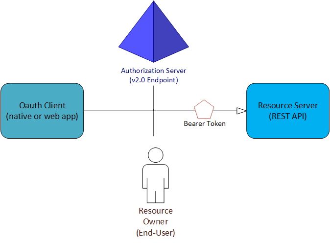

<properties
    pageTitle="Azure Active Directory B2C | Microsoft Azure"
    description="Modalità di compilazione di applicazioni direttamente utilizzando i protocolli supportati da Azure Active Directory B2C."
    services="active-directory-b2c"
    documentationCenter=""
    authors="dstrockis"
    manager="mbaldwin"
    editor=""/>

<tags
    ms.service="active-directory-b2c"
    ms.workload="identity"
    ms.tgt_pltfrm="na"
    ms.devlang="na"
    ms.topic="article"
    ms.date="07/22/2016"
    ms.author="dastrock"/>

# <a name="azure-ad-b2c-authentication-protocols"></a>Azure Active Directory B2C: Protocolli di autenticazione

Azure Active Directory (Azure Active Directory) B2C garantisce identità come servizio per le App in quanto supporta due protocolli standard: OpenID connettersi e OAuth 2.0. Il servizio è conformi agli standard, ma alcuna due implementazione di essi possono presentare alcune differenze.  Le informazioni contenute in questa Guida sarà è utile se si scrive il codice direttamente inviando e la gestione delle richieste HTTP, anziché con una raccolta di Apri origine. È consigliabile leggere questa pagina prima di approfondire i dettagli di ogni protocollo specifico. Ma se si ha già familiarità con Azure Active Directory B2C, è possibile passare direttamente alle [guide di riferimento protocollo](#protocols).

<!-- TODO: Need link to libraries above -->

## <a name="the-basics"></a>Nozioni fondamentali
Tutte le app che usa Azure Active Directory B2C deve essere registrato nella directory B2C nel [portale di Azure](https://portal.azure.com). Il processo di registrazione app raccoglie e l'assegna alcuni valori all'applicazione in uso:

- Un **ID applicazione** che identifica l'app.
- Un **URI reindirizzare** o **identificatore pacchetto** che può essere utilizzato per indirizzare le risposte tornare all'app.
- Alcuni altri valori specifici di uno scenario. Per ulteriori informazioni, informazioni su [come registrare l'applicazione](active-directory-b2c-app-registration.md).

Dopo aver registrato l'app, comunica con Azure Active Directory mediante l'invio di richieste per l'endpoint v 2.0:

```
https://login.microsoftonline.com/common/oauth2/v2.0/authorize
https://login.microsoftonline.com/common/oauth2/v2.0/token
```

In quasi tutti i flussi OAuth e connettere OpenID, quattro parti vengono utilizzate nella versione di exchange:



- Il **server di autorizzazione** corrisponde all'endpoint v 2.0 di Azure Active Directory. Gestisce in modo sicuro elementi correlati all'accesso e informazioni utente. Consente di gestire anche le relazioni di trust tra le parti di un flusso. È responsabile per verificare l'identità dell'utente, concessione e revoca dell'accesso alle risorse e i token di emissione. È anche nota come provider di identità.
- Il **proprietario della risorsa** è in genere l'utente finale. Si tratta di terze parti che appartengono i dati e ha la possibilità di terze parti accedere a tali dati o delle risorse.
- Il **client OAuth** è l'app. Viene identificata dall'ID applicazione relativi ad esempio: È in genere la parte che gli utenti finali interagiscono con. Inoltre, le richieste token dal server di autorizzazione. Proprietario della risorsa conceda l'autorizzazione di client per accedere alla risorsa.
- Il **server delle risorse** sia in cui si trovano la risorsa o dati. Considerare attendibile il server di autorizzazione per eseguire l'autenticazione in modo sicuro e autorizzare il client OAuth. Utilizza anche token di accesso del titolare per garantire che è possibile concedere l'accesso a una risorsa.

## <a name="policies"></a>Criteri
Probabilmente, i criteri di Azure Active Directory B2C sono le caratteristiche più importanti del servizio. Azure Active Directory B2C estende i protocolli OAuth 2.0 e connettere OpenID standard introducendo i criteri. Queste consentono di Azure Active Directory B2C eseguire molto più semplice autenticazione e l'autorizzazione. Criteri descrivono consumer identità esperienze, incluso per l'abbonamento, accesso e la modifica profilo. Criteri possono essere definiti nell'interfaccia di amministrazione. Si può essere eseguite mediante un parametro di query speciale in richieste di autenticazione HTTP. Criteri non sono caratteristiche standard di OAuth 2.0 e OpenID connettersi, pertanto non è necessario accettare il tempo necessario per comprenderne. Per ulteriori informazioni, vedere la [Guida di riferimento dei criteri di Azure Active Directory B2C](active-directory-b2c-reference-policies.md).

## <a name="tokens"></a>Token
L'implementazione di Azure Active Directory B2C di OAuth 2.0 e connettere OpenID utilizza molto di token del titolare, inclusi i token del titolare rappresentati come token web JSON (JWTs). Un token del titolare è un token di sicurezza leggera che concede l'accesso "titolare" a una risorsa protetta. Il titolare è tutte le parti che possono presentare il token. Azure Active Directory necessario eseguire l'autenticazione una festa prima che possa ricevere un token del titolare. Ma se i passaggi necessari non sono prese a proteggere il token in trasmissione e lo spazio di archiviazione, può essere intercettare e utilizzato da una parte indesiderata.

Alcuni token di sicurezza ha un meccanismo incorporato che impedisce autorizzati dal loro utilizzo, ma i token del titolare non dispone di questo meccanismo. Si devono avvenire in un canale sicuro, ad esempio di protezione a livello di trasporto (HTTPS). Se un token del titolare viene trasmesso all'esterno di un canale sicuro, una festa dannosa possa utilizzare un attacco uomo secondo per acquisire il token e usarlo per ottenere accesso non autorizzato a una risorsa protetta. Gli stessi principi di sicurezza applicano quando i token del titolare vengono archiviati o memorizzati nella cache per successivi utilizzi. Sempre assicurarsi che l'app trasmette e archivia i token del titolare in modo sicuro.

Per motivi di sicurezza token del titolare aggiuntive, vedere [RFC 6750 sezione 5](http://tools.ietf.org/html/rfc6750).

Ulteriori informazioni sui diversi tipi di token usato in Azure Active Directory B2C sono disponibili nel [riferimento token Azure Active Directory](active-directory-b2c-reference-tokens.md).

## <a name="protocols"></a>Protocolli

Quando si è pronti per esaminare alcune richieste di esempio, è possibile iniziare con uno dei seguenti esercitazioni. Ognuno di essi corrisponde a uno scenario di autenticazione specifico. Se occorre assistenza per determinare quali flusso è appropriato, estrarre [che i tipi di App è possibile creare con Azure Active Directory B2C](active-directory-b2c-apps.md).

- [Creare applicazioni per dispositivi mobili e native tramite OAuth 2.0](active-directory-b2c-reference-oauth-code.md)
- [Creazione di applicazioni web mediante OpenID Connect](active-directory-b2c-reference-oidc.md)
