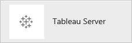
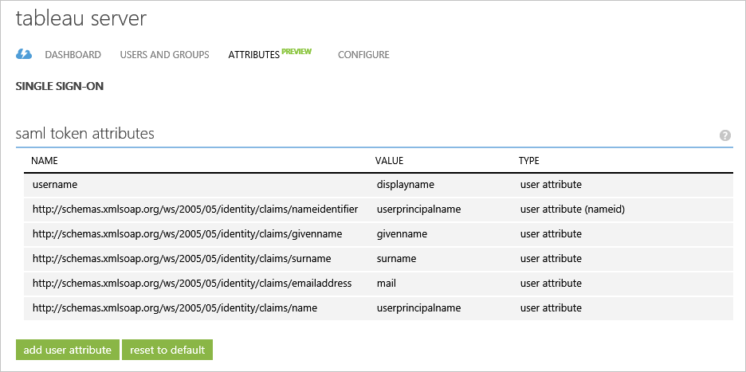
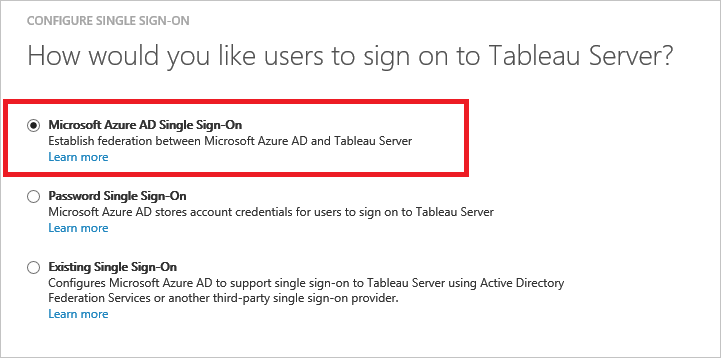

<properties
    pageTitle="Esercitazione: Integrazione di Azure Active Directory con un Server Tableau | Microsoft Azure"
    description="Informazioni su come configurare single sign-on tra Azure Active Directory e Tableau Server."
    services="active-directory"
    documentationCenter=""
    authors="jeevansd"
    manager="femila"
    editor=""/>

<tags
    ms.service="active-directory"
    ms.workload="identity"
    ms.tgt_pltfrm="na"
    ms.devlang="na"
    ms.topic="article"
    ms.date="09/29/2016"
    ms.author="jeedes"/>

# Esercitazione: Integrazione di Azure Active Directory con un Server Tableau

L'obiettivo di questa esercitazione è illustrano come integrare Tableau Server con Azure Active Directory (Azure Active Directory).

Integrazione di Tableau Server con Azure Active Directory offre i seguenti vantaggi:

- È possibile controllare in Azure Active Directory chi ha accesso al Server Tableau
- È possibile consentire agli utenti di automaticamente ottenere effettuato l'accesso a Server Tableau (Single Sign-On) con il proprio account Azure Active Directory
- È possibile gestire gli account in una posizione centrale - portale classica di Azure

Se si desiderano ulteriori dettagli sull'integrazione di app SaaS con Azure Active Directory, vedere [che cos'è l'accesso alle applicazioni e single sign-on con Azure Active Directory](active-directory-appssoaccess-whatis.md).

## Prerequisiti

Per configurare l'integrazione di Azure Active Directory con Tableau Server, è necessario quanto segue:

- Una sottoscrizione di Azure Active Directory
- Un Server Tableau single sign-abbonamento abilitato

> [AZURE.NOTE] Per testare la procedura descritta in questa esercitazione, è consigliabile non usare un ambiente di produzione.

Per verificare la procedura descritta in questa esercitazione, è necessario seguire questi suggerimenti:

- Non utilizzare l'ambiente di produzione, a meno che non è necessario.
- Se non si dispone di un ambiente di valutazione di Azure Active Directory, è possibile ottenere un mese di una versione di valutazione [qui](https://azure.microsoft.com/pricing/free-trial/).

## Descrizione dello scenario
L'obiettivo di questa esercitazione è che consentono di verificare Azure Active Directory single sign-on in un ambiente di testing. 

Scenario illustrato in questa esercitazione è composto da due blocchi predefiniti principali:

1. Aggiunta di Server Tableau dalla raccolta
2. Configurazione e verifica Azure Active Directory single sign-on

## Aggiunta di Server Tableau dalla raccolta
Per configurare l'integrazione di Tableau Server Azure Active Directory, è necessario aggiungere l'elenco di App SaaS gestito Tableau Server dalla raccolta.

**Per aggiungere Server Tableau dalla raccolta, procedere come segue:**

1. Nel **portale classica Azure**, nel riquadro di spostamento sinistra, fare clic su **Active Directory**. 
 
    ![Active Directory][1]

2. Nell'elenco di **Directory** , selezionare la directory per il quale si desidera attivare l'integrazione di directory.

3. Per aprire la visualizzazione di applicazioni, nella visualizzazione directory, fare clic su **applicazioni** nel menu superiore.

    ![Applicazioni][2]

4. Fare clic su **Aggiungi** nella parte inferiore della pagina.

    ![Applicazioni][3]

5. Nella finestra di dialogo **che cosa si vuole eseguire** , fare clic su **Aggiungi un'applicazione dalla raccolta**.

    ![Applicazioni][4]

6. Nella casella Cerca digitare **Tableau Server**.

    

7. Nel riquadro dei risultati, selezionare il **Server Tableau**e quindi fare clic su **completa** per aggiungere l'applicazione.

    

##  Configurazione e verifica Azure Active Directory single sign-on
L'obiettivo di questa sezione è illustrato come configurare e testare Azure Active Directory single sign-on con Server Tableau in base a un utente di test denominato "Ezio Sandro".

Single sign-on per l'uso, è necessario indicare che cos'è l'utente corrispondente nel Server Tableau a un utente in Active Directory Azure Azure Active Directory. In altre parole, una relazione di collegamento tra un utente di Azure Active Directory e il relativo utente Tableau Server deve essere stabilito.

È stata stabilita la relazione di collegamento assegnando il valore di **nome utente** in Active Directory Azure come il valore di **nome utente** nel Server Tableau.

Per configurare e testare Azure Active Directory single sign-on con Tableau Server, è necessario completare i blocchi predefiniti seguenti:

1. **[Configurazione di Azure Active Directory Single Sign-On](#configuring-azure-ad-single-single-sign-on)** - per consentire agli utenti di utilizzare questa caratteristica.
2. **[Creazione di un annuncio Azure testare utente](#creating-an-azure-ad-test-user)** - verificare Azure Active Directory single sign-on con Britta Simon.
4. **[Creazione di un Server Tableau test utente](#creating-a-tableauserver-test-user)** - abbiano un equivalente di Britta Simon nel Server Tableau collegato per la rappresentazione di Azure Active Directory di lei.
5. **[Assegnazione di Azure AD testare utente](#assigning-the-azure-ad-test-user)** - abilitare Britta Simon a utilizzare Azure Active Directory single sign-on.
5. **[Test Single Sign-On](#testing-single-sign-on)** - per verificare se funziona la configurazione.

### Configurazione di Azure Active Directory Single Sign-On

L'obiettivo di questa sezione è per attivare Azure Active Directory single sign-on nel portale di classica Azure e configurare il single sign-on Server Tableau nell'applicazione in uso.

Applicazione di Server tableau prevede asserzioni SAML in un formato specifico. Schermata seguente è illustrato un esempio per l'oggetto. 

 

**Per configurare Azure Active Directory single sign-on con Server Tableau, procedere come segue:**

1. Nel portale di classica Azure, nella pagina integrazione applicazione **Tableau Server** , nel menu nella parte superiore, fare clic su **attributi**.

     

1. Nella finestra di dialogo **attributi token SAML** , procedere come segue:

    

    un. Fare clic su **Aggiungi attributo utente** per aprire la finestra di dialogo **Aggiungi utente Attribure** .

     

    b. Nella casella di testo **Nome attributo** , digitare **nome utente**.

    c. Nell'elenco **Valore dell'attributo** selsect **user.displayname**.

    d. Fare clic su **completa**.  
    

1. Nel menu nella parte superiore, fare clic su **Quick Start**.

      

1. Fare clic su **Configura il single sign-on** per aprire la finestra di dialogo **Configura Single Sign-On** .

    ![Configurare Single Sign-On][6] 

2. Nella pagina **specificare come gli utenti di accedere al Server Tableau** selezionare **Azure Active Directory Single Sign-On**e quindi fare clic su **Avanti**.

     

3. Nella pagina di finestra di dialogo **Configura impostazioni di App** , eseguire le operazioni seguenti e fare clic su **Avanti**:

     

    un. Nella casella di testo **URL di accesso** , digitare l'URL del server Tableau. 

    b. Casella copia nell'identificatore di 

    c. Fare clic su **Avanti**

4. Nella pagina **Configura il single sign-on Tableau server** , eseguire le operazioni seguenti e fare clic su **Avanti**:

     

    un. Fare clic su **Scarica metadati**e quindi salvare il file nel computer in uso.

    b. Fare clic su **Avanti**.

6. Per ottenere SSO configurato per l'applicazione, è necessario sign-on per il tenant Tableau Server come amministratore.

    un. Nella configurazione del Server Tableau, fare clic sulla scheda **SAML** .

     

    b. Selezionare la casella di controllo di **Usa SAML per single sign-on**.

    c. Individuare il file di metadati federazione scaricato dal portale classica Azure e quindi caricarlo nel **file di metadati Idp SAML**.

    d. Server tableau restituire URL, ovvero l'URL che Tableau Server gli utenti accedono, ad esempio http://tableau_server. Non è consigliabile usare http://localhost. Utilizzo di un URL con una barra rovesciata (ad esempio http://tableau_server/) non è supportato. Copiare **l'URL restituito Tableau Server** e incollarlo in Azure Active Directory **URL accesso nella** casella di testo, come illustrato nel passaggio 3

    e. ID entità SAML, ovvero l'ID di entità identifica in modo univoco l'installazione di Tableau Server per la IdP. È possibile immettere l'URL del Server Tableau nuovamente in questo caso, se si preferisce, ma non è necessario essere l'URL del Server Tableau. Copiare **SAML entità ID** e incollarla in casella di testo di Azure Active Directory **identificatore** , come illustrato nel passaggio 3.

    f. Fare clic su **Esporta File di metadati** e aprirlo nell'applicazione dell'editor di testo. Individuare l'URL di servizio asserzione Consumer con Http Post e indice 0 e copiare l'URL. A questo punto incollare il codice di Azure Active Directory **URL di risposta** testo come illustrato nel passaggio 3. 

    g. Fare clic su **OK** nella pagina Tableau Server Configiuration.

    > [AZURE.NOTE] Se occorre assistenza nella configurazione SAML Tableau server, vedere questo articolo [Configurare SAML](http://onlinehelp.tableau.com/current/server/en-us/config_saml.htm) 

6. Nel portale di classica Azure, selezionare la conferma di single sign-on configurazione e quindi fare clic su **Avanti**.

    ![Azure Active Directory Single Sign-On][10]

7. Nella pagina di **Conferma Single sign-on** , fare clic su **completa**. 
 
    ![Azure Active Directory Single Sign-On][11]

### Creazione di un utente di test di Azure Active Directory
L'obiettivo di questa sezione consiste nel creare un utente di prova nel portale di classica Azure chiamato Britta Simon.

Nell'elenco di utenti, selezionare **Sandro**.

![Creazione di Azure Active Directory utente][20]

**Per creare un utente di prova in Azure Active Directory, procedere come segue:**

1. Nel **portale classica Azure**, nel riquadro di spostamento sinistra, fare clic su **Active Directory**.

     

2. Nell'elenco di **Directory** , selezionare la directory per il quale si desidera attivare l'integrazione di directory.

3. Per visualizzare l'elenco di utenti, nel menu nella parte superiore, fare clic su **utenti**.
 
     

4. Per aprire la finestra di dialogo **Aggiungi utente** , nella barra degli strumenti nella parte inferiore, fare clic su **Aggiungi utente**.

    

5. Nella scheda **inviare commenti e suggerimenti su questo utente** , procedere come segue:

     

    un. Come **Tipo di utente**, selezionare **nuovo utente nell'organizzazione**.

    b. Nella casella di testo **Nome utente** digitare **BrittaSimon**.

    c. Fare clic su **Avanti**.

6.  Nella pagina di finestra di dialogo del **Profilo utente** , procedere come segue:

     

    un. Nella casella di testo **nome** digitare **Sandro**.  

    b. Nella casella **Cognome** di testo digitare **Ezio**.

    c. Nella casella di testo **Nome visualizzato** digitare **Sandro**.

    d. Nell'elenco **ruolo** selezionare **utente**.

    e. Fare clic su **Avanti**.

7. Nella pagina **Guida password temporanea** fare clic su **Crea**.

     

8. Nella pagina **Guida password temporanea** procedere come segue:
 
     

    un. Prendere nota del valore della **Nuova Password**.

    b. Fare clic su **completa**.   

### Creazione di un utente di test Tableau Server

L'obiettivo di questa sezione consiste nel creare un utente chiamato Britta Simon Tableau server. È necessario effettuare il provisioning di tutti gli utenti nel server Tableau. Si noti inoltre che nome utente dell'utente deve corrispondere al valore che è stato configurato l'attributo personalizzato di Azure Active Directory del **nome utente**. Con il mapping corretto deve usare l'integrazione di [Configurazione Azure Active Directory Single Sign-On](#configuring-azure-ad-single-single-sign-on).

> [AZURE.NOTE] Se è necessario creare manualmente un utente, è necessario contattare l'amministratore del Server Tableau all'interno dell'organizzazione.

### L'assegnazione all'utente di test di Azure Active Directory

L'obiettivo di questa sezione è l'attivazione di Britta Simon a usare il single sign-on Azure concedendo utente l'accesso al Server Tableau.

![Assegnare utente][200] 

**Per assegnare Britta Simon Tableau server, procedere come segue:**

1. Nel portale di Azure classico per aprire la visualizzazione di applicazioni, nella visualizzazione directory, fare clic su **applicazioni** nel menu superiore.
 
    ![Assegnare utente][201] 

2. Nell'elenco delle applicazioni, selezionare **Tableau Server**.

     

1. Nel menu nella parte superiore, fare clic su **utenti**.

    ![Assegnare utente][203]

1. Nell'elenco di utenti, selezionare **Sandro**.

2. Nella barra degli strumenti nella parte inferiore, fare clic su **Assegna**.

![Assegnare utente][205]

### Test Single Sign-On

L'obiettivo di questa sezione è per verificare la Azure Active Directory single sign-on configurazione mediante il pannello di accesso.

Quando si fa clic sul riquadro Tableau Server nel Pannello di accesso, è necessario ottenere automaticamente effettuato l'accesso-on all'applicazione Tableau Server.

## Risorse aggiuntive

* [Elenco di esercitazioni su come integrare App SaaS con Azure Active Directory](active-directory-saas-tutorial-list.md)
* [Che cos'è l'accesso alle applicazioni e single sign-on con Azure Active Directory?](active-directory-appssoaccess-whatis.md)

<!--Image references-->

[1]: ./media/active-directory-saas-tableauserver-tutorial/tutorial_general_01.png
[2]: ./media/active-directory-saas-tableauserver-tutorial/tutorial_general_02.png
[3]: ./media/active-directory-saas-tableauserver-tutorial/tutorial_general_03.png
[4]: ./media/active-directory-saas-tableauserver-tutorial/tutorial_general_04.png

[6]: ./media/active-directory-saas-tableauserver-tutorial/tutorial_general_05.png
[10]: ./media/active-directory-saas-tableauserver-tutorial/tutorial_general_06.png
[11]: ./media/active-directory-saas-tableauserver-tutorial/tutorial_general_07.png
[20]: ./media/active-directory-saas-tableauserver-tutorial/tutorial_general_100.png

[200]: ./media/active-directory-saas-tableauserver-tutorial/tutorial_general_200.png
[201]: ./media/active-directory-saas-tableauserver-tutorial/tutorial_general_201.png
[203]: ./media/active-directory-saas-tableauserver-tutorial/tutorial_general_203.png
[204]: ./media/active-directory-saas-tableauserver-tutorial/tutorial_general_204.png
[205]: ./media/active-directory-saas-tableauserver-tutorial/tutorial_general_205.png
