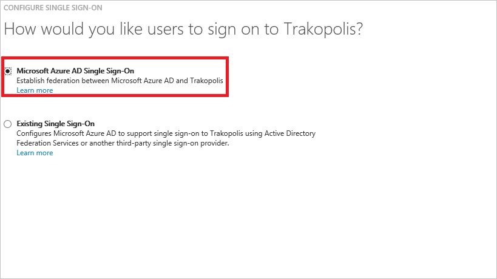
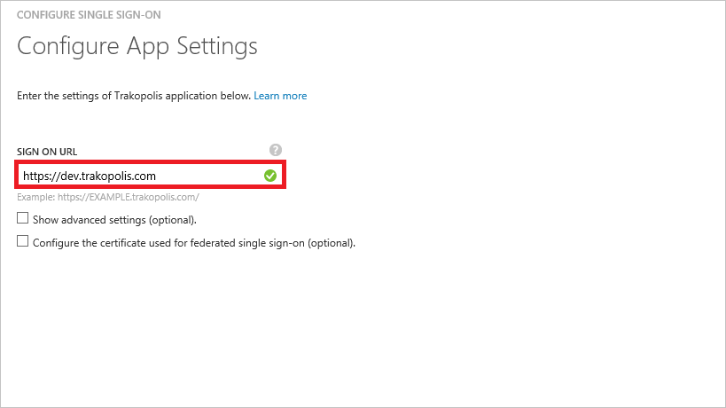
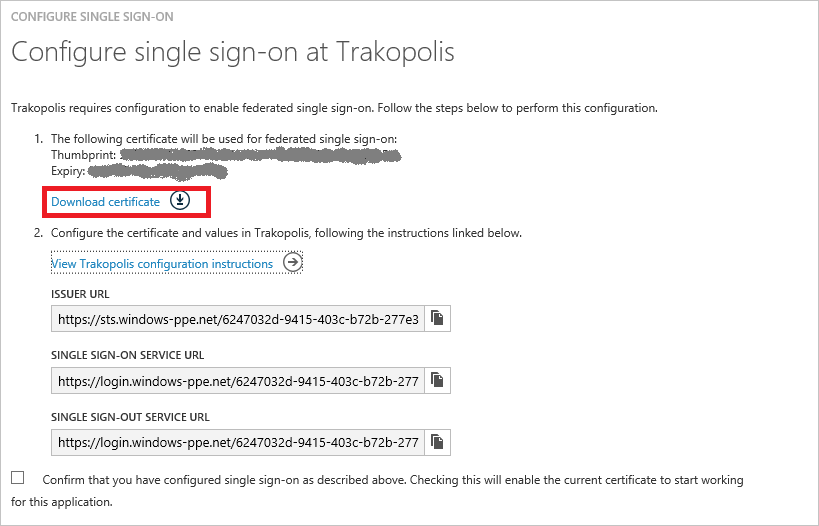

<properties
    pageTitle="Esercitazione: Integrazione di Azure Active Directory con Trakopolis | Microsoft Azure"
    description="Informazioni su come configurare single sign-on tra Azure Active Directory e Trakopolis."
    services="active-directory"
    documentationCenter=""
    authors="jeevansd"
    manager="femila"
    editor=""/>

<tags
    ms.service="active-directory"
    ms.workload="identity"
    ms.tgt_pltfrm="na"
    ms.devlang="na"
    ms.topic="article"
    ms.date="09/01/2016"
    ms.author="jeedes"/>

# Esercitazione: Integrazione di Azure Active Directory con Trakopolis

L'obiettivo di questa esercitazione è illustrano come integrare Trakopolis con Azure Active Directory (Azure Active Directory).  
Integrazione di Trakopolis con Azure Active Directory offre i seguenti vantaggi:

- È possibile controllare in Azure Active Directory chi ha accesso a Trakopolis
- È possibile consentire agli utenti di automaticamente ottenere effettuato l'accesso a Trakopolis (Single Sign-On) con il proprio account Azure Active Directory
- È possibile gestire gli account in una posizione centrale - Azure Active Directory 

Se si desiderano ulteriori dettagli sull'integrazione di app SaaS con Azure Active Directory, vedere [che cos'è l'accesso alle applicazioni e single sign-on con Azure Active Directory](active-directory-appssoaccess-whatis.md).

## Prerequisiti

Per configurare l'integrazione di Azure Active Directory con Trakopolis, è necessario quanto segue:

- Una sottoscrizione di Azure Active Directory
- Un Trakopolis single sign-abbonamento abilitato

> [AZURE.NOTE] Per testare la procedura descritta in questa esercitazione, è consigliabile non usare un ambiente di produzione.

Per verificare la procedura descritta in questa esercitazione, è necessario seguire questi suggerimenti:

- Non utilizzare l'ambiente di produzione, a meno che non è necessario.
- Se non si dispone di un ambiente di valutazione di Azure Active Directory, è possibile ottenere un mese di una versione di valutazione [qui](https://azure.microsoft.com/pricing/free-trial/).

## Descrizione dello scenario
L'obiettivo di questa esercitazione è che consentono di verificare Azure Active Directory single sign-on in un ambiente di testing.  
Scenario illustrato in questa esercitazione è composto da due blocchi predefiniti principali:

1. Aggiunta di Trakopolis dalla raccolta
2. Configurazione e verifica Azure Active Directory single sign-on

## Aggiunta di Trakopolis dalla raccolta
Per configurare l'integrazione di Trakopolis in Azure Active Directory, è necessario aggiungere l'elenco di App SaaS gestito Trakopolis dalla raccolta.

**Per aggiungere Trakopolis dalla raccolta, procedere come segue:**

1. Nel **portale classica Azure**, nel riquadro di spostamento sinistra, fare clic su **Active Directory**. 

    ![Active Directory][1]

2. Nell'elenco di **Directory** , selezionare la directory per il quale si desidera attivare l'integrazione di directory.

3. Per aprire la visualizzazione di applicazioni, nella visualizzazione directory, fare clic su **applicazioni** nel menu superiore.
 
    ![Applicazioni][2]

4. Fare clic su **Aggiungi** nella parte inferiore della pagina.

    ![Applicazioni][3]

5. Nella finestra di dialogo **che cosa si vuole eseguire** , fare clic su **Aggiungi un'applicazione dalla raccolta**.

    ![Applicazioni][4]

6. Nella casella Cerca digitare **Trakopolis**.

    

7. Nel riquadro dei risultati, selezionare **Trakopolis**e quindi fare clic su **completa** per aggiungere l'applicazione.

    

##  Configurazione e verifica Azure Active Directory single sign-on
L'obiettivo di questa sezione è illustrato come configurare e testare Azure Active Directory single sign-on con Trakopolis in base a un utente di test denominato "Ezio Sandro".

Single sign-on per l'uso, è necessario indicare che cos'è l'utente corrispondente in Trakopolis a un utente in Active Directory Azure Azure Active Directory. In altre parole, una relazione di collegamento tra un utente di Azure Active Directory e il relativo utente Trakopolis deve essere stabilito.  
È stata stabilita la relazione di collegamento assegnando il valore di **nome utente** in Active Directory Azure come il valore di **nome utente** in Trakopolis.

Per configurare e testare Azure Active Directory single sign-on con Trakopolis, è necessario completare i blocchi predefiniti seguenti:

1. **[Configurazione di Azure Active Directory Single Sign-On](#configuring-azure-ad-single-single-sign-on)** - per consentire agli utenti di utilizzare questa caratteristica.
2. **[Creazione di un annuncio Azure testare utente](#creating-an-azure-ad-test-user)** - verificare Azure Active Directory single sign-on con Britta Simon.
4. **[Creazione di un Trakopolis test utente](#creating-a-trakopolis-test-user)** - che equivalente di Britta Simon nel Trakopolis collegato per la rappresentazione di Azure Active Directory di lei.
5. **[Assegnazione di Azure AD testare utente](#assigning-the-azure-ad-test-user)** - abilitare Britta Simon a utilizzare Azure Active Directory single sign-on.
5. **[Test Single Sign-On](#testing-single-sign-on)** - per verificare se funziona la configurazione.

### Configurazione di Azure Active Directory Single Sign-On

L'obiettivo di questa sezione è per attivare Azure Active Directory single sign-on nel portale di classica Azure e configurare il single sign-on Trakopolis nell'applicazione in uso.

**Per configurare Azure Active Directory single sign-on con Trakopolis, procedere come segue:**

1. Nel portale di classica Azure, nella pagina integrazione applicazione **Trakopolis** , fare clic su **Configura il single sign-on** per aprire la finestra di dialogo **Configura Single Sign-On** .

    ![Configurare Single Sign-On][6] 

2. Nella pagina **specificare come gli utenti di accedere al Trakopolis** selezionare **Azure Active Directory Single Sign-On**e quindi fare clic su **Avanti**.

     

3. Nella pagina di finestra di dialogo **Configura impostazioni di App** , procedere come segue:
 
     

    un. Nella casella di testo su URL di accesso, digitare l'URL utilizzato da agli utenti di accesso all'applicazione Trakopolis utilizzando il modello seguente: **"https://\<il nome della società\>. trakopolis.com"**.

     b. Fare clic su **Avanti**.

4. Nella pagina **Configura il single sign-on in Trakopolis** , procedere come segue:

     

    un. Fare clic su **Scarica certificato**e quindi salvare il file nel computer in uso.

    b. Fare clic su **Avanti**.

5. Per ottenere SSO configurato per l'applicazione, contattare il team di supporto Trakopolis [support@cantelematics.com](mailto:support@cantelematics.com), allegare il certificato scaricato e fornire l' **URL emittente**, l' **URL di Single Sign-on SAML** e l' **Accesso all'URL**.

6. Nel portale di classica Azure, selezionare la conferma di single sign-on configurazione e quindi fare clic su **Avanti**.

    ![Azure Active Directory Single Sign-On][10]

7. Nella pagina di **Conferma Single sign-on** , fare clic su **completa**.  

    ![Azure Active Directory Single Sign-On][11]

### Creazione di un utente di test di Azure Active Directory
L'obiettivo di questa sezione consiste nel creare un utente di prova nel portale di classica Azure chiamato Britta Simon.

![Creazione di Azure Active Directory utente][20]

**Per creare un utente di prova in Azure Active Directory, procedere come segue:**

1. Nel **portale classica Azure**, nel riquadro di spostamento sinistra, fare clic su **Active Directory**.

     

2. Nell'elenco di **Directory** , selezionare la directory per il quale si desidera attivare l'integrazione di directory.

3. Per visualizzare l'elenco di utenti, nel menu nella parte superiore, fare clic su **utenti**.

     

4. Per aprire la finestra di dialogo **Aggiungi utente** , nella barra degli strumenti nella parte inferiore, fare clic su **Aggiungi utente**.

     

5. Nella scheda **inviare commenti e suggerimenti su questo utente** , procedere come segue:

     

    un. Come tipo di utente, selezionare nuovo utente nell'organizzazione.

    b. Nella casella nome utente di **casella di testo**digitare **BrittaSimon**.

    c. Fare clic su **Avanti**.

6.  Nella pagina di finestra di dialogo del **Profilo utente** , procedere come segue:

     

    un. Nella casella di testo **nome** digitare **Sandro**.  

    b. Nella casella **Cognome** di testo digitare **Ezio**.

    c. Nella casella di testo **Nome visualizzato** digitare **Sandro**.

    d. Nell'elenco **ruolo** selezionare **utente**.

    e. Fare clic su **Avanti**.

7. Nella pagina **Guida password temporanea** fare clic su **Crea**.

     

8. Nella pagina **Guida password temporanea** procedere come segue:

     

    un. Prendere nota del valore della **Nuova Password**.

    b. Fare clic su **completa**.   

### Creazione di un test Trakopolis utente

L'obiettivo di questa sezione consiste nel creare un utente chiamato Britta Simon in Trakopolis.  
Lavorare con il team di supporto Trakopolis per aggiungere gli utenti Trakopolis. 

### L'assegnazione all'utente di test di Azure Active Directory

L'obiettivo di questa sezione è l'attivazione di Britta Simon a usare il single sign-on Azure concedendo la sua Trakopolis.

![Assegnare utente][200] 

**Per assegnare Britta Simon Trakopolis, procedere come segue:**

1. Nel portale di Azure classico per aprire la visualizzazione di applicazioni, nella visualizzazione directory, fare clic su **applicazioni** nel menu superiore.

    ![Assegnare utente][201] 

2. Nell'elenco delle applicazioni, selezionare **Trakopolis**.

     

1. Nel menu nella parte superiore, fare clic su **utenti**.

    ![Assegnare utente][203] 

1. Nell'elenco di utenti, selezionare **Sandro**.

2. Nella barra degli strumenti nella parte inferiore, fare clic su **Assegna**.

    ![Assegnare utente][205]

### Test Single Sign-On

L'obiettivo di questa sezione è per verificare la Azure Active Directory single sign-on configurazione mediante il pannello di accesso.  
Quando si fa clic sul riquadro Trakopolis nel Pannello di accesso, è necessario ottenere automaticamente effettuato l'accesso-on all'applicazione Trakopolis.

## Risorse aggiuntive

- [Elenco di esercitazioni su come integrare App SaaS con Azure Active Directory](active-directory-saas-tutorial-list.md)

- [Che cos'è l'accesso alle applicazioni e single sign-on con Azure Active Directory?](active-directory-appssoaccess-whatis.md)

<!--Image references-->

[1]: ./media/active-directory-saas-trakopolis-tutorial/tutorial_general_01.png
[2]: ./media/active-directory-saas-trakopolis-tutorial/tutorial_general_02.png
[3]: ./media/active-directory-saas-trakopolis-tutorial/tutorial_general_03.png
[4]: ./media/active-directory-saas-trakopolis-tutorial/tutorial_general_04.png

[6]: ./media/active-directory-saas-trakopolis-tutorial/tutorial_general_05.png
[10]: ./media/active-directory-saas-trakopolis-tutorial/tutorial_general_06.png
[11]: ./media/active-directory-saas-trakopolis-tutorial/tutorial_general_07.png
[20]: ./media/active-directory-saas-trakopolis-tutorial/tutorial_general_100.png

[200]: ./media/active-directory-saas-trakopolis-tutorial/tutorial_general_200.png
[201]: ./media/active-directory-saas-trakopolis-tutorial/tutorial_general_201.png
[203]: ./media/active-directory-saas-trakopolis-tutorial/tutorial_general_203.png
[204]: ./media/active-directory-saas-trakopolis-tutorial/tutorial_general_204.png
[205]: ./media/active-directory-saas-trakopolis-tutorial/tutorial_general_205.png
