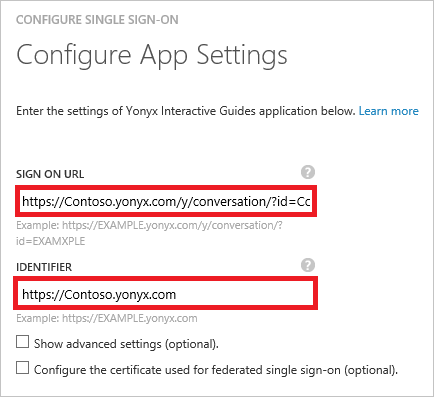

<properties
    pageTitle="Esercitazione: Integrazione di Azure Active Directory con guide interattive Yonyx | Microsoft Azure"
    description="Informazioni su come configurare single sign-on tra Azure Active Directory e guide interattive Yonyx."
    services="active-directory"
    documentationCenter=""
    authors="jeevansd"
    manager="femila"
    editor=""/>

<tags
    ms.service="active-directory"
    ms.workload="identity"
    ms.tgt_pltfrm="na"
    ms.devlang="na"
    ms.topic="article"
    ms.date="10/26/2016"
    ms.author="jeedes"/>

# Esercitazione: Integrazione di Azure Active Directory con guide interattive Yonyx

L'obiettivo di questa esercitazione è illustrano come integrare guide interattive Yonyx con Azure Active Directory (Azure Active Directory).

Guide interattive Yonyx l'integrazione con Azure Active Directory offre i seguenti vantaggi:

- È possibile controllare in Azure Active Directory chi ha accesso a guide interattive Yonyx
- È possibile consentire agli utenti di automaticamente ottenere effettuato l'accesso a guide interattive Yonyx (Single Sign-On) con il proprio account Azure Active Directory
- È possibile gestire gli account in una posizione centrale - portale classica di Azure

Se si desiderano ulteriori dettagli sull'integrazione di app SaaS con Azure Active Directory, vedere [che cos'è l'accesso alle applicazioni e single sign-on con Azure Active Directory](active-directory-appssoaccess-whatis.md).

## Prerequisiti

Per configurare l'integrazione di Azure Active Directory con guide interattive Yonyx, è necessario quanto segue:

- Una sottoscrizione di Azure Active Directory
- Un guide interattive Yonyx single sign-abbonamento abilitato

> [AZURE.NOTE] Per testare la procedura descritta in questa esercitazione, è consigliabile non usare un ambiente di produzione.

Per verificare la procedura descritta in questa esercitazione, è necessario seguire questi suggerimenti:

- Non utilizzare l'ambiente di produzione, a meno che non è necessario.
- Se non si dispone di un ambiente di valutazione di Azure Active Directory, è possibile ottenere un mese di una versione di valutazione [qui](https://azure.microsoft.com/pricing/free-trial/).

## Descrizione dello scenario
L'obiettivo di questa esercitazione è che consentono di verificare Azure Active Directory single sign-on in un ambiente di testing.

Scenario illustrato in questa esercitazione è composto da due blocchi predefiniti principali:

1. Aggiunta di guide interattive Yonyx dalla raccolta
2. Configurazione e verifica Azure Active Directory single sign-on

## Aggiunta di guide interattive Yonyx dalla raccolta
Per configurare l'integrazione di guide interattive Yonyx in Azure Active Directory, è necessario aggiungere l'elenco di App SaaS gestito guide interattive Yonyx dalla raccolta.

**Per aggiungere guide interattive Yonyx dalla raccolta, procedere come segue:**

1. Nel **portale classica Azure**, nel riquadro di spostamento sinistra, fare clic su **Active Directory**. 

    ![Active Directory][1]

2. Nell'elenco di **Directory** , selezionare la directory per il quale si desidera attivare l'integrazione di directory.

3. Per aprire la visualizzazione di applicazioni, nella visualizzazione directory, fare clic su **applicazioni** nel menu superiore.
    
    ![Applicazioni][2]

4. Fare clic su **Aggiungi** nella parte inferiore della pagina.
    
    ![Applicazioni][3]

5. Nella finestra di dialogo **che cosa si vuole eseguire** , fare clic su **Aggiungi un'applicazione dalla raccolta**.

    ![Applicazioni][4]

6. Nella casella Cerca digitare **Yonyx guide interattive**.

    

7. Nel riquadro risultati selezionare **Guide interattive Yonyx**e quindi fare clic su **completa** per aggiungere l'applicazione.

    

##  Configurazione e verifica Azure Active Directory single sign-on
L'obiettivo di questa sezione è illustrato come configurare e testare Azure Active Directory single sign-on con guide interattive Yonyx in base a un utente di test denominato "Ezio Sandro".

Single sign-on per l'uso, è necessario indicare che cos'è l'utente corrispondente in guide interattive Yonyx a un utente in Active Directory Azure Azure Active Directory. In altre parole, una relazione di collegamento tra un utente di Azure Active Directory e il relativo utente guide interattive Yonyx deve essere stabilito.

È stata stabilita la relazione di collegamento assegnando il valore di **nome utente** in Active Directory Azure come valore di **nome utente** nella Yonyx guide interattive.

Per configurare e testare Azure Active Directory single sign-on con guide interattive Yonyx, è necessario completare i blocchi predefiniti seguenti:

1. **[Configurazione di Azure Active Directory Single Sign-On](#configuring-azure-ad-single-single-sign-on)** - per consentire agli utenti di utilizzare questa caratteristica.
2. **[Creazione di un annuncio Azure testare utente](#creating-an-azure-ad-test-user)** - verificare Azure Active Directory single sign-on con Britta Simon.
3. **[Creazione di un guide interattive Yonyx test utente](#creating-a-yonyx-interactive-guides-test-user)** - che equivalente di Britta Simon nel guide interattive Yonyx collegato per la rappresentazione di Azure Active Directory di lei.
4. **[Assegnazione di Azure AD testare utente](#assigning-the-azure-ad-test-user)** - abilitare Britta Simon a utilizzare Azure Active Directory single sign-on.
5. **[Test Single Sign-On](#testing-single-sign-on)** - per verificare se funziona la configurazione.

### Configurazione Azure Active Directory single sign-on

In questa sezione, attivare Azure Active Directory single sign-on nel portale di classica e configurare il single sign-on nell'applicazione Yonyx guide interattive.

**Per configurare Azure Active Directory single sign-on con guide interattive Yonyx, procedere come segue:**

1. Nel portale classico, nella pagina integrazione applicazione **Guide interattive Yonyx** , fare clic su **Configura il single sign-on** per aprire la finestra di dialogo **Configura Single Sign-On** .
     
    ![Configurare Single Sign-On][6] 

2. Nella pagina **specificare come agli utenti di effettuare l'accesso a guide interattive Yonyx** selezionare **Azure Active Directory Single Sign-On**e quindi fare clic su **Avanti**.
    
    

3. Nella pagina di finestra di dialogo **Configura impostazioni di App** , eseguire le operazioni seguenti e fare clic su **Avanti**:

    

    un. Nella casella di testo **Su URL di accesso** , digitare un URL utilizzando il modello seguente: `https://<company name>.yonyx.com/y/conversation/?id=<guid number>`.

    b. Nella casella di testo **identificatore** , digitare un URL utilizzando il modello seguente: `https://<company name>.yonyx.com`.

    c. Fare clic su **Avanti**

    > [AZURE.NOTE] Si noti che è necessario aggiornare i valori con segno su URL effettivo e identificatore. Per ottenere questi valori, contattare il team tramite di supporto guide interattive Yonyx <mailto:support@yonyx.com>.

4. Nella pagina **Configura il single sign-on in guide interattive Yonyx** fare clic su **Scarica certificato** e quindi salvare il file nel computer in uso:

    

5. Per ottenere Single Sign-on configurata per le guide interattive Yonyx applicazione, contatta il supporto del team tramite <mailto:support@yonyx.com> e fornire le operazioni seguenti:

    • Scaricato **certificato**

    • **Emittente URL**

    • L' **URL del servizio Single Sign-On**

    • L' **URL del servizio di disconnessione singola**

6. Nel portale classico, selezionare la conferma di single sign-on configurazione e quindi fare clic su **Avanti**.
    
    ![Azure Active Directory Single Sign-On][10]

7. Nella pagina di **Conferma Single sign-on** , fare clic su **completa**.  
    
    ![Azure Active Directory Single Sign-On][11]

### Creazione di un utente di test di Azure Active Directory
L'obiettivo di questa sezione consiste nel creare un utente di prova nel portale di classica chiamato Britta Simon.

![Creazione di Azure Active Directory utente][20]

**Per creare un utente di prova in Azure Active Directory, procedere come segue:**

1. Nel **portale classica Azure**, nel riquadro di spostamento sinistra, fare clic su **Active Directory**.

    

2. Nell'elenco di **Directory** , selezionare la directory per il quale si desidera attivare l'integrazione di directory.

3. Per visualizzare l'elenco di utenti, nel menu nella parte superiore, fare clic su **utenti**.
    
    

4. Per aprire la finestra di dialogo **Aggiungi utente** , nella barra degli strumenti nella parte inferiore, fare clic su **Aggiungi utente**.

    

5. Nella scheda **inviare commenti e suggerimenti su questo utente** , procedere come segue:

    

    un. Come tipo di utente, selezionare nuovo utente nell'organizzazione.

    b. Nella casella nome utente di **casella di testo**digitare **BrittaSimon**.

    c. Fare clic su **Avanti**.

6.  Nella pagina di finestra di dialogo del **Profilo utente** , procedere come segue:
    
    

    un. Nella casella di testo **nome** digitare **Sandro**.  

    b. Nella casella di testo **Cognome** digitare **Ezio**.

    c. Nella casella di testo **Nome visualizzato** digitare **Sandro**.

    d. Nell'elenco **ruolo** selezionare **utente**.

    e. Fare clic su **Avanti**.

7. Nella pagina **Guida password temporanea** fare clic su **Crea**.
    
    

8. Nella pagina **Guida password temporanea** procedere come segue:
    
    

    un. Prendere nota del valore della **Nuova Password**.

    b. Fare clic su **completa**.   

### Creazione di un utente di test guide interattive Yonyx

L'obiettivo di questa sezione consiste nel creare un utente chiamato Britta Simon in Yonyx guide interattive. Guide interattive Yonyx sono supportati in fase di provisioning, che per impostazione predefinita abilitato.

Non esiste alcun elemento azione dell'utente in questa sezione. Verrà creato un nuovo utente durante il tentativo di accesso Cloud Creative Adobe se non esiste ancora.

> [AZURE.NOTE] Se è necessario creare manualmente un utente, è necessario contattare il team di supporto Yonyx guide interattive tramite <mailto:support@yonyx.com>.

### L'assegnazione all'utente di test di Azure Active Directory

L'obiettivo di questa sezione è l'attivazione di Britta Simon a usare il single sign-on Azure concedendo la sua Yonyx guide interattive.
    
![Assegnare utente][200]

**Per assegnare Britta Simon Yonyx guide interattive, procedere come segue:**

1. Nel portale classico per aprire la visualizzazione di applicazioni, nella visualizzazione directory, fare clic su **applicazioni** nel menu superiore.
    
    ![Assegnare utente][201]

2. Nell'elenco delle applicazioni, selezionare **Yonyx guide interattive**.
    
    

3. Nel menu nella parte superiore, fare clic su **utenti**.
    
    ![Assegnare utente][203]

4. Nell'elenco di utenti, selezionare **Sandro**.

5. Nella barra degli strumenti nella parte inferiore, fare clic su **Assegna**.
    
    ![Assegnare utente][205]

### Test il single sign-on

L'obiettivo di questa sezione è per verificare la Azure Active Directory single sign-on configurazione mediante il pannello di accesso.
 
Quando si fa clic sul riquadro guide interattive Yonyx nel Pannello di accesso, è necessario ottenere automaticamente effettuato l'accesso-on all'applicazione Yonyx guide interattive.

## Risorse aggiuntive

* [Elenco di esercitazioni su come integrare App SaaS con Azure Active Directory](active-directory-saas-tutorial-list.md)
* [Che cos'è l'accesso alle applicazioni e single sign-on con Azure Active Directory?](active-directory-appssoaccess-whatis.md)

<!--Image references-->

[1]: ./media/active-directory-saas-yonyx-tutorial/tutorial_general_01.png
[2]: ./media/active-directory-saas-yonyx-tutorial/tutorial_general_02.png
[3]: ./media/active-directory-saas-yonyx-tutorial/tutorial_general_03.png
[4]: ./media/active-directory-saas-yonyx-tutorial/tutorial_general_04.png

[6]: ./media/active-directory-saas-yonyx-tutorial/tutorial_general_05.png
[10]: ./media/active-directory-saas-yonyx-tutorial/tutorial_general_06.png
[11]: ./media/active-directory-saas-yonyx-tutorial/tutorial_general_07.png
[20]: ./media/active-directory-saas-yonyx-tutorial/tutorial_general_100.png

[200]: ./media/active-directory-saas-yonyx-tutorial/tutorial_general_200.png
[201]: ./media/active-directory-saas-yonyx-tutorial/tutorial_general_201.png
[203]: ./media/active-directory-saas-yonyx-tutorial/tutorial_general_203.png
[204]: ./media/active-directory-saas-yonyx-tutorial/tutorial_general_204.png
[205]: ./media/active-directory-saas-yonyx-tutorial/tutorial_general_205.png
