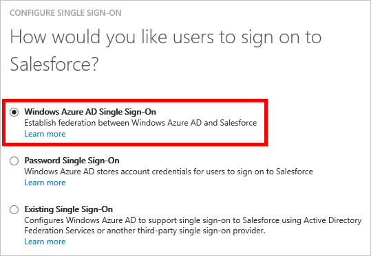

<properties
    pageTitle="Come gestire i certificati federazione in Azure Active Directory | Microsoft Azure"
    description="Informazioni su come personalizzare la data di scadenza per i certificati di federazione e come rinnovare i certificati che scadranno tra breve."
    services="active-directory"
    documentationCenter=""
    authors="asmalser-msft"
    manager="femila"
    editor=""/>

<tags
    ms.service="active-directory"
    ms.workload="identity"
    ms.tgt_pltfrm="na"
    ms.devlang="na"
    ms.topic="article"
    ms.date="02/09/2016"
    ms.author="asmalser-msft"/>

#Gestione dei certificati per federati Single Sign-On di Azure Active Directory

In questo articolo vengono illustrate le domande frequenti relative ai certificati creati da Azure Active Directory per stabilire federati single sign-on (SSO) per le applicazioni SaaS.

In questo articolo riguarda solo alle App configurati per l'utilizzo di **Azure Active Directory Single Sign-On**, come illustrato nell'esempio seguente:

##Come personalizzare la data di scadenza per il certificato di federazione

Per impostazione predefinita, i certificati impostati in modo che scadano dopo due anni. È possibile scegliere una data di scadenza diversa per il certificato seguendo la procedura seguente. Screenshot inclusi usare Salesforce a fini di esempio, ma la procedura seguente è possono applicare a qualsiasi app SaaS federati.

1. Azure Active Directory, nella pagina Guida introduttiva per l'applicazione, fare clic su **Configura il single sign-on**.

    

2. Selezionare **Azure Active Directory Single Sign-On**e quindi fare clic su **Avanti**.

3. Digitare l' **URL di accesso** dell'applicazione e selezionare la casella di controllo per **configurare il certificato usato per single sign-on federati**. Fare clic su **Avanti**.

    

4. Nella pagina successiva, selezionare **Genera un nuovo certificato**e selezionare quanto tempo si preferisce il certificato valido per. Fare clic su **Avanti**.

    

5. Fare clic su **Scarica certificato**. Per informazioni su come caricare il certificato all'app SaaS specifico, fare clic su **Visualizza le istruzioni di configurazione**.

    

6. Il certificato non abilitato fino a quando non si seleziona la casella di controllo conferma nella parte inferiore della finestra di dialogo e quindi preme INVIO.

##Come rinnovare un certificato scadrà tra breve

La procedura di rinnovo illustrata di seguito comporterà ideale senza tempo di inattività significativo per gli utenti. Screenshot utilizzato in questa caratteristica sezione Salesforce come esempio, ma la procedura seguente è possibile applicare a qualsiasi app SaaS federati.

1. Di Azure Active Directory, nella pagina Guida introduttiva per l'applicazione, fare clic su **Configura Single Sign-On**.

    

2. Nella prima pagina della finestra di dialogo **Azure Active Directory Single Sign-On** deve essere già selezionata, quindi fare clic su **Avanti**.

3. Nella seconda pagina, selezionare la casella di controllo per **configurare il certificato usato per single sign-on federati**. Fare clic su **Avanti**.

    

4. Nella pagina successiva, selezionare **Genera un nuovo certificato**e selezionare quanto tempo si preferisce il nuovo certificato valido per. Fare clic su **Avanti**.

    

5. Fare clic su **Scarica certificato**. Per rewnew correttamente il certificato, è necessario eseguire due passaggi seguenti:

    - Caricare il nuovo certificato alla schermata di single sign-on configurazione dell'applicazione SaaS. Per informazioni su come eseguire questa operazione per l'app SaaS specifico, fare clic su **Visualizza le istruzioni di configurazione**.

    - In Azure Active Directory, selezionare la casella di controllo conferma nella parte inferiore della finestra di dialogo per abilitare il nuovo certificato e quindi fare clic su **Avanti** per inviare.

    > [AZURE.IMPORTANT] Servizio Single sign-on all'app verranno disattivate, viene completato al momento uno di questi due passaggi, ma sarà attivato nuovamente una volta completato il secondo passaggio. Pertanto, per ridurre al minimo il tempo di inattività, Prepara da eseguire completare entrambi i passaggi all'interno di un breve periodo di tempo tra loro.

    

## Articoli correlati

- [Indice articolo per la gestione applicazioni in Azure Active Directory.](active-directory-apps-index.md)
- [Accesso alle applicazioni e single sign-on con Azure Active Directory](active-directory-appssoaccess-whatis.md)
- [Risoluzione dei problemi basata su SAML Single Sign-On](active-directory-saml-debugging.md)
