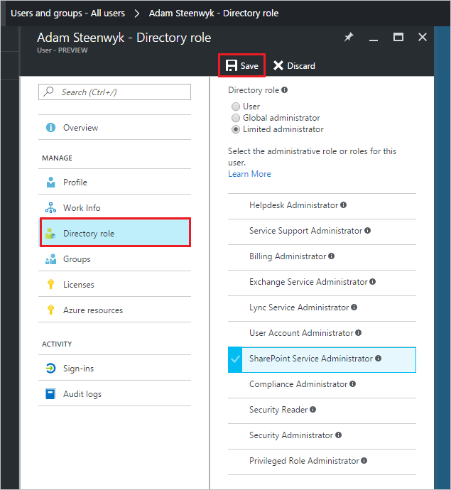

<properties
    pageTitle="Assegnare a un utente ai ruoli di amministratore in anteprima di Azure Active Directory | Microsoft Azure"
    description="Viene spiegato come modificare le informazioni amministrative di Azure Active Directory"
    services="active-directory"
    documentationCenter=""
    authors="curtand"
    manager="femila"
    editor=""/>

<tags
    ms.service="active-directory"
    ms.workload="identity"
    ms.tgt_pltfrm="na"
    ms.devlang="na"
    ms.topic="article"
    ms.date="09/12/2016"
    ms.author="curtand"/>

# Assegnare a un utente ai ruoli di amministratore in anteprima di Azure Active Directory

In questo articolo viene illustrato come assegnare un ruolo amministrativo a un utente in anteprima di Azure Active Directory (Azure Active Directory). [Che cos'è nel riquadro di anteprima?](active-directory-preview-explainer.md) Per informazioni sull'aggiunta di nuovi utenti all'interno dell'organizzazione, vedere [aggiungere nuovi utenti di Azure Active Directory](active-directory-users-create-azure-portal.md). Utenti aggiunti non dispongono delle autorizzazioni di amministratore per impostazione predefinita, ma è possibile assegnare i ruoli a tali in qualsiasi momento.

## Assegnare un ruolo a un utente

1.  Accedere al [portale di Azure](https://portal.azure.com) con un account è un amministratore globale per la directory.

2.  Selezionare **altri servizi**, immettere **gli utenti e gruppi** nella casella di testo e quindi premere **INVIO**.

    

3.  Scegliere **tutti gli utenti**e **l'utenti e gruppi** .

    

4. Scegliere un utente e **l'utenti e gruppi: tutti gli utenti** dall'elenco.

5. Scegliere blade per l'utente selezionato, selezionare **il ruolo di Directory**e quindi assegnare all'utente in un ruolo dall'elenco di **ruolo di Directory** . Per ulteriori informazioni sui ruoli di amministratore e utente, vedere [assegnazione di ruoli di amministratore in Azure Active Directory](active-directory-assign-admin-roles.md).

      

6. Selezionare **Salva**.

## Che cos'è successiva

- [Aggiungere un utente](active-directory-users-create-azure-portal.md)
- [Reimpostare una password utente nel portale di Azure nuovo](active-directory-users-reset-password-azure-portal.md)
- [Modificare le informazioni sul lavoro dell'utente](active-directory-users-work-info-azure-portal.md)
- [Gestire i profili utente](active-directory-users-profile-azure-portal.md)
- [Eliminare un utente in un annuncio Azure](active-directory-users-delete-user-azure-portal.md)
