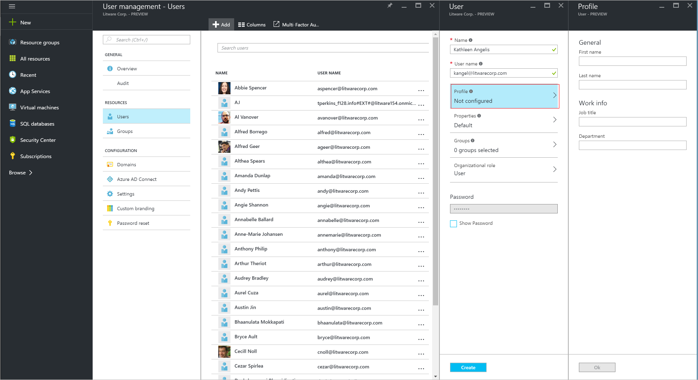
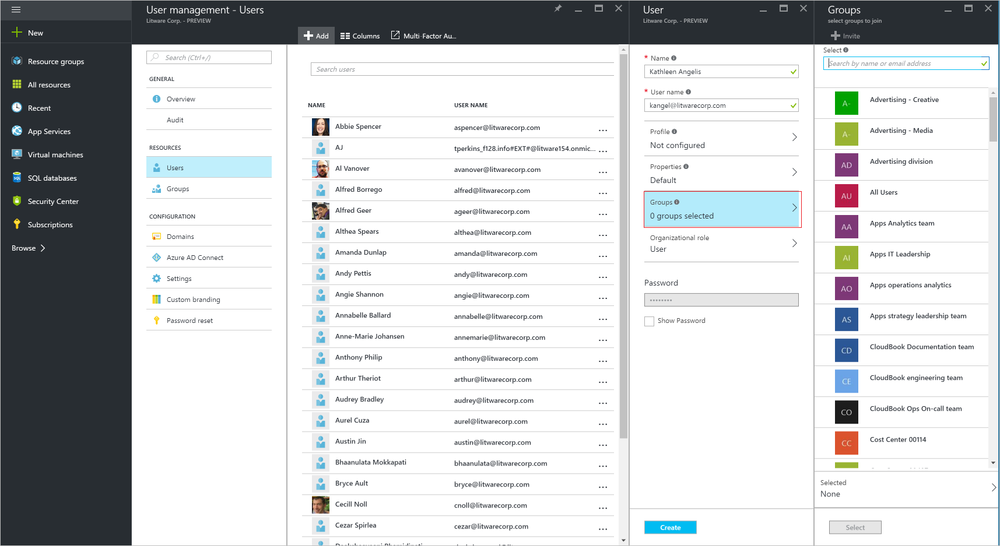

<properties
    pageTitle="Aggiungere gli utenti di altre directory o società affiliate in anteprima di Azure Active Directory | Microsoft Azure"
    description="In questo articolo viene spiegato come aggiungere utenti o modificare le informazioni utente in Azure Active Directory, inclusi gli utenti esterni e guest."
    services="active-directory"
    documentationCenter=""
    authors="curtand"
    manager="femila"
    editor=""/>

<tags
    ms.service="active-directory"
    ms.workload="identity"
    ms.tgt_pltfrm="na"
    ms.devlang="na"
    ms.topic="article"
    ms.date="09/12/2016"
    ms.author="curtand"/>

# Aggiungere gli utenti di altre directory o partner commerciali in anteprima di Azure Active Directory

> [AZURE.SELECTOR]
- [Portale di Azure](active-directory-users-create-external-azure-portal.md)
- [Portale classica Azure](active-directory-create-users-external.md)

In questo articolo viene spiegato come aggiungere utenti da altre directory in anteprima di Azure Active Directory (Azure Active Directory) o da società partner. [Che cos'è nel riquadro di anteprima?](active-directory-preview-explainer.md) Per informazioni sull'aggiunta di nuovi utenti all'interno dell'organizzazione e aggiunta di utenti che hanno un account Microsoft, vedere [aggiungere nuovi utenti di Azure Active Directory](active-directory-users-create-azure-portal.md). Utenti aggiunti non dispongono delle autorizzazioni di amministratore per impostazione predefinita, ma è possibile assegnare i ruoli a tali in qualsiasi momento.

## Aggiungere un utente

1.  Accedere al [portale di Azure](https://portal.azure.com) con un account è un amministratore globale per la directory.

2.  Selezionare **altri servizi**, immettere **gli utenti e gruppi** nella casella di testo e quindi premere **INVIO**.

    

3.  Scegliere e **l'utenti e gruppi** , selezionare **utenti**e quindi selezionare **Aggiungi**.

    

4. Nella e **utente** , specificare un nome visualizzato nella **casella Nome** e il nome dell'utente accesso nella **casella nome utente**.

5. Copiare o nota in caso contrario la password dell'utente generato in modo che è possibile fornire all'utente al termine del processo.

6. Facoltativamente, selezionare **profilo** per aggiungere gli utenti e il cognome, un titolo e il nome di reparto.
    
    

    - Selezionare i **gruppi** per aggiungere l'utente per uno o più gruppi.

        

    - Selezionare **il ruolo dell'organizzazione** per assegnare all'utente a un ruolo dall'elenco **ruoli** . Per ulteriori informazioni sui ruoli di amministratore e utente, vedere [assegnazione di ruoli di amministratore in Azure Active Directory](active-directory-assign-admin-roles.md).

        

7. Selezionare **Crea**.

8. Distribuire in modo sicuro la password generata al nuovo utente in modo che può accedere all'utente.

> [AZURE.IMPORTANT] Se l'organizzazione Usa più domini, è necessario conoscere i problemi seguenti quando si aggiunge un account utente:
>
> - Per aggiungere gli account utente con lo stesso nome dell'entità utente (UPN) in domini, **prima** aggiungere, ad esempio geoffgrisso@contoso.onmicrosoft.com, **seguito da** geoffgrisso@contoso.com.
> - **Non** aggiungere geoffgrisso@contoso.com prima di aggiungere geoffgrisso@contoso.onmicrosoft.com. In questo ordine è importante e può essere difficile da annullare.

Se si modificano le informazioni per un utente la cui identità viene sincronizzato con il servizio Active Directory locale, è possibile modificare le informazioni utente nel portale di classica Azure. Per modificare le informazioni utente, utilizzare gli strumenti di gestione di Active Directory locale.

## Che cos'è successiva

- [Aggiungere un utente](active-directory-users-create-azure-portal.md)
- [Reimpostare una password utente nel portale di Azure nuovo](active-directory-users-reset-password-azure-portal.md)
- [Assegnare a un utente a un ruolo nell'annuncio Azure](active-directory-users-assign-role-azure-portal.md)
- [Modificare le informazioni sul lavoro dell'utente](active-directory-users-work-info-azure-portal.md)
- [Gestire i profili utente](active-directory-users-profile-azure-portal.md)
- [Eliminare un utente in un annuncio Azure](active-directory-users-delete-user-azure-portal.md)
