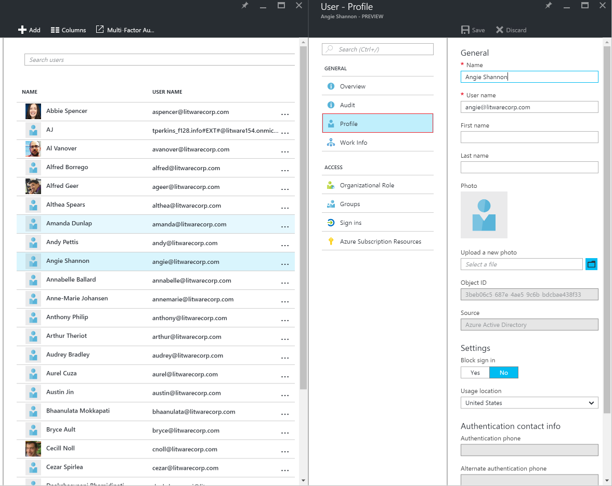

<properties
    pageTitle="Aggiungere o modificare informazioni del profilo per un utente in anteprima di Azure Active Directory | Microsoft Azure"
    description="In questo articolo viene spiegato come aggiungere il profilo utente, inclusi l'immagine del profilo, in Azure Active Directory"
    services="active-directory"
    documentationCenter=""
    authors="curtand"
    manager="femila"
    editor=""/>

<tags
    ms.service="active-directory"
    ms.workload="identity"
    ms.tgt_pltfrm="na"
    ms.devlang="na"
    ms.topic="article"
    ms.date="09/12/2016"
    ms.author="curtand"/>

# Aggiungere o modificare informazioni del profilo per un utente in anteprima di Azure Active Directory

In questo articolo viene spiegato come aggiungere informazioni del profilo utente, ad esempio un'immagine o telefono e posta elettronica autenticazione informazioni sul profilo, in anteprima di Azure Active Directory (Azure Active Directory). [Che cos'è nel riquadro di anteprima?](active-directory-preview-explainer.md) Per informazioni sull'aggiunta di nuovi utenti all'interno dell'organizzazione, vedere [aggiungere nuovi utenti di Azure Active Directory](active-directory-users-create-azure-portal.md).

## Come modificare le informazioni del profilo

1.  Accedere al [portale di Azure](https://portal.azure.com) con un account è un amministratore globale per la directory.

2.  Selezionare **altri servizi**, immettere **gli utenti e gruppi** nella casella di testo e quindi premere **INVIO**.

    

3.  In **utenti e gruppi** * blade, selezionare * *gli utenti**.

    

4. Scegliere un utente e **l'utenti e gruppi, utenti** dall'elenco.

5. Scegliere **profilo**blade per l'utente selezionato.

    

6. Aggiungere o modificare le informazioni del profilo e quindi selezionare **Salva**nella barra dei comandi.

## Che cos'è successiva

- [Aggiungere un utente](active-directory-users-create-azure-portal.md)
- [Reimpostare una password utente nel portale di Azure nuovo](active-directory-users-reset-password-azure-portal.md)
- [Assegnare a un utente a un ruolo nell'annuncio Azure](active-directory-users-assign-role-azure-portal.md)
- [Modificare le informazioni sul lavoro dell'utente](active-directory-users-work-info-azure-portal.md)
- [Eliminare un utente in un annuncio Azure](active-directory-users-delete-user-azure-portal.md)
