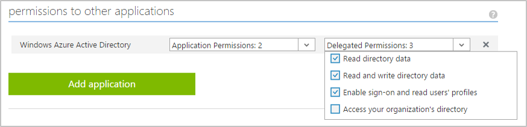

<properties
    pageTitle="L'endpoint di Azure Active Directory v 2.0 | Microsoft Azure"
    description="Un confronto tra Azure AD originale e i punti finali v 2.0."
    services="active-directory"
    documentationCenter=""
    authors="dstrockis"
    manager="mbaldwin"
    editor=""/>

<tags
    ms.service="active-directory"
    ms.workload="identity"
    ms.tgt_pltfrm="na"
    ms.devlang="na"
    ms.topic="article"
    ms.date="09/16/2016"
    ms.author="dastrock"/>

# <a name="whats-different-about-the-v20-endpoint"></a>Qual è la differenza rispetto al punto finale v 2.0?

Se si ha familiarità con Azure Active Directory o integrati Azure Active Directory in passato App, potrebbero esserci alcune differenze tra l'endpoint v 2.0 che non si aspetta.  In questo documento vengono indicati le differenze per la collaborazione.

> [AZURE.NOTE]
    Non tutti gli scenari di Azure Active Directory e funzionalità supportate da endpoint v 2.0.  Per determinare se è necessario utilizzare l'endpoint v 2.0, informazioni sulle [limitazioni v 2.0](active-directory-v2-limitations.md).


## <a name="microsoft-accounts-and-azure-ad-accounts"></a>Account Microsoft e Azure Active Directory
endpoint v 2.0 consentono agli sviluppatori scrivere applicazioni che accettano accessohttp dagli account di Microsoft Accounts e Azure Active Directory utilizzando un endpoint auth singola.  In questo modo la possibilità di scrivere l'app completamente account indipendente; può essere sostanze il tipo di account che l'utente accede con.  Naturalmente, è *possibile* rendere l'app tenere presente il tipo di account utilizzato in una specifica sessione, ma non è necessario.

Ad esempio, se l'app chiama [Microsoft Graph](https://graph.microsoft.io), alcune funzionalità aggiuntive e i dati sarà disponibili per gli utenti aziendali, ad esempio i siti di SharePoint o dati di Directory.  Ma per più azioni, ad esempio [la lettura di posta elettronica dell'utente](https://graph.microsoft.io/docs/api-reference/v1.0/resources/message), il codice può essere scritto esattamente per gli account Microsoft per Accounts e Azure Active Directory.  

L'app l'integrazione con Microsoft Accounts e Azure Active Directory è ora un processo semplice.  È possibile utilizzare un singolo set di punti finali, un'unica raccolta e una registrazione singola app per accedere al mondo consumer e dell'organizzazione.  Per altre informazioni sull'endpoint v 2.0, vedere [la panoramica](active-directory-appmodel-v2-overview.md).


## <a name="new-app-registration-portal"></a>Portale di registrazione nuova app
endpoint v 2.0 possono essere registrati solo in una nuova posizione: [apps.dev.microsoft.com](https://apps.dev.microsoft.com/?referrer=https://azure.microsoft.com/documentation/articles&deeplink=/appList).  Questo è il portale nel punto in cui è possibile ottenere un Id applicazione di personalizzare l'aspetto della pagina di accesso dell'app e altro ancora.  È necessario accedere al portale è un account Microsoft con tecnologia - account personale o aziendale o dell'istituto di istruzione.  

Si continuerà a aggiungere altre e altre funzionalità per il portale di registrazione App nel tempo.  Lo scopo è che il portale sarà nella nuova posizione in cui è possibile passare a gestire nulla e tutto il necessario dover eseguire con le applicazioni di Microsoft.


## <a name="one-app-id-for-all-platforms"></a>Un'app Id per tutte le piattaforme
Nel servizio di Azure Active Directory originale, si possono registrati diversi varie App per un singolo progetto.  È stato necessario utilizzare le registrazioni app distinta per i client nativi e web App:


Ad esempio, se è stato creato un sito Web e un'app iOS, era necessario registrarle separatamente, con due diversi ID dell'applicazione.  Se si dispone di un sito Web e un back-end web api, si potrebbe aver registrato ogni come app separata in Azure Active Directory.  Se si dispone di un'app iOS e un'app di Android, è anche possibile aver registrato due varie app.  

<!-- You may have even registered different apps for each of your build environments - one for dev, one for test, and one for production. -->

A questo punto, è sufficiente una registrazione app singola e un singolo Id applicazione per ognuno dei progetti.  È possibile aggiungere diversi "piattaforme" a un ogni progetto e fornire i dati appropriati per ogni piattaforma che si aggiunge.  Naturalmente, è possibile creare tanti App mentre si è soddisfatti in base ai propri requisiti per la maggior parte dei casi Id applicazione di un solo dovrebbe essere necessario.

<!-- You can also label a particular platform as "production-ready" when it is ready to be published to the outside world, and use that same Application Id safely in your development environments. -->

Il nostro obiettivo è che verrà visualizzata un'esperienza di sviluppo e gestione di app più semplificata e creare una visualizzazione di un singolo progetto se si lavora su più consolidata.


## <a name="scopes-not-resources"></a>Ambiti, non risorse
Nel servizio di Azure Active Directory originale di un'app può funzionare come una **risorsa**o un destinatario di token.  Una risorsa è possibile definire un numero di **ambiti** o **oAuth2Permissions** accettato, che consente di App richiedere i token a quella risorsa per un determinato insieme di ambiti di client.  Considerare l'API di Azure Active Directory grafico come esempio di una risorsa:

- Identificatore di risorsa, o `AppID URI`:`https://graph.windows.net/`
- Ambiti, o `OAuth2Permissions`: `Directory.Read`, `Directory.Write`e così via.  

Tutto ciò vale per l'endpoint v 2.0.  Si può comunque comportare un'app come risorsa e definire gli ambiti e identificata da un URI.  Applicazioni client ancora possano richiedere l'accesso a tali ambiti.  Tuttavia, è cambiata la modalità in cui un client richiede le autorizzazioni.  In passato, autorizzare un 2.0 OAuth richiesta di Azure Active Directory stato simile:

```
GET https://login.microsoftonline.com/common/oauth2/authorize?
client_id=2d4d11a2-f814-46a7-890a-274a72a7309e
&resource=https%3A%2F%2Fgraph.windows.net%2F
...
```

il parametro di **risorse** indicato nel punto in cui la risorsa dell'applicazione client richiede l'autorizzazione per.  Azure Active Directory calcolato le autorizzazioni necessarie per l'applicazione in base alla configurazione statica nel portale di Azure e rilasciati token di conseguenza.  A questo punto, la stessa 2.0 OAuth autorizzare richiesta l'aspetto seguente:

```
GET https://login.microsoftonline.com/common/oauth2/v2.0/authorize?
client_id=2d4d11a2-f814-46a7-890a-274a72a7309e
&scope=https%3A%2F%2Fgraph.windows.net%2Fdirectory.read%20https%3A%2F%2Fgraph.windows.net%2Fdirectory.write
...
```

dove il parametro **ambito** indica la risorsa e le autorizzazioni dell'app richiede l'autorizzazione per. La risorsa desiderata è ancora molto presenta nella richiesta: è sufficiente è incluso in ogni valore del parametro di ambito.  Tramite il parametro scope in questo modo consente a un endpoint v 2.0 essere più compatibili con le specifiche OAuth 2.0 e più da vicino allineato consigliate comuni.  Consente inoltre App eseguire [il consenso incrementale](#incremental-and-dynamic-consent), descritto nella sezione successiva.

## <a name="incremental-and-dynamic-consent"></a>Consenso incrementale e dinamico
App registrato in Active Directory di Azure generalmente disponibile servizio necessario per specificare le autorizzazioni necessarie OAuth 2.0 nel portale di Azure, al momento della creazione app:



Le autorizzazioni per un'app obbligatoria sono state configurate **in modo statico**.  Mentre questa configurazione dell'applicazione esiste nel portale di Azure consentiti e mantenere il codice pile e semplice, presenta alcuni problemi per gli sviluppatori:

- Un'app doveva sapere tutte le autorizzazioni di che cui fosse necessario al momento della creazione di app.  Aggiunta di autorizzazioni nel tempo, è stato un processo difficile.
- Un'app doveva sapere tutte le risorse che mai acceda anticipo.  È stato difficile creare App che possono accedere a un numero non autorizzato delle risorse.
- Un'app doveva richiedere tutte le autorizzazioni di che cui fosse necessario al momento dell'utente primo accesso.  In alcuni casi per questo che un elenco di autorizzazioni che sconsigliato gli utenti finali di approvazione accedere dell'app accesso in iniziale molto lungo.

Con l'endpoint v 2.0, è possibile specificare le autorizzazioni l'app necessarie **in modo dinamico**, in fase di esecuzione durante l'uso normale dell'app.  A tale scopo, è possibile specificare gli ambiti l'app deve in qualsiasi punto nel tempo includendo Invia a OneNote di `scope` parametro di una richiesta di autorizzazione:

```
GET https://login.microsoftonline.com/common/oauth2/v2.0/authorize?
client_id=2d4d11a2-f814-46a7-890a-274a72a7309e
&scope=https%3A%2F%2Fgraph.windows.net%2Fdirectory.read%20https%3A%2F%2Fgraph.windows.net%2Fdirectory.write
...
```

Il precedente richiede l'autorizzazione per l'app leggere un Azure Active directory dati utente, nonché scrivere dati nella directory.  Se l'utente ha acconsentito a tali autorizzazioni in passato per questa app particolare, che sarà sufficiente immettere le proprie credenziali e aver effettuato l'accesso all'app.  Se l'utente non ha acconsentito a qualsiasi di queste autorizzazioni, l'endpoint v 2.0 utente verrà chiesto di consenso per le autorizzazioni.  Per ulteriori informazioni, è possibile leggere fino su [ambiti, consenso e autorizzazioni](active-directory-v2-scopes.md).

Se si consente a un'app per richiedere le autorizzazioni in modo dinamico tramite il `scope` parametro fornisce il controllo completo dell'utente.  Se si desidera, è possibile scegliere di frontload il consenso dell'utente l'esperienza e domande per tutte le autorizzazioni di una richiesta di autorizzazione iniziale.  Oppure, se l'app richiede un numero elevato di autorizzazioni, è possibile scegliere di raccogliere le autorizzazioni dall'utente in modo incrementale, mentre si tenta di utilizzare alcune funzionalità dell'applicazione nel tempo.

## <a name="well-known-scopes"></a>Ambiti di noti

#### <a name="offline-access"></a>Accesso offline
endpoint v 2.0 può richiedere l'utilizzo di una nuova autorizzazione nota per App - il `offline_access` ambito.  Tutte le app saranno necessario richiedere questa autorizzazione se è necessaria accedere alle risorse per conto di un utente per un periodo di tempo, anche quando l'utente potrebbe non essere attivamente usando l'app prolungato.  Il `offline_access` ambito verrà visualizzato all'utente nelle finestre di dialogo di consenso come "Accesso offline i dati", che l'utente deve accettare a.  Richiede il `offline_access` autorizzazione consenta app web di ricevere OAuth 2.0 refresh_tokens da endpoint v 2.0.  Refresh_tokens sono permanenti e possono essere scambiate per nuovi access_tokens OAuth 2.0 per lunghi periodi di access.  

Se l'app non viene richiesta la `offline_access` ambito, non verranno ricevuti refresh_tokens.  Questo errore indica che quando si Riscatta un authorization_code nel [flusso di codice autorizzazione OAuth 2.0](active-directory-v2-protocols.md#oauth2-authorization-code-flow), si riceveranno solo nuovamente un Access dalla `/token` endpoint.  Tale Access continuerà a essere valido per un breve periodo di tempo (in genere un'ora), ma scadrà alla fine.  Eseguire il backup in tale momento, l'app sarà necessario reindirizzare l'utente per il `/authorize` endpoint per recuperare un nuovo authorization_code.  Durante il reindirizzamento, l'utente può o non è necessario immettere nuovamente le credenziali o un nuovo consenso autorizzazioni, a seconda del tipo il tipo di app.

Per ulteriori informazioni su come OAuth 2.0, refresh_tokens e access_tokens, consultare il [riferimento al protocollo v 2.0](active-directory-v2-protocols.md).

#### <a name="openid-profile--email"></a>OpenID, profilo e posta elettronica

Nel servizio di Azure Active Directory originale, il più semplice connettere OpenID accesso flusso fornisce un'ampia varietà di informazioni relative all'utente id_token risultante.  Sulle attestazioni in un id_token possono includere nome dell'utente, nome utente preferito, indirizzo di posta elettronica, ID oggetto e altre.

È ora stiamo limitare le informazioni che il `openid` ambito mette a disposizione le app di accedere a.  L'ambito 'openid' solo consentire l'app accedere all'utente in e ricevere un identificatore app specifico per l'utente.  Se si desidera ottenere personali informazioni personali sull'utente nell'app, l'app sarà necessario richiedere autorizzazioni aggiuntive da parte dell'utente.  È in corso Introduzione a due nuovi ambiti – la `email` e `profile` ambiti – che consentono di eseguire questa operazione.

Il `email` ambito è molto semplice: consente l'app di accedere all'indirizzo di posta elettronica principale dell'utente tramite la `email` richiedere la id_token.  Il `profile` ID ambito mette a disposizione le app di accedere a tutte le altre informazioni di base relative all'utente: il nome, nomeutente preferito, oggetto e così via.

Questa sezione consente di codice l'app in modo minimo divulgazione – è solo possibile chiedere all'utente per il set di informazioni che l'app è necessario eseguire il processo.  Per ulteriori informazioni su questi ambiti, consultare [il riferimento di ambito v 2.0](active-directory-v2-scopes.md). 

## <a name="token-claims"></a>Token delle attestazioni

Sulle attestazioni nei token emessi endpoint v 2.0 non corrispondere ai token emessi generalmente disponibile endpoint di Azure Active Directory - app di migrazione al nuovo servizio non certo una particolare domanda sarà presente in id_tokens o access_tokens.   I token emessi endpoint v 2.0 compatibili con le specifiche OAuth 2.0 e connettere OpenID, ma può seguire semantica diversa rispetto generalmente disponibile il servizio di Azure Active Directory.

Per informazioni sulle attestazioni specifiche generate in token v 2.0, vedere la [Guida di riferimento token v 2.0](active-directory-v2-tokens.md).

## <a name="limitations"></a>Limitazioni
Esistono alcune limitazioni da tenere presenti quando si usa il punto di v 2.0.  Fare riferimento al [documento limitazioni v 2.0](active-directory-v2-limitations.md) per verificare se una delle restrizioni applicate alla propria situazione particolare.
