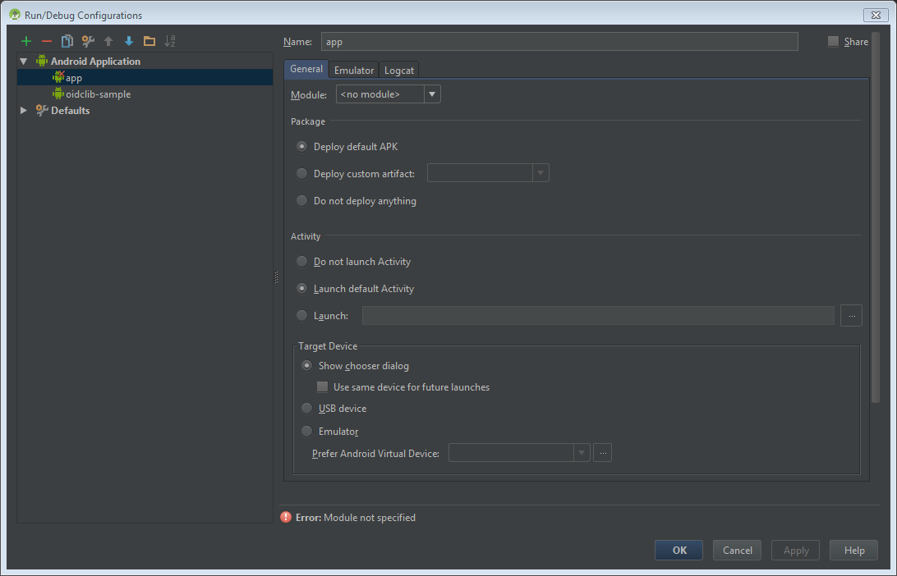

<properties
    pageTitle="Azure Active Directory app di Android v 2.0 | Microsoft Azure"
    description="Come creare un'app Android accede gli utenti che dispongono sia personale account Microsoft e lavoro o dell'istituto di istruzione account e le chiamate API grafico utilizzando le raccolte di terze parti."
    services="active-directory"
    documentationCenter=""
    authors="brandwe"
    manager="mbaldwin"
    editor=""/>

<tags
    ms.service="active-directory"
    ms.workload="identity"
    ms.tgt_pltfrm="na"
    ms.devlang="na"
    ms.topic="article"
    ms.date="09/16/2016"
    ms.author="brandwe"/>

#  <a name="add-sign-in-to-an-android-app-using-a-third-party-library-with-graph-api-using-the-v20-endpoint"></a>Aggiungere l'accesso a un'app di Android con una raccolta di terze parti API grafico utilizzando l'endpoint v 2.0

La piattaforma identità Microsoft utilizza standard aperti, ad esempio OAuth2 e OpenID connettersi. Gli sviluppatori possono utilizzare raccolta per l'integrazione con i servizi. Per consentire agli sviluppatori di utilizzare la piattaforma con altre raccolte, abbiamo scritto alcune procedure dettagliate analogo al seguente per dimostrare come configurare le librerie di terze parti per connettersi alla piattaforma Microsoft identità. La maggior parte delle raccolte in cui implementano [specifiche RFC6749 OAuth2](https://tools.ietf.org/html/rfc6749) possono connettersi alla piattaforma di identità di Microsoft.

Con l'applicazione creata in questa procedura dettagliata, gli utenti possono accedere alla propria organizzazione e quindi cercare per se stessi all'interno dell'organizzazione tramite l'API di grafico.

Se si conosce OAuth2 o OpenID connettersi, la maggior parte di questo esempio di configurazione non può avere senso all'utente. È consigliabile leggere [2.0 protocolli - OAuth 2.0 autorizzazione codice flusso](active-directory-v2-protocols-oauth-code.md) per lo sfondo.

> [AZURE.NOTE] Alcune caratteristiche della piattaforma che dispongono di un'espressione in standard OAuth2 o OpenID connettersi, ad esempio accesso condizionato e gestione di criteri Intune, è necessario usare il nostro Apri origine librerie di identità di Microsoft Azure.

Endpoint v 2.0 non supporta tutti gli scenari di Azure Active Directory e funzionalità.

> [AZURE.NOTE] Per determinare se è necessario utilizzare l'endpoint v 2.0, informazioni sulle [limitazioni v 2.0](active-directory-v2-limitations.md).


## <a name="download-the-code-from-github"></a>Scaricare il codice dal GitHub
Il codice per questa esercitazione viene mantenuto [sul GitHub](https://github.com/Azure-Samples/active-directory-android-native-oidcandroidlib-v2).  Per seguire, è possibile [scaricare struttura dell'app come un file ZIP](https://github.com/Azure-Samples/active-directory-android-native-oidcandroidlib-v2/archive/skeleton.zip) o duplicare la struttura:

```
git clone --branch skeleton git@github.com:Azure-Samples/active-directory-android-native-oidcandroidlib-v2.git
```

È anche possibile scaricare il campione e iniziare immediatamente:

```
git@github.com:Azure-Samples/active-directory-android-native-oidcandroidlib-v2.git
```

## <a name="register-an-app"></a>Registrare un'app
Creare una nuova app [portale di registrazione dell'applicazione](https://apps.dev.microsoft.com/?referrer=https://azure.microsoft.com/documentation/articles&deeplink=/appList)o seguire la procedura dettagliata su [come registrare un'app all'endpoint v 2.0](active-directory-v2-app-registration.md).  Assicurarsi di:

- Copiare l' **Id applicazione di** assegnare all'app perché sarà necessario breve.
- Aggiungere la piattaforma **Mobile** per l'app.

> Nota: Il portale di registrazione applicazione rappresenta un valore **URI reindirizzare la chiamata** . In questo esempio è necessario utilizzare il valore predefinito di `https://login.microsoftonline.com/common/oauth2/nativeclient`.


## <a name="download-the-nxoauth2-third-party-library-and-create-a-workspace"></a>Scaricare la raccolta di terze parti NXOAuth2 e creare un'area di lavoro

Per questa procedura dettagliata, occorre usare OIDCAndroidLib da GitHub, ovvero una raccolta di OAuth2 in base al codice OpenID connessione di Google. Implementa il profilo di applicazione nativa e supporta l'endpoint di autorizzazione dell'utente. Si tratta di tutti gli elementi che è necessario per l'integrazione con la piattaforma di identità di Microsoft.

Duplicare repo OIDCAndroidLib nel computer in uso.

```
git@github.com:kalemontes/OIDCAndroidLib.git
```


## <a name="set-up-your-android-studio-environment"></a>Configurare l'ambiente di Studio Android

1. Creare un nuovo progetto di Studio Android e accettare le impostazioni predefinite della procedura guidata.

    

    

    

2. Per configurare i moduli di progetto, spostare repo duplicato al percorso del progetto. È possibile anche creare il progetto e quindi duplicare direttamente al percorso del progetto.

    

3. Aprire le impostazioni di moduli di progetto tramite il menu di scelta rapida oppure usando lo scelta rapida Ctrl + Alt + Maj + S.

    

4. Rimuovere il modulo di app predefinita dal momento che solo le impostazioni del contenitore di progetto.

    

5. Importare i moduli da repo duplicato al progetto corrente.

    
    

6. Ripetere questi passaggi per la `oidlib-sample` modulo.

7. Verificare se le dipendenze oidclib il `oidlib-sample` modulo.

    

8. Fare clic su **OK** e Attendi la sincronizzazione di gradle.

    Il settings.gradle dovrebbe essere simile:

    

9. Creare l'applicazione di esempio per assicurarsi che il codice di esempio in esecuzione correttamente.

    Non sarà possibile usare ancora con Azure Active Directory. È necessario configurare alcuni endpoint prima di tutto. In questo modo viene che non si dispone un problemi Studio Android prima di iniziare la personalizzazione di applicazione di esempio.

10. Creare ed eseguire `oidlib-sample` con quello di destinazione in Studio Android.

    

11. Eliminare la `app ` directory che è stato lasciato quando si rimuove il modulo dal progetto perché Studio Android non si elimina per la sicurezza.

    

12. Aprire il menu **Modifica configurazioni** per rimuovere la configurazione di esecuzione che è stata lasciata anche quando si rimuove il modulo dal progetto.

    
    

## <a name="configure-the-endpoints-of-the-sample"></a>Configurare gli endpoint del campione

Dopo avere creato la `oidlib-sample` eseguito correttamente, modifica alcuni endpoint per ottenere il lavoro con Azure Active Directory.

### <a name="configure-your-client-by-editing-the-oidcclientconfxml-file"></a>Configurare il client modificando il file oidc_clientconf.xml

1. Perché si siano utilizzando flussi di OAuth2 solo per ottenere un token e chiamare l'API di grafico, impostare il client per eseguire solo OAuth2. OIDC venga recapitata in un secondo esempio.

    ```xml
        <bool name="oidc_oauth2only">true</bool>
    ```

2. Configurare l'ID client ricevuti dal portale di registrazione.

    ```xml
        <string name="oidc_clientId">86172f9d-a1ae-4348-aafa-7b3e5d1b36f5</string>
        <string name="oidc_clientSecret"></string>
    ```

3. Configurare il reindirizzamento URI con quella riportata di seguito.

    ```xml
        <string name="oidc_redirectUrl">https://login.microsoftonline.com/common/oauth2/nativeclient</string>
    ```

4. Configurare i propri ambiti necessari per accedere all'API di grafico.

    ```xml
        <string-array name="oidc_scopes">
            <item>openid</item>
            <item>https://graph.microsoft.com/User.Read</item>
            <item>offline_access</item>
        </string-array>
    ```

Il `User.Read` valore in `oidc_scopes` consente di leggere la firma di base del profilo utente.
Sono disponibili ulteriori su tutti gli ambiti disponibili in [Microsoft Graph ambiti di autorizzazione](https://graph.microsoft.io/docs/authorization/permission_scopes).

Se si preferisce spiegazioni sul `openid` o `offline_access` come ambiti OpenID Connetti, vedere la sezione [2.0 protocolli - OAuth 2.0 autorizzazione codice flusso](active-directory-v2-protocols-oauth-code.md).

### <a name="configure-your-client-endpoints-by-editing-the-oidcendpointsxml-file"></a>Configurare gli endpoint client modificando il file oidc_endpoints.xml

- Aprire la `oidc_endpoints.xml` file e apportare le modifiche seguenti:

    ```xml
    <!-- Stores OpenID Connect provider endpoints. -->
    <resources>
        <string name="op_authorizationEnpoint">https://login.microsoftonline.com/common/oauth2/v2.0/authorize</string>
        <string name="op_tokenEndpoint">https://login.microsoftonline.com/common/oauth2/v2.0/token</string>
        <string name="op_userInfoEndpoint">https://www.example.com/oauth2/userinfo</string>
        <string name="op_revocationEndpoint">https://www.example.com/oauth2/revoketoken</string>
    </resources>
    ```

Se si utilizza OAuth2 come il protocollo non devono mai cambiare gli endpoint.

> [AZURE.NOTE]
I punti finali per `userInfoEndpoint` e `revocationEndpoint` non sono attualmente supportati da Azure Active Directory. Se si omette con il valore di example.com predefinito, si verrà avvertiti che non sono disponibili nel campione :-)


## <a name="configure-a-graph-api-call"></a>Configurare una chiamata all'API di grafico

- Aprire la `HomeActivity.java` file e apportare le modifiche seguenti:

    ```Java
       //TODO: set your protected resource url
        private static final String protectedResUrl = "https://graph.microsoft.com/v1.0/me/";
    ```

In questo caso una chiamata API grafico semplice restituisce le informazioni.

Queste sono tutte le modifiche che è necessario eseguire. Eseguire il `oidlib-sample` applicazione, fare clic su **Accedi**.

Dopo che è stato autenticato, selezionare il pulsante **Richiedi risorsa protetta** per testare le chiamate all'API di grafico.

## <a name="get-security-updates-for-our-product"></a>Ottenere gli aggiornamenti di sicurezza per il prodotto

È consigliabile ottenere notifiche relative ai problemi di protezione per visitare [TechCenter di sicurezza](https://technet.microsoft.com/security/dd252948) e la sottoscrizione per gli avvisi di avviso di sicurezza.
