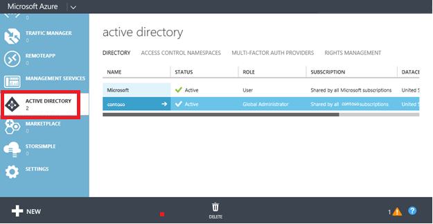
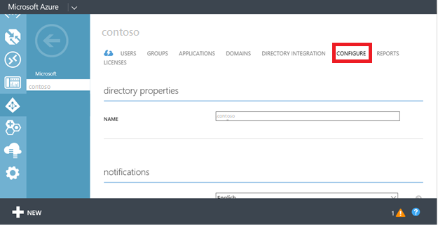

<properties
    pageTitle="Abilita Enterprise stato Roaming di Azure Active Directory | Microsoft Azure"
    description="Domande frequenti sulle impostazioni di Roaming stato Enterprise nei dispositivi Windows. Enterprise stato comuni consente agli utenti un'esperienza uniforme tra i dispositivi Windows e riduce il tempo necessario per la configurazione di un nuovo dispositivo."
    services="active-directory"
    keywords="stato dell'organizzazione comune, cloud di windows, come abilitare roaming dello stato dell'organizzazione"
    documentationCenter=""
    authors="femila"
    manager="swadhwa"
    editor="curtand"/>

<tags
    ms.service="active-directory"  
    ms.workload="identity"
    ms.tgt_pltfrm="na"
    ms.devlang="na"
    ms.topic="article"
    ms.date="09/27/2016"
    ms.author="femila"/>

# Abilita Enterprise stato Roaming di Azure Active Directory

Roaming stato Enterprise è disponibile per tutte le organizzazioni con un abbonamento Premium Azure Active Directory (Azure Active Directory). Per ulteriori informazioni su come ottenere una sottoscrizione di Azure Active Directory, vedere la [pagina di prodotto di Azure Active Directory](https://azure.microsoft.com/services/active-directory).

Quando si abilita Roaming dello stato dell'organizzazione, l'organizzazione verrà automaticamente concesse licenze per un abbonamento gratuito, limitato a Azure Rights Management. La sottoscrizione gratuita è limitata ai crittografare e decrittografare le impostazioni dell'organizzazione e dati di applicazione sincronizzati dal servizio di Roaming dello stato dell'organizzazione. è necessario disporre di un abbonamento a pagamento da usare tutte le funzionalità di Azure Rights Management.

Dopo aver ottenuto un abbonamento Premium Azure Active Directory, seguire questa procedura per attivare Roaming stato Enterprise:

1. Accesso al portale di classica Azure.
2. A sinistra, selezionare **ACTIVE DIRECTORY**e quindi selezionare la directory per il quale si vuole abilitare Roaming stato dell'organizzazione.

3. Passare alla scheda **Configura** nella parte superiore.

4.  Scorrere verso il basso e selezionare **gli utenti possono SINCRONIZZARE le impostazioni di dati aziendali e APP**e quindi fare clic su **Salva**.

Per un dispositivo con Windows 10 il roaming impostazioni con il servizio di Roaming di stato dell'organizzazione, il dispositivo deve eseguire l'autenticazione tramite un'identità di Azure Active Directory. Per i dispositivi che fanno parte di Azure Active Directory, accesso primario dell'utente è l'identità di Azure Active Directory, pertanto è richiesta alcuna configurazione aggiuntiva. Per i dispositivi che utilizzano un Active Directory locale tradizionale, l'amministratore IT necessario [collegare i dispositivi di Azure Active Directory per Windows 10 esperienze dominio](active-directory-azureadjoin-devices-group-policy.md).

## Archiviazione di dati di sincronizzazione
Dati comuni di stato dell'organizzazione sono ospitati in una o più [aree Azure](https://azure.microsoft.com/regions/ ) Allinea meglio con il valore di paese/area geografica impostato dell'istanza di Azure Active Directory. Dati aziendali comuni di stato sono suddiviso in base a tre aree geografiche principali: Nord America, EMEA e APAC. Dati Enterprise stato comuni per il tenant si trova con l'area geografica in locale e non replicati su aree geografiche.  Ad esempio, i clienti che hanno impostato su uno dei paesi EMEA il valore di paese/area geografica come "Francia" o "Zambia" avranno i dati ospitati in uno o delle regioni Azure in Europa.  Clienti che hanno impostare il valore di paese/area geografica in Azure Active Directory a uno dei paesi del Nord America, ad esempio "Italia" o "Canada" avranno i dati contenuti in uno o più delle regioni Azure negli Stati Uniti.  Clienti che hanno impostare il valore di paese/area geografica in Azure Active Directory a uno dei paesi APAC come "Australia" o "Nuova Zelanda" avranno i dati ospitati in uno o più delle regioni Azure all'interno di Asia.  Paesi del Sud America e dati Antartide verranno inseriti in una o più aree Azure negli Stati Uniti.  Il valore di paese/area geografica viene impostato come parte del processo di creazione di Azure Active directory e non può essere modificato successivamente. 

Se sono necessarie altre informazioni dettagliate sulla posizione di archiviazione di dati, file ticket di [supporto di Azure](https://azure.microsoft.com/support/options/).

## Gestire lo stato dell'organizzazione Roaming
Abilitare e disabilitare Enterprise stato Roaming nel portale di classica Azure amministratori globali di Azure Active Directory.

Gli amministratori globali possono limitare sincronizzazione impostazioni ai gruppi di sicurezza specifico.

Gli amministratori globali inoltre possono visualizzare un report di stato sincronizzazione dispositivo per utente selezionando un utente specifico dall'elenco di **utenti** istanza di Active Directory e facendo clic sulla scheda **dispositivi** e scegliendo Visualizza **dispositivi la sincronizzazione di dati di app dell'organizzazione e le impostazioni**.

##Conservazione dei dati
Dati sincronizzati con Azure tramite Enterprise stato Roaming verranno mantenuti tempo indefinito a meno che non viene eseguita un'operazione di eliminazione manuale o i dati in questione viene considerati non aggiornati. 

**Eliminazione esplicita:** I dati vengono eliminati quando un amministratore Azure consente di eliminare un utente o una directory o un amministratore in modo esplicito richiede che si desidera eliminare dati.

- **Eliminazione degli utenti**: quando un utente viene eliminato in Azure Active Directory, l'account utente roaming dati verranno contrassegnato per l'eliminazione e verrà eliminato tra 90 e 180 giorni. 
- **Eliminazione di directory**: l'eliminazione di un'intera directory in Azure Active Directory è un'operazione immediata. Tutti i dati di impostazioni associato che directory verranno contrassegnati per l'eliminazione e verrà eliminato tra 90 e 180 giorni. 
- **Su eliminazione richiesta**: se l'amministratore di Azure Active Directory desidera eliminare manualmente i dati o i dati delle impostazioni di un utente specifico, l'amministratore può file ticket con [Azure supporto](https://azure.microsoft.com/support/). 

**Eliminazione dei dati non aggiornati**: dati che non è stato effettuato l'accesso per un anno ("il periodo di memorizzazione") verrà considerato come non aggiornati e può essere eliminato da Azure. Il periodo di conservazione è soggetta a modifiche ma non sarà minore di 90 giorni. I dati non aggiornati possono essere un insieme di impostazioni Windows/applicazione o tutte le impostazioni per un utente specifico. Per esempio:
 
- Se nessuna periferica accede a un insieme di impostazioni specifico, ad esempio, un'applicazione è stata rimossa dal dispositivo, o un gruppo di impostazioni, ad esempio "Tema" è disabilitato per tutti i dispositivi di un utente, quindi tale raccolta diventerà non aggiornato dopo il periodo di conservazione e può essere eliminata. 
- Se un utente ha disattivato la sincronizzazione di impostazioni in tutti i suoi dispositivi, quindi nessuno dei dati impostazioni accederà e tutti i dati delle impostazioni per l'utente diventeranno non aggiornati e possono essere eliminati dopo il periodo di conservazione. 
- Se l'amministratore di Azure Active directory vengono disattivate le Roaming dello stato dell'organizzazione per l'intera cartella, quindi tutti gli utenti in directory verranno interrompere la sincronizzazione di impostazioni e tutti i dati di impostazioni per tutti gli utenti diventano obsoleti e possono essere eliminati dopo il periodo di conservazione. 

**Ripristino dei dati eliminati**: non sono possibile configurare i criteri di conservazione dei dati. Una volta eliminati definitivamente i dati, non saranno recuperato. Tuttavia, è importante tenere presente che i dati delle impostazioni verranno eliminati solo da Azure, non il dispositivo per l'utente finale. Se qualsiasi dispositivo in un secondo momento si riconnette al servizio di Roaming di stato dell'organizzazione, le impostazioni verranno nuovamente sincronizzate e archiviate in Azure.

## Argomenti correlati
- [Panoramica di Roaming di stato dell'organizzazione](active-directory-windows-enterprise-state-roaming-overview.md)
- [Dati roaming domande frequenti e le impostazioni](active-directory-windows-enterprise-state-roaming-faqs.md)
- [Le impostazioni di criteri e MDM per la sincronizzazione di impostazioni dei gruppi](active-directory-windows-enterprise-state-roaming-group-policy-settings.md)
- [Informazioni di riferimento impostazioni comuni di Windows 10](active-directory-windows-enterprise-state-roaming-windows-settings-reference.md)
