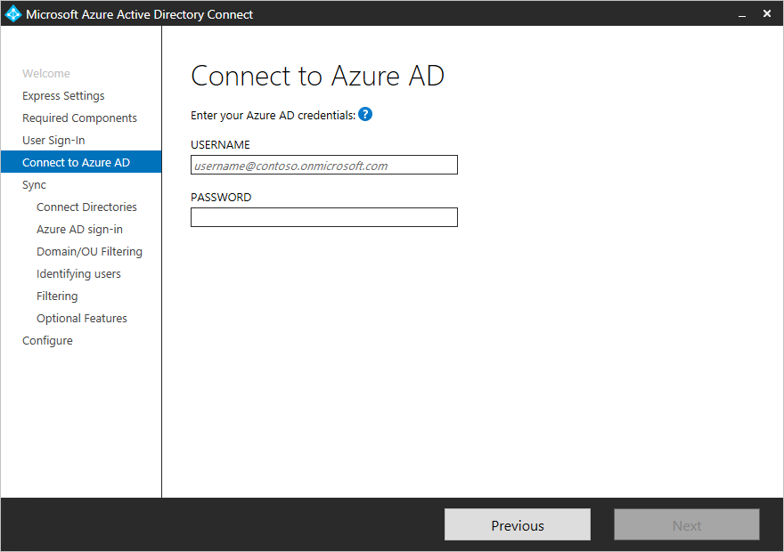
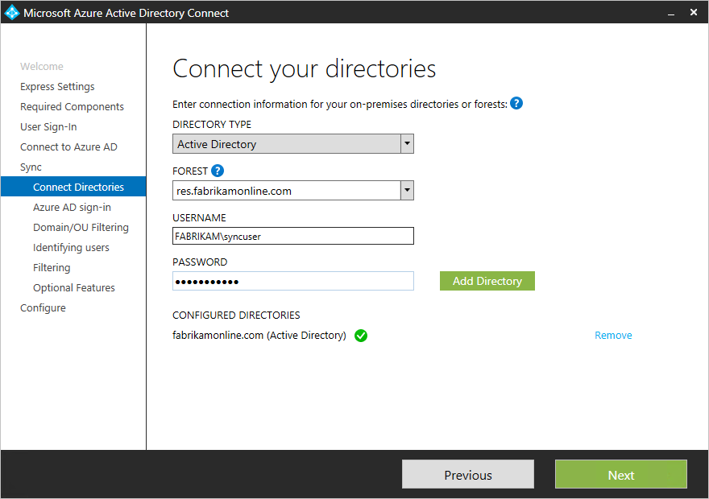
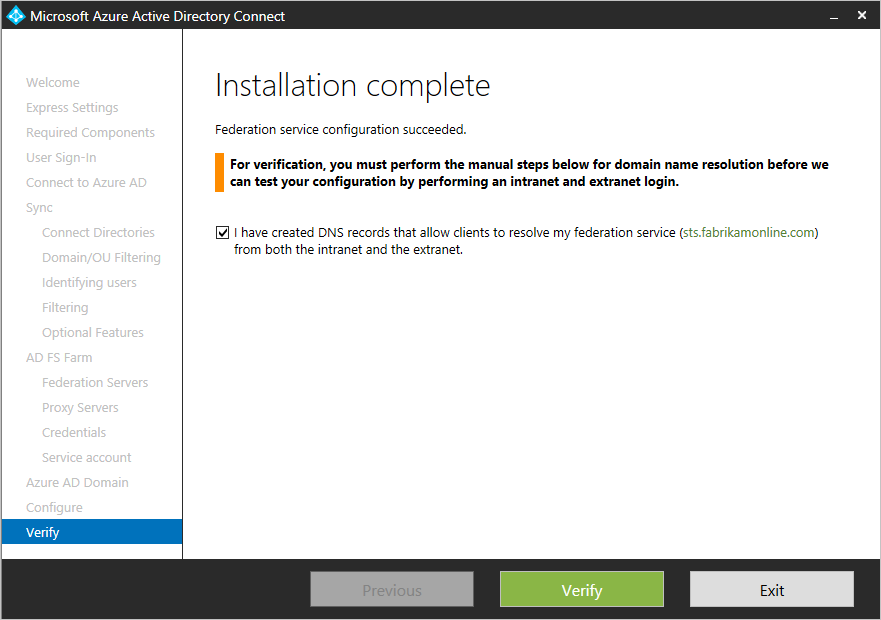

<properties
    pageTitle="Azure AD Connect: Installazione personalizzata | Microsoft Azure"
    description="In questo documento dettaglio le opzioni di installazione personalizzata per Azure AD Connect. Utilizzare queste istruzioni per installare Active Directory tramite Azure AD Connect."
    services="active-directory"
    keywords="che cos'è Azure AD Connect, installare Active Directory, componenti necessari per Azure Active Directory"
    documentationCenter=""
    authors="andkjell"
    manager="femila"
    editor="curtand"/>

<tags
    ms.service="active-directory"  
    ms.workload="identity"
    ms.tgt_pltfrm="na"
    ms.devlang="na"
    ms.topic="get-started-article"
    ms.date="09/13/2016"
    ms.author="billmath"/>

# Installazione personalizzata di Azure AD Connect
Azure AD Connect **impostazioni personalizzate** viene utilizzato quando si desiderano ulteriori opzioni per l'installazione. Viene utilizzato se si dispone di più insiemi di strutture o se si desidera configurare caratteristiche facoltative non illustra l'installazione rapida. Viene utilizzato in tutti i casi in cui l'opzione di [**installazione rapida**](active-directory-aadconnect-get-started-express.md) non soddisfa la distribuzione o della topologia.

Prima di iniziare l'installazione di Azure AD Connect, assicurarsi di [scaricare Azure AD Connect](http://go.microsoft.com/fwlink/?LinkId=615771) e completare i passaggi di prerequisito nel [Azure AD Connect: Hardware e i prerequisiti](../active-directory-aadconnect-prerequisites.md). Verificare anche che sono necessari account disponibili come descritto in [autorizzazioni e account Azure AD Connect](active-directory-aadconnect-accounts-permissions.md).

Se le impostazioni personalizzate non corrisponde a topologia, ad esempio per l'aggiornamento DirSync, vedere [la documentazione pertinente](#related-documentation) per altri scenari.

## Installazione di impostazioni personalizzate di Azure AD Connect

### Impostazioni Express
In questa pagina, fare clic su **Personalizza** per avviare l'installazione le impostazioni personalizzate.

### Installare componenti necessari
Quando si installa i servizi di sincronizzazione, è possibile lasciare la sezione configurazione facoltativo deselezionata e Azure AD Connect imposta tutto automaticamente. Imposta su un'istanza di SQL Server 2012 Express LocalDB, creare gruppi appropriati e assegnare le autorizzazioni. Se si desidera modificare le impostazioni predefinite, è possibile utilizzare la tabella seguente per informazioni sulle opzioni di configurazione opzionali che sono disponibili.

Configurazione facoltativa  | Descrizione
------------- | -------------
Utilizzare un Server SQL esistente | Consente di specificare il nome di SQL Server e il nome dell'istanza. Scegliere questa opzione se si dispone già di un server di database che si desidera utilizzare. Immettere il nome dell'istanza seguito da un punto e virgola e numero di porta nel **Nome dell'istanza** se SQL Server non è disponibile la funzionalità di navigazione.
Usare un account di servizio esistente | Per impostazione predefinita Azure AD Connect crea un account di servizio locale per i servizi di sincronizzazione da utilizzare. La password è generato automaticamente e sconosciuto alla persona che l'installazione di Azure AD Connect. Se si utilizza un server SQL remoto o un proxy che richiede l'autenticazione, è necessario un servizio account del dominio e conoscere la password. In questi casi, immettere l'account di servizio da usare. Verificare che l'utente che esegue l'installazione sia un amministratore di sistema di SQL in modo che è possibile creare un account di accesso per l'account di servizio. Vedere [autorizzazioni e account Azure AD Connect](active-directory-aadconnect-accounts-permissions.md#custom-settings-installation)
Specificare i gruppi di sincronizzazione personalizzate | Per impostazione predefinita Azure AD Connect consente di creare quattro gruppi locale del server quando sono installati i servizi di sincronizzazione. Questi gruppi sono: gruppo Administrators, gruppo operatori, gruppo Sfoglia e il gruppo di reimpostare la Password. È possibile specificare gruppi personalizzati. I gruppi devono trovarsi sul server e non è possibile individuare il dominio.

### Accesso degli utenti
Dopo l'installazione di componenti necessari, viene chiesto di selezionare l'utenti single sign-on metodo. Nella tabella seguente fornisce una breve descrizione delle opzioni disponibili. Per una descrizione completa dei metodi di accesso, vedere [accesso degli utenti](../active-directory-aadconnect-user-signin.md).

Opzione Single Sign On | Descrizione
------------- | -------------
Sincronizzazione delle password | Gli utenti possono accedere ai servizi cloud Microsoft, ad esempio Office 365, usando la stessa password che usano per la rete locale. Le password degli utenti vengono sincronizzate con Azure Active Directory come hash password e l'autenticazione viene eseguita nel cloud. Per ulteriori informazioni, vedere [la sincronizzazione delle Password](../active-directory-aadconnectsync-implement-password-synchronization.md) .
Federazione con ADFS | Gli utenti possono accedere ai servizi cloud Microsoft, ad esempio Office 365, usando la stessa password che usano per la rete locale.  Gli utenti vengono reindirizzati alla loro locale ADFS istanza per accedere e l'autenticazione viene eseguita in locale.
Non si configura | Non viene installata e configurata caratteristica. Scegliere questa opzione se si dispone già di un server federativo parte 3 ° o un'altra soluzione esistente in posizione.

### Connettersi a Azure Active Directory
Nella schermata Connetti al Azure Active Directory, immettere un account di amministratore globale e la password. Se è stata selezionata **la federazione con ADFS** nella pagina precedente, non accedere con un account in un dominio che pianificare l'abilitazione per la federazione. Un suggerimento consiste nell'usare un account nel dominio **onmicrosoft.com** predefinito, che include la directory di Azure Active Directory.

L'account viene utilizzato solo per creare un account di servizio in Azure Active Directory e non viene utilizzato una volta completata la procedura guidata.  

Se l'account di amministratore globale ha MFA attivata, è necessario fornire la password nel popup del segno e completare la richiesta MFA. La difficoltà quando si è possibile fornire un codice di verifica o una chiamata telefonica.  

L'account di amministratore globale può avere [Privilegi di gestione delle identità](../active-directory-privileged-identity-management-getting-started.md) attivata.

Se si riceve un messaggio di errore e problemi di connettività, vedere [risolvere i problemi di connettività](../active-directory-aadconnect-troubleshoot-connectivity.md).

## Pagine della sezione sincronizzazione

### Connettere la directory
Per connettere il servizio di dominio Active Directory, Azure AD Connect richiede le credenziali di un account con autorizzazioni sufficienti. È possibile immettere la parte del dominio nel formato FQDN o NetBios, vale a dire FABRIKAM\syncuser o fabrikam.com\syncuser. Questo account può essere un account utente normale perché sono necessarie solo le autorizzazioni di lettura predefinito. Tuttavia, a seconda dello scenario, potrebbe essere necessario più autorizzazioni. Per ulteriori informazioni, vedere [account di connessione di Azure Active Directory e autorizzazioni](../active-directory-aadconnect-accounts-permissions.md#create-the-ad-ds-account)

### Azure configurazione di Active Directory
Questa pagina consente di esaminare i domini UPN locale di dominio Active Directory e che sono stati verificati in Azure Active Directory. Questa pagina consente anche di configurare l'attributo da utilizzare per l'attributo userPrincipalName.

  
Esaminare ogni dominio contrassegnata **Non è stato aggiunto** e **Non verificato**. Assicurarsi che questi domini che si usa verificati in Azure Active Directory. Quando si sono verificati i domini, fare clic sul simbolo di aggiornamento. Per ulteriori informazioni, vedere [aggiungere e verificare il dominio](../active-directory-add-domain.md)

**UserPrincipalName** - userPrincipalName attributo è utenti attributo utilizzano quando si effettua l'accesso a Azure Active Directory e in Office 365. I domini usati, noto anche come-suffisso UPN, devono essere verificati in Azure Active Directory prima che gli utenti sono sincronizzati. Si consiglia di mantenere predefinito attributo userPrincipalName. Se l'attributo è non routing e non può essere verificato, è possibile selezionare un altro attributo. È possibile selezionare, ad esempio posta elettronica come l'attributo che l'ID di accesso. Utilizzo di un altro attributo userPrincipalName è noto come **ID alternativo**. Il valore dell'attributo ID alternativo deve seguire lo standard RFC822. Con la sincronizzazione delle password e la federazione, è possibile utilizzare un ID alternativo.

>[AZURE.WARNING]
Con un ID alternativo non è compatibile con tutti i carichi di Office 365. Per ulteriori informazioni, vedere [Configurazione di ID di accesso alternativo](https://technet.microsoft.com/library/dn659436.aspx).

### Dominio e il filtraggio di unità Organizzativa
Per impostazione predefinita vengono sincronizzate tutti i domini e unità organizzative. Se sono presenti alcuni domini o unità organizzative non si desidera sincronizzare Azure Active Directory, è possibile deselezionare questi domini e unità organizzative.  
 questa pagina della procedura guidata configurazione il filtro basato sul dominio. Per ulteriori informazioni, vedere [il filtro basato sul dominio](../active-directory-aadconnectsync-configure-filtering.md#domain-based-filtering).

È inoltre possibile che alcuni domini non siano raggiungibili a causa di limitazioni firewall. Questi domini deselezionati per impostazione predefinita e ricevere un avviso.  
  
Se viene visualizzato l'avviso, assicurarsi che questi domini sono effettivamente raggiungibili ed è previsto l'avviso.

### Identifica gli utenti
Corrispondenza tra funzionalità strutture consente di definire come gli utenti dall'insieme di strutture di Active Directory sono rappresentati in Azure Active Directory. Un utente può essere rappresentato in una sola volta tra insiemi di strutture tutti o disporre di una combinazione degli account attivato e disattivato. L'utente può essere rappresentato anche come contatto in alcune strutture.

Impostazione | Descrizione
------------- | -------------
[Gli utenti sono rappresentati solo una volta tra insiemi di strutture tutti](../active-directory-aadconnect-topologies.md#multiple-forests-separate-topologies) | Tutti gli utenti vengono creati come singoli oggetti in Azure Active Directory. Gli oggetti non fanno parte nel metaverse.
[Attributo della posta](../active-directory-aadconnect-topologies.md#multiple-forests-full-mesh-with-optional-galsync) | Questa opzione eseguono l'accesso agli utenti e i contatti se l'attributo mail ha lo stesso valore in diversi insiemi di strutture. Usare questa opzione quando i contatti sono stati creati usando GALSync.
[ObjectSID e msExchangeMasterAccountSID / msRTCSIP-OriginatorSid](../active-directory-aadconnect-topologies.md#multiple-forests-account-resource-forest) | Questa opzione viene aggiunto a un utente abilitato in un insieme di strutture di account con un utente disabilitato un insieme di strutture di risorse. In Exchange questa configurazione è nota come una cassetta postale collegata. Questa opzione può essere utilizzata anche se si usa solo Lync ed Exchange non sono presenti in strutture delle risorse.
sAMAccountName e MailNickName | Questa opzione unisce gli attributi nel punto in cui è previsto che l'ID di accesso per l'utente può trovarsi.
Un attributo specifico | Questa opzione consente di selezionare un attributo personalizzato. **Limitazione:** Assicurarsi di selezionare un attributo già disponibili nel metaverse. Se si sceglie un attributo personalizzato (non metaverse), non è possibile eseguire la procedura guidata.

**Ancoraggio di origine** - sourceAnchor attributo rappresenta un attributo che non è modificabile nel corso della durata di un oggetto utente. È la chiave primaria collegamento l'utente locale con l'utente in Active Directory Azure. Poiché l'attributo non può essere modificata, è necessario pianificare per un buono attributo da utilizzare. Costituire è objectGUID. Questo attributo non viene modificato, a meno che l'account utente viene spostato tra insiemi di strutture/domini. In un ambiente con più insiemi di strutture in cui si sposta account tra insiemi di strutture, un altro attributo da utilizzare, ad esempio un attributo con il campo ID dipendente. Evitare gli attributi da modificare quando una persona matrimonio o modificare le assegnazioni. Non è possibile utilizzare gli attributi con un @-sign, in modo che la posta elettronica e userPrincipalName non può essere utilizzati. L'attributo è distinzione tra maiuscole e anche quando si sposta un oggetto tra insiemi di strutture, dunque, verificare di maiuscole / minuscole superiore/inferiore. Gli attributi binari sono codifica base 64, ma gli altri tipi di attributo rimangono nel suo stato non codificato. In scenari di federazione e alcune interfacce di Azure Active Directory, l'attributo è noto anche come immutableID. Sono disponibili ulteriori informazioni sull'ancoraggio origine nei [concetti di progettazione](../active-directory-aadconnect-design-concepts.md#sourceAnchor).

### Sincronizzazione di filtro in base ai gruppi
Il filtro nella funzione gruppi consente di sincronizzare solo un sottoinsieme di oggetti per un progetto pilota. Per utilizzare questa caratteristica, creare un gruppo a tale scopo in Active Directory locale. Quindi aggiungere utenti e gruppi che devono essere sincronizzati Azure Active Directory come membri diretti. In un secondo momento, è possibile aggiungere e rimuovere utenti da questo gruppo per gestire l'elenco di oggetti che deve essere presente in Azure Active Directory. Tutti gli oggetti che si desidera sincronizzare devono essere un membro del gruppo diretto. Tutti gli utenti, gruppi, i contatti e computer/dispositivi deve essere membri diretti. Non è stato risolto l'appartenenza ai gruppi annidate. Quando si aggiunge un gruppo con l'aggiunta di un membro, solo il gruppo stesso e non ai relativi componenti.

>[AZURE.WARNING]
Questa funzionalità viene usata solo per una distribuzione pilota di supporto. Non viene utilizzato in un ambiente di produzione complete.

In un ambiente di produzione completa, sta per essere difficile da gestire un singolo gruppo con tutti gli oggetti per la sincronizzazione. È necessario utilizzare uno dei metodi [Configura](../active-directory-aadconnectsync-configure-filtering.md)filtri.

### Caratteristiche facoltative
Questa schermata consente di selezionare le funzionalità facoltative ai tuoi scenari specifici.

>[AZURE.WARNING]
Se si dispone di DirSync o sincronizzazione di Azure Active Directory attiva, non attivare una qualsiasi delle caratteristiche writeback di Azure AD Connect.

Caratteristiche facoltative | Descrizione
------------------- | -------------
Distribuzione ibrida di Exchange | La funzione di distribuzione ibrida di Exchange consente per assicurare la coesistenza cassette postali di Exchange sia locale e in Office 365. Azure AD Connect sta sincronizzando un determinato set di [attributi](../active-directory-aadconnectsync-attributes-synchronized.md#exchange-hybrid-writeback) da Azure Active Directory in directory locale.
Attributo di filtro e Azure Active Directory app | Abilitando attributo di filtro e app di Azure Active Directory, è possibile adattare l'insieme di attributi sincronizzati. Questa opzione consente di aggiungere due altre pagine di configurazione per la procedura guidata. Per ulteriori informazioni, vedere [app Azure Active Directory e degli attributi di filtro](#azure-ad-app-and-attribute-filtering).
Sincronizzazione delle password | Se si seleziona la federazione della soluzione di accesso, è possibile abilitare questa opzione. La sincronizzazione delle password può quindi essere utilizzata come un'opzione di backup. Per ulteriori informazioni, vedere [la sincronizzazione delle Password](../active-directory-aadconnectsync-implement-password-synchronization.md).
Writeback di password | Abilitando writeback di password, le modifiche delle password che derivano in Azure Active Directory è scritte alla directory locale. Per ulteriori informazioni, vedere [Guida introduttiva alla gestione delle password](../active-directory-passwords-getting-started.md).
Writeback di gruppo | Se si utilizza la caratteristica di **Gruppi di Office 365** , è possibile creare questi gruppi sono rappresentati in Active Directory locale. Questa opzione è disponibile solo se si dispone di Exchange presenti in Active Directory locale. Per ulteriori informazioni, vedere [writeback di gruppo](../active-directory-aadconnect-feature-preview.md#group-writeback).
Writeback di dispositivo | Consente agli oggetti dispositivo writeback in Azure Active Directory locale Active Directory per gli scenari di accesso condizionato. Per ulteriori informazioni, vedere [attivazione dispositivo writeback di Azure AD Connect](../active-directory-aadconnect-feature-device-writeback.md).
Sincronizzazione della directory estensione attributo | Se si attiva la sincronizzazione della directory estensioni attributo, gli attributi specificati vengono sincronizzati di Azure Active Directory. Per ulteriori informazioni, vedere [estensioni Directory](../active-directory-aadconnectsync-feature-directory-extensions.md).

### Attributo di filtro e Azure Active Directory app
Se si desidera limitare gli attributi da sincronizzare con Azure Active Directory, quindi iniziare selezionando a quali servizi si utilizza. Se si apportano modifiche di configurazione in questa pagina, è necessario selezionare esplicitamente eseguendo nuovamente l'installazione guidata di un nuovo servizio.

In base ai servizi selezionati nel passaggio precedente, questa pagina Mostra tutti gli attributi sincronizzati. In questo elenco è una combinazione di tutti i tipi di oggetto in corso la sincronizzazione. Se non vi sono alcuni attributi particolari che è necessario non vengono sincronizzati, è possibile deselezionare gli attributi.

>[AZURE.WARNING]
Rimozione di attributi può influire sulla funzionalità. Per procedure consigliate, vedere [attributi sincronizzati](../active-directory-aadconnectsync-attributes-synchronized.md#attributes-to-synchronize).

### Sincronizzazione della directory estensione attributo
È possibile estendere lo schema di Azure Active Directory con gli attributi personalizzati aggiunti dall'organizzazione o altri attributi di Active Directory. Per utilizzare questa caratteristica, selezionare **Directory estensione attributo Sincronizza** nella pagina **Caratteristiche facoltativo** . È possibile selezionare più attributi a cui eseguire la sincronizzazione in questa pagina.

Per ulteriori informazioni, vedere [estensioni Directory](../active-directory-aadconnectsync-feature-directory-extensions.md).

## Configurazione della federazione con ADFS
Configurazione di ADFS con Azure AD Connect è semplice con pochi clic. È necessario prima la configurazione.

- Un server di Windows Server 2012 R2 per il server federativo alla gestione remota abilitato
- Un server di Windows Server 2012 R2 per il server Proxy di applicazione Web con gestione remota abilitato
- Un certificato SSL per il nome del servizio federazione si intende utilizzare (ad esempio sts.contoso.com)

### Prerequisiti di AD FS configurazione
Per configurare la farm di ADFS con Azure AD Connect, verificare che WinRM è attivata per il server remoto. Inoltre, passano attraverso requisito porte elencato nella [tabella 3 - Azure AD Connect e server federativo/WAP](../active-directory-aadconnect-ports.md#table-3---azure-ad-connect-and-federation-serverswap).

### Creare una nuova farm di ADFS o usare una farm di ADFS esistente
È possibile utilizzare una farm di ADFS esistente oppure è possibile scegliere di creare una nuova farm di ADFS. Se si sceglie di crearne uno nuovo, è necessario fornire il certificato SSL. Se il certificato SSL è protetto da password, viene richiesto per la password.

Se si sceglie di utilizzare una farm di ADFS esistente, vengono create direttamente alla configurazione la relazione di attendibilità tra schermata ADFS e Azure Active Directory.

### Specificare i server ADFS
Immettere il server che si desidera installare ADFS in. È possibile aggiungere uno o più server in base alle capacità di pianificazione alle esigenze. Partecipare a tutti i server in Active Directory prima di eseguire questa configurazione. Si consiglia di installazione di un singolo server ADFS per distribuzioni pilota e. Aggiungere quindi e distribuire più server per soddisfare le esigenze di ridimensionamento eseguendo Azure AD Connect nuovamente dopo la configurazione iniziale.

>[AZURE.NOTE]
Assicurarsi che tutti i server fanno parte di un dominio di Active Directory prima di eseguire questa configurazione.

### Specificare i server Proxy di applicazione Web
Immettere il server che si desidera impostare come server proxy applicazione Web. Il server proxy di applicazione web viene distribuito nella rete Perimetrale (esposto extranet) e supporta le richieste di autenticazione dal extranet. È possibile aggiungere uno o più server in base alle capacità di pianificazione alle esigenze. Si consiglia di installazione di un server di proxy di applicazione Web solo per le distribuzioni pilota e. Aggiungere quindi e distribuire più server per soddisfare le esigenze di ridimensionamento eseguendo Azure AD Connect nuovamente dopo la configurazione iniziale. Si consiglia di gestire un numero equivalente di server proxy per soddisfare autenticazione dalla rete intranet.

>[AZURE.NOTE]
<li> Se l'account in uso non è un amministratore locale nel server ADFS, viene richiesto per le credenziali di amministratore.</li>
<li> Assicurarsi che sia presente la connettività HTTP/HTTPS tra il server Azure AD Connect e il server Proxy di applicazione Web prima di eseguire questo passaggio.</li>
<li> Assicurarsi che la connettività HTTP/HTTPS tra Server dell'applicazione Web e il server ADFS per consentire le richieste di autenticazione scorrono.</li>

Viene richiesto di immettere le credenziali in modo che il server di applicazione web può stabilire una connessione protetta nel server ADFS. Queste credenziali devono essere un amministratore locale nel server ADFS.

### Specificare l'account di servizio per il servizio di ADFS
Il servizio di ADFS richiede un account di servizio di dominio per l'autenticazione degli utenti e cercare le informazioni utente in Active Directory. Supporta due tipi di account di servizio:

- **Gruppo gestito degli Account del servizio** - introdotta in servizi di dominio Active Directory con Windows Server 2012. Questo tipo di account offre servizi, ad esempio ADFS, un singolo account senza dover aggiornare regolarmente la password dell'account. Usare questa opzione se si dispone già di Windows Server 2012 controller del dominio a cui appartiene il server ADFS.
- **Account utente di dominio** - questo tipo di account è necessario fornire una password e aggiornare la password quando la password viene modificato o alla scadenza. Usare questa opzione solo quando non si dispone di Windows Server 2012 controller del dominio a cui appartiene il server ADFS.

Se si seleziona gruppo gestite degli Account del servizio e questa caratteristica non è mai stata usata in Active Directory, viene richiesto per le credenziali di amministratore dell'organizzazione. Queste credenziali vengono utilizzate per avviare l'archivio delle chiavi e abilitare la funzionalità di Active Directory.

### Selezionare il dominio di Azure Active Directory che si desidera stabilire la federazione
Questa configurazione viene utilizzata per la relazione federazione tra AD FS e Azure Active Directory di installazione. Configura ADFS al problema token di sicurezza di Azure Active Directory e configura Azure Active Directory per considerare attendibile il token da questa specifica istanza di ADFS. Questa pagina consente solo configurare un unico dominio durante l'installazione iniziale. È possibile configurare più domini in un secondo momento eseguendo nuovamente Azure AD Connect.

### Verificare il dominio di Azure Active Directory selezionato per la federazione
Quando si seleziona il dominio deve essere federato, Azure AD Connect vengono fornite informazioni necessarie per verificare un dominio non verificato. Vedere [aggiungere e verificare il dominio](../active-directory-add-domain.md) illustra come utilizzare queste informazioni.

>[AZURE.NOTE]
AD Connect tenta di verificare il dominio durante la fase di configurazione. Se si continua a configurare senza aggiungere i record DNS necessari, la procedura guidata non è in grado di completare la configurazione.

## Configurare e verificare le pagine
La configurazione accade in questa pagina.

>[AZURE.NOTE]
Prima di continuare l'installazione e se è stato configurato la federazione, assicurarsi di avere configurato [la risoluzione dei server federativi](../active-directory-aadconnect-prerequisites.md#name-resolution-for-federation-servers).

### Modalità di gestione temporanea
È possibile configurare un nuovo server di sincronizzazione in parallelo con la modalità di gestione temporanea. Questa caratteristica è supportata solo per disporre di un server di sincronizzazione l'esportazione in una directory nel cloud. Ma se si desidera spostare da un altro server, ad esempio una esecuzione DirSync, è possibile attivare Azure AD Connect in modalità di gestione temporanea. Quando si abilita, il motore di sincronizzazione importare e sincronizzare i dati come di consueto, ma non vengono esportati nulla in Azure Active Directory o Active Directory. Writeback sincronizzazione e la password la password di caratteristiche sono disabilitati in modalità di gestione temporanea.

In modalità di gestione temporanea, è possibile apportare modifiche necessarie al motore di sincronizzazione e verificare cosa si desidera esportare. Quando la configurazione è soddisfacente, eseguire di nuovo l'installazione guidata e disattivare la modalità di gestione temporanea. È ora esportate Azure Active Directory dal server. Assicurarsi di disattivare l'altro server nello stesso momento in modo unico server attivamente l'esportazione.

Per ulteriori informazioni, vedere [modalità di gestione temporanea](../active-directory-aadconnectsync-operations.md#staging-mode).

### Verificare la configurazione della federazione
Azure AD Connect consente di verificare le impostazioni DNS quando si fa clic sul pulsante verifica.

Inoltre, effettuare le seguenti operazioni di verifica:

- Convalidare che è possibile accedere da un browser da un computer collegato tramite join dominio della rete Intranet: connettersi a https://myapps.microsoft.com e verificare di effettuare l'accesso con l'account connesso. L'account di amministratore di Active Directory predefinito non è sincronizzato e non può essere utilizzato per la verifica.
- Convalidare che è possibile accedere da un dispositivo dalla rete extranet. In un computer di casa o un dispositivo mobile, connettersi a https://myapps.microsoft.com e fornire le credenziali.
- Convalidare accessohttp rich client. Connettersi a https://testconnectivity.microsoft.com, scegliere la scheda **Office 365** e scegliere **Office 365 Single Sign-On Test**.

## Passaggi successivi
Al termine dell'installazione, disconnettersi e accedere nuovamente a Windows prima di utilizzare Gestione servizio di sincronizzazione o Editor di regole di sincronizzazione.

Dopo aver creato Azure AD Connect installato è possibile [verificare l'installazione e assegnare licenze](../active-directory-aadconnect-whats-next.md).

Ulteriori informazioni su queste funzionalità, hanno appurate con l'installazione: [Impedisci accidentali Elimina](../active-directory-aadconnectsync-feature-prevent-accidental-deletes.md) e [Azure Active Directory connettersi integrità](../active-directory-aadconnect-health-sync.md).

Altre informazioni su questi argomenti comuni: [utilità di pianificazione e la procedura di attivazione di sincronizzazione](../active-directory-aadconnectsync-feature-scheduler.md).

Ulteriori informazioni [sull'integrazione le identità locali con Azure Active Directory](../active-directory-aadconnect.md).

## Documentazione correlata

Argomento |  
--------- | ---------
Panoramica di Azure AD Connect | [Integrazione le identità locali con Azure Active Directory](../active-directory-aadconnect.md)
Installare con le impostazioni Express | [Installazione di Azure AD Connect rapida](active-directory-aadconnect-get-started-express.md)
Eseguire l'aggiornamento da DirSync | [Eseguire l'aggiornamento da strumento di sincronizzazione di Azure Active Directory (DirSync)](active-directory-aadconnect-dirsync-upgrade-get-started.md)
Account usato per l'installazione | [Ulteriori informazioni sulle autorizzazioni e account Azure AD Connect](active-directory-aadconnect-accounts-permissions.md)
