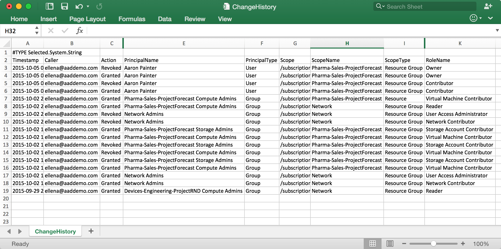

<properties
    pageTitle="Creare un report di access modifica cronologia | Microsoft Azure"
    description="Generare un report in cui sono elencate tutte le modifiche in access per le sottoscrizioni Azure con controllo dell'accesso basato sui ruoli negli ultimi 90 giorni."
    services="active-directory"
    documentationCenter=""
    authors="kgremban"
    manager="femila"
    editor=""/>

<tags
    ms.service="active-directory"
    ms.devlang="na"
    ms.topic="article"
    ms.tgt_pltfrm="na"
    ms.workload="identity"
    ms.date="08/03/2016"
    ms.author="kgremban"/>

# <a name="create-an-access-change-history-report"></a>Creare un report di cronologia delle modifiche di access

Ogni volta che qualcuno concede o revoca l'accesso all'interno le sottoscrizioni, le modifiche ottenere eseguito l'accesso agli eventi Azure. È possibile creare report di access modifica cronologia per visualizzare tutte le modifiche negli ultimi 90 giorni.

## <a name="create-a-report-with-azure-powershell"></a>Creare un report con PowerShell Azure
Per creare un report di cronologia delle modifiche di access in PowerShell, utilizzare la `Get-AzureRMAuthorizationChangeLog` comando. Ulteriori informazioni su questo cmdlet sono disponibili nella [Raccolta di PowerShell](https://www.powershellgallery.com/packages/AzureRM.Storage/1.0.6/Content/ResourceManagerStartup.ps1).

Quando si chiama questo comando, è possibile specificare le proprietà delle assegnazioni desiderato, incluse le seguenti:

| Proprietà | Descrizione |
| -------- | ----------- |
| **Azione** | Se l'accesso è stato concesso o revocato |
| **Chiamante** | Il proprietario responsabile per la modifica di access |
| **Data** | La data e l'ora in cui è stato modificato l'accesso |
| **DirectoryName** | Nella directory di Azure Active Directory |
| **PrincipalName** | Il nome dell'utente, gruppo o dell'applicazione |
| **PrincipalType** | Se l'assegnazione è stato un utente, gruppo o dell'applicazione |
| **RoleId** | GUID del ruolo che è stato concesso o revocato |
| **RoleName** | Il ruolo di cui è stato concesso o revocato |
| **ScopeName** | Il nome della sottoscrizione, gruppo di risorse o delle risorse |
| **ScopeType** | Se è stato l'assegnazione all'abbonamento, gruppo di risorse o ambito delle risorse |
| **SubscriptionId** | GUID della sottoscrizione Azure |
| **SubscriptionName** | Il nome della sottoscrizione Azure |

In questo esempio viene sono elencate tutte le modifiche di accesso nella sottoscrizione negli ultimi sette giorni:

```
Get-AzureRMAuthorizationChangeLog -StartTime ([DateTime]::Now - [TimeSpan]::FromDays(7)) | FT Caller,Action,RoleName,PrincipalType,PrincipalName,ScopeType,ScopeName
```


## <a name="create-a-report-with-azure-cli"></a>Creare un report con CLI Azure
Per creare un report Cronologia modifiche di accesso dell'interfaccia della riga di comando Azure (CLI), utilizzare la `azure role assignment changelog list` comando.

## <a name="export-to-a-spreadsheet"></a>Esportare in un foglio di calcolo
Per salvare il report o modificare i dati, è possibile esportare le modifiche di access in un file CSV. È quindi possibile visualizzare il report in un foglio di calcolo per la revisione.



## <a name="see-also"></a>Vedere anche
- Guida introduttiva a [Controllo dell'accesso Azure Role-Based](role-based-access-control-configure.md)
- Utilizzare i [ruoli personalizzati in RBAC Azure](role-based-access-control-custom-roles.md)
