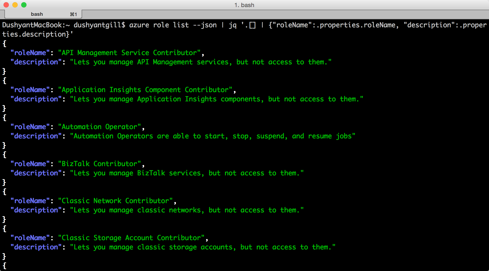
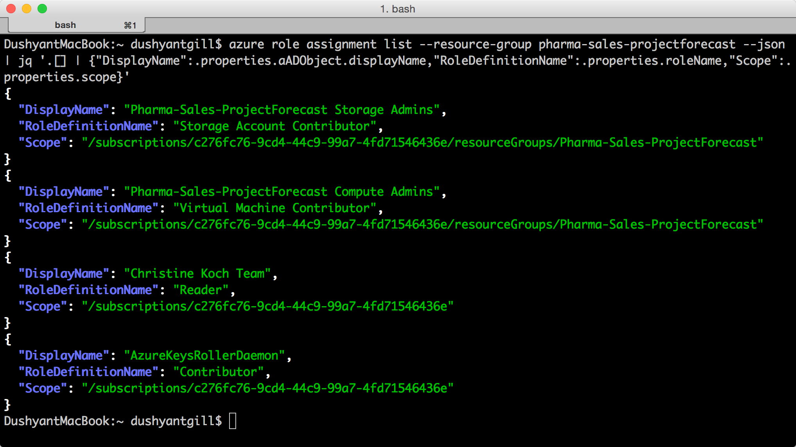
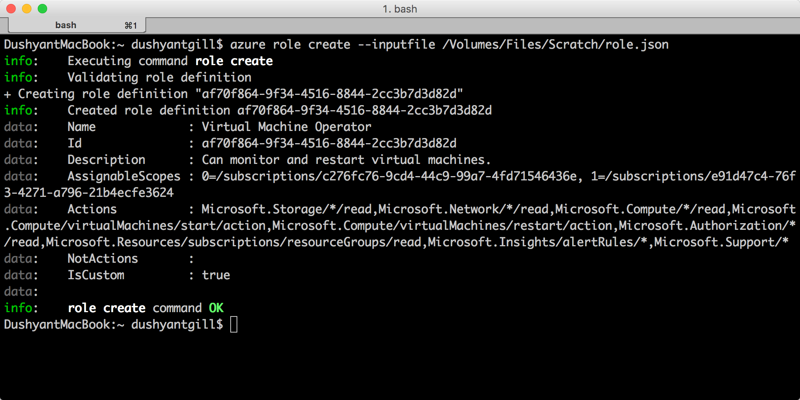
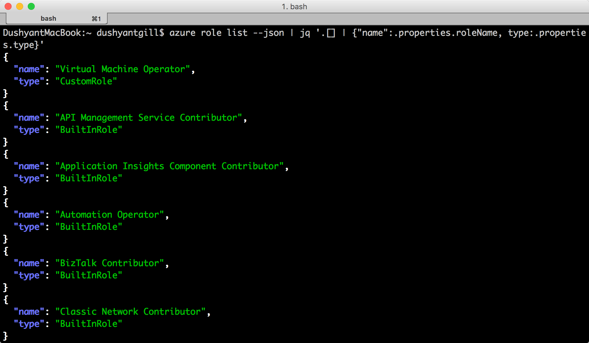

<properties
    pageTitle="Gestire il controllo dell'accesso basato sui ruoli (RBAC) con Azure CLI | Microsoft Azure"
    description="Informazioni su come gestire basato sui ruoli controllo di accesso (RBAC) con la riga di comando Azure elencando i ruoli e le azioni di ruolo e mediante l'assegnazione di ruoli per gli ambiti di abbonamento e applicazione."
    services="active-directory"
    documentationCenter=""
    authors="kgremban"
    manager="femila"
    editor=""/>

<tags
    ms.service="active-directory"
    ms.devlang="na"
    ms.topic="article"
    ms.tgt_pltfrm="na"
    ms.workload="identity"
    ms.date="07/22/2016"
    ms.author="kgremban"/>

# <a name="manage-role-based-access-control-with-the-azure-command-line-interface"></a>Gestione controllo dell'accesso basato sui ruoli con l'interfaccia della riga di comando Azure

> [AZURE.SELECTOR]
- [PowerShell](role-based-access-control-manage-access-powershell.md)
- [CLI Azure](role-based-access-control-manage-access-azure-cli.md)
- [API REST](role-based-access-control-manage-access-rest.md)

È possibile utilizzare controllo dell'accesso basato sui ruoli (RBAC) nel portale di Azure e Azure Manager delle risorse API per gestire l'accesso alle risorse a livello diffusamente abbonamento. Con questa caratteristica, è possibile concedere l'accesso per gli utenti, gruppi o identità di servizio Active Directory mediante l'assegnazione di alcuni ruoli ad essi in un particolare ambito.

Prima di utilizzare l'interfaccia della riga di comando Azure (CLI) per gestire RBAC, è necessario disporre le operazioni seguenti:

- Azure CLI versione 0.8.8 o versione successiva. Per installare la versione più recente e associare all'abbonamento Azure, vedere [installare e configurare CLI Azure](../xplat-cli-install.md).
- Gestione risorse di Azure in CLI Azure. Passare [all'uso di Azure CLI Gestione risorse](../xplat-cli-azure-resource-manager.md) per altri dettagli.

## <a name="list-roles"></a>Ruoli di elenco

### <a name="list-all-available-roles"></a>Elenco tutti i ruoli disponibili
Per elencare tutti i ruoli disponibili, usare:

        azure role list

Nell'esempio seguente mostra l'elenco di *tutti i ruoli disponibili*.

```
azure role list --json | jq '.[] | {"roleName":.properties.roleName, "description":.properties.description}'
```



### <a name="list-actions-of-a-role"></a>Azioni elenco di un ruolo
Per elencare le azioni di un ruolo, usare:

    azure role show "<role name>"

Nell'esempio seguente mostra le azioni dei ruoli *per i collaboratori* e *Collaboratori macchina virtuale* .

```
azure role show "contributor" --json | jq '.[] | {"Actions":.properties.permissions[0].actions,"NotActions":properties.permissions[0].notActions}'

azure role show "virtual machine contributor" --json | jq '.[] | .properties.permissions[0].actions'
```


##  <a name="list-access"></a>Elenco accesso
### <a name="list-role-assignments-effective-on-a-resource-group"></a>Elenco di assegnazioni di ruolo efficace in un gruppo di risorse
Per elencare le assegnazioni di ruolo presenti in un gruppo di risorse, usare:

    azure role assignment list --resource-group <resource group name>

Nell'esempio seguente mostra le assegnazioni di ruolo gruppo *projecforcast di vendite registrazione al pharma* .

```
azure role assignment list --resource-group pharma-sales-projecforcast --json | jq '.[] | {"DisplayName":.properties.aADObject.displayName,"RoleDefinitionName":.properties.roleName,"Scope":.properties.scope}'
```



### <a name="list-role-assignments-for-a-user"></a>Assegnazione di ruolo elenco per un utente
Per visualizzare le assegnazioni di ruolo per un utente specifico e le assegnazioni vengono assegnate ai gruppi dell'utente, usare:

    azure role assignment list --signInName <user email>

È anche possibile visualizzare le assegnazioni di ruolo ereditate dallo gruppi modificando il comando:

    azure role assignment list --expandPrincipalGroups --signInName <user email>

Nell'esempio seguente mostra le assegnazioni di ruolo concesse per il *sameert@aaddemo.com* utente. Sono inclusi i ruoli assegnati direttamente all'utente e i ruoli che ereditati dallo gruppi.

```
azure role assignment list --signInName sameert@aaddemo.com --json | jq '.[] | {"DisplayName":.properties.aADObject.DisplayName,"RoleDefinitionName":.properties.roleName,"Scope":.properties.scope}'

azure role assignment list --expandPrincipalGroups --signInName sameert@aaddemo.com --json | jq '.[] | {"DisplayName":.properties.aADObject.DisplayName,"RoleDefinitionName":.properties.roleName,"Scope":.properties.scope}'
```


##  <a name="grant-access"></a>Concedere l'accesso
Per concedere l'accesso dopo avere individuato il ruolo che si desidera assegnare, usare:

    azure role assignment create

### <a name="assign-a-role-to-group-at-the-subscription-scope"></a>Assegnare un ruolo al gruppo nell'ambito dell'abbonamento
Per assegnare un ruolo a un gruppo nell'ambito dell'abbonamento, usare:

    azure role assignment create --objectId  <group object id> --roleName <name of role> --subscription <subscription> --scope <subscription/subscription id>

Nell'esempio seguente assegna il ruolo di *lettore* al *Team di Christine Koch* nell'ambito *dell'abbonamento* .


### <a name="assign-a-role-to-an-application-at-the-subscription-scope"></a>Assegnare un ruolo a un'applicazione nell'ambito dell'abbonamento
Per assegnare un ruolo a un'applicazione nell'ambito dell'abbonamento, usare:

    azure role assignment create --objectId  <applications object id> --roleName <name of role> --subscription <subscription> --scope <subscription/subscription id>

Nell'esempio seguente concede il ruolo di *Collaboratore* per un'applicazione di *Azure Active Directory* dell'abbonamento selezionato.

 

### <a name="assign-a-role-to-a-user-at-the-resource-group-scope"></a>Assegnare un ruolo a un utente nell'ambito di gruppo di risorse
Per assegnare un ruolo a un utente nell'ambito di gruppo di risorse, usare:

    azure role assignment create --signInName  <user email address> --roleName "<name of role>" --resourceGroup <resource group name>

Nell'esempio seguente concede il ruolo di *Collaboratore macchina virtuale* per *samert@aaddemo.com* utente nell'ambito di gruppo di risorse *ProjectForcast di vendite registrazione al Pharma* .


### <a name="assign-a-role-to-a-group-at-the-resource-scope"></a>Assegnare un ruolo a un gruppo nell'ambito delle risorse
Per assegnare un ruolo a un gruppo nell'ambito delle risorse, usare:

    azure role assignment create --objectId <group id> --role "<name of role>" --resource-name <resource group name> --resource-type <resource group type> --parent <resource group parent> --resource-group <resource group>

Nell'esempio seguente concede il ruolo di *Collaboratore macchina virtuale* a un gruppo di *Azure Active Directory* in una *subnet*.


##  <a name="remove-access"></a>Rimuovere l'accesso
Per rimuovere un'assegnazione di ruolo, usare:

    azure role assignment delete --objectId <object id to from which to remove role> --roleName "<role name>"

Nell'esempio seguente rimuove l'assegnazione di ruolo di *Collaboratore macchina virtuale* dalla *sammert@aaddemo.com* utente per il gruppo di risorse *ProjectForcast di vendite registrazione al Pharma* .
Nell'esempio quindi rimuove l'assegnazione di ruolo da un gruppo dell'abbonamento.


## <a name="create-a-custom-role"></a>Creare un ruolo personalizzato
Per creare un ruolo personalizzato, usare:

    azure role create --inputfile <file path>

Nell'esempio seguente viene creato un ruolo personalizzato chiamato *Operatore macchina virtuale*. Il ruolo personalizzato concede l'accesso a tutte le operazioni di lettura del provider di risorse *Microsoft.Compute*, *Microsoft.Storage*e *Microsoft.Network* e accesso all'avvio, riavviare e monitorare macchine virtuali. Il ruolo personalizzato può essere utilizzato in due sottoscrizioni. In questo esempio viene utilizzato un file JSON come input.




## <a name="modify-a-custom-role"></a>Modificare un ruolo personalizzato

Per modificare un ruolo personalizzato, utilizzare la `azure role show` comando per recuperare la definizione di ruolo. In secondo luogo, apportare le modifiche desiderate al file di definizione ruolo. Infine, utilizzare `azure role set` per salvare la definizione di ruolo modificata.

    azure role set --inputfile <file path>

Nell'esempio seguente aggiunge l'operazione *Microsoft.Insights/diagnosticSettings/* le **Azioni**e un abbonamento Azure a **AssignableScopes** del ruolo personalizzato operatore macchina virtuale.


## <a name="delete-a-custom-role"></a>Eliminare un ruolo personalizzato

Per eliminare un ruolo personalizzato, utilizzare la `azure role show` comando per determinare l' **ID** del ruolo. Quindi, utilizzare la `azure role delete` comando per l'eliminazione del ruolo specificando l' **ID**.

Nell'esempio seguente rimuove il ruolo personalizzato *Operatore macchina virtuale* .


## <a name="list-custom-roles"></a>Elenco ruoli personalizzati

Per elencare i ruoli che sono disponibili per l'assegnazione in un ambito, utilizzare la `azure role list` comando.

Nell'esempio seguente sono elencati tutti ruoli disponibili per l'assegnazione nella sottoscrizione selezionata.

```
azure role list --json | jq '.[] | {"name":.properties.roleName, type:.properties.type}'
```



Nell'esempio seguente il ruolo personalizzato *Operatore macchina virtuale* non è disponibile nella sottoscrizione *Production4* perché l'abbonamento non è in **AssignableScopes** del ruolo.

```
azure role list --json | jq '.[] | if .properties.type == "CustomRole" then .properties.roleName else empty end'
```


## <a name="rbac-topics"></a>Argomenti della RBAC
[AZURE.INCLUDE [role-based-access-control-toc.md](../../includes/role-based-access-control-toc.md)]
