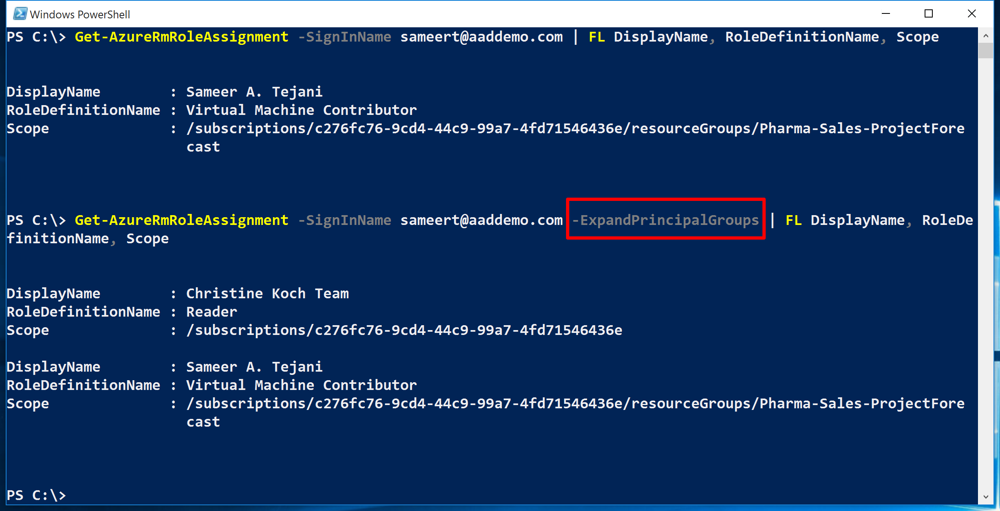
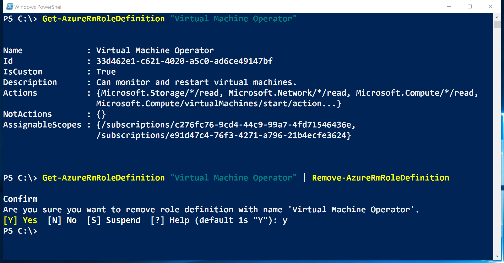

<properties
    pageTitle="Gestire il controllo dell'accesso basato sui ruoli (RBAC) con PowerShell Azure | Microsoft Azure"
    description="Come gestire RBAC con PowerShell di Azure, inclusi voce ruoli, l'assegnazione di ruoli e l'eliminazione delle assegnazioni di ruolo."
    services="active-directory"
    documentationCenter=""
    authors="kgremban"
    manager="femila"
    editor=""/>

<tags
    ms.service="active-directory"
    ms.devlang="na"
    ms.topic="article"
    ms.tgt_pltfrm="na"
    ms.workload="identity"
    ms.date="07/22/2016"
    ms.author="kgremban"/>

# <a name="manage-role-based-access-control-with-azure-powershell"></a>Gestire il controllo dell'accesso basato sui ruoli con PowerShell Azure

> [AZURE.SELECTOR]
- [PowerShell](role-based-access-control-manage-access-powershell.md)
- [CLI Azure](role-based-access-control-manage-access-azure-cli.md)
- [API REST](role-based-access-control-manage-access-rest.md)


È possibile utilizzare controllo dell'accesso basato sui ruoli (RBAC) nel portale di Azure e Azure API di gestione delle risorse per gestire l'accesso all'abbonamento a un livello diffusamente. Con questa caratteristica, è possibile concedere l'accesso per gli utenti, gruppi o identità di servizio Active Directory mediante l'assegnazione di alcuni ruoli ad essi in un particolare ambito.

Prima di poter utilizzare PowerShell per gestire RBAC, è necessario disporre le operazioni seguenti:

- Azure PowerShell versione 0.8.8 o versione successiva. Per installare la versione più recente e associare all'abbonamento Azure, vedere [come installare e configurare Azure PowerShell](../powershell-install-configure.md).

- Azure cmdlet per la gestione risorse. Installare i [cmdlet per la gestione di risorse di Azure](https://msdn.microsoft.com/library/mt125356.aspx) in PowerShell.

## <a name="list-roles"></a>Ruoli di elenco

### <a name="list-all-available-roles"></a>Elenco tutti i ruoli disponibili
Ai ruoli RBAC elenco che sono disponibili per l'assegnazione di controllare le operazioni a cui si concedere l'accesso, utilizzano `Get-AzureRmRoleDefinition`.

```
Get-AzureRmRoleDefinition | FT Name, Description
```


### <a name="list-actions-of-a-role"></a>Azioni elenco di un ruolo
Per elencare le azioni per un ruolo specifico, utilizzare `Get-AzureRmRoleDefinition <role name>`.

```
Get-AzureRmRoleDefinition Contributor | FL Actions, NotActions

(Get-AzureRmRoleDefinition "Virtual Machine Contributor").Actions
```


## <a name="see-who-has-access"></a>Vedere chi ha accesso
Per visualizzare le assegnazioni accesso RBAC, utilizzare `Get-AzureRmRoleAssignment`.

### <a name="list-role-assignments-at-a-specific-scope"></a>Elenco assegnazioni di ruolo a un ambito specifico
È possibile visualizzare tutte le assegnazioni di accesso per una sottoscrizione specificata, gruppo di risorse o delle risorse. Per visualizzare tutte le assegnazioni attive per un gruppo di risorse, ad esempio, è consigliabile utilizzare `Get-AzureRmRoleAssignment -ResourceGroupName <resource group name>`.

```
Get-AzureRmRoleAssignment -ResourceGroupName Pharma-Sales-ProjectForcast | FL DisplayName, RoleDefinitionName, Scope
```


### <a name="list-roles-assigned-to-a-user"></a>Elenco dai diversi ruoli a un utente
Per visualizzare tutti i ruoli assegnati a un utente specificato e i ruoli assegnati ai gruppi a cui appartiene l'utente, utilizzare `Get-AzureRmRoleAssignment -SignInName <User email> -ExpandPrincipalGroups`.

```
Get-AzureRmRoleAssignment -SignInName sameert@aaddemo.com | FL DisplayName, RoleDefinitionName, Scope

Get-AzureRmRoleAssignment -SignInName sameert@aaddemo.com -ExpandPrincipalGroups | FL DisplayName, RoleDefinitionName, Scope
```



### <a name="list-classic-service-administrator-and-coadmin-role-assignments"></a>Elenco assegnazioni di ruolo di amministratore e del componente coadmin servizio classica
Alle assegnazioni di accesso di elenco per l'amministratore della sottoscrizione classica e coadministrators, usare:

    Get-AzureRmRoleAssignment -IncludeClassicAdministrators

## <a name="grant-access"></a>Concedere l'accesso
### <a name="search-for-object-ids"></a>Ricerca di ID oggetto
Per assegnare un ruolo, è necessario identificare l'oggetto (utente, gruppo o applicazione) e l'ambito.

Se non si conosce l'ID di abbonamento, è possibile trovare in e **l'abbonamenti** nel portale di Azure. Per informazioni su come eseguire una query per l'ID di abbonamento, vedere [Get-AzureSubscription](https://msdn.microsoft.com/library/dn495302.aspx) su MSDN.

Per ottenere l'ID di oggetto per un gruppo di Azure Active Directory, usare:

    Get-AzureRmADGroup -SearchString <group name in quotes>

Per ottenere l'ID oggetto di un'applicazione o principale del servizio di Azure Active Directory, usare:

    Get-AzureRmADServicePrincipal -SearchString <service name in quotes>

### <a name="assign-a-role-to-an-application-at-the-subscription-scope"></a>Assegnare un ruolo a un'applicazione nell'ambito dell'abbonamento
Per concedere l'accesso a un'applicazione nell'ambito dell'abbonamento, usare:

    New-AzureRmRoleAssignment -ObjectId <application id> -RoleDefinitionName <role name> -Scope <subscription id>


### <a name="assign-a-role-to-a-user-at-the-resource-group-scope"></a>Assegnare un ruolo a un utente nell'ambito di gruppo di risorse
Per concedere l'accesso a un utente nell'ambito di gruppo di risorse, usare:

    New-AzureRmRoleAssignment -SignInName <email of user> -RoleDefinitionName <role name in quotes> -ResourceGroupName <resource group name>


### <a name="assign-a-role-to-a-group-at-the-resource-scope"></a>Assegnare un ruolo a un gruppo nell'ambito delle risorse
Per concedere l'accesso a un gruppo nell'ambito delle risorse, usare:

    New-AzureRmRoleAssignment -ObjectId <object id> -RoleDefinitionName <role name in quotes> -ResourceName <resource name> -ResourceType <resource type> -ParentResource <parent resource> -ResourceGroupName <resource group name>


## <a name="remove-access"></a>Rimuovere l'accesso
Per rimuovere l'accesso per gli utenti, gruppi e applicazioni, usare:

    Remove-AzureRmRoleAssignment -ObjectId <object id> -RoleDefinitionName <role name> -Scope <scope such as subscription id>


## <a name="create-a-custom-role"></a>Creare un ruolo personalizzato
Per creare un ruolo personalizzato, utilizzare la `New-AzureRmRoleDefinition` comando.

Quando si crea un ruolo personalizzato tramite PowerShell, è necessario iniziare da uno dei [ruoli predefiniti](role-based-access-built-in-roles.md). Modificare gli attributi per aggiungere le *Azioni*, *notActions*o *ambiti* desiderato e quindi salvare le modifiche in un nuovo ruolo.

Nell'esempio seguente inizia con il ruolo di *Collaboratore macchina virtuale* e che viene usata per creare un ruolo personalizzato chiamato *Operatore macchina virtuale*. Il nuovo ruolo concede l'accesso a tutte le operazioni di lettura del provider di risorse *Microsoft.Compute*, *Microsoft.Storage*e *Microsoft.Network* e accesso all'avvio, riavviare e monitorare macchine virtuali. Il ruolo personalizzato può essere utilizzato in due sottoscrizioni.

```
$role = Get-AzureRmRoleDefinition "Virtual Machine Contributor"
$role.Id = $null
$role.Name = "Virtual Machine Operator"
$role.Description = "Can monitor and restart virtual machines."
$role.Actions.Clear()
$role.Actions.Add("Microsoft.Storage/*/read")
$role.Actions.Add("Microsoft.Network/*/read")
$role.Actions.Add("Microsoft.Compute/*/read")
$role.Actions.Add("Microsoft.Compute/virtualMachines/start/action")
$role.Actions.Add("Microsoft.Compute/virtualMachines/restart/action")
$role.Actions.Add("Microsoft.Authorization/*/read")
$role.Actions.Add("Microsoft.Resources/subscriptions/resourceGroups/read")
$role.Actions.Add("Microsoft.Insights/alertRules/*")
$role.Actions.Add("Microsoft.Support/*")
$role.AssignableScopes.Clear()
$role.AssignableScopes.Add("/subscriptions/c276fc76-9cd4-44c9-99a7-4fd71546436e")
$role.AssignableScopes.Add("/subscriptions/e91d47c4-76f3-4271-a796-21b4ecfe3624")
New-AzureRmRoleDefinition -Role $role
```


## <a name="modify-a-custom-role"></a>Modificare un ruolo personalizzato
Per modificare un ruolo personalizzato, prima di tutto, utilizzare la `Get-AzureRmRoleDefinition` comando per recuperare la definizione del ruolo. In secondo luogo, apportare le modifiche desiderate alla definizione di ruolo. Infine, utilizzare la `Set-AzureRmRoleDefinition` comando per salvare la definizione di ruolo modificata.

Nell'esempio seguente viene aggiunto il `Microsoft.Insights/diagnosticSettings/*` operazione al ruolo personalizzato *Operatore macchina virtuale* .

```
$role = Get-AzureRmRoleDefinition "Virtual Machine Operator"
$role.Actions.Add("Microsoft.Insights/diagnosticSettings/*")
Set-AzureRmRoleDefinition -Role $role
```


Nell'esempio seguente aggiunge una sottoscrizione Azure ad assegnare ambiti del ruolo personalizzato *Operatore macchina virtuale* .

```
Get-AzureRmSubscription - SubscriptionName Production3

$role = Get-AzureRmRoleDefinition "Virtual Machine Operator"
$role.AssignableScopes.Add("/subscriptions/34370e90-ac4a-4bf9-821f-85eeedead1a2"
Set-AzureRmRoleDefinition -Role $role)
```


## <a name="delete-a-custom-role"></a>Eliminare un ruolo personalizzato

Per eliminare un ruolo personalizzato, utilizzare la `Remove-AzureRmRoleDefinition` comando.

Nell'esempio seguente rimuove il ruolo personalizzato *Operatore macchina virtuale* .

```
Get-AzureRmRoleDefinition "Virtual Machine Operator"

Get-AzureRmRoleDefinition "Virtual Machine Operator" | Remove-AzureRmRoleDefinition
```



## <a name="list-custom-roles"></a>Elenco ruoli personalizzati
Per elencare i ruoli che sono disponibili per l'assegnazione in un ambito, utilizzare la `Get-AzureRmRoleDefinition` comando.

Nell'esempio seguente sono elencati tutti i ruoli disponibili per l'assegnazione nella sottoscrizione selezionata.

```
Get-AzureRmRoleDefinition | FT Name, IsCustom
```


Nell'esempio seguente il ruolo personalizzato *Operatore macchina virtuale* non è disponibile nella sottoscrizione *Production4* perché l'abbonamento non è in **AssignableScopes** del ruolo.


## <a name="see-also"></a>Vedere anche
- [Utilizzo di PowerShell Azure Azure Gestione risorse](../powershell-azure-resource-manager.md)
[AZURE.INCLUDE [role-based-access-control-toc.md](../../includes/role-based-access-control-toc.md)]
