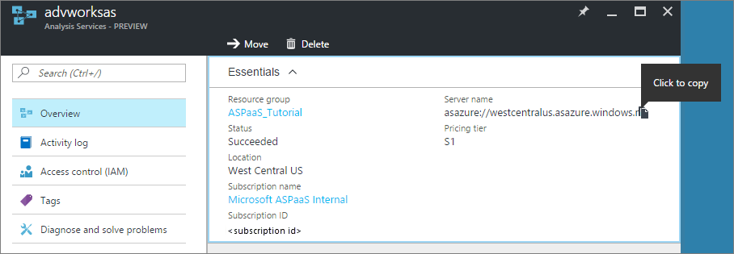
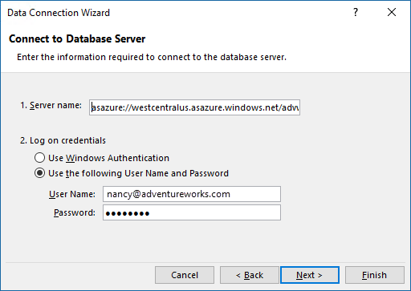

<properties
   pageTitle="Recuperare dati da Analysis Services Azure | Microsoft Azure"
   description="Informazioni su come connettersi e recuperare dati da un server Analysis Services in Azure."
   services="analysis-services"
   documentationCenter=""
   authors="minewiskan"
   manager="erikre"
   editor=""
   tags=""/>
<tags
   ms.service="analysis-services"
   ms.devlang="NA"
   ms.topic="article"
   ms.tgt_pltfrm="NA"
   ms.workload="na"
   ms.date="10/24/2016"
   ms.author="owend"/>

# <a name="get-data-from-azure-analysis-services"></a>Recuperare dati da Azure Analysis Services
Dopo aver creato un server in Azure e distribuito un modello tabulare, gli utenti dell'organizzazione sono pronti per connettersi e iniziare a esplorare i dati.

Azure Analysis Services supporta connessioni client tramite l' [aggiornamento dei modelli di oggetto](#client-libraries). TOM AMO, Adomd.Net o MSOLAP, connettersi tramite xmla nel server. Ad esempio, Power BI, Power BI Desktop, Excel o qualsiasi applicazione client di terze parti che supporta i modelli di oggetti.

## <a name="server-name"></a>Nome del server
Quando si crea un server Analysis Services in Azure, specificare un nome univoco e area geografica in cui il server viene creato. Quando si specifica il nome del server in una connessione, lo schema di denominazione server è:
```
<protocol>://<region>/<servername>
```
 Protocollo stringa **asazure**, l'area geografica è Uri dell'area in cui è stato creato il server (ad esempio, per ovest US, westus.asazure.windows.net) e nomeserver è il nome del server univoco all'interno dell'area.

## <a name="get-the-server-name"></a>Ottenere il nome del server
Prima di connettersi, è necessario ottenere il nome del server. Nel **portale di Azure** > server > **Panoramica** > **nome del Server**, copiare il nome del server intera. Se altri utenti dell'organizzazione esegue la connessione al server troppo, verrà desidera condividere il nome del server. Quando si specifica il nome del server, è necessario utilizzare il percorso completo.




## <a name="connect-in-power-bi-desktop"></a>Connette in Power BI Desktop

> [AZURE.NOTE] Questa caratteristica è anteprima.

1. In [Power BI Desktop](https://powerbi.microsoft.com/desktop/), fare clic su **Recupera dati** > **database** > **Azure Analysis Services**.

2. In **Server**, incollare il nome del server dagli Appunti.

3. Nel **Database**, se si conosce il nome del database modello tabulare o prospettiva che si desidera connettersi, incollarlo qui. In caso contrario, è possibile lasciare questo campo vuoto. È possibile selezionare un database o un punto di vista nella schermata successiva.

4. Lasciare l'opzione **Connetti live** predefinita selezionata e quindi preme **Connetti**. Se viene richiesto di immettere un account, immettere l'account aziendale.

5. In **strumento di navigazione**, espandere il server, quindi selezionare il modello o prospettiva che si desidera connettersi, quindi fare clic su **Connetti**. Un solo clic in un modello o un punto di vista mostra tutti gli oggetti per la visualizzazione.


## <a name="connect-in-power-bi"></a>La connessione di Power BI
1. Creare un file di Power BI Desktop con una connessione dinamica a un modello nel server.

2. In [Power BI](https://powerbi.microsoft.com), fare clic su **Recupera dati** > **file**. Individuare e selezionare il file.


## <a name="connect-in-excel"></a>Connette in Excel
Connessione al server di Azure Analysis Services in Excel è supportata mediante recupera dati in Excel 2016 o Power Query nelle versioni precedenti. [Provider MSOLAP.7](https://aka.ms/msolap) è necessario. La connessione tramite l'importazione guidata tabella in Power Pivot non è supportata.

1. In Excel 2016, sulla barra multifunzione di **dati** , fare clic su **Carica dati esterni** > **Da altre origini** > **Da Analysis Services**.

2. Nella connessione guidata dati, in **nome Server**, incollare il nome del server dagli Appunti. Quindi, in **credenziali di accesso**, selezionare **usare il nome utente e la Password seguenti**e quindi digitare il nome utente dell'organizzazione, ad esempio nancy@adventureworks.com, e la password.

    

4. In **Seleziona Database e tabella**, selezionare il database e modello o il punto di vista e quindi fare clic su **Fine**.

    

## <a name="connection-string"></a>Stringa di connessione
Quando ci si connette ad Azure Analysis Services utilizzando il modello a oggetti tabulare, usare i formati di stringa di connessione seguenti:

###### <a name="integrated-azure-active-directory-authentication"></a>Autenticazione di Azure Active Directory
```
"Provider=MSOLAP;Data Source=<Azure AS instance name>;"
```
Autenticazione integrata preleverà cache delle credenziali Azure Active Directory se disponibile. In caso contrario, viene visualizzata la finestra di accesso Azure.

###### <a name="azure-active-directory-authentication-with-username-and-password"></a>Autenticazione di Azure Active Directory con nome utente e password
```
"Provider=MSOLAP;Data Source=<Azure AS instance name>;User ID=<user name>;Password=<password>;Persist Security Info=True; Impersonation Level=Impersonate;";
```

## <a name="client-libraries"></a>Raccolte di client
Quando ci si connette a Azure Analysis Services da Excel o altre interfacce, ad esempio TOM, AsCmd, ADOMD.NET, è necessario installare le librerie client provider più recenti. Novità:  

[MSOLAP (amd64)](https://go.microsoft.com/fwlink/?linkid=829576)</br>
[MSOLAP (x86)](https://go.microsoft.com/fwlink/?linkid=829575)</br>
[AMO](https://go.microsoft.com/fwlink/?linkid=829578)</br>
[ADOMD](https://go.microsoft.com/fwlink/?linkid=829577)</br>


## <a name="next-steps"></a>Passaggi successivi
[Gestire il server](analysis-services-manage.md)
