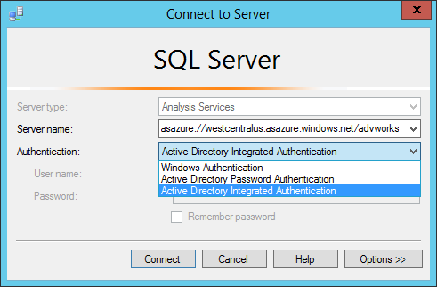

<properties
   pageTitle="Gestione dei servizi di analisi Azure | Microsoft Azure"
   description="Informazioni su come gestire un server Analysis Services in Azure."
   services="analysis-services"
   documentationCenter=""
   authors="minewiskan"
   manager="erikre"
   editor=""
   tags=""/>
<tags
   ms.service="analysis-services"
   ms.devlang="NA"
   ms.topic="article"
   ms.tgt_pltfrm="NA"
   ms.workload="na"
   ms.date="10/24/2016"
   ms.author="owend"/>

# <a name="manage-analysis-services"></a>Gestire Analysis Services

Dopo aver creato un server Analysis Services in Azure, è possibile che alcune attività di amministrazione e la gestione che è necessario eseguire subito o un intervallo di tempo nel tempo. Ad esempio, eseguire l'elaborazione per aggiornare dati, controllare chi può accedere i modelli nel server o monitorare l'integrità del server. Alcune attività di gestione può essere eseguita solo nel portale Azure ad altri utenti in SQL Server Management Studio (SQL Server Management Studio), e alcune attività possono essere eseguite in uno.

## <a name="azure-portal"></a>Portale di Azure
Il [portale di Azure](http://portal.azure.com/) è nel punto in cui è possibile creare ed eliminare server, eseguire il monitoraggio delle risorse del server, cambiare dimensioni e gestire chi ha accesso al server.  Se si verificano problemi, è inoltre possibile inviare una richiesta di assistenza.


## <a name="sql-server-management-studio"></a>SQL Server Management Studio
Connessione al server in Azure è analoga la connessione a un'istanza di server della propria organizzazione. Da SQL Server Management Studio, è possibile eseguire molte delle attività, ad esempio dati processo o creare uno script di elaborazione, gestire i ruoli e usare PowerShell.


 Una delle differenze più grande è l'autenticazione che consente la connessione al server. Per connettersi al server Azure Analysis Services, è necessario selezionare **Autenticazione tramite Password di Active Directory**.

### <a name="to-connect-with-ssms"></a>Per connettersi a SQL Server Management Studio
1. Prima di connettersi, è necessario ottenere il nome del server. Nel **portale di Azure** > server > **Panoramica** > **nome del Server**, copiare il nome del server.

    

2. In SQL Server Management Studio > **Esplora oggetti**, fare clic su **Connetti** > **Analysis Services**.

3. Nella finestra di dialogo **connessione al Server** incollare il nome del server, quindi in **autenticazione**, scegliere una delle operazioni seguenti:

    **Autenticazione integrata di active Directory** per usare il single sign-on con Active Directory per la federazione di Azure Active Directory.

    **Autenticazione tramite Password di active Directory** da utilizzare un account dell'organizzazione. Ad esempio, se la connessione da un non dominio aggiungono computer.

    Nota: Se non è visibile l'autenticazione di Active Directory, potrebbe essere necessario [abilitare l'autenticazione di Azure Active Directory](#enable-azure-active-directory-authentication) in SQL Server Management Studio.

    

Poiché la gestione del server in Azure con SQL Server Management Studio è molto simile alla gestione di un server locale, non verranno forniti dettagli sul. Tutte le informazioni è necessario sono disponibili in [Analysis Services istanza gestione](https://msdn.microsoft.com/library/hh230806.aspx) su MSDN.

## <a name="server-administrators"></a>Amministratori di server
È possibile utilizzare **Gli amministratori di Analysis Services** e il controllo del server in portal Azure o SQL Server Management Studio per gestire gli amministratori di server. Gli amministratori di Analysis Services sono gli amministratori di server di database con diritti per comuni attività di amministrazione di database, ad esempio l'aggiunta e rimozione dei database e gestione degli utenti. Per impostazione predefinita, l'utente che crea il server nel portale di Azure viene automaticamente aggiunto come amministratore Analysis Services.

È necessario conoscere:

-   Windows Live ID non è un tipo di identità supportati per Azure Analysis Services.  
-   Gli amministratori di Analysis Services deve essere valida agli utenti di Azure Active Directory.
-   Se si crea un server Azure Analysis Services tramite Gestione risorse Azure modelli, gli amministratori di Analysis Services accetta una matrice JSON degli utenti che devono essere aggiunti come amministratori.

Gli amministratori di Analysis Services possono essere diversi da parte degli amministratori delle risorse Azure, che è possibile gestire le risorse per gli abbonamenti Azure. In questo modo la compatibilità con XMLA e TSML esistenti gestire comportamenti di Analysis Services e per consentire lo spostamento separare i compiti tra la gestione delle risorse Azure e Analysis Services gestione del database.

Per visualizzare tutti i ruoli e accedere a tipi per la risorsa Azure Analysis Services, utilizzare controllo di accesso (IAM) e il controllo.

## <a name="database-users"></a>Utenti del database
Azure utenti del modello database di Analysis Services devono essere in Azure Active Directory. I nomi utente specificati per il modello database devono essere UPN o indirizzo di posta elettronica dell'organizzazione. Questa è la differenza tra i database modello locale che supportano gli utenti per i nomi utente dominio di Windows.

È possibile aggiungere utenti tramite [le assegnazioni di ruolo di Azure Active Directory](../active-directory/role-based-access-control-configure.md) o se mediante il [Linguaggio di script modello tabulare](https://msdn.microsoft.com/library/mt614797.aspx) (TMSL) in SQL Server Management Studio.

**Script di esempio TMSL**

```
{
  "createOrReplace": {
    "object": {
      "database": "SalesBI",
      "role": "Users"
    },
    "role": {
      "name": "Users",
      "description": "All allowed users to query the model",
      "modelPermission": "read",
      "members": [
        {
          "memberName": "user1@contoso.com",
          "identityProvider": "AzureAD"
        },
        {
          "memberName": "group1@contoso.com",
          "identityProvider": "AzureAD"
        }
      ]
    }
  }
}
```

## <a name="enable-azure-active-directory-authentication"></a>Abilitare l'autenticazione di Azure Active Directory
Per attivare la caratteristica di autenticazione di Azure Active Directory per SQL Server Management Studio nel Registro di sistema, creare un file di testo denominato EnableAAD.reg, quindi copiare e incollare la stringa seguente:


```
Windows Registry Editor Version 5.00
[HKEY_CURRENT_USER\Software\Microsoft\Microsoft SQL Server\Microsoft Analysis Services\Settings]
"AS AAD Enabled"="True"
```

Salvare e quindi eseguire il file.


## <a name="next-steps"></a>Passaggi successivi
Se già non distribuito un modello tabulare al nuovo server, è ora un ottimale del tempo. Per ulteriori informazioni, vedere [distribuire a Azure Analysis Services](analysis-services-deploy.md).

Se è stato distribuito un modello per il server, si è pronti per la connessione tramite un client o browser. Per ulteriori informazioni, vedere [recuperare dati da server Azure Analysis Services](analysis-services-connect.md).
