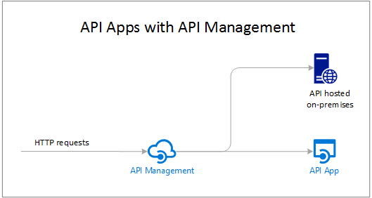

<properties 
    pageTitle="Introduzione all'API App | Microsoft Azure" 
    description="Informazioni su come servizio App Azure consente di sviluppare host e l'utilizzo di API REST." 
    services="app-service\api" 
    documentationCenter=".net" 
    authors="tdykstra" 
    manager="wpickett" 
    editor=""/>

<tags 
    ms.service="app-service-api" 
    ms.workload="web" 
    ms.tgt_pltfrm="na" 
    ms.devlang="na" 
    ms.topic="get-started-article" 
    ms.date="08/23/2016" 
    ms.author="rachelap"/>

# Panoramica dell'API App

API app nel servizio App Azure offrono funzionalità che rendono più semplice sviluppare host e utilizzare API nel cloud e locale. Con App API viene visualizzato protezione voto aziendale, il controllo dell'accesso semplice, connettività ibrida, generazione automatica di SDK e integrazione perfetta con [Logica di App](../app-service-logic/app-service-logic-what-are-logic-apps.md).

[Servizio di App Azure](../app-service/app-service-value-prop-what-is.md) è una piattaforma completamente gestita per web per dispositivi mobili e scenari di integrazione. API App corrisponde a uno dei quattro tipi di app disponibili in [Azure App servizio](../app-service/app-service-value-prop-what-is.md).

## Perché usare API App?

Ecco alcune caratteristiche chiave di API App:

- **Anticipare l'API esistente come-è** -non è necessario modificare il codice dell'API esistenti per usufruire delle API App - appena distribuire il codice in un'app API. L'API è possibile utilizzare qualsiasi lingua o framework supportato dal servizio di App, compresi ASP.NET e c#, Java, PHP, Node e Python.

- **Consumo facile** - supporto integrato per [i metadati Swagger API](http://swagger.io/) rende l'API agevolmente utilizzabili da un'ampia gamma di client.  Generare automaticamente il codice client per l'API in diverse lingue inclusi c#, Java e Javascript. Configurare con facilità [CORS](app-service-api-cors-consume-javascript.md) senza modificare il codice. Per ulteriori informazioni, vedere [App servizio API App metadati per la generazione di individuazione e codice API](app-service-api-metadata.md) e [consumo un'app di API da JavaScript utilizzando CORS](app-service-api-cors-consume-javascript.md). 

- **Controllo dell'accesso semplice** - proteggere un'app API dall'accesso non autenticato senza apportare modifiche al codice. Servizi di autenticazione predefiniti proteggere API per l'accesso da altri servizi o dai client che rappresentano gli utenti. Provider di identità supportati includono Azure Active Directory, Facebook, Twitter, Google e Account Microsoft. Client possono utilizzare una raccolta di autenticazione Active Directory (ADAL) o Mobile App SDK. Per ulteriori informazioni, vedere [l'autenticazione e l'autorizzazione per le applicazioni di API in Azure App servizio](app-service-api-authentication.md).

- **Integrazione di visual Studio** - strumenti dedicati in Visual Studio semplificare le operazioni di creazione, distribuzione, utilizzo, debug e gestire le app API. Per ulteriori informazioni, vedere [annuncio Azure SDK 2.8.1 per .NET](/blog/announcing-azure-sdk-2-8-1-for-net/).

- **Integrazione con applicazioni logica** - App API creati possono essere utilizzati [dall'Applicazione servizio di logica di applicazioni](../app-service-logic/app-service-logic-what-are-logic-apps.md).  Per ulteriori informazioni, vedere [usare l'API personalizzati ospitati in App servizio con logica App](../app-service-logic/app-service-logic-custom-hosted-api.md) e [nuovo schema versione 2015-08-01-preview](../app-service-logic/app-service-logic-schema-2015-08-01.md).

Inoltre, un'app API possibile sfruttare le funzionalità offerte da [Web App](../app-service-web/app-service-web-overview.md) e [App Mobile](../app-service-mobile/app-service-mobile-value-prop.md). Anche l'operazione true: se si usa un'app web app per dispositivi mobili per ospitare una API, è possibile sfruttare le funzionalità dell'API App, ad esempio metadati Swagger per client generazione del codice e CORS per l'accesso del browser di domini. L'unica differenza tra i tipi di tre app (API, web mobile) è il nome e l'icona utilizzata per poterli nel portale di Azure.

## Qual è la differenza tra le app API e Azure API Management?

API App e [Azure API Management](../api-management/api-management-key-concepts.md) sono servizi complementari:

* Gestione dell'API è sulla gestione delle API. Inserire un front-end API gestione in un'API monitor e la gestione, la modifica di input e output, consolidare varie API in un punto finale e così via. API gestite possono essere ospitate in un punto qualsiasi.
* API App consiste API di hosting. Il servizio include caratteristiche che semplificano l'API di sviluppare e il consumo, ma non i tipi di monitoraggio, limitazione, modifica o il consolidamento di tale gestione API indica. Se non sono necessarie caratteristiche di gestione dell'API, è possibile ospitare API nelle App API senza utilizzare Gestione API.

Ecco un diagramma che illustra l'API Gestione utilizzato per API ospitate nelle App API e in altre posizioni.

Alcune funzionalità di gestione delle API e le API App ha funzioni simili.  Ad esempio, sia possibile automatizzare CORS supporto. Quando si utilizzano due servizi insieme, utilizzare Gestione API per CORS poiché funziona come front-end alle App API. 

## Guida introduttiva

Per iniziare a usare App API dal codice di esempio per una distribuzione, vedere l'esercitazione per il framework desiderato:

* [ASP.NET](app-service-api-dotnet-get-started.md) 
* [Node](app-service-api-nodejs-api-app.md) 
* [Java](app-service-api-java-api-app.md) 

Per porre domande sulle App API, avviare un thread nel [forum su API Apps](https://social.msdn.microsoft.com/Forums/en-US/home?forum=AzureAPIApps). 
