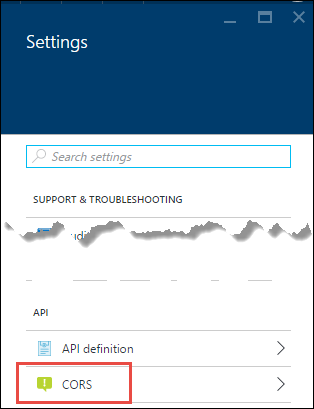

<properties
    pageTitle="CORS supporto nel servizio App | Microsoft Azure"
    description="Informazioni su come utilizzare il supporto CORS nel servizio di Azure Azure App."
    services="app-service\api"
    documentationCenter=".net"
    authors="tdykstra"
    manager="wpickett"
    editor=""/>

<tags
    ms.service="app-service-api"
    ms.workload="na"
    ms.tgt_pltfrm="dotnet"
    ms.devlang="na"
    ms.topic="get-started-article"
    ms.date="08/27/2016"
    ms.author="rachelap"/>

# Utilizzare un'app di API da JavaScript utilizzando CORS

Servizio di App offre supporto incorporato per [Tra origine risorsa condivisione (CORS)](https://en.wikipedia.org/wiki/Cross-origin_resource_sharing), che consente ai client JavaScript effettuare chiamate domini alle API che si trovano nelle App API. Il servizio di App consente di configurare l'accesso CORS l'API senza scrivere codice l'API.

In questo articolo contiene due sezioni:

* La sezione [come configurare CORS](#corsconfig) in genere viene illustrato come configurare CORS per qualsiasi app API, web app o app per dispositivi mobili. Applicabile anche a tutti i Framework supportate dal servizio di App, tra cui .NET, Node e Java. 

* Con la sezione [continuare le esercitazioni .NET Guida introduttiva](#tutorialstart) , l'articolo consiste nell'iniziare un'esercitazione che illustra che CORS supporto grazie al supporto è stato eseguito in [App API prima guida introduttiva esercitazione](app-service-api-dotnet-get-started.md). 

## Come configurare CORS nel servizio di App Azure

È possibile configurare CORS nel portale di Azure o mediante gli strumenti di [Gestione risorse di Azure](../azure-resource-manager/resource-group-overview.md) .

#### Configurare CORS nel portale di Azure

8. In un browser passare al [portale di Azure](https://portal.azure.com/).

2. Fare clic su **Servizi di App**e quindi fare clic sul nome dell'app API.

    

10. In e **l'Impostazioni** che viene visualizzata a destra della stessa e **app API** , individuare la sezione **API** e quindi fare clic su **CORS**.

    

11. Nel testo casella immettere l'URL o l'URL che si desidera che le chiamate JavaScript provenire da.

    Ad esempio, se è stata distribuita l'applicazione JavaScript per un'app web denominata todolistangular, immettere "https://todolistangular.azurewebsites.net". In alternativa, è possibile immettere un asterisco (*) per specificare che tutti i domini di origine vengono accettati.

13. Fare clic su **Salva**.

    

    Dopo aver fatto clic **salvataggio**, l'app API accetta chiamate JavaScript dagli URL specificato.

#### Configurare CORS tramite gli strumenti di gestione risorse di Azure

È anche possibile configurare CORS per un'app API utilizzando [i modelli di gestione risorse di Azure](../resource-group-authoring-templates.md) in strumenti di riga di comando, ad esempio [PowerShell Azure](../powershell-install-configure.md) e [Azure CLI](../xplat-cli-install.md). 

Per un esempio di un modello di gestione di risorse Azure che imposta la proprietà CORS, aprire il [file azuredeploy.json nel repository per l'applicazione di esempio dell'esercitazione](https://github.com/azure-samples/app-service-api-dotnet-todo-list/blob/master/azuredeploy.json). Individuare la sezione del modello che ha un aspetto simile al seguente:

        "cors": {
            "allowedOrigins": [
                "todolistangular.azurewebsites.net"
            ]
        }

## Continuare l'esercitazione .NET Guida introduttiva

Se si stanno seguendo la Node linguaggio introduzione serie o per le applicazioni di API, è stata completata la serie di iniziare la lettura. Passare alla sezione [passaggi successivi](#next-steps) per trovare i suggerimenti per l'apprendimento ulteriormente sulle API app.

Il resto di questo articolo è una continuazione della serie Guida introduttiva di .NET e si presuppone che è stato completato [l'esercitazione prima](app-service-api-dotnet-get-started.md).

## Distribuire il progetto ToDoListAngular in una nuova app web

Nella [prima esercitazione](app-service-api-dotnet-get-started.md)e vengono creati un'app di API intermedio un'app di API di livello di dati. In questa esercitazione si crea un'app web pagina singola applicazione (SPA) che app chiamate API intermedio. Per l'autenticazione SPA abbia effetto, è necessario attivare CORS App intermedio API. 

Nell' [applicazione di esempio elenco attività](https://github.com/Azure-Samples/app-service-api-dotnet-todo-list), il progetto ToDoListAngular è un semplice client AngularJS che chiama il progetto di API Web ToDoListAPI intermedio. Il codice JavaScript nel file *app/scripts/todoListSvc.js* chiama l'API utilizzando il provider di AngularJS HTTP. 

        angular.module('todoApp')
        .factory('todoListSvc', ['$http', function ($http) {

            $http.defaults.useXDomain = true;
            delete $http.defaults.headers.common['X-Requested-With']; 
        
            return {
                getItems : function(){
                    return $http.get(apiEndpoint + '/api/TodoList');
                },

                /* Get by ID, Put, and Delete methods not shown */

                postItem : function(item){
                    return $http.post(apiEndpoint + '/api/TodoList', item);
                }
            };
        }]);

### Creare una nuova app web per il progetto ToDoListAngular

La procedura per creare una nuova app web App servizio e distribuire un progetto è simile a quello visualizzato per [creare e distribuire un'app API nell'esercitazione prima in questa serie](app-service-api-dotnet-get-started.md#createapiapp). L'unica differenza è che il tipo di app **Web App** anziché **API App**.  Per schermate delle finestre di dialogo, vedere 

1. In **Esplora soluzioni**fare clic sul progetto ToDoListAngular e quindi fare clic su **pubblica**.

3.  Nella scheda **profilo** della creazione guidata **Pubblicazione Web** , fare clic su **Servizio di Microsoft Azure App**.

5. Nella finestra di dialogo **Servizio App** fare clic su **Nuovo**.

3. Nella scheda **Hosting** della finestra di dialogo **Crea App servizio** immettere un **Nome di applicazione Web** che sia univoco nel dominio di *azurewebsites.net* . 

5. Scegliere Azure **abbonamento** che si desidera utilizzare.

6. Nell'elenco a discesa **Gruppo risorse** scegliere stesso gruppo di risorse creata in precedenza.

4. Nell'elenco a discesa **Piano di servizio App** scegliere lo stesso piano creata in precedenza. 

7. Fare clic su **Crea**.

    Verrà creato il web app, viene creato un profilo di pubblicazione per renderla e viene visualizzato il passaggio di **connessione** della creazione guidata **Pubblicazione Web** .

    Non fare ancora clic **pubblica** . Nella sezione seguente, configurare la nuova app web per chiamare l'app API intermedio è in esecuzione nel servizio di App. 

### Impostare l'URL di livello intermedio in impostazioni web app

1. Accedere al [portale di Azure](https://portal.azure.com/)e quindi passare a e il **Web App** per l'applicazione web che è stato creato per ospitare il progetto TodoListAngular (front-end).

2. Fare clic su **Impostazioni > Impostazioni applicazione**.

3. Nella sezione **Impostazioni App** aggiungere la chiave e il valore seguente:

  	|Chiave|Valore|Esempio
  	|---|---|---|
  	|toDoListAPIURL|nome dell'app intermedio API https://{Your} .azurewebsites .net|https://todolistapi0121.azurewebsites.NET|

4. Fare clic su **Salva**.

    Quando viene eseguito il codice di Azure, questo valore sostituisce l'URL dell'host locale in *config* . 

    Viene visualizzato il codice che ottiene il valore dell'impostazione in *index.cshtml*:

        
        

    Il codice *todoListSvc.js* utilizza l'impostazione:

        return {
            getItems : function(){
                return $http.get(apiEndpoint + '/api/TodoList');
            },
            getItem : function(id){
                return $http.get(apiEndpoint + '/api/TodoList/' + id);
            },
            postItem : function(item){
                return $http.post(apiEndpoint + '/api/TodoList', item);
            },
            putItem : function(item){
                return $http.put(apiEndpoint + '/api/TodoList/', item);
            },
            deleteItem : function(id){
                return $http({
                    method: 'DELETE',
                    url: apiEndpoint + '/api/TodoList/' + id
                });
            }
        };

### Distribuire il progetto di web ToDoListAngular per la nuova app web

*  In Visual Studio, nella schermata di **connessione** della creazione guidata **Pubblicazione Web** , fare clic su **pubblica**.

    Visual Studio distribuisce il progetto ToDoListAngular per la nuova app web e consente di aprire un browser all'URL dell'applicazione web. 

### Testare l'applicazione senza CORS abilitata 

2. Nel browser gli strumenti di sviluppo, aprire la finestra Console.

3. Nella finestra del browser che visualizza UI AngularJS, fare clic sul collegamento **Dell'elenco** .

    Il codice JavaScript tenta di chiamare l'app intermedio API, ma la chiamata non riesce perché front-end è in esecuzione in un dominio diverso da quello back-end. Della finestra del browser per sviluppatori strumenti Console viene visualizzato un messaggio di errore tra origine.

    

## Configurare CORS per l'app API intermedio

In questa sezione, configurare l'impostazione CORS per il livello intermedio app ToDoListAPI API in Azure. Questa impostazione consentirà livello intermedio app API per ricevere chiamate JavaScript da app web creata per il progetto ToDoListAngular.

8. In un browser, accedere al [portale di Azure](https://portal.azure.com/).

2. Fare clic su **Servizi di App**e quindi fare clic sull'app di API di ToDoListAPI (livello intermedio).

    

10. In e **l'Impostazioni** che viene visualizzata a destra della stessa e **app API** , individuare la sezione **API** e quindi fare clic su **CORS**.

    

12. Nella casella di testo, immettere l'URL per l'applicazione web ToDoListAngular (front-end). Ad esempio, se è stato distribuito il progetto ToDoListAngular per un'app web denominata todolistangular0121, consentire chiamate dall'URL `https://todolistangular0121.azurewebsites.net`.

    In alternativa, è possibile immettere un asterisco (*) per specificare che tutti i domini di origine vengono accettati.

13. Fare clic su **Salva**.

    

    Dopo aver fatto clic **salvataggio**, l'app API accetta chiamate JavaScript dall'URL specificato. In questa schermata, l'app ToDoListAPI0223 API accetta chiamate client JavaScript da ToDoListAngular web app.

### Verificare l'applicazione con CORS abilitata

* Aprire un browser all'URL HTTPS dell'applicazione web. 

    Questa volta l'applicazione consente di visualizzare, aggiungere, modificare ed eliminare elementi attività. 

    

## Servizio di App CORS e CORS API Web

In un progetto di API Web, è possibile installare il pacchetto NuGet [Microsoft.AspNet.WebApi.Cors](https://www.nuget.org/packages/Microsoft.AspNet.WebApi.Cors/) per specificare quali domini accetta l'API JavaScript chiama da codice.
 
Supporto CORS API Web è più flessibile App servizio CORS supporto. Nel codice, ad esempio, è possibile specificare diverse origini accettate per metodi di azione diversi, mentre per App servizio CORS specificare un unico set delle origini accettate per tutti i metodi di un'app API.

> [AZURE.NOTE] Non provare a utilizzare CORS API Web e App servizio CORS in un'app di API. Servizio di App CORS avrà la precedenza e CORS API Web non avrà alcun effetto. Ad esempio, se si abilita un dominio di origine nel servizio di App e attivare tutti i domini di origine nel codice API Web, l'app di Azure API solo accettare chiamate da quello specificato nel Azure del dominio.

### Come abilitare CORS nel codice API Web

La procedura seguente riepiloga il processo di attivazione del supporto CORS API Web. Per ulteriori informazioni, vedere [Attivazione richieste tra origine ASP.NET Web API 2](http://www.asp.net/web-api/overview/security/enabling-cross-origin-requests-in-web-api).

1. In un progetto di API Web, installare il pacchetto di NuGet [Microsoft.AspNet.WebApi.Cors](https://www.nuget.org/packages/Microsoft.AspNet.WebApi.Cors/) .

1. Includere un `config.EnableCors()` riga di codice del metodo di **eseguire la registrazione** della classe **WebApiConfig** , come illustrato nell'esempio seguente. 

        public static class WebApiConfig
        {
            public static void Register(HttpConfiguration config)
            {
                // Web API configuration and services
                
                // The following line enables you to control CORS by using Web API code
                config.EnableCors();
    
                // Web API routes
                config.MapHttpAttributeRoutes();
    
                config.Routes.MapHttpRoute(
                    name: "DefaultApi",
                    routeTemplate: "api/{controller}/{id}",
                    defaults: new { id = RouteParameter.Optional }
                );
            }
        }

1. Nella finestra controller API Web, aggiungere un `using` istruzione per il `System.Web.Http.Cors` spazio dei nomi e aggiungere il `EnableCors` attributo per la classe controller o per singoli metodi di azione. Nell'esempio seguente supporto CORS si applica a controller intero.

        namespace ToDoListAPI.Controllers 
        {
            [HttpOperationExceptionFilterAttribute]
            [EnableCors(origins:"https://todolistangular0121.azurewebsites.net", headers:"accept,content-type,origin,x-my-header", methods: "get,post")]
            public class ToDoListController : ApiController
 
## Utilizzo di gestione API Azure con API App

Se si usa Azure API Management con un'app di API, configurare CORS in Gestione API anziché nell'app API. Per ulteriori informazioni, vedere le risorse seguenti:

* [Panoramica di gestione dell'API Azure (video: CORS compreso 12:10)](https://azure.microsoft.com/documentation/videos/azure-api-management-overview/)
* [Gestione dell'API cross criteri di dominio](https://msdn.microsoft.com/library/azure/dn894084.aspx#CORS)
 
## Risoluzione dei problemi

Nel caso in cui si verificano problemi durante l'esecuzione di questa esercitazione, ecco alcuni suggerimenti sulla risoluzione dei problemi.

* Verificare che si sta usando la versione più recente di [Azure SDK per .NET per Visual Studio 2015](http://go.microsoft.com/fwlink/?linkid=518003).

* Assicurarsi di avere immesso `https` nell'impostazione CORS e assicurarsi che sta usando `https` per eseguire l'applicazione web front-end.

* Assicurarsi di avere immesso l'impostazione CORS nell'app API intermedio, non nell'app web front-end.

* Se si sta configurando CORS nel codice dell'applicazione e servizio App Azure, tenere presente che l'impostazione di App servizio CORS sostituirà qualsiasi si sta eseguendo nel codice dell'applicazione. 

Per ulteriori informazioni sulle funzionalità di Visual Studio che semplificano la risoluzione dei problemi, vedere [risoluzione dei problemi del servizio di Azure App le App in Visual Studio](../app-service-web/web-sites-dotnet-troubleshoot-visual-studio.md).

## Passaggi successivi 

In questo articolo è stato illustrato come attivare il supporto di App servizio CORS in modo che il codice JavaScript client può chiamare un'API in un dominio diverso. Per ulteriori informazioni sulle App API, leggere l' [Introduzione all'autenticazione nel servizio di App](../app-service/app-service-authentication-overview.md)e quindi passare [all'autenticazione dell'utente per App API](app-service-api-dotnet-user-principal-auth.md) esercitazione.
