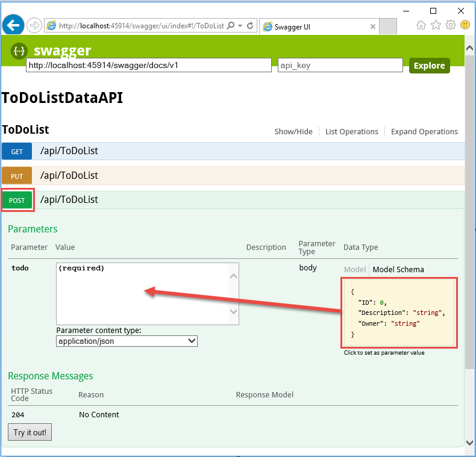
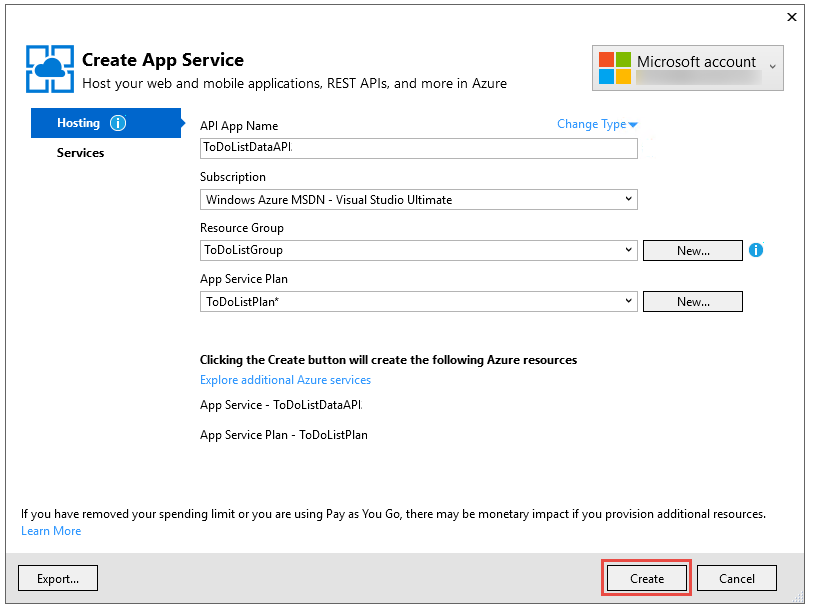
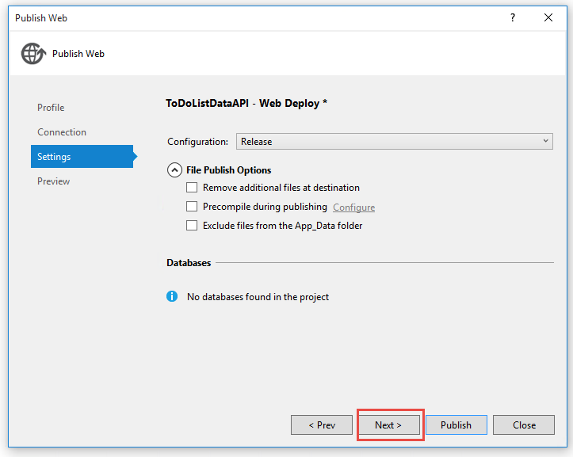

<properties
    pageTitle="Introduzione all'API App e ASP.NET nel servizio App | Microsoft Azure"
    description="Informazioni su come creare, distribuire e utilizzare un'app API ASP.NET nel servizio App Azure utilizzando Visual Studio 2015."
    services="app-service\api"
    documentationCenter=".net"
    authors="tdykstra"
    manager="wpickett"
    editor=""/>

<tags
    ms.service="app-service-api"
    ms.workload="na"
    ms.tgt_pltfrm="dotnet"
    ms.devlang="na"
    ms.topic="hero-article"
    ms.date="09/20/2016"
    ms.author="rachelap"/>

# Guida introduttiva a App API, ASP.NET e Swagger nel servizio App Azure

[AZURE.INCLUDE [selector](../../includes/app-service-api-get-started-selector.md)]

Questo è il primo in una serie di esercitazioni che illustrano come usare le funzionalità del servizio di App Azure sono utili per lo sviluppo e API REST di hosting.  In questa esercitazione descrive il supporto per i metadati API in formato Swagger.

Si apprenderanno:

* Come creare e distribuire [applicazioni API](app-service-api-apps-why-best-platform.md) in Azure App servizio usando gli strumenti incorporati in Visual Studio 2015.
* Procedura per automatizzare l'individuazione di API utilizzando il pacchetto Swashbuckle NuGet generare in modo dinamico Swagger API metadati.
* Come utilizzare metadati Swagger API per generare automaticamente codice client per un'app API.

## Cenni preliminari sulle applicazioni di esempio

In questa esercitazione si lavora con un'applicazione di esempio di elenco da fare semplice. L'applicazione di un front-end pagina singola applicazione (SPA), un livello intermedio API Web ASP.NET e un livello di dati dell'API Web ASP.NET.

Ecco una schermata di [AngularJS](https://angularjs.org/) front-end.

Soluzione di Visual Studio include tre progetti:

* **ToDoListAngular** - front-end: un SPA AngularJS che chiama il secondo livello.

* **ToDoListAPI** - livello intermedio: un progetto API Web ASP.NET che chiama il livello di dati per eseguire operazioni CRUD su elementi attività.

* **ToDoListDataAPI** - il livello di dati: un progetto API Web ASP.NET che esegue operazioni CRUD in elementi attività.

L'architettura di tre livelli è uno dei molti architetture che è possibile implementare utilizzando API App e viene usato qui solo dimostrativo. Il codice di ogni livello è semplice come possibili illustrare le funzionalità dell'API App; il livello di dati, ad esempio, utilizza la memoria del server invece di un database come meccanismo di persistenza.

L'esercitazione, saranno disponibili due progetti di API Web alto e in esecuzione nel cloud nelle App API del servizio di App.

Esercitazione successiva nella serie distribuisce il front-end SPA nel cloud.

## Prerequisiti

* API Web ASP.NET - le istruzioni dell'esercitazione si suppone che una knowledge base sull'utilizzo con ASP.NET [Web API 2](http://www.asp.net/web-api/overview/getting-started-with-aspnet-web-api/tutorial-your-first-web-api) in Visual Studio.

* Account Azure, è possibile [aprire un account Azure gratuitamente](/pricing/free-trial/?WT.mc_id=A261C142F) o [vantaggi sottoscrittore attivare Visual Studio](/pricing/member-offers/msdn-benefits-details/?WT.mc_id=A261C142F).

    Se si desidera iniziare a usare il servizio di App Azure prima che si effettua l'iscrizione per un account Azure, accedere al [Servizio di App provare](http://go.microsoft.com/fwlink/?LinkId=523751). Non esiste, è possibile creare immediatamente un'app starter breve nel servizio di App, ovvero **necessaria nessuna carta di credito**e non impegni.

* Visual Studio 2015 con [Azure SDK per .NET](https://azure.microsoft.com/downloads/archive-net-downloads/) - SDK di Visual Studio 2015 viene installato automaticamente se si dispone già.

    * In Visual Studio, fare clic su Guida -> informazioni su Microsoft Visual Studio e assicurarsi di avere "Servizio App Azure strumenti v2.9.1" o successiva.

    

    >[AZURE.NOTE] A seconda di quante delle dipendenze SDK già presenti nel computer in uso, installare il SDK potrebbe richiedere molto tempo, da alcuni minuti a mezz'ora o più.

## Scaricare l'applicazione di esempio

1. Scaricare archivio [Azure-Samples/app-service-api-dotnet-to-do-list](https://github.com/Azure-Samples/app-service-api-dotnet-todo-list) .

    È possibile fare clic sul pulsante **Scarica ZIP** o duplicare l'archivio sul computer locale.

2. Aprire la soluzione elenco attività in Visual Studio 2015 o 2013.
   1. È necessario considerare attendibile ogni soluzione.
        

3. Compilare la soluzione (CTRL + MAIUSC + B) per ripristinare i pacchetti NuGet.

    Se si desidera visualizzare l'applicazione in operazione prima di distribuirlo, è possibile eseguire in locale. Verificare che ToDoListDataAPI sia il progetto di avvio ed eseguire la soluzione. È possibile aspettarsi visualizzare un errore HTTP 403 nel browser.

## Utilizzare API Swagger metadati e l'interfaccia utente

Supporto per i metadati API [Swagger](http://swagger.io/) 2.0 integrato in Azure App servizio. Ogni app API può specificare un endpoint di URL che restituisce i metadati per l'API nel formato JSON Swagger. Metadati restituiti da tale endpoint è utilizzabile per generare il codice client.

Un progetto API Web ASP.NET può generare in modo dinamico Swagger metadati utilizzando il pacchetto NuGet [Swashbuckle](https://www.nuget.org/packages/Swashbuckle) . Il pacchetto Swashbuckle NuGet è già installato nei progetti ToDoListDataAPI e ToDoListAPI che è stato scaricato.

In questa sezione dell'esercitazione, esaminare i metadati Swagger 2.0 generato e quindi provare a utilizzare un test dell'interfaccia utente basato su metadati Swagger.

1. Impostare il progetto ToDoListDataAPI (**non** il progetto ToDoListAPI) come progetto di avvio.

    

2. Premere F5 o fare clic su **Debug > Avvia debug** per eseguire il progetto in modalità di debug.

    Il browser viene visualizzata la pagina di errore HTTP 403.

3. Nella barra degli indirizzi del browser, aggiungere `swagger/docs/v1` fino alla fine della riga e quindi premere INVIO. (L'URL è `http://localhost:45914/swagger/docs/v1`.)

    Questo è l'URL predefinito utilizzato dal Swashbuckle per restituire i metadati Swagger JSON 2.0 per l'API.

    Se si usa Internet Explorer, il browser richiede di scaricare un file *v1.json* .

    

    Se si usa Chrome, Firefox o bordo, il browser visualizza il JSON nella finestra del browser. Browser diversi gestiscono JSON in modo diverso e la finestra del browser potrebbe non apparire esattamente come nell'esempio.

    

    Nell'esempio seguente viene illustrata la prima sezione dei metadati Swagger per l'API, la definizione per il metodo Get. Questi metadati sono cosa spinge l'interfaccia utente Swagger utilizzate nei passaggi seguenti e utilizzarla in una sezione successiva dell'esercitazione per generare automaticamente codice client.

        {
          "swagger": "2.0",
          "info": {
            "version": "v1",
            "title": "ToDoListDataAPI"
          },
          "host": "localhost:45914",
          "schemes": [ "http" ],
          "paths": {
            "/api/ToDoList": {
              "get": {
                "tags": [ "ToDoList" ],
                "operationId": "ToDoList_GetByOwner",
                "consumes": [ ],
                "produces": [ "application/json", "text/json", "application/xml", "text/xml" ],
                "parameters": [
                  {
                    "name": "owner",
                    "in": "query",
                    "required": true,
                    "type": "string"
                  }
                ],
                "responses": {
                  "200": {
                    "description": "OK",
                    "schema": {
                      "type": "array",
                      "items": { "$ref": "#/definitions/ToDoItem" }
                    }
                  }
                },
                "deprecated": false
              },

4. Chiudere il browser e interrompe il debug di Visual Studio.

5. Nel progetto ToDoListDataAPI in **Esplora soluzioni**, aprire il file *App_Start\SwaggerConfig.cs* , quindi scorrere fino a riga 174 e rimuovere il commento per il codice riportato di seguito.

        /*
            })
        .EnableSwaggerUi(c =>
            {
        */

    Quando si installa il pacchetto Swashbuckle in un progetto, viene creato il file *SwaggerConfig.cs* . Il file offre diversi modi per configurare Swashbuckle.

    Il codice di che stato rimuovere consente l'interfaccia utente Swagger utilizzate nei passaggi seguenti. Quando si crea un progetto API Web utilizzando il modello di progetto app API, questo codice commento per impostazione predefinita una misura di sicurezza.

6. Eseguire nuovamente il progetto.

7. Nella barra degli indirizzi del browser, aggiungere `swagger` fino alla fine della riga e quindi premere INVIO. (L'URL è `http://localhost:45914/swagger`.)

8. Quando viene visualizzata la pagina dell'interfaccia utente Swagger, fare clic su **elenco attività** per visualizzare i metodi disponibili.

    

9. Fare clic sul pulsante **visualizzato** prima nell'elenco.

10. Nella sezione **parametri** , immettere un asterisco come valore della `owner` parametro, quindi **eseguire una prova**.

    Quando si aggiunge l'autenticazione in esercitazioni su versioni successive, il livello intermedio costituiranno l'ID utente effettivo al livello dati. Per ora, tutte le attività avrà un asterisco come il loro ID proprietario mentre viene eseguita l'applicazione senza attivata l'autenticazione.

    

    L'interfaccia utente Swagger chiama Get elenco attività metodo e visualizza il codice di risposta e JSON risultati.

    

11. Fare clic su **pubblica**e quindi fare clic sulla casella **Schema del modello**.

    Fare clic su schema del modello viene automaticamente immesso casella in cui è possibile specificare il valore del parametro per il metodo Post. (Se questa operazione non funziona in Internet Explorer, utilizzare un browser diverso o immettere manualmente il valore del parametro nel passaggio successivo.)  

    

12. Modificare JSON nel `todo` un parametro di input casella in modo da riferisca quello raffigurato nell'illustrazione seguente o sostituire testo Descrizione:

        {
          "ID": 2,
          "Description": "buy the dog a toy",
          "Owner": "*"
        }

13. Fare clic su **Provalo indietro**.

    L'API di elenco attività restituisce un codice di risposta HTTP 204 che indica l'esito positivo.

14. Fare clic sul pulsante prima di **iniziare** e quindi fare clic sul pulsante **esercitazione** in tale sezione della pagina.

    La risposta al metodo Get include ora il nuovo all'elemento.

15. Facoltativo: Provare anche inserire, eliminare e ottenere metodi ID.

16. Chiudere il browser e interrompe il debug di Visual Studio.

Swashbuckle funziona con qualsiasi progetto API Web ASP.NET. Se si desidera aggiungere Swagger generazione di metadati a un progetto esistente, è sufficiente installare il pacchetto Swashbuckle.

>[AZURE.NOTE] Metadati swagger includono un ID univoco per ogni operazione API. Per impostazione predefinita, Swashbuckle può generare duplicati Swagger operazione ID per i metodi di controller API Web. Si verifica questo evento se controller sono metodi di overload HTTP, ad esempio `Get()` e `Get(id)`. Per informazioni su come gestire overload, vedere [le definizioni delle API generato Swashbuckle personalizzare](app-service-api-dotnet-swashbuckle-customize.md). Se si crea un progetto API Web in Visual Studio utilizzando il modello di App API di Azure, codice che genera operazione univoco ID viene automaticamente aggiunto al file *SwaggerConfig.cs* .  

## Creare un'app API in Azure e distribuire il codice

In questa sezione, verrà usato Azure gli strumenti integrati nella procedura guidata di Visual Studio **Pubblica sito Web** per creare una nuova app API in Azure. Quindi distribuire il progetto ToDoListDataAPI per la nuova app API e chiamare l'API eseguendo l'interfaccia utente Swagger.

1. In **Esplora soluzioni**fare clic sul progetto ToDoListDataAPI e quindi fare clic su **pubblica**.

    

2.  Nel passaggio **profilo** della creazione guidata **Pubblicazione Web** , fare clic su **Servizio di Microsoft Azure App**.

    

3. Accedere al proprio account Azure se non si è già stato fatto, o aggiornare le credenziali se si è scaduti.

4. Nella finestra di dialogo servizio App scegliere Azure **abbonamento** che si desidera utilizzare e quindi fare clic su **Nuovo**.

    

    Verrà visualizzata la scheda **Hosting** della finestra di dialogo **Crea servizio App** .

    Poiché si distribuisce un progetto API Web che contiene Swashbuckle installato, Visual Studio presuppone che si desidera creare un'App API. Questo è indicato dal **Nome dell'App API** titolo e dal fatto che l'elenco di riepilogo a discesa **Tipo di modifica** è impostato su **API App**.

    

5. Immettere un **Nome applicazione API** univoco nel dominio di *azurewebsites.net* . È possibile accettare il nome predefinito da Visual Studio propone.

    Se si immette un nome di un altro utente ha già utilizzato, viene visualizzato un punto esclamativo rosso a destra.

    L'URL dell'app API sarà `{API app name}.azurewebsites.net`.

6. Nell'elenco a discesa **Gruppo risorse** fare clic su **Nuovo**e quindi immettere "ToDoListGroup" o un altro nome se si preferisce.

    Un gruppo di risorse è una raccolta di risorse Azure, ad esempio App API, database, macchine virtuali e così via. Per questa esercitazione, è consigliabile creare un nuovo gruppo di risorse perché che consente di eliminare in un unico passaggio tutte le risorse Azure creati per l'esercitazione facilmente.

    Questa opzione consente di selezionare un [gruppo di risorse](../azure-resource-manager/resource-group-overview.md) esistente o crearne uno nuovo, digitare un nome diverso da qualsiasi gruppo di risorse esistente nell'abbonamento.

7. Fare clic sul pulsante **Nuovo** accanto al **Piano di servizio App** elenco a discesa.

    La schermata Mostra valori di esempio per **Nome applicazione API**, **sottoscrizione**e **Gruppo di risorse** , che i valori sono diversi.

    

    Nei passaggi seguenti creare un piano di servizio App per il nuovo gruppo di risorse. Un piano di servizio App specifica le risorse di elaborazione utilizzabile con l'app API. Ad esempio, se si sceglie il livello gratuito, l'app API viene eseguito in macchine virtuali condivise, mentre per alcuni livelli pagati viene eseguito in macchine virtuali dedicate. Per informazioni sui piani di servizio di App, vedere [Panoramica sul piano di servizio di App](../app-service/azure-web-sites-web-hosting-plans-in-depth-overview.md).

8. Nella finestra di dialogo **Configura piano di servizio App** immettere "ToDoListPlan" o un altro nome se si preferisce.

9. Nella casella **percorso** scegliere la posizione più vicina all'utente.

    Questa impostazione specifica quali Azure Data Center l'app viene eseguito in. Scegliere un percorso vicino è possibile ridurre [la latenza](http://www.bing.com/search?q=web%20latency%20introduction&qs=n&form=QBRE&pq=web%20latency%20introduction&sc=1-24&sp=-1&sk=&cvid=eefff99dfc864d25a75a83740f1e0090).

10. Nell'elenco a discesa **dimensione** fare clic su **gratuito**.

    Per questa esercitazione, il livello di prezzo gratuito fornirà prestazioni sufficienti.

11. Nella finestra di dialogo **Configura piano di servizio App** , fare clic su **OK**.

    

12. Nella finestra di dialogo **Crea App servizio** fare clic su **Crea**.

    

    Visual Studio crea app API e un profilo di pubblicazione che contiene tutte le informazioni necessarie per l'app API. Lo apre guidata **Pubblica Web** , occorre usare per distribuire il progetto.

    Creazione guidata **Pubblicazione Web** verrà visualizzata la scheda **connessione** (come illustrato di seguito).

    Nella scheda **connessione** le impostazioni di **Server** e **il nome del sito** scegliere l'app API. Il **nome utente** e **Password** sono le credenziali di distribuzione che Azure crea automaticamente. Dopo la distribuzione, viene aperto un browser per l' **URL di destinazione** (che è l'unico scopo **dell'URL di destinazione**).  

13. Fare clic su **Avanti**.

    

    La scheda successiva è la scheda **Impostazioni** (come illustrata di seguito). Qui è possibile modificare la scheda Configurazione di compilazione per distribuire una build di debug per [il debug remoto](../app-service-web/web-sites-dotnet-troubleshoot-visual-studio.md#remotedebug). La scheda offre diverse **Opzioni di pubblicazione di File**:

    * Rimuovere altri file di destinazione
    * Precompilare durante la pubblicazione
    * Escludere i file dalla cartella App_Data

    Per questa esercitazione è possibile non è necessaria una delle operazioni. Per una spiegazione dettagliata delle relative funzioni, vedere [procedura: distribuire un Web progetto tramite pubblicazione con un clic in Visual Studio](https://msdn.microsoft.com/library/dd465337.aspx).

14. Fare clic su **Avanti**.

    

    È quindi la scheda **Anteprima** (come illustrata di seguito), che offre la possibilità di vedere i file verranno copiati dal progetto all'API app. Quando si distribuisce un progetto a un'app di API che già distribuito in precedenza, vengono copiati solo i file modificati. Se si vuole visualizzare un elenco di informazioni verranno copiate, è possibile fare clic sul pulsante **Start anteprima** .

15. Fare clic su **pubblica**.

    

    Visual Studio distribuisce il progetto ToDoListDataAPI per la nuova API app. Nella finestra di **Output** esegue corretta distribuzione e viene visualizzata una pagina "completata" in una finestra del browser aperta all'URL dell'app API.

    

    

16. Aggiungere "swagger" per l'URL nella barra degli indirizzi del browser e quindi premere INVIO. (L'URL è `http://{apiappname}.azurewebsites.net/swagger`.)

    Il browser viene visualizzata la stessa Swagger interfaccia illustrato in precedenza, ma a questo punto è in esecuzione nel cloud. Provare a utilizzare il metodo Get e viene visualizzato che è alla cose con 2 predefinito. Le modifiche apportate in precedenza sono state salvate in memoria nel computer locale.

17. Aprire il [portale di Azure](https://portal.azure.com/).

    Il portale di Azure è un'interfaccia web per la gestione delle risorse Azure, ad esempio API app.

18. Fare clic su **altri servizi > App servizi**.

    

19. In e il **App servizi** , individuare e selezionare la nuova API app. (Nel portale di Azure, windows aprire a destra sono denominate *pale*.)

    

    Aprire due pale. Una contenga un lungo elenco di impostazioni che è possibile visualizzare e modificare una pala ha una panoramica dell'app API.

20. In e **l'Impostazioni** individuare la sezione **API** e fare clic su **Definizione dell'API**.

    

    E il **Definizione dell'API** consente di specificare l'URL che restituisce i metadati Swagger 2.0 nel formato JSON. Quando Visual Studio crea app API, imposta l'URL di definizione dell'API per il valore predefinito per generato Swashbuckle metadati illustrato in precedenza, ossia l'app API base URL più `/swagger/docs/v1`.

    

    Quando si seleziona un'app di API per generare il codice di client per renderla, Visual Studio recupera i metadati da questo URL.

## Generare il codice di client per il livello di dati

Uno dei vantaggi dell'integrazione Swagger API Azure App è generazione automatica del codice. Le classi client generato rendono più semplice scrivere codice che chiama un'app API.

Il progetto ToDoListAPI include già codice client generato, ma nei passaggi seguenti si sarà eliminarla e rigenerare per informazioni su come eseguire la generazione del codice.

1. In Visual Studio **Esplora**nel progetto ToDoListAPI eliminare la cartella *ToDoListDataAPI* . **Attenzione: Eliminare solo la cartella, non il progetto ToDoListDataAPI.**

    

    Questa cartella è stata creata tramite il processo di generazione codice che si sta per elaborata.

2. Fare clic sul progetto ToDoListAPI e quindi fare clic su **Aggiungi > Client API REST**.

    

3. Nella finestra di dialogo **Aggiungi Client API REST** fare clic su **URL Swagger**e quindi fare clic su **Selezionare bene Azure**.

    

4. Nella finestra di dialogo **Servizio App** espandere il gruppo di risorse in uso per questa esercitazione e selezionare l'app API e quindi fare clic su **OK**.

    

    Si noti che quando si torna alla finestra di dialogo **Aggiungi Client API REST** , la casella di testo è stata inserita la definizione dell'API valore URL che si è visto in precedenza nel portale.

    

    >[AZURE.TIP] Una soluzione alternativa per ottenere i metadati per la generazione del codice consiste nell'immettere l'URL direttamente invece di accedervi tramite la finestra di dialogo Sfoglia. Oppure, se si desidera generare il codice client prima della distribuzione di Azure, è possibile eseguire il progetto API Web localmente, passare all'URL che fornisce il file Swagger JSON, salvare il file e utilizzare l'opzione **Seleziona un file di metadati Swagger esistente** .

5. Nella finestra di dialogo **Aggiungi Client API REST** , fare clic su **OK**.

    Verrà creata una cartella denominata dopo l'applicazione di API e genera classi client.

    

6. Nel progetto ToDoListAPI aprire *Controllers\ToDoListController.cs* per visualizzare il codice alla riga 40 che chiama l'API utilizzando il client generato.

    Il frammento di codice seguente viene illustrato il codice di un'istanza dell'oggetto client e chiama il metodo Get.

        private static ToDoListDataAPI NewDataAPIClient()
        {
            var client = new ToDoListDataAPI(new Uri(ConfigurationManager.AppSettings["toDoListDataAPIURL"]));
            return client;
        }

        public async Task<IEnumerable<ToDoItem>> Get()
        {
            using (var client = NewDataAPIClient())
            {
                var results = await client.ToDoList.GetByOwnerAsync(owner);
                return results.Select(m => new ToDoItem
                {
                    Description = m.Description,
                    ID = (int)m.ID,
                    Owner = m.Owner
                });
            }
        }

    Il parametro costruttore Ottiene l'URL dell'endpoint dalla `toDoListDataAPIURL` impostazione app. In config, il valore è impostato su URL IIS locale Express del progetto API in modo che è possibile eseguire l'applicazione in locale. Se si omette il parametro del costruttore, l'endpoint predefinito è l'URL che si ha generato il codice.

7. La classe client verrà generata con un nome diverso in base al nome dell'app API; modificare il codice di *Controllers\ToDoListController.cs* in modo che il nome del tipo corrisponde a che cosa è stato generato nel progetto. Ad esempio, se è stata denominata ToDoListDataAPI071316 l'App API, modificate questo codice:

        private static ToDoListDataAPI NewDataAPIClient()
        {
            var client = new ToDoListDataAPI(new Uri(ConfigurationManager.AppSettings["toDoListDataAPIURL"]));

a questo:

        private static ToDoListDataAPI071316 NewDataAPIClient()
        {
            var client = new ToDoListDataAPI071316(new Uri(ConfigurationManager.AppSettings["toDoListDataAPIURL"]));

## Creare un'app di API per ospitare il livello intermedio

Precedenti è [creato l'app di API di livello dati e distribuito codice ad esso](#createapiapp).  A questo punto si seguire la stessa procedura per l'app API intermedio.

1. In **Esplora soluzioni**, fare clic livello intermedio ToDoListAPI project (non il livello dati ToDoListDataAPI) e quindi fare clic su **pubblica**.

    

2.  Nella scheda **profilo** della creazione guidata **Pubblicazione Web** , fare clic su **Servizio di Microsoft Azure App**.

3. Nella finestra di dialogo **Servizio App** fare clic su **Nuovo**.

4. Nella scheda **Hosting** della finestra di dialogo **Crea servizio App** , accettare il **Nome App API** predefinito oppure immettere un nome univoco nel dominio di *azurewebsites.net* .

5. Scegliere Azure **abbonamento** è stato utilizzato.

6. Nell'elenco a discesa **Gruppo risorse** scegliere stesso gruppo di risorse creata in precedenza.

7. Nell'elenco a discesa **Piano di servizio App** scegliere lo stesso piano creata in precedenza. Verrà aperta a questo valore.

8. Fare clic su **Crea**.

    Visual Studio crea app API, viene creato un profilo di pubblicazione per renderla e viene visualizzato il passaggio di **connessione** della creazione guidata **Pubblicazione Web** .

9.  Nel passaggio di **connessione** della creazione guidata **Pubblicazione Web** , fare clic su **pubblica**.

    Visual Studio distribuisce il progetto ToDoListAPI per la nuova app API e consente di aprire un browser all'URL dell'app API. Verrà visualizzata la pagina "creata".

## Configurare il livello centrale per chiamare il livello di dati

Se è stato chiamato app intermedio API a questo punto, da provare a chiamare il livello di dati mediante l'URL host locale ancora presente nella config. In questa sezione immettere l'URL di app API di livello dati in un'impostazione di ambiente nell'app API intermedio. Se il codice nell'app intermedio API recupera l'impostazione di URL livello di dati, l'impostazione di ambiente ignorerà novità config.

1. Accedere al [portale di Azure](https://portal.azure.com/)e quindi passare a e il **App API** per l'app API creato per ospitare il progetto TodoListAPI (livello intermedio).

2. In blade **Impostazioni** dell'App API, fare clic su **Impostazioni applicazione**.

3. In blade **Impostazioni applicazione** dell'applicazione API, scorrere fino alla sezione **impostazioni di App** e aggiungere la chiave e il valore seguente. Il valore sarà l'URL dell'App API prima pubblicate in questa esercitazione.

  	| **Chiave** | toDoListDataAPIURL |
  	|---|---|
  	| **Valore** | nome dell'app livello API dati https://{Your} .azurewebsites .net |
  	| **Esempio** | https://todolistdataapi.azurewebsites.NET |

4. Fare clic su **Salva**.

    

    Quando viene eseguito il codice di Azure, questo valore ora sostituirà l'URL dell'host locale in config.

## Test

1. In una finestra del browser, passare all'URL dell'app API intermedio nuova appena creata per ToDoListAPI. È possibile ottenere sono facendo clic sull'URL nel blade principale dell'applicazione API nel portale.

2. Aggiungere "swagger" per l'URL nella barra degli indirizzi del browser e quindi premere INVIO. (L'URL è `http://{apiappname}.azurewebsites.net/swagger`.)

    Il browser viene visualizzata l'interfaccia Swagger stesso illustrato in precedenza per ToDoListDataAPI, ma ora `owner` non è un campo richiesto per l'operazione di lettura, perché l'app intermedio API sta inviando il valore all'app API di livello dati dell'utente. (Quando si esegue le esercitazioni di autenticazione, livello intermedio invierà ID utente effettivo il `owner` parametro; per ora è hardcoded un asterisco.)

3. Provare a usare il metodo Get e altri metodi per convalidare che l'app API intermedio correttamente la chiamata app API di livello di dati.

    

## Risoluzione dei problemi

Nel caso in cui si verificano problemi durante l'analisi di seguito in questa esercitazione sono alcune idee sulla risoluzione dei problemi:

* Verificare che si sta usando la versione più recente di [Azure SDK per .NET](http://go.microsoft.com/fwlink/?linkid=518003).

* Due dei nomi di progetto sono simili (ToDoListAPI, ToDoListDataAPI). Se il non aspetto come descritto nelle istruzioni quando si lavora con un progetto, assicurarsi che è stato aperto il progetto corretto.

* Se si utilizza la rete aziendale e si tenta di distribuire al servizio App Azure attraverso un firewall, verificare che le porte 443 e 8172 sono aperte per la distribuzione Web. Se non è possibile aprire le porte, è possibile usare altri metodi di distribuzione.  Vedere [distribuire le app al servizio App Azure](../app-service-web/web-sites-deploy.md).

* "La distribuzione dei nomi devono essere univoci" errori, è possibile ottenere questi se si accidentalmente distribuisce il progetto errato a un'app di API e quindi in un secondo momento quello corretto per il. Per risolvere il problema, Ridistribuisci il progetto corretto all'API app e nella scheda **Impostazioni** della creazione guidata **Pubblicazione Web** selezionare **Rimuovi altri file di destinazione**.

Dopo aver ottenuto l'app API ASP.NET in esecuzione in Azure App servizio, è consigliabile per altre informazioni sulle caratteristiche di Visual Studio che semplificano la risoluzione dei problemi. Per informazioni sulla registrazione, il debug remoto e altre informazioni, vedere [risoluzione dei problemi del servizio di App Azure App in Visual Studio](../app-service-web/web-sites-dotnet-troubleshoot-visual-studio.md).

## Passaggi successivi

È stato illustrato come distribuire progetti API Web esistenti in App API, generare il codice di client per le applicazioni di API e utilizzare App API dai client .NET. Esercitazione successiva in questa serie di seguito viene illustrato come [utilizzare CORS per utilizzare App API dai client JavaScript](app-service-api-cors-consume-javascript.md).

Per ulteriori informazioni sulla generazione di codice client, vedere archivio [Azure/AutoRest](https://github.com/azure/autorest) su GitHub.com. Per assistenza con i problemi usando il client generato, aprire un [problema nel repository AutoRest](https://github.com/azure/autorest/issues).

Se si desidera creare nuovi progetti app API da zero, utilizzare il modello di **Azure API App** .

Il modello di progetto di **Azure API App** corrisponde al contenuto scegliendo il **vuoto** ASP.NET 4.5.2 modello, fare clic sulla casella di controllo per aggiungere il supporto dell'API Web e l'installazione del pacchetto Swashbuckle NuGet. Inoltre, il modello aggiunge un codice di configurazione Swashbuckle progettato per impedire la creazione di duplicati Swagger operazione ID. Dopo aver creato un progetto API App, è possibile distribuirlo a un'app API esattamente come illustrato in questa esercitazione.
