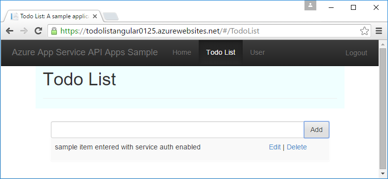

<properties
    pageTitle="Autenticazione dell'entità del servizio per le applicazioni di API in Azure App servizio | Microsoft Azure"
    description="Informazioni su come proteggere un'app di API in Azure App servizio per gli scenari di servizio."
    services="app-service\api"
    documentationCenter=".net"
    authors="tdykstra"
    manager="wpickett"
    editor=""/>

<tags
    ms.service="app-service-api"
    ms.workload="na"
    ms.tgt_pltfrm="dotnet"
    ms.devlang="na"
    ms.topic="article"
    ms.date="06/30/2016" 
    ms.author="rachelap"/>

# Autenticazione dell'entità del servizio per API App comprese nel servizio App Azure

## Panoramica

In questo articolo viene illustrato come utilizzare l'autenticazione del servizio di App per l'accesso *interno* alle API app. Uno scenario interno è nel punto in cui si dispone di un'app di API che si desidera essere utilizzabile solo da codice dell'applicazione. Il modo consigliato per implementare questo scenario nel servizio App consiste nell'utilizzare Azure Active Directory per proteggere l'app API chiamata. Chiamare l'app API protetto con un token del titolare che viene visualizzato da Azure Active Directory fornendo identità dell'applicazione le credenziali (servizio principale). Per le alternative all'utilizzo di Azure Active Directory, vedere la sezione **autenticazione al servizio** di [Panoramica di autenticazione del servizio di App Azure](../app-service/app-service-authentication-overview.md#service-to-service-authentication).

In questo articolo verranno fornite informazioni:

* Come utilizzare Azure Active Directory (Azure Active Directory) per proteggere un'app API dall'accesso non autenticato.
* Come utilizzare un'app API protetta da un'app API, online o app per dispositivi mobili tramite capitale (identità app) le credenziali del servizio di Azure Active Directory. Per informazioni su come utilizzare da un'app di logica, vedere [usare l'API personalizzati ospitati in App servizio con logica App](../app-service-logic/app-service-logic-custom-hosted-api.md).
* Come assicurarsi che l'app API protetta non può essere chiamato da un browser dagli utenti ha effettuati l'accesso.
* Modalità per assicurarsi che l'app API protetta può essere chiamato solo da una specifica Azure Active Directory service capitale.

L'articolo include due sezioni:

* La sezione [come configurare l'autenticazione dell'entità servizio nel servizio App Azure](#authconfig) viene illustrato in generale come configurare l'autenticazione per un'app qualsiasi API e illustrato come utilizzare l'app API protetto. In questa sezione applicabile anche a tutti i Framework supportati dal servizio di App, tra cui .NET, Node e Java.

* A partire dalla sezione [continuare le esercitazioni .NET Guida introduttiva](#tutorialstart) , l'esercitazione passaggi necessari per la configurazione di uno scenario di "accesso interno" per un'applicazione di esempio .NET in esecuzione nel servizio di App. 

## Come configurare l'autenticazione dell'entità servizio servizio App Azure

In questa sezione vengono fornite istruzioni generali che si applicano a qualsiasi app API. Per istruzioni specifiche per l'applicazione di esempio per eseguire elenco .NET, passare a [continuare la serie di esercitazioni .NET API App](#tutorialstart).

1. Nel [portale di Azure](https://portal.azure.com/), passare a e **l'Impostazioni** dell'app API che si desidera proteggere, quindi individuare la sezione **caratteristiche** e fare clic su **autenticazione / autorizzazione**.

    

3. Nel **autenticazione / autorizzazione** blade, fare clic **su**.

4. Nell'elenco a discesa **azione da eseguire quando richiesta non viene autenticato** selezionare **accedere con Azure Active Directory** .

5. In **Provider di autenticazione**, selezionare **Azure Active Directory**.

    

6. Configurare e **l'Impostazioni di Azure Active Directory** per creare una nuova applicazione di Azure Active Directory o utilizzare un'applicazione di Azure Active Directory esistente se si dispone già di quello che si desidera utilizzare.

    Scenari interni riguardano in genere un'app di API chiamata un'app API. È possibile utilizzare separata Azure Active Directory applicazioni per ogni app API o una sola applicazione di Azure Active Directory.

    Per istruzioni dettagliate su questo blade, vedere [come configurare l'applicazione di servizio App per usare le credenziali Azure Active Directory](../app-service-mobile/app-service-mobile-how-to-configure-active-directory-authentication.md).

7. Al termine e di configurazione il provider di autenticazione, fare clic su **OK**.

7. Nel **autenticazione / autorizzazione** blade, fare clic su **Salva**.

    

Al termine, App servizio consente solo le richieste dai chiamanti nella proprietà configurata tenant di Azure Active Directory. Non è necessario alcun codice autenticazione o autorizzazione nell'app API protetto. Token del titolare quello passato alla app API insieme comunemente usati sulle attestazioni nelle intestazioni HTTP ed è possibile leggere le informazioni nel codice per convalidare la richieste da un chiamante specifico, ad esempio un'entità servizio.

Questa funzionalità di autenticazione funziona nello stesso modo per tutte le lingue supportate dal servizio di App, tra cui .NET, Node e linguaggio di. 

#### Modalità di utilizzo dell'app API protetto

Il chiamante deve fornire un token del titolare di Azure Active Directory con le chiamate API. Per ottenere un token del titolare usando le credenziali dell'entità del servizio, il chiamante utilizza Active Directory Authentication Library (ADAL per [.NET](https://www.nuget.org/packages/Microsoft.IdentityModel.Clients.ActiveDirectory), [Node](https://github.com/AzureAD/azure-activedirectory-library-for-nodejs)o [linguaggio](https://github.com/AzureAD/azure-activedirectory-library-for-java)). Per ottenere un token, il codice che chiama ADAL fornisce a ADAL le seguenti informazioni:

* Il nome del tenant di Azure Active Directory.
* ID client e segreto del client (tasto app) dell'app Azure Active Directory associato il chiamante.
* ID client dell'applicazione Azure Active Directory associato con l'app API protetto. (Se si utilizza una sola applicazione di Azure Active Directory, questo è lo stesso ID client quello per il chiamante.)

Questi valori sono disponibili nelle pagine di Azure Active Directory del [portale classica Azure](https://manage.windowsazure.com/).

Dopo aver acquistato il token, il chiamante include le richieste HTTP nell'intestazione di autorizzazione.  Servizio di App convalidato il token e consente le richieste di raggiungere l'app API protetto.

#### Per impedire l'accesso agli utenti nello stesso tenant app API

I token del titolare per gli utenti nello stesso tenant sono considerati validi per l'app API protetto.  Se si desidera assicurarsi che solo un'entità servizio possa chiamare l'app API protetto, aggiungere codice nell'app API protetta per convalidare sulle attestazioni seguenti del token di:

* `appid`dovrebbe essere l'ID client dell'applicazione Azure Active Directory che è associato il chiamante. 
* `oid`(`objectidentifier`) deve essere l'ID dell'entità servizio del chiamante. 

Servizio di App vengono forniti anche i `objectidentifier` richiedere nell'intestazione X-MS-CLIENT-capitale-ID.

### Per impedire l'accesso tramite browser di app API

Se si non convalidano delle attestazioni nel codice nell'app API protetta e se si utilizza una diversa applicazione Azure Active Directory per l'app API protetto, assicurarsi che l'URL risposta dell'applicazione Azure Active Directory non è lo stesso URL di base dell'applicazione API. Se l'URL di risposta punta direttamente all'app API protetta, un utente nello stesso tenant di Azure Active Directory Impossibile individuare l'app API, accedere e chiamare correttamente l'API.

## Continuare la serie di esercitazioni .NET API App

Se si stanno seguendo la serie di esercitazioni Node o Java per le applicazioni di API, passare alla sezione [passaggi successivi](#next-steps) . 

Il resto di questo articolo continua la serie di esercitazioni .NET API App e presuppone che sia stata completata l' [esercitazione di autenticazione utente](app-service-api-dotnet-user-principal-auth.md) e dispone dell'applicazione di esempio in esecuzione in Azure con attivata l'autenticazione utente.

## Configurare l'autenticazione di Azure

In questa sezione configurare servizio App in modo che le richieste HTTP sola consente di raggiungere l'app di API di livello dati sono quelli che hanno Azure valido i token del titolare di Active Directory. 

Nella sezione seguente, configurare l'app API intermedio per inviare le credenziali dell'applicazione di Azure Active Directory, tornare un token del titolare e inviare il token del titolare all'app API di livello dati. Questo processo è illustrato nella figura.

Se si verificano problemi durante la seguendo le indicazioni esercitazioni, vedere la sezione [risoluzione dei problemi](#troubleshooting) alla fine dell'esercitazione. 

1. Nel [portale di Azure](https://portal.azure.com/), passare a e **l'Impostazioni** dell'app API creato per l'app di API ToDoListDataAPI (livello di dati) e quindi fare clic su **Impostazioni**.

2. In e **l'Impostazioni** individuare la sezione **caratteristiche** e quindi fare clic su **autenticazione / autorizzazione**.

    

3. Nel **autenticazione / autorizzazione** blade, fare clic **su**.

4. Nell'elenco a discesa **azione da eseguire quando richiesta non viene autenticato** selezionare **accedere con Azure Active Directory**.

    Questa è l'impostazione che causa servizio App per assicurarsi che solo autenticati richieste portata app API. Per le richieste contenenti i token del titolare valido, servizio App passa i token lungo all'API app e compila le intestazioni HTTP con simboli di utilizzo delle attestazioni per rendere le informazioni più facilmente disponibili al codice.

5. In **Provider di autenticazione**, fare clic su **Azure Active Directory**.

    

6. In e **l'Impostazioni di Azure Active Directory** , fare clic su **Express**.

    Con **Express** è possibile che l'opzione Azure creare automaticamente un'applicazione di AAD nel [tenant di](https://msdn.microsoft.com/en-us/library/azure/jj573650.aspx#BKMK_WhatIsAnAzureADTenant)Azure Active Directory. 

    Non è necessario creare un tenant, in quanto ogni account Azure dispone automaticamente uno.

7. In **modalità di gestione**, fare clic su **Crea nuovo Active Directory App** se non è già selezionata.

    Portale di collega la casella di input **Crea App** con un valore predefinito. Per impostazione predefinita, l'applicazione di Azure Active Directory è diverso da quello di app API. Se si preferisce, è possibile immettere un nome diverso.
    
    

    **Nota**: in alternativa, è possibile utilizzare una singola Azure AD applicazioni per l'app API chiamante e l'app API protetto. Se si decide che alternativo, occorrerà non qui l'opzione **Crea nuovo Active Directory App** poiché un'applicazione di Azure Active Directory è già stato creato in precedenza nell'esercitazione di autenticazione utente. Per questa esercitazione si utilizzeranno separare le applicazioni di Azure Active Directory per l'app API chiamante e l'app API protetto.

8. Prendere nota del valore nella casella **Crea App** ; è necessario cercare in un secondo momento questa applicazione AAD nel portale di classica Azure.

7. Fare clic su **OK**.

10. Nel **autenticazione / autorizzazione** blade, fare clic su **Salva**.

    

    **URL di risposta** viene impostata automaticamente all'URL dell'app API servizio App creata un'applicazione di Azure Active Directory con **l'URL di accesso** . Il valore di quest'ultimo consente agli utenti nel tenant di AAD per accedere e accedere all'app API.

### Verificare che l'app API è protetto

1. In un browser passare all'URL dell'app API: in e il **API app** nel portale di Azure, fare clic sul collegamento **all'URL**. 

    Poiché le richieste non autenticate non sono consentite per raggiungere l'app API, si viene reindirizzati a una schermata di accesso. 

    Se il browser passare all'interfaccia utente Swagger, il browser potrebbe già essere collegato via, ossia in tal caso, aprire una finestra InPrivate o Incognito e passare all'URL dell'interfaccia utente Swagger.

18. Accedere con le credenziali di un utente nel tenant di AAD.

    Quando è stato effettuato, verrà visualizzata la pagina "creata" nel browser.

## Configurare il progetto ToDoListAPI per acquisire e inviare il token di Azure Active Directory

In questa sezione è eseguire le operazioni seguenti:

* Aggiungere codice nell'app API intermedio che utilizza le credenziali dell'applicazione di Azure Active Directory per acquisire un token e inviare l'app di API di livello dati con le richieste HTTP.
* È possibile ottenere le credenziali che necessarie dall'Azure Active Directory.
* Immettere le credenziali nelle impostazioni dell'ambiente runtime del servizio di Azure App nel livello intermedio API app. 

### Configurare il progetto ToDoListAPI per acquisire e inviare il token di Azure Active Directory

Apportare le modifiche seguenti nel progetto ToDoListAPI in Visual Studio.

1. Rimuovere il commento per tutto il codice nel file *ServicePrincipal.cs* .

    Questo è il codice che utilizza ADAL per .NET per acquisire il token del titolare di Azure Active Directory.  Utilizza diversi valori di configurazione che è necessario impostare nell'ambiente di runtime Azure in un secondo momento. Ecco il codice: 

        public static class ServicePrincipal
        {
            static string authority = ConfigurationManager.AppSettings["ida:Authority"];
            static string clientId = ConfigurationManager.AppSettings["ida:ClientId"];
            static string clientSecret = ConfigurationManager.AppSettings["ida:ClientSecret"];
            static string resource = ConfigurationManager.AppSettings["ida:Resource"];
        
            public static AuthenticationResult GetS2SAccessTokenForProdMSA()
            {
                return GetS2SAccessToken(authority, resource, clientId, clientSecret);
            }
        
            static AuthenticationResult GetS2SAccessToken(string authority, string resource, string clientId, string clientSecret)
            {
                var clientCredential = new ClientCredential(clientId, clientSecret);
                AuthenticationContext context = new AuthenticationContext(authority, false);
                AuthenticationResult authenticationResult = context.AcquireToken(
                    resource,
                    clientCredential);
                return authenticationResult;
            }
        }

    **Nota:** Questo codice richiede la ADAL per il pacchetto di .NET NuGet (Microsoft.IdentityModel.Clients.ActiveDirectory), che è già installato nel progetto. Se si sta creando il progetto da zero, è necessario installare il pacchetto. Questo pacchetto non viene installato automaticamente dal modello API app nuovo progetto.

2. In *Controller/ToDoListController*, rimuovere il commento per il codice di `NewDataAPIClient` metodo che aggiunge il token a HTTP richiede nell'intestazione di autorizzazione.

        client.HttpClient.DefaultRequestHeaders.Authorization =
            new AuthenticationHeaderValue("Bearer", ServicePrincipal.GetS2SAccessTokenForProdMSA().AccessToken);

3. Distribuire il progetto ToDoListAPI. (Fare clic sul progetto, quindi fare clic su **pubblica > pubblica**.)

    Visual Studio distribuisce il progetto e viene aperto un browser per l'URL di base dell'applicazione web. Questa verrà visualizzata una pagina di 403 errore, che può essere normale quando si tenta di accedere a un URL di base API Web da un browser.

4. Chiudere il browser.

### Ottenere i valori di configurazione di Azure Active Directory

11. Nel [portale classica Azure](https://manage.windowsazure.com/), passare a **Azure Active Directory**.

12. Nella scheda **Directory** fare clic sul tenant AAD.

14. Fare clic su **applicazioni > applicazioni appartiene alla società**e quindi fare clic sul segno di spunta.

15. Nell'elenco delle applicazioni, fare clic sul nome di quella Azure creato automaticamente quando è abilitata l'autenticazione per l'app di API ToDoListDataAPI (livello di dati).

16. Fare clic sulla scheda **Configura** .

5. Copiare il valore di **ID Client** e salvarlo in un punto che è possibile ottenere da in un secondo momento. 

8. Nel portale di classica Azure tornare all'elenco di **applicazioni appartiene alla società**e fare clic sull'applicazione AAD creato per l'app ToDoListAPI API intermedio (quella creata nell'esercitazione precedente, non quello creato in questa esercitazione).

16. Fare clic sulla scheda **Configura** .

5. Copiare il valore di **ID Client** e salvarlo in un punto che è possibile ottenere da in un secondo momento.

6. Nelle **chiavi**, selezionare **1 anno** dall'elenco a discesa **Selezionare durata** .

6. Fare clic su **Salva**.

    

7. Copiare il valore di chiave e salvarlo in un punto che è possibile ottenere da in un secondo momento.

    

### Configurare le impostazioni di Azure Active Directory nell'ambiente di runtime dell'applicazione intermedio API

1. Accedere al [portale di Azure](https://portal.azure.com/)e quindi passare a e il **App API** per l'app API che ospita il progetto TodoListAPI (livello intermedio).

2. Fare clic su **Impostazioni > Impostazioni applicazione**.

3. Nella sezione **Impostazioni App** aggiungere le chiavi e i valori seguenti:

  	| **Chiave** | Autorità di ida: |
  	|---|---|
  	| **Valore** | https://Login.microsoftonline.com/ {il nome del tenant Azure Active Directory} |
  	| **Esempio** | https://Login.microsoftonline.com/contoso.onmicrosoft.com |

  	| **Chiave** | ida: ClientId |
  	|---|---|
  	| **Valore** | ID client dell'applicazione chiamante (livello intermedio - ToDoListAPI) |
  	| **Esempio** | 960adec2-b74a-484a-960adec2-b74a-484a |

  	| **Chiave** | ida: ClientSecret |
  	|---|---|
  	| **Valore** | Chiave App dell'applicazione chiamante (livello intermedio - ToDoListAPI) |
  	| **Esempio** | e65e8fc9-5f6b-48e8-e65e8fc9-5f6b-48e8 |

  	| **Chiave** | ida: risorse |
  	|---|---|
  	| **Valore** | ID client dell'applicazione chiamata (livello dati - ToDoListDataAPI) |
  	| **Esempio** | e65e8fc9-5f6b-48e8-e65e8fc9-5f6b-48e8 |

    **Nota**: per `ida:Resource`, è necessario utilizzare dell'applicazione chiamata **ID client** e non di **App ID URI**.

    `ida:ClientId`e `ida:Resource` differenze tra i valori per questa esercitazione perché è in uso separano applicaations di Azure Active Directory per il secondo livello e dati. Se si sta utilizzando una singola applicazione di Azure Active Directory per l'app API chiamante e l'app API protetto, utilizzare lo stesso valore in entrambi `ida:ClientId` e `ida:Resource`.

    Il codice utilizza ConfigurationManager per ottenere questi valori, in modo che possono essere archiviate in config del progetto oppure nell'ambiente di runtime Azure. Durante l'esecuzione di un'applicazione ASP.NET in Azure App servizio impostazioni dell'ambiente ignorano automaticamente le impostazioni da config. Impostazioni dell'ambiente sono in genere un [modo più sicuro per memorizzare informazioni riservate rispetto a un file config](http://www.asp.net/identity/overview/features-api/best-practices-for-deploying-passwords-and-other-sensitive-data-to-aspnet-and-azure).

6. Fare clic su **Salva**.

    

### Verificare l'applicazione

1. In un browser passare all'URL HTTPS di AngularJS front-end web app.

2. Scegliere la scheda **Dell'elenco attività** e accedere con le credenziali per un utente nel tenant di Azure Active Directory. 

4. Aggiungere elementi attività per verificare il funzionamento dell'applicazione.

    

    Se l'applicazione non funziona come previsto, verificare le impostazioni che immesso nel portale di Azure. Se tutte le impostazioni sembra essere corretta, vedere la sezione [risoluzione dei problemi](#troubleshooting) più avanti in questa esercitazione.

## Proteggere l'app API dall'accesso del browser

Per questa esercitazione è stato creato un separato applicazione Azure Active Directory per l'app API ToDoListDataAPI (livello di dati). Come si è visto, quando il servizio di App crea un'applicazione di AAD, l'applicazione AAD viene configurato in modo che consente agli utenti di passare all'URL dell'applicazione API in un browser e accedere. Ciò significa che è possibile che un utente finale nel tenant di Azure Active Directory, non solo un servizio principale, per accedere all'API. 

Se si vuole impedire l'accesso browser senza scrivere codice nell'app API protetto, è possibile modificare l' **URL di risposta** dell'applicazione AAD in modo che sia diversa da URL di base dell'applicazione API. 

### Disattivare l'accesso del browser

1. Nella scheda **Configura** del portale classico per l'applicazione AAD che è stato creato per il TodoListService, modificare il valore nel campo **URL di risposta** in modo che sia un URL valido, ma non dell'app API URL.
 
2. Fare clic su **Salva**.

### Verificare l'accesso tramite browser non funziona più

In precedenza è verificato che è possibile accedere all'URL dell'API app da un browser eseguendo l'accesso con le credenziali di un singolo utente. In questa sezione, verificare che questo non è più possibile. 

1. In una nuova finestra del browser, passare all'URL dell'app API nuovamente.

2. Accedere quando viene chiesto di farlo.

3. Account di accesso ha avuto esito positivo ma conduce a una pagina di errore.

    È ora configurato l'app AAD in modo che gli utenti nel tenant di AAD non è possibile accedere e accedere all'API da un browser. È ancora possibile accedere app API utilizzando un token dell'entità servizio, è possibile verificare, passare all'URL dell'applicazione web e aggiungere ulteriori elementi attività.

## Limitare l'accesso a un'entità particolare servizio  

Qualsiasi chiamante che è possibile ottenere un token per un utente a questo punto, a destra o principale del servizio nel tenant di Azure Active Directory può chiamare app API TodoListDataAPI (livello di dati). È consigliabile per assicurarsi che l'app di API di livello dati accetta solo chiamate da TodoListAPI (livello intermedio) API app e solo da un'entità particolare servizio. 

È possibile aggiungere queste limitazioni mediante l'aggiunta di codice per convalidare la `appid` e `objectidentifier` crediti le chiamate in arrivo.

Per questa esercitazione si inserire il codice che convalida app ID e ID dell'entità servizio direttamente in azioni del controller.  Alternativa, utilizzare una personalizzata `Authorize` dell'attributo o per eseguire la convalida nell'avvio sequenze (ad esempio OWIN middleware). Per un esempio di quest'ultimo, vedere [questa applicazione di esempio](https://github.com/mohitsriv/EasyAuthMultiTierSample/blob/master/MyDashDataAPI/Startup.cs). 

Apportare le modifiche seguenti al progetto TodoListDataAPI.

2. Aprire il file *Controllers/TodoListController.cs* .

3. Rimuovere le righe che impostare `trustedCallerClientId` e `trustedCallerServicePrincipalId`.

        private static string trustedCallerClientId = ConfigurationManager.AppSettings["todo:TrustedCallerClientId"];
        private static string trustedCallerServicePrincipalId = ConfigurationManager.AppSettings["todo:TrustedCallerServicePrincipalId"];

4. Rimuovere il commento per il codice nel metodo CheckCallerId. Questo metodo è chiamato all'inizio di ogni metodo di azione nel controllo. 

        private static void CheckCallerId()
        {
            string currentCallerClientId = ClaimsPrincipal.Current.FindFirst("appid").Value;
            string currentCallerServicePrincipalId = ClaimsPrincipal.Current.FindFirst("http://schemas.microsoft.com/identity/claims/objectidentifier").Value;
            if (currentCallerClientId != trustedCallerClientId || currentCallerServicePrincipalId != trustedCallerServicePrincipalId)
            {
                throw new HttpResponseException(new HttpResponseMessage { StatusCode = HttpStatusCode.Unauthorized, ReasonPhrase = "The appID or service principal ID is not the expected value." });
            }
        }

5. Ridistribuire il progetto ToDoListDataAPI al servizio App Azure.

6. Nel browser passare all'URL HTTPS dell'applicazione del web di front-end AngularJS e nella home page fare clic sulla scheda **Dell'elenco** .

    L'applicazione non funziona perché le chiamate al back-end hanno esito negativo. Il nuovo codice controllo appid effettivo e objectidentifier ma non ancora contiene i valori corretti per archiviarle contro. Il browser per sviluppatori strumenti Console segnala che il server restituisce un errore HTTP 401.

    

    Nei passaggi seguenti configurare i valori previsti.

8. Utilizzo di Azure Active Directory PowerShell, ottenere il valore dell'identità di servizio per l'applicazione di Azure Active Directory creato per il progetto TodoListWebApp.

    un. Per istruzioni su come installare PowerShell Azure e connettersi al proprio abbonamento, vedere [Uso di PowerShell Azure Gestione risorse Azure](../powershell-azure-resource-manager.md).

    b. Per ottenere un elenco delle identità del servizio, eseguire la `Login-AzureRmAccount` comando e quindi la `Get-AzureRmADServicePrincipal` comando.

    c. Cercare objectid principale del servizio dell'applicazione TodoListAPI e salvarlo in un percorso che è possibile copiare in un secondo momento.

7. Nel portale di Azure, passare a e il app API per l'app API che è stato distribuito il progetto ToDoListDataAPI.

9. Fare clic su **Impostazioni > Impostazioni applicazione**.

3. Nella sezione **Impostazioni App** aggiungere le chiavi e i valori seguenti:

  	| **Chiave** | TODO:TrustedCallerServicePrincipalId |
  	|---|---|
  	| **Valore** | Id dell'entità servizio dell'applicazione chiamante |
  	| **Esempio** | 4f4a94a4-6f0d-4072-4f4a94a4-6f0d-4072 |

  	| **Chiave** | TODO:TrustedCallerClientId |
  	|---|---|
  	| **Valore** | ID client della chiamata applicazione - copiato dall'applicazione TodoListAPI Azure Active Directory |
  	| **Esempio** | 960adec2-b74a-484a-960adec2-b74a-484a |

6. Fare clic su **Salva**.

    

6. Nel browser, tornare all'URL dell'applicazione web e nella home page fare clic sulla scheda **Dell'elenco** .

    Questa volta l'applicazione funziona come previsto in quanto l'app chiamante attendibile ID e ID dell'entità servizio sono i valori previsti.

    

## Compilazione dei progetti da zero

I due progetti API Web sono stati creati usando il modello di progetto di **Azure API App** e la sostituzione del controller di valori predefiniti con un controller di elenco attività. Per acquisire i token principali Azure Active Directory servizio nel progetto ToDoListAPI, è stato installato il pacchetto NuGet [Active Directory autenticazione raccolta (ADAL) per .NET](https://www.nuget.org/packages/Microsoft.IdentityModel.Clients.ActiveDirectory/) .
 
Per informazioni su come creare un'applicazione di pagine singole AngularJS con un back-end API Web come ToDoListAngular, vedere [mani in Esercitazione: creare una singola pagina applicazione (SPA) con API Web ASP.NET e Angular.js](http://www.asp.net/web-api/overview/getting-started-with-aspnet-web-api/build-a-single-page-application-spa-with-aspnet-web-api-and-angularjs). Per informazioni su come aggiungere il codice di autenticazione di Azure Active Directory, vedere [App pagina singola a AngularJS la protezione con Azure Active Directory](../active-directory/active-directory-devquickstarts-angular.md).

## Risoluzione dei problemi

[AZURE.INCLUDE [troubleshooting](../../includes/app-service-api-auth-troubleshooting.md)]

* Assicurarsi che non confondere ToDoListAPI (livello intermedio) e ToDoListDataAPI (livello di dati). Ad esempio, in questa esercitazione si aggiungere l'autenticazione a app API di livello dati, **ma la chiave app deve provenire dall'applicazione di Azure Active Directory creata per l'app intermedio API**.

## Passaggi successivi

Verrà visualizzata l'ultima esercitazione nella serie di API app. 

Per ulteriori informazioni su Azure Active Directory, vedere le risorse seguenti.

* [Azure Active Directory dei Guida per gli sviluppatori](http://aka.ms/aaddev)
* [Scenari di Azure Active Directory](http://aka.ms/aadscenarios)
* [Esempi di Azure Active Directory](http://aka.ms/aadsamples)

    Nell'esempio di [Web App-WebAPI-OAuth2-AppIdentity-DotNet](http://github.com/AzureADSamples/WebApp-WebAPI-OAuth2-AppIdentity-DotNet) è simile a quello mostrato in questa esercitazione, ma non si utilizza l'autenticazione del servizio di App.

Per informazioni su altri modi per distribuire progetti di Visual Studio API App, utilizzando Visual Studio o [automatizzare la distribuzione](http://www.asp.net/aspnet/overview/developing-apps-with-windows-azure/building-real-world-cloud-apps-with-windows-azure/continuous-integration-and-continuous-delivery) da un [controllo del codice sorgente](http://www.asp.net/aspnet/overview/developing-apps-with-windows-azure/building-real-world-cloud-apps-with-windows-azure/source-control), vedere [come distribuire un'applicazione di servizio App Azure](../app-service-web/web-sites-deploy.md).
