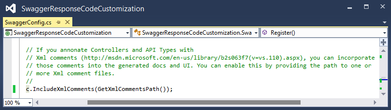
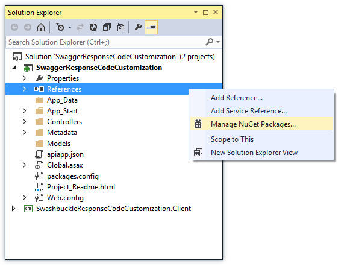

<properties 
    pageTitle="Personalizzare le definizioni di API generato Swashbuckle" 
    description="Informazioni su come personalizzare le definizioni delle API Swagger generate da Swashbuckle per un'app API in Azure App servizio." 
    services="app-service\api" 
    documentationCenter=".net" 
    authors="bradygaster" 
    manager="wpickett" 
    editor="jimbe"/>

<tags 
    ms.service="app-service-api" 
    ms.workload="web" 
    ms.tgt_pltfrm="dotnet" 
    ms.devlang="na" 
    ms.topic="article" 
    ms.date="08/29/2016" 
    ms.author="rachelap"/>

# Personalizzare le definizioni di API generato Swashbuckle 

## Panoramica

In questo articolo viene descritto come personalizzare Swashbuckle per gestire scenari comuni in cui si desidera modificare il comportamento predefinito:

* Swashbuckle genera identificatori di operazione duplicati per gli overload dei metodi controller
* Swashbuckle si presuppone che la risposta valida solo da un metodo HTTP 200 (OK) 
 
## Personalizzare la generazione identificatore dell'operazione

Swashbuckle genera Swagger operazione identificatori concatenando controller nome e il nome del metodo. Questo modello consente di creare un problema quando si dispone di più overload di un metodo: Swashbuckle Genera ID operazione duplicato, ovvero JSON Swagger non validi.

Ad esempio il codice seguente controller, Swashbuckle generare tre Contact_Get operazione ID.

È possibile risolvere il problema manualmente assegnando nomi univoci, ad esempio la procedura seguente per questo esempio i metodi:

* Ottieni
* GetById
* GetPage

L'alternativa è possibile estendere Swashbuckle per renderlo di generare automaticamente gli ID univoci operazione.

La procedura seguente viene illustrato come personalizzare Swashbuckle utilizzando il file *SwaggerConfig.cs* incluse nel progetto dal modello di progetto di Visual Studio API App Preview.  È anche possibile personalizzare Swashbuckle in un progetto API Web che consentono di configurare per la distribuzione di App API.

1. Creare un `IOperationFilter` implementazione 

    Il `IOperationFilter` interfaccia costituisce un punto per gli utenti Swashbuckle per personalizzare diversi aspetti del processo di metadati Swagger. Il codice seguente viene illustrato un metodo di modificare il comportamento di generazione di id operazione. Il codice aggiunge i nomi dei parametri per il nome dell'id operazione.  

        using Swashbuckle.Swagger;
        using System.Web.Http.Description;
        
        namespace ContactsList
        {
            public class MultipleOperationsWithSameVerbFilter : IOperationFilter
            {
                public void Apply(
                    Operation operation,
                    SchemaRegistry schemaRegistry,
                    ApiDescription apiDescription)
                {
                    if (operation.parameters != null)
                    {
                        operation.operationId += "By";
                        foreach (var parm in operation.parameters)
                        {
                            operation.operationId += string.Format("{0}",parm.name);
                        }
                    }
                }
            }
        }

2. Nel file *App_Start\SwaggerConfig.cs* , chiamare il `OperationFilter` Swashbuckle utilizzare il nuovo metodo `IOperationFilter` implementazione.

        c.OperationFilter<MultipleOperationsWithSameVerbFilter>();

    

    Il file *SwaggerConfig.cs* viene rimosso dal pacchetto Swashbuckle NuGet contiene molti esempi di commento di punti di estendibilità. Commenti aggiuntivi non vengono visualizzati qui. 

    Dopo aver apportato questa modifica, il `IOperationFilter` implementazione usato e fa sì che gli ID univoci operazione deve essere generato.
 
    

    
## Codici di risposta diverso da 200

Per impostazione predefinita, Swashbuckle si presuppone che una risposta HTTP 200 (OK) la risposta legittimi *solo* da un metodo API Web. In alcuni casi può essere necessario tornare altri codici di risposta senza causare il client generare un'eccezione.  Ad esempio, il codice seguente API Web illustrato uno scenario desiderato il client per accettare una 200 oppure 404 come risposte valide.

    [ResponseType(typeof(Contact))]
    public HttpResponseMessage Get(int id)
    {
        var contacts = GetContacts();

        var requestedContact = contacts.FirstOrDefault(x => x.Id == id);

        if (requestedContact == null)
        {
            return Request.CreateResponse(HttpStatusCode.NotFound);
        }
        else
        {
            return Request.CreateResponse<Contact>(HttpStatusCode.OK, requestedContact);
        }
    }

In questo scenario, Swagger che per impostazione predefinita Swashbuckle genera specifica sola legittimo codice di stato HTTP, HTTP 200.

Poiché Visual Studio viene utilizzata la definizione dell'API Swagger per generare il codice per il client, viene creato il codice client che genera un'eccezione per le risposte ad eccezione di un 200 HTTP. Il codice riportato di seguito è stata inviata da un client c# generato per questo metodo API Web di esempio.

    if (statusCode != HttpStatusCode.OK)
    {
        HttpOperationException<object> ex = new HttpOperationException<object>();
        ex.Request = httpRequest;
        ex.Response = httpResponse;
        ex.Body = null;
        if (shouldTrace)
        {
            ServiceClientTracing.Error(invocationId, ex);
        }
        throw ex;
    } 

Swashbuckle in due modi per personalizzare l'elenco dei codici di risposta HTTP previsti generate, utilizzando i commenti XML o `SwaggerResponse` attributo. L'attributo è più semplice, ma è solo disponibile in Swashbuckle 5.1.5 o versione successiva. Il modello di nuovo progetto App API anteprima in Visual Studio 2013 include Swashbuckle versione 5.0.0, pertanto se si utilizza il modello e non si desidera aggiornare Swashbuckle, l'unica opzione disponibile per usare i commenti XML. 

### Personalizzare i codici di risposta prevista utilizzando i commenti XML

Utilizzare questo metodo per specificare i codici di risposta se la versione Swashbuckle è precedente alla 5.1.5.

1. Prima di tutto, aggiungere commenti alla documentazione XML sui metodi che si desidera specificare i codici di risposta HTTP per. Il campione API Web azione visualizzata sopra e applicando la documentazione XML comporterebbe nel codice come nell'esempio seguente. 

        /// 

        /// Returns the specified contact.
        /// 

        /// <param name="id">The ID of the contact.</param>
        /// <returns>A contact record with an HTTP 200, or null with an HTTP 404.</returns>
        /// <response code="200">OK</response>
        /// <response code="404">Not Found</response>
        [ResponseType(typeof(Contact))]
        public HttpResponseMessage Get(int id)
        {
            var contacts = GetContacts();
        
            var requestedContact = contacts.FirstOrDefault(x => x.Id == id);
        
            if (requestedContact == null)
            {
                return Request.CreateResponse(HttpStatusCode.NotFound);
            }
            else
            {
                return Request.CreateResponse<Contact>(HttpStatusCode.OK, requestedContact);
            }
        }

1. Aggiungere le istruzioni nel file *SwaggerConfig.cs* per indirizzare Swashbuckle per avvalersi delle XML file di documentazione.

    * Aprire *SwaggerConfig.cs* e creare un metodo sulla classe *SwaggerConfig* per specificare il percorso di file XML di documentazione. 

            private static string GetXmlCommentsPath()
            {
                return string.Format(@"{0}\XmlComments.xml", 
                    System.AppDomain.CurrentDomain.BaseDirectory);
            }

    * Scorrere verso il basso nel file *SwaggerConfig.cs* finché non viene visualizzata la riga di commento di codice simile alla schermata di seguito. 

        
    
    * Rimuovere il commento per abilitare i commenti XML elaborazione durante la generazione Swagger. 
    
        
    
1. Per generare il file di documentazione XML, vanno direttamente le proprietà del progetto e abilitare il file di documentazione XML, come illustrato nella figura riportata di seguito. 

     

Una volta eseguita questa procedura, JSON Swagger generati da Swashbuckle rifletteranno i codici di risposta HTTP specificata nei commenti XML. Nella schermata seguente viene illustrato questo payload JSON nuovo. 

Quando si utilizza Visual Studio per rigenerare il codice di client per le API REST, codici di stato HTTP OK e non viene trovato il codice c# accetta senza generare un'eccezione, consentendo il codice utilizzato prendere decisioni su come gestire la restituzione di un record contatto null. 

        if (statusCode != HttpStatusCode.OK && statusCode != HttpStatusCode.NotFound)
        {
            HttpOperationException<object> ex = new HttpOperationException<object>();
            ex.Request = httpRequest;
            ex.Response = httpResponse;
            ex.Body = null;
            if (shouldTrace)
            {
                ServiceClientTracing.Error(invocationId, ex);
            }
                throw ex;
        }

Il codice per questa dimostrazione disponibili in [questo repository GitHub](https://github.com/Azure-Samples/app-service-api-dotnet-swashbuckle-swaggerresponse). Oltre l'API Web progetto contrassegnato con i commenti XML è un progetto di applicazione Console che contiene un client generato per questa API. 

### Personalizzare i codici di risposta previsto utilizzando l'attributo SwaggerResponse

L'attributo [SwaggerResponse](https://github.com/domaindrivendev/Swashbuckle/blob/master/Swashbuckle.Core/Swagger/Annotations/SwaggerResponseAttribute.cs) è disponibile in Swashbuckle 5.1.5 e versioni successive. Nel caso in cui è installata una versione precedente di un progetto, in questa sezione innanzitutto che spiega come aggiornare il pacchetto Swashbuckle NuGet in modo che è possibile utilizzare questo attributo.

1. In **Esplora soluzioni**fare clic sul progetto l'API Web e fare clic su **Gestisci pacchetti NuGet**. 

    

1. Fare clic sul pulsante *Aggiorna* accanto al pacchetto NuGet *Swashbuckle* . 

    

1. Aggiungere gli attributi *SwaggerResponse* i metodi di azione API Web per il quale si desidera specificare i codici di risposta HTTP validi. 

        [SwaggerResponse(HttpStatusCode.OK)]
        [SwaggerResponse(HttpStatusCode.NotFound)]
        [ResponseType(typeof(Contact))]
        public HttpResponseMessage Get(int id)
        {
            var contacts = GetContacts();

            var requestedContact = contacts.FirstOrDefault(x => x.Id == id);
            if (requestedContact == null)
            {
                return Request.CreateResponse(HttpStatusCode.NotFound);
            }
            else
            {
                return Request.CreateResponse<Contact>(HttpStatusCode.OK, requestedContact);
            }
        }

2. Aggiungere un `using` istruzione per spazio dei nomi dell'attributo:

        using Swashbuckle.Swagger.Annotations;
        
1. Passare all'URL */swagger/docs/v1* del progetto e i codici di risposta HTTP vari sarà visibili nel JSON Swagger. 

    

Il codice per questa dimostrazione disponibili in [questo repository GitHub](https://github.com/Azure-Samples/API-Apps-DotNet-Swashbuckle-Customization-MultipleResponseCodes-With-Attributes). Oltre l'API Web progetto contrassegnato l'attributo *SwaggerResponse* è un progetto di applicazione Console che contiene un client generato per questa API. 

## Passaggi successivi

In questo articolo è illustrato come personalizzare l'aspetto che swashbuckle Genera ID operazione e i codici di risposta valida. Per ulteriori informazioni, vedere [Swashbuckle su GitHub](https://github.com/domaindrivendev/Swashbuckle).
 
