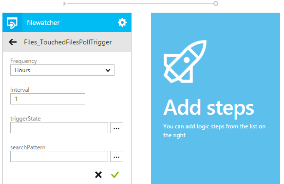

<properties 
    pageTitle="API del servizio di App app trigger | Microsoft Azure" 
    description="Come implementare trigger in un'App API nel servizio App Azure" 
    services="logic-apps" 
    documentationCenter=".net" 
    authors="guangyang"
    manager="wpickett" 
    editor="jimbe"/>

<tags 
    ms.service="logic-apps" 
    ms.workload="na" 
    ms.tgt_pltfrm="dotnet" 
    ms.devlang="na" 
    ms.topic="article" 
    ms.date="08/25/2016" 
    ms.author="rachelap"/>

# Azure API del servizio App app trigger

>[AZURE.NOTE] Questa versione dell'articolo si applica alla versione dell'API App 2014-12-01-anteprima dello schema.

## Panoramica

In questo articolo viene spiegato come API app trigger per implementare e utilizzarli da un'app per logica.

Tutti i frammenti di codice in questo argomento vengono copiati dal [FileWatcher API App esempio](http://go.microsoft.com/fwlink/?LinkId=534802). 

Si noti che è necessario scaricare il pacchetto nuget seguenti per il codice in questo articolo per generare ed eseguire: [http://www.nuget.org/packages/Microsoft.Azure.AppService.ApiApps.Service/](http://www.nuget.org/packages/Microsoft.Azure.AppService.ApiApps.Service/).

## Quali sono i trigger di app API?

Si tratta di uno scenario comune per un'app di API generare un evento, in modo che i client dell'app API possono eseguire le operazioni appropriate in risposta a un evento. Il meccanismo API REST in base a che supporta questo scenario viene definito un trigger di app API. 

Si supponga ad esempio, il codice client utilizza l' [API di connettore Twitter app](../app-service-logic/app-service-logic-connector-twitter.md) e il codice deve eseguire un'azione in base a nuove TWEET contenenti parole specifiche. In questo caso, potrebbe impostare un trigger sondaggio o push per facilitare la necessità.

## Trigger sondaggio e trigger di push

Due tipi di trigger sono attualmente supportati:

- Trigger sondaggio - Client polling app API per la notifica di un evento con stato attivato 
- Trigger di push - Client riceve una notifica tramite l'app API quando viene generato un evento 

### Trigger sondaggio

Un trigger di sondaggio implementato come un normale API REST e si aspetta relativi client (ad esempio un'app di logica) sondaggio per ottenere la notifica. Mentre il cliente può mantenere lo stato, trigger sondaggio è privo di stato. 

Le seguenti informazioni relative pacchetti richiesta e risposta illustrare alcuni aspetti del contratto trigger sondaggio:

- Richiesta
    - Metodo HTTP: GET
    - Parametri
        - triggerState - questo parametro facoltativo consente ai client di specificare il proprio stato in modo che il trigger sondaggio correttamente possibile decidere se restituire notifica o meno in base a stato specificato.
        - Parametri API specifici
- Risposta
    - Codice di stato **200** - richiesta è valida ed è una notifica dal trigger. Il contenuto della notifica sarà il corpo della risposta. Un'intestazione "Riprova dopo" nella risposta indica che notifica aggiuntive per recuperare i dati con una chiamata di richiesta successiva.
    - Codice di stato **202** - richiesta è valida, ma non vi è alcuna notifica dal trigger.
    - Codice di stato **4xx** - richiesta non è valido. Il client non deve riprendere la richiesta.
    - Codice di stato **5xx** - richiesta è ha generato un errore interno del server e/o di un problema temporaneo. Il cliente deve riprendere la richiesta.

Frammento di codice seguente è illustrato un esempio di come implementare un trigger di sondaggio.

    // Implement a poll trigger.
    [HttpGet]
    [Route("api/files/poll/TouchedFiles")]
    public HttpResponseMessage TouchedFilesPollTrigger(
        // triggerState is a UTC timestamp
        string triggerState,
        // Additional parameters
        string searchPattern = "*")
    {
        // Check to see whether there is any file touched after the timestamp.
        var lastTriggerTimeUtc = DateTime.Parse(triggerState).ToUniversalTime();
        var touchedFiles = Directory.EnumerateFiles(rootPath, searchPattern, SearchOption.AllDirectories)
            .Select(f => FileInfoWrapper.FromFileInfo(new FileInfo(f)))
            .Where(fi => fi.LastAccessTimeUtc > lastTriggerTimeUtc);

        // If there are files touched after the timestamp, return their information.
        if (touchedFiles != null && touchedFiles.Count() != 0)
        {
            // Extension method provided by the AppService service SDK.
            return this.Request.EventTriggered(new { files = touchedFiles });
        }
        // If there are no files touched after the timestamp, tell the caller to poll again after 1 mintue.
        else
        {
            // Extension method provided by the AppService service SDK.
            return this.Request.EventWaitPoll(new TimeSpan(0, 1, 0));
        }
    }

Per provare questo trigger sondaggio, procedere come segue:

1. Distribuire App API con un'impostazione di autenticazione di **pubblico anonimo**.
2. Chiamare l'operazione **tocco** al tocco un file. Nella figura seguente mostra una richiesta di esempio tramite Postman.
   
3. Chiamare il trigger sondaggio con il parametro **triggerState** impostato su un indicatore di data e ora precedente passaggio 2. Nella figura seguente è illustrata la richiesta di esempio tramite Postman.
   

### Trigger di push

Un trigger di push viene implementato come un normale API REST che inserisce le notifiche per i clienti che hanno registrato per ricevere una notifica quando vengono generati eventi specifici.

Le seguenti informazioni relative pacchetti richiesta e risposta illustrare alcuni aspetti del contratto trigger push.

- Richiesta
    - Metodo HTTP: inserire
    - Parametri
        - triggerId: obbligatorio - stringa opaca (ad esempio un GUID) che rappresenta la registrazione di un trigger di push.
        - callbackUrl: obbligatorio - URL del callback da richiamare quando viene generato l'evento. La chiamata è una chiamata HTTP POST semplice.
        - Parametri API specifici
- Risposta
    - Stato codice **200** - richiesta per registrare client esito negativo.
    - Codice di stato **4xx** - richiesta non è valido. Il client non deve riprendere la richiesta.
    - Codice di stato **5xx** - richiesta è ha generato un errore interno del server e/o di un problema temporaneo. Il cliente deve riprendere la richiesta.
- Callback
    - Metodo HTTP: POST
    - Corpo richiesta: il contenuto di notifica.

Frammento di codice seguente è illustrato un esempio di come implementare un trigger di push:

    // Implement a push trigger.
    [HttpPut]
    [Route("api/files/push/TouchedFiles/{triggerId}")]
    public HttpResponseMessage TouchedFilesPushTrigger(
        // triggerId is an opaque string.
        string triggerId,
        // A helper class provided by the AppService service SDK.
        // Here it defines the input of the push trigger is a string and the output to the callback is a FileInfoWrapper object.
        [FromBody]TriggerInput<string, FileInfoWrapper> triggerInput)
    {
        // Register the trigger to some trigger store.
        triggerStore.RegisterTrigger(triggerId, rootPath, triggerInput);

        // Extension method provided by the AppService service SDK indicating the registration is completed.
        return this.Request.PushTriggerRegistered(triggerInput.GetCallback());
    }

    // A simple in-memory trigger store.
    public class InMemoryTriggerStore
    {
        private static InMemoryTriggerStore instance;

        private IDictionary<string, FileSystemWatcher> _store;

        private InMemoryTriggerStore()
        {
            _store = new Dictionary<string, FileSystemWatcher>();
        }

        public static InMemoryTriggerStore Instance
        {
            get
            {
                if (instance == null)
                {
                    instance = new InMemoryTriggerStore();
                }
                return instance;
            }
        }

        // Register a push trigger.
        public void RegisterTrigger(string triggerId, string rootPath,
            TriggerInput<string, FileInfoWrapper> triggerInput)
        {
            // Use FileSystemWatcher to listen to file change event.
            var filter = string.IsNullOrEmpty(triggerInput.inputs) ? "*" : triggerInput.inputs;
            var watcher = new FileSystemWatcher(rootPath, filter);
            watcher.IncludeSubdirectories = true;
            watcher.EnableRaisingEvents = true;
            watcher.NotifyFilter = NotifyFilters.LastAccess;

            // When some file is changed, fire the push trigger.
            watcher.Changed +=
                (sender, e) => watcher_Changed(sender, e,
                    Runtime.FromAppSettings(),
                    triggerInput.GetCallback());

            // Assoicate the FileSystemWatcher object with the triggerId.
            _store[triggerId] = watcher;

        }

        // Fire the assoicated push trigger when some file is changed.
        void watcher_Changed(object sender, FileSystemEventArgs e,
            // AppService runtime object needed to invoke the callback.
            Runtime runtime,
            // The callback to invoke.
            ClientTriggerCallback<FileInfoWrapper> callback)
        {
            // Helper method provided by AppService service SDK to invoke a push trigger callback.
            callback.InvokeAsync(runtime, FileInfoWrapper.FromFileInfo(new FileInfo(e.FullPath)));
        }
    }

Per provare questo trigger sondaggio, procedere come segue:

1. Distribuire App API con un'impostazione di autenticazione di **pubblico anonimo**.
2. Passare alla [http://requestb.in/](http://requestb.in/) per creare un RequestBin che verrà utilizzata come l'URL di callback.
3. Chiamare il trigger di push con un GUID come **triggerId** e l'URL RequestBin come **callbackUrl**.
   
4. Chiamare l'operazione **tocco** al tocco un file. Nella figura seguente mostra una richiesta di esempio tramite Postman.
   
5. Selezionare RequestBin per confermare che la push trigger richiamata con l'output di proprietà.
   

### Descrivere i trigger di definizione dell'API

Dopo aver implementazione i trigger e distribuzione l'app API in Azure, passare a e il **Definizione dell'API** nel portale di Azure preview e si noterà che trigger vengono riconosciuti automaticamente nell'interfaccia utente, è dovuta la definizione di Swagger 2.0 API dell'app API.

Se si fare clic sul pulsante **Scarica Swagger** e aprire il file JSON, si noterà risultati simili al seguente:

    "/api/files/poll/TouchedFiles": {
      "get": {
        "operationId": "Files_TouchedFilesPollTrigger",
        ...
        "x-ms-scheduler-trigger": "poll"
      }
    },
    "/api/files/push/TouchedFiles/{triggerId}": {
      "put": {
        "operationId": "Files_TouchedFilesPushTrigger",
        ...
        "x-ms-scheduler-trigger": "push"
      }
    }

Proprietà estensione **x-ms-schedular-trigger** è come descritti nella definizione dell'API trigger e vengono automaticamente aggiunti dal gateway app API quando si richiede la definizione dell'API tramite il gateway se la richiesta di uno dei seguenti criteri. (È possibile anche aggiungere questa proprietà manualmente.)

- Trigger sondaggio
    - Se il metodo HTTP non è **visualizzato**.
    - Se la proprietà **operationId** contiene la stringa **trigger**.
    - Se la proprietà **parametri** include un parametro con una proprietà di **nome** impostata su **triggerState**.
- Trigger di push
    - Se il metodo HTTP è **POSIZIONARE**.
    - Se la proprietà **operationId** contiene la stringa **trigger**.
    - Se la proprietà **parametri** include un parametro con una proprietà di **nome** impostata su **triggerId**.

## Utilizzare trigger di app API in App logica

### Elencare e configurare i trigger di app API nella finestra di progettazione di applicazioni logica

Se si crea un'app logica nello stesso gruppo di risorse app API, sarà possibile aggiungere all'area di progettazione è sufficiente, fare clic su esso. Nelle immagini seguenti viene illustrato questo:

## Ottimizzare i trigger di app API per le applicazioni di logica

Dopo aver aggiunto i trigger per un'app di API, esistono alcune operazioni da eseguire per migliorare l'esperienza quando si usa l'app API in un'app di logica.

Ad esempio, il parametro **triggerState** per i trigger di sondaggio deve essere impostato sull'espressione seguente nell'app logica. Questa espressione deve restituire l'ultima chiamata del trigger dall'app logica e tale valore restituito.  

    @coalesce(triggers()?.outputs?.body?['triggerState'], '')

Nota: Per una spiegazione delle funzioni utilizzate nell'espressione sopra, consultare la documentazione per la lingua di [definizione del flusso di lavoro](https://msdn.microsoft.com/library/azure/dn948512.aspx)di logica di App.

Gli utenti di app logica necessario fornire l'espressione sopra per il parametro **triggerState** durante l'uso di trigger. È possibile che questo valore predefinito nella finestra di progettazione di app logica tramite la proprietà di estensione **recommendation x-ms-utilità di pianificazione**.  In modo che il parametro non viene visualizzato nella finestra di progettazione, è possibile impostare la proprietà di estensione **x-ms-visibilità** a un valore di *interno* .  Il frammento di codice seguente è illustrata il.

    "/api/Messages/poll": {
      "get": {
        "operationId": "Messages_NewMessageTrigger",
        "parameters": [
          {
            "name": "triggerState",
            "in": "query",
            "required": true,
            "x-ms-visibility": "internal",
            "x-ms-scheduler-recommendation": "@coalesce(triggers()?.outputs?.body?['triggerState'], '')",
            "type": "string"
          }
        ]
        ...
        "x-ms-scheduler-trigger": "poll"
      }
    }

Per i trigger di push, è necessario il parametro **triggerId** identifichi app logica. Una procedura consigliata consiste nell'impostare questa proprietà per il nome del flusso di lavoro tramite l'espressione seguente:

    @workflow().name

Utilizzando le proprietà di estensione **recommendation x-ms-utilità di pianificazione** e **x-ms-visibilità** nella relativa definizione API, app API possono trasmettere alla finestra di progettazione di app logica per impostare automaticamente questa espressione per l'utente.

        "parameters":[  
          {  
            "name":"triggerId",
            "in":"path",
            "required":true,
            "x-ms-visibility":"internal",
            "x-ms-scheduler-recommendation":"@workflow().name",
            "type":"string"
          },

### Aggiungere le proprietà di estensione in definizione API

Informazioni aggiuntive sui metadati, ad esempio l'estensione proprietà **recommendation x-ms-utilità di pianificazione** e **la visibilità di ms x** - possono essere aggiunti nella definizione API in uno dei due modi: statica o dinamica.

Per i metadati statici, è possibile modificare il file */metadata/apiDefinition.swagger.json* nel progetto direttamente e aggiungere manualmente le proprietà.

Per App API tramite metadati dinamico, è possibile modificare il file SwaggerConfig.cs per aggiungere un'operazione di filtro che è possibile aggiungere queste estensioni.

    GlobalConfiguration.Configuration 
        .EnableSwagger(c =>
            {
                ...
                c.OperationFilter<TriggerStateFilter>();
                ...
            }

Di seguito è illustrato un esempio di come è possibile implementare questa classe per facilitare lo scenario di metadati dinamico.

    // Add extension properties on the triggerState parameter
    public class TriggerStateFilter : IOperationFilter
    {

        public void Apply(Operation operation, SchemaRegistry schemaRegistry, System.Web.Http.Description.ApiDescription apiDescription)
        {
            if (operation.operationId.IndexOf("Trigger", StringComparison.InvariantCultureIgnoreCase) >= 0)
            {
                // this is a possible trigger
                var triggerStateParam = operation.parameters.FirstOrDefault(x => x.name.Equals("triggerState"));
                if (triggerStateParam != null)
                {
                    if (triggerStateParam.vendorExtensions == null)
                    {
                        triggerStateParam.vendorExtensions = new Dictionary<string, object>();
                    }

                    // add 2 vendor extensions
                    // x-ms-visibility: set to 'internal' to signify this is an internal field
                    // x-ms-scheduler-recommendation: set to a value that logic app can use
                    triggerStateParam.vendorExtensions.Add("x-ms-visibility", "internal");
                    triggerStateParam.vendorExtensions.Add("x-ms-scheduler-recommendation",
                                                           "@coalesce(triggers()?.outputs?.body?['triggerState'], '')");
                }
            }
        }
    }
 
