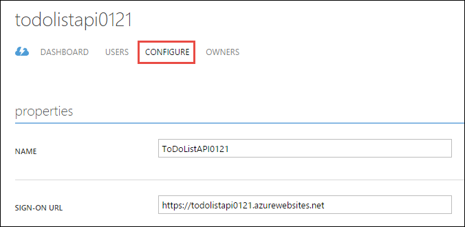
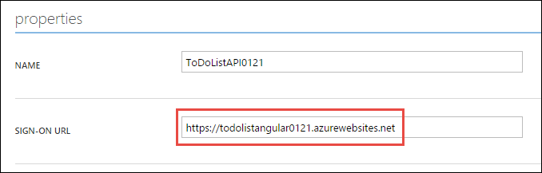
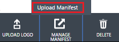

<properties
    pageTitle="Autenticazione dell'utente per le applicazioni di API in Azure App servizio | Microsoft Azure"
    description="Informazioni su come proteggere un'app API in Azure App servizio che consente l'accesso solo agli utenti autenticati."
    services="app-service\api"
    documentationCenter=".net"
    authors="tdykstra"
    manager="wpickett"
    editor=""/>

<tags
    ms.service="app-service-api"
    ms.workload="na"
    ms.tgt_pltfrm="dotnet"
    ms.devlang="na"
    ms.topic="article"
    ms.date="06/30/2016"
    ms.author="rachelap"/>

# Autenticazione dell'utente per App API nel servizio App Azure

## Panoramica

In questo articolo viene illustrato come proteggere un'app di Azure API in modo che possa essere chiamata solo gli utenti autenticati. L'articolo si presuppone che è stato consultato l'articolo [Cenni preliminari sull'autenticazione servizio App Azure](../app-service/app-service-authentication-overview.md).

Si apprenderanno:

* Informazioni su come configurare un provider di autenticazione tramite i dettagli di Azure Active Directory (Azure Active Directory).
* Come utilizzare un'app API protetta tramite [Active Directory autenticazione raccolta (ADAL) per JavaScript](https://github.com/AzureAD/azure-activedirectory-library-for-js).

L'articolo include due sezioni:

* La sezione [come configurare l'autenticazione utente in Azure App servizio](#authconfig) in genere viene illustrato come configurare l'autenticazione utente per un'app qualsiasi API e applicabile anche a tutti i Framework supportati dal servizio di App, tra cui .NET, Node e Java.

* Iniziando dalla sezione [continuare le esercitazioni .NET API App](#tutorialstart) , guide articolo per la configurazione di un'applicazione di esempio con un .NET back-end e un front AngularJS terminare in modo che utilizzi Azure Active Directory per l'autenticazione utente. 

## Come configurare l'autenticazione utente in Azure App servizio

In questa sezione vengono fornite istruzioni generali che si applicano a qualsiasi app API. Per istruzioni specifiche per l'applicazione di esempio per eseguire elenco .NET, passare a [continuare le esercitazioni .NET Guida introduttiva](#tutorialstart).

1. Nel [portale di Azure](https://portal.azure.com/), passare a e **l'Impostazioni** dell'app API che si desidera proteggere, individuare la sezione **caratteristiche** e quindi fare clic su **autenticazione / autorizzazione**.

    

3. Nel **autenticazione / autorizzazione** blade, fare clic **su**.

4. Selezionare un'opzione dall'elenco a discesa **azione da eseguire quando richiesta non viene autenticato** .

    * Se si vuole solo chiamate autenticate per raggiungere l'app API, scegliere una delle opzioni di **registrarsi...** . Questa opzione consente di proteggere l'app API senza scrivere codice eseguibile al suo interno.

    * Se si vuole tutte le chiamate a raggiungere l'app API, selezionare **Consenti richiesta (alcuna azione)**. È possibile utilizzare questa opzione per indirizzare ai chiamanti autenticati di una scelta del provider di autenticazione. Con questa opzione è necessario scrivere codice per gestire l'autorizzazione.

    Per ulteriori informazioni, vedere [l'autenticazione e l'autorizzazione per le applicazioni di API in Azure App servizio](app-service-api-authentication.md#multiple-protection-options).

5. Selezionare uno o più dei **Provider di autenticazione**.

    L'immagine Mostra opzioni che richiedono tutti i chiamanti devono essere autenticate dal Azure Active Directory.
 
    

    Quando si sceglie un provider di autenticazione, il portale Visualizza blade configurazione per il provider. 

    Per istruzioni dettagliate che spiegano come configurare le pale configurazione provider di autenticazione, vedere [come configurare l'applicazione di servizio App per usare le credenziali Azure Active Directory](../app-service-mobile/app-service-mobile-how-to-configure-active-directory-authentication.md). (Il collegamento passa a un articolo su Azure Active Directory, ma l'articolo stesso contiene le schede collegamenti ad articoli per gli altri provider di autenticazione).

7. Al termine e di configurazione il provider di autenticazione, fare clic su **OK**.

7. Nel **autenticazione / autorizzazione** blade, fare clic su **Salva**.

Al termine, App servizio autentica tutte le chiamate API di raggiungere l'API app. I servizi di autenticazione funzionano per tutte le lingue supportate dal servizio di App, tra cui .NET, Node e linguaggio di. 

Per effettuare chiamate API autenticate, il chiamante include del token del titolare OAuth 2.0 del provider di autenticazione nell'intestazione di autorizzazione richieste HTTP. Il token può essere acquisito tramite SDK del provider di autenticazione.

## Continuare le esercitazioni .NET API App

Se si stanno seguendo le esercitazioni Node o Java per App API, andare al prossimo articolo, [l'autenticazione dell'entità servizio per API App](app-service-api-dotnet-service-principal-auth.md). 

Se si stanno seguendo la serie di esercitazioni .NET per le applicazioni di API e già distribuito l'applicazione di esempio come indicato nelle esercitazioni [prima](app-service-api-dotnet-get-started.md) e la [seconda](app-service-api-cors-consume-javascript.md) , passare alla sezione [configurare l'autenticazione nel servizio di App e Azure Active Directory](#azureauth) .

Se si desidera seguire questa esercitazione senza passano attraverso le esercitazioni prima e la seconda, eseguire i passaggi seguenti che spiegano come iniziare con un processo automatizzato per distribuire l'applicazione di esempio.

>[AZURE.NOTE] La procedura seguente riprendere a stesso punto di partenza come se sono state eseguite le prime due esercitazioni con un'eccezione: Visual Studio non si conosce già quali web app o app API Ottiene distribuiti ogni progetto. Che indica che non è più possibile istruzioni esatte in questa esercitazione viene spiegato come distribuire le destinazioni destra. Se non si ha familiarità con informazioni generali su come eseguire i passaggi di distribuzione privatamente, si consiglia di eseguire la serie di esercitazioni da [esercitazione prima](app-service-api-dotnet-get-started.md) rispetto alla iniziare con questo processo di distribuzione automatica.

1. Verificare la disponibilità di tutti i prerequisiti elencati nella [prima esercitazione](app-service-api-dotnet-get-started.md). Oltre ai prerequisiti elencati, queste esercitazioni autenticazione presuppongono che hanno lavorato con App servizio web App e App API in Visual Studio e il portale di Azure.

2. Fare clic sul pulsante **Distribuisci in Azure** nel [file Leggimi dell'archivio di esempio elenco attività](https://github.com/azure-samples/app-service-api-dotnet-todo-list/blob/master/readme.md) per distribuire le applicazioni di API e web app. Prendere nota del gruppo di risorse Azure che viene creato, come è possibile utilizzare questa versione successiva per cercare web app e i nomi di app API.
 
3. Scaricare o duplicare l' [archivio di esempio elenco attività](https://github.com/Azure-Samples/app-service-api-dotnet-todo-list) per ottenere il codice che verrà utilizzato in locale in Visual Studio.

## Configurare l'autenticazione nel servizio di App e Azure Active Directory

A questo punto, si dispone dell'applicazione in esecuzione in Azure App servizio senza che gli utenti autenticati. In questa sezione è aggiungere autenticazione eseguendo le operazioni seguenti:

* Configurare il servizio di App per richiedere l'autenticazione di Azure Active Directory (Azure Active Directory) per le chiamate in app intermedio API.
* Creare un'applicazione di Azure Active Directory.
* Configurare l'applicazione di Azure Active Directory per inviare il token del titolare dopo l'accesso a AngularJS front-end. 

Se si verificano problemi durante la seguendo le indicazioni esercitazioni, vedere la sezione [risoluzione dei problemi](#troubleshooting) alla fine dell'esercitazione. 
 
### Configurare l'autenticazione per l'app API intermedio

1. Nel [portale di Azure](https://portal.azure.com/), passare a e **l'Impostazioni** dell'app API creato per il progetto ToDoListAPI, individuare la sezione **caratteristiche** e quindi fare clic su **autenticazione / autorizzazione**.

    

3. Nel **autenticazione / autorizzazione** blade, fare clic **su**.

4. Nell'elenco a discesa **azione da eseguire quando richiesta non viene autenticato** selezionare **accedere con Azure Active Directory**.

    Questa opzione garantisce che nessuna richiesta unauathenticated verrà recapitate app API. 

5. In **Provider di autenticazione**, fare clic su **Azure Active Directory**.

    

6. In e **l'Impostazioni di Azure Active Directory** , fare clic su **Express**

    

    Con l'opzione **Express** servizio App possibile creare automaticamente un'applicazione di Azure Active Directory nel [tenant di](https://msdn.microsoft.com/en-us/library/azure/jj573650.aspx#BKMK_WhatIsAnAzureADTenant)Azure Active Directory. 

    Non è necessario creare un tenant, in quanto ogni account Azure dispone automaticamente uno.

7. In **modalità di gestione**, fare clic su **Crea nuovo Active Directory App** se non è già selezionata e osservare il valore nella casella di testo **Crea App** . è necessario cercare in un secondo momento questa applicazione AAD nel portale di classica Azure.

    

    Azure crea automaticamente un'applicazione di Azure Active Directory con il nome indicato nel tenant di Azure Active Directory. Per impostazione predefinita, l'applicazione di Azure Active Directory è diverso da quello di app API. Se si preferisce, è possibile immettere un nome diverso.
 
7. Fare clic su **OK**.

7. Nel **autenticazione / autorizzazione** blade, fare clic su **Salva**.

    

A questo punto solo gli utenti nel tenant di Azure Active Directory possono chiamare l'API app.

### Facoltativo: Verificare l'app API

1. In un browser passare all'URL dell'app API: in e il **API app** nel portale di Azure, fare clic sul collegamento **all'URL**.  

    Poiché le richieste non autenticate non sono consentite per raggiungere l'app API, si viene reindirizzati a una schermata di accesso.

    Se il browser passa alla pagina "correttamente creata", il browser potrebbe già essere collegato via, ossia in tal caso, aprire una finestra InPrivate o Incognito e passare all'URL dell'app API.

2. Accedere usando le credenziali per un utente nel tenant di Azure Active Directory.

    Quando è stato effettuato, verrà visualizzata la pagina "creata" nel browser.

9. Chiudere il browser.

### Configurare l'applicazione di Azure Active Directory

Quando è stato configurato l'autenticazione di Azure Active Directory, servizio App creato un'applicazione di Azure Active Directory. Per impostazione predefinita nuovo Azure AD applicazione è stata configurata per fornire il token del titolare all'URL dell'applicazione API. In questa sezione configurare l'applicazione di Azure Active Directory per fornire il token del titolare al AngularJS front end anziché direttamente all'app intermedio API. AngularJS front-end invierà il token all'app API quando si chiama l'API app.

>[AZURE.NOTE] Per mantenere il processo come semplice come possibili, questa esercitazione utilizza un singolo Azure AD applicazione per front-end e il secondo livello API app. Un'altra opzione consiste nell'usare due applicazioni di Azure Active Directory. In questo caso è necessario assegnare l'autorizzazione di applicazione di Azure Active Directory del front-end da chiamare applicazione di Azure Active Directory del livello intermedio. Questo approccio più applicazione da dare maggiore controllo sulle autorizzazioni per ogni livello.

11. Nel [portale classica Azure](https://manage.windowsazure.com/), passare a **Azure Active Directory**.

    È necessario usare il portale classico perché alcune impostazioni di Azure Active Directory che è necessario accedere a non sono ancora disponibili nel portale di Azure corrente.

12. Nella scheda **Directory** fare clic sul tenant AAD.

    

14. Fare clic su **applicazioni > applicazioni appartiene alla società**e quindi fare clic sul segno di spunta.

    Inoltre, è necessario aggiornare la pagina per visualizzare la nuova applicazione.

15. Nell'elenco delle applicazioni, fare clic sul nome di quella Azure creato automaticamente quando è abilitata l'autenticazione per l'app API.

    

16. Fare clic su **Configura**.

    

17. Impostare **l'URL di accesso** all'URL per un'app web AngularJS, senza barra.

    Ad esempio: https://todolistangular.azurewebsites.net

    

17. Impostare **l'URL di risposta** all'URL per un'app web, senza barra.

    Ad esempio: https://todolistsangular.azurewebsites.net

16. Fare clic su **Salva**.

    

15. Nella parte inferiore della pagina, fare clic su **manifesto Gestisci > Download manifesto**.

    

17. Scaricare il file in una posizione in cui è possibile modificarla.

16. Nel file di manifesto scaricato, cercare la `oauth2AllowImplicitFlow` proprietà. Modificare il valore di questa proprietà da `false` a `true`e quindi salvare il file.

    Questa impostazione è necessaria per l'accesso da un'applicazione di una pagina JavaScript. In questo modo il token del titolare Oauth 2.0 da utilizzare per il frammento di URL.

16. Fare clic su **manifesto Gestisci > Carica manifesto**e caricare il file aggiornato nel passaggio precedente.

    

17. Copiare il valore di **ID Client** e salvarlo in un punto che è possibile ottenere da in un secondo momento.

## Configurare il progetto ToDoListAngular per utilizzare l'autenticazione

In questa sezione è modificare AngularJS front-end in modo che utilizzi Active Directory autenticazione raccolta (ADAL) per JS per acquisire un token del titolare per l'utente ha effettuato l'accesso da Azure Active Directory. Il codice includerà il token in richieste HTTP inviate a livello centrale, come illustrato nella figura seguente. 

Apportare le modifiche seguenti al file di progetto ToDoListAngular.

1. Aprire il file *index* .

2. Rimuovere le righe che fanno riferimento il protocollo Active Directory autenticazione raccolta (ADAL) per gli script JS.

        
        

1. Aprire il file *app/scripts/app.js* .

2. Commento il blocco di codice contrassegnato per "senza autenticazione" e rimuovere il commento per il blocco di codice contrassegnato per "con autenticazione".

    Questa modifica fa riferimento il provider di autenticazione JS ADAL e fornisce i valori di configurazione ad esso. Nei passaggi seguenti è impostare i valori di configurazione per l'API app e applicazione di Azure Active Directory.

8. Nel codice che imposta la `endpoints` variabile, impostare l'URL di API per l'URL dell'app API create per il progetto ToDoListAPI e impostare l'ID applicazione di Azure Active Directory per l'ID client che sono stati copiati dal portale di classica Azure.

    Il codice è ora simile al seguente.

        var endpoints = {
            "https://todolistapi0121.azurewebsites.net/": "1cf55bc9-9ed8-4df31cf55bc9-9ed8-4df3"
        };

9. Nella chiamata a `adalProvider.init`, impostare `tenant` al nome del tenant e `clientId` sullo stesso valore usato nel passaggio precedente.

    Il codice è ora simile al seguente.

        adalProvider.init(
            {
                instance: 'https://login.microsoftonline.com/', 
                tenant: 'contoso.onmicrosoft.com',
                clientId: '1cf55bc9-9ed8-4df31cf55bc9-9ed8-4df3',
                extraQueryParameter: 'nux=1',
                endpoints: endpoints
            },
            $httpProvider
            );

    Le modifiche a `app.js` specificare che il codice di chiamata e chiamata API sono nella stessa applicazione di Azure Active Directory.

1. Aprire il file *app/scripts/homeCtrl.js* .

2. Commento il blocco di codice contrassegnato per "senza autenticazione" e rimuovere il commento per il blocco di codice contrassegnato per "con autenticazione".

1. Aprire il file *app/scripts/indexCtrl.js* .

2. Commento il blocco di codice contrassegnato per "senza autenticazione" e rimuovere il commento per il blocco di codice contrassegnato per "con autenticazione".

### Distribuire il progetto ToDoListAngular in Azure

8. In **Esplora soluzioni**fare clic sul progetto ToDoListAngular e quindi fare clic su **pubblica**.

9. Fare clic su **pubblica**.

    Visual Studio distribuisce il progetto e viene aperto un browser per l'URL di base dell'applicazione web. Questa verrà visualizzata una pagina di 403 errore, che può essere normale quando si tenta di accedere a un URL di base API Web da un browser.

    È comunque necessario apporta una modifica all'app API intermedio prima di poter testare l'applicazione.

10. Chiudere il browser.

## Configurare il progetto ToDoListAPI per utilizzare l'autenticazione

Attualmente il progetto ToDoListAPI Invia "*" come il `owner` valore ToDoListDataAPI. In questa sezione modificare il codice per inviare l'ID dell'utente connesso.

Apportare le modifiche seguenti nel progetto ToDoListAPI.

1. Aprire il file *Controllers/ToDoListController.cs* e rimuovere il commento in ogni metodo di azione imposta `owner` di Azure AD `NameIdentifier` valore attestazione. Per esempio:

        owner = ((ClaimsIdentity)User.Identity).FindFirst(ClaimTypes.NameIdentifier).Value;

    **Importante**: non rimuovere il commento di codice nel `ToDoListDataAPI` metodo. è necessario farlo in un secondo momento per l'esercitazione di autenticazione dell'entità servizio.

### Distribuire il progetto ToDoListAPI in Azure

8. In **Esplora soluzioni**fare clic sul progetto ToDoListAPI e quindi fare clic su **pubblica**.

9. Fare clic su **pubblica**.

    Visual Studio distribuisce il progetto e viene aperto un browser per l'URL di base dell'applicazione API.

10. Chiudere il browser.

### Verificare l'applicazione

9. Passare all'URL dell'applicazione web **usando l'HTTPS, non HTTP**.

8. Fare clic sulla scheda **Dell'elenco** .

    Viene richiesto di effettuare l'accesso.

9. Accedere con le credenziali dell'utente nel tenant di AAD.

10. Verrà visualizzata la pagina **Dell'elenco** .

    

    Non attività vengono visualizzati elementi perché fino a questo momento sono tutte stati per proprietario "*". A questo punto l'intermedio richiede elementi per l'utente ha effettuato l'accesso e non sono ancora stati creati.

11. Aggiungere nuovi elementi attività per verificare il funzionamento dell'applicazione.

12. In un'altra finestra del browser, passare all'URL dell'interfaccia utente Swagger per l'app API ToDoListDataAPI e fare clic su **elenco attività > ottenere**. Immettere un asterisco per il `owner` parametro, quindi **eseguire una prova**.

    La risposta viene indicato che gli elementi di cose da fare di nuovo l'effettivo ID utente di Azure Active Directory nella proprietà proprietario.

    

## Compilazione dei progetti da zero

I due progetti API Web sono stati creati usando il modello di progetto di **Azure API App** e la sostituzione del controller di valori predefiniti con un controller di elenco attività. 

Per informazioni su come creare un'applicazione di pagine singole AngularJS con 2 API Web back-end, vedere [mani in Esercitazione: creare una singola pagina applicazione (SPA) con API Web ASP.NET e Angular.js](http://www.asp.net/web-api/overview/getting-started-with-aspnet-web-api/build-a-single-page-application-spa-with-aspnet-web-api-and-angularjs). Per informazioni su come aggiungere il codice di autenticazione di Azure Active Directory, vedere le risorse seguenti:

* [Protezione AngularJS singola pagina App con Azure Active Directory](../active-directory/active-directory-devquickstarts-angular.md).
* [Introduzione a v1 JS ADAL](http://www.cloudidentity.com/blog/2015/02/19/introducing-adal-js-v1/)

## Risoluzione dei problemi

[AZURE.INCLUDE [troubleshooting](../../includes/app-service-api-auth-troubleshooting.md)]

* Assicurarsi che non confondere ToDoListAPI (livello intermedio) e ToDoListDataAPI (livello di dati). Ad esempio, verificare di avere aggiunto l'autenticazione all'app intermedio API, non il livello di dati. 
* Assicurarsi che il codice sorgente AngularJS fa riferimento l'URL di app intermedio API (ToDoListAPI, non ToDoListDataAPI) e Azure corretto ID client di Active Directory. 

## Passaggi successivi

In questa esercitazione è stato illustrato come utilizzare l'autenticazione del servizio di App per un'app di API e come chiamare app API usando la raccolta di ADAL JS. Nell'esercitazione successiva si apprenderà come per [proteggere l'accesso all'app API per gli scenari di servizio](app-service-api-dotnet-service-principal-auth.md).

