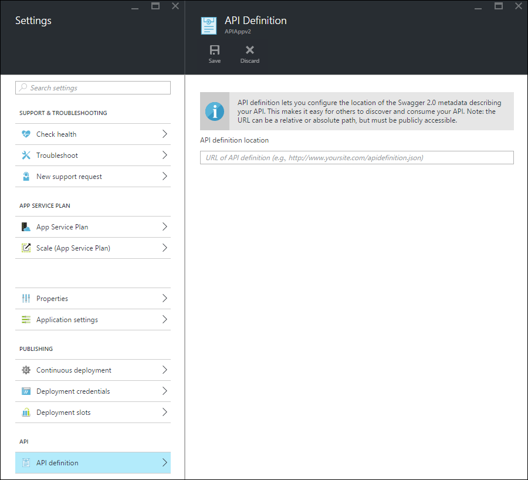

<properties
    pageTitle="App App API del servizio metadati per la generazione di individuazione e codice API | Microsoft Azure"
    description="Informazioni su come API app nel servizio di Azure App Usa metadati Swagger per facilitare la generazione di individuazione e codice API."
    services="app-service\api"
    documentationCenter=".net"
    authors="tdykstra"
    manager="wpickett"
    editor=""/>

<tags
    ms.service="app-service-api"
    ms.workload="na"
    ms.tgt_pltfrm="na"
    ms.devlang="na"
    ms.topic="article"
    ms.date="08/30/2016"
    ms.author="rachelap"/>

# App App API del servizio metadati per la generazione di individuazione e codice API 

Supporto per i metadati API [Swagger 2.0](http://swagger.io/) integrato in App servizio API app. Non è necessario utilizzare Swagger, ma se si utilizza, è possibile sfruttare le funzionalità dell'API App che semplificano l'individuazione e consumo.   

## Endpoint swagger

È possibile specificare un endpoint che fornisce i metadati Swagger JSON 2.0 per un'app all'API di una proprietà dell'API app. L'endpoint può essere relativo l'URL di base dell'app API o un URL assoluto. URL assoluto può fare riferimento di fuori dell'app API. 

Molti client downstream (ad esempio la generazione del codice Visual Studio e flusso PowerApps "Aggiungi API"), l'URL deve essere accessibile al pubblico (non è protetto da utente o dei servizi di autenticazione). Questo significa che, se si usa l'autenticazione del servizio di App e si desidera esporre la definizione di API dall'app stesso, è necessario utilizzare l'opzione di autenticazione che consente il traffico anonimo raggiungere l'API. Per ulteriori informazioni, vedere [l'autenticazione e l'autorizzazione per le applicazioni di API del servizio di App](app-service-api-authentication.md).

### Portale blade

Nel [portale di Azure](https://portal.azure.com/) URL endpoint può essere visualizzato e modificato nel e **Definizione dell'API** .

### Azure proprietà Manager delle risorse

È anche possibile configurare l'URL di definizione dell'API per un'app API usando [Esplora risorse](https://resources.azure.com/) o [Gestione risorse di Azure modelli](../resource-group-authoring-templates.md) in strumenti di riga di comando, ad esempio [PowerShell Azure](../powershell-install-configure.md) e [Azure CLI](../xplat-cli-install.md). 

In **Esplora risorse**, accedere a **abbonamenti > {abbonamento} > resourceGroups > {il gruppo di risorse} > provider > Microsoft.Web > siti > {sito} > Configurazione > web**, e verrà visualizzato il `apiDefinition` proprietà:

        "apiDefinition": {
          "url": "https://contactslistapi.azurewebsites.net/swagger/docs/v1"
        }

Per un esempio di un modello di gestione di risorse Azure che imposta la `apiDefinition` proprietà, aprire il [file azuredeploy.json nell'applicazione di esempio elenco attività](https://github.com/azure-samples/app-service-api-dotnet-todo-list/blob/master/azuredeploy.json). Individuare la sezione del modello che ha l'aspetto dell'esempio JSON mostrato sopra.

### Valore predefinito

Quando si utilizza Visual Studio per creare un'app di API, l'endpoint di definizione dell'API viene impostata automaticamente all'URL di base dell'app API più `/swagger/docs/v1`. Questo è l'URL predefinito utilizzato il pacchetto NuGet [Swashbuckle](https://www.nuget.org/packages/Swashbuckle) per servire generato in modo dinamico Swagger metadati per un progetto API Web ASP.NET. 

## Generazione di codice

Uno dei vantaggi dell'integrazione Swagger API Azure App è generazione automatica del codice. Le classi client generato rendono più semplice scrivere codice che chiama un'app API.

È possibile generare il codice di client per un'app API utilizzando Visual Studio o dalla riga di comando. Per informazioni su come generare classi client in Visual Studio per un progetto API Web ASP.NET, vedere [Introduzione all'API App e ASP.NET](app-service-api-dotnet-get-started.md#codegen). Per informazioni su come eseguire dalla riga di comando per tutte le lingue supportate, vedere il file Leggimi dell'archivio [Azure/autorest](https://github.com/azure/autorest) in GitHub.com.
 
## Passaggi successivi

Per un'esercitazione dettagliata che viene descritta la creazione, la distribuzione e l'utilizzo di un'app di API, vedere [Introduzione a Apps API in Azure App servizio](app-service-api-dotnet-get-started.md).

Se si usa Azure API Management con API App, è possibile utilizzare i metadati Swagger per importare le API in Gestione API. Per ulteriori informazioni, vedere [come importare la definizione di un'API con le operazioni di gestione delle API di Azure](../api-management/api-management-howto-import-api.md). 
