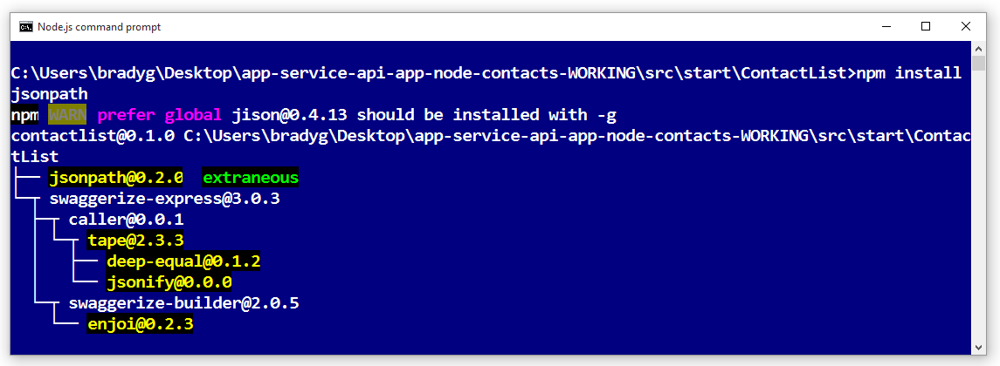
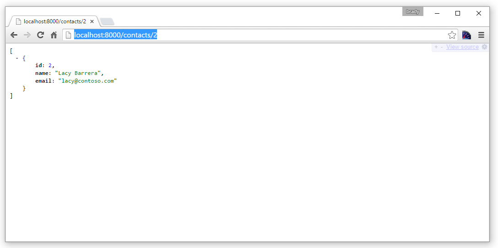
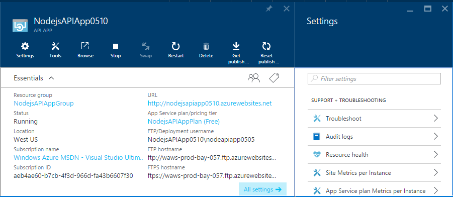
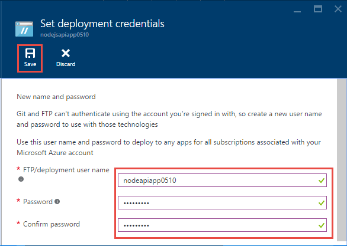
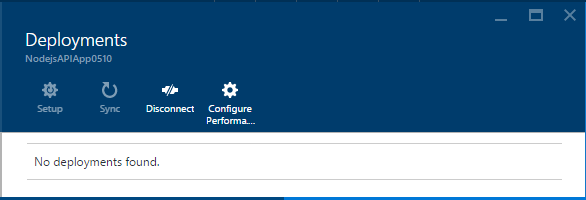
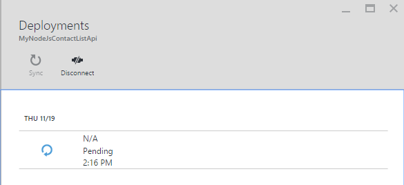

<properties
    pageTitle="App Node API nel servizio App Azure | Microsoft Azure"
    description="Informazioni su come creare un API REST Node e distribuire un'app API in Azure App servizio."
    services="app-service\api"
    documentationCenter="node"
    authors="bradygaster"
    manager="wpickett"
    editor=""/>

<tags
    ms.service="app-service-api"
    ms.workload="web"
    ms.tgt_pltfrm="na"
    ms.devlang="node"
    ms.topic="get-started-article"
    ms.date="05/26/2016"
    ms.author="rachelap"/>

# Creare un API REST Node e distribuire un'app API in Azure

[AZURE.INCLUDE [app-service-api-get-started-selector](../../includes/app-service-api-get-started-selector.md)]

In questa esercitazione viene illustrato come creare un semplice [Node](http://nodejs.org) API e distribuire in un' [app all'API](app-service-api-apps-why-best-platform.md) di [Servizio App Azure](../app-service/app-service-value-prop-what-is.md) tramite [operazioni](http://git-scm.com). È possibile utilizzare qualsiasi sistema operativo che è possibile eseguire Node e verrà eseguire tutte le attività mediante strumenti della riga di comando, ad esempio cmd.exe o bash.

## Prerequisiti

1. Account di Microsoft Azure ([aprire un account di gratuito](https://azure.microsoft.com/pricing/free-trial/))
1. [Node](http://nodejs.org) installato (in questo esempio si presuppone Node versione 4.2.2)
2. [Operazioni](https://git-scm.com/) installato
1. Account [GitHub](https://github.com/)

Servizio App supporta diversi modi per distribuire il codice in un'app di API, questa esercitazione viene illustrato il metodo fra mentre si presuppone che sia knowledge base sull'utilizzo di operazioni. Per informazioni su altri metodi di distribuzione, vedere [distribuire le app al servizio App Azure](../app-service-web/web-sites-deploy.md).

## Ottenere il codice di esempio

1. Aprire un'interfaccia della riga di comando che è possibile eseguire comandi Node e operazioni.

1. Passare a una cartella che è possibile utilizzare per una fra archivio locale e Clona [repository GitHub contenente il codice di esempio](https://github.com/Azure-Samples/app-service-api-node-contact-list).

        git clone https://github.com/Azure-Samples/app-service-api-node-contact-list.git

    L'API di esempio fornisce due punti finali: una richiesta Get per `/contacts` restituisce un elenco di nomi e indirizzi di posta elettronica in formato JSON, mentre `/contacts/{id}` restituisce solo il contatto selezionato.

## Scaffold (genera automaticamente) Node codice basato su metadati Swagger

[Swagger](http://swagger.io/) è un formato di file per i metadati che descrive un API REST. [Supporto per i metadati Swagger](app-service-api-metadata.md)Azure servizio di App. In questa sezione dell'esercitazione modelli API sviluppo flusso di lavoro in cui creare innanzitutto i metadati Swagger e che consente di scaffold (genera automaticamente) codice server per l'API. 

>[AZURE.NOTE] Se non si desidera imparare a scaffold Node codice da un file di metadati Swagger, è possibile ignorare questa sezione. Se si desidera distribuire solo codice di esempio in una nuova app API, passare direttamente alla sezione [creare un'app di API in Azure](#createapiapp) .

### Installare ed eseguire Swaggerize

1. Eseguire i comandi seguenti per installare i moduli NPM **yo** e **swaggerize generatore** globale.

        npm install -g yo
        npm install -g generator-swaggerize

    Swaggerize è uno strumento che genera codice server per un'API descritta da un file di metadati Swagger. Il file Swagger in cui si userà denominato *api.json* e si trova nella cartella *avvio* dell'archivio che è duplicato.

2. Passare alla cartella *avviare* ed eseguire il `yo swaggerize` comando. Swaggerize verranno porre una serie di domande.  Per **gli elementi da chiamare il progetto**, immettere "ContactList", il **percorso di swagger documento**, immettere "api.json" e per **Express soddisfatti, o Restify**, immettere "express".

        yo swaggerize

    
    
    **Nota**: se si verifica un errore in questo passaggio, il passaggio successivo viene spiegato come risolvere il problema.

    Swaggerize Crea cartella di un'applicazione, gestori di strutture e file di configurazione e genera un file **package.json** . Il motore di visualizzazione express viene usato per generare la pagina di Guida Swagger.  

3. Se il `swaggerize` comando ha esito negativo con un errore di "sequenza di escape non valido" o "token imprevisto", correggere la causa dell'errore modificando il file generato *package.json* . Nel `regenerate` a linee in `scripts`, modificare la barra rovesciata che precede *api.json* a una barra, in modo che la riga è simile nell'esempio seguente:

        "regenerate": "yo swaggerize --only=handlers,models,tests --framework express --apiPath config/api.json"

1. Passare alla cartella contenente il codice di supporto temporaneo (in questo caso, la sottocartella */start/ContactList* ).

1. Eseguire `npm install`.
    
        npm install
        
2. Installare il modulo NPM **jsonpath** . 

        npm install --save jsonpath
        
    

1. Installare il modulo NPM **swaggerize dell'interfaccia utente** . 

        npm install --save swaggerize-ui
        
    

### Personalizzare il codice di supporto temporaneo

1. Copiare la cartella di **raccolta** dalla cartella di **avvio** nella cartella **ContactList** autore di scaffolder. 

1. Sostituire il codice nel file **handlers/contacts.js** con il codice seguente. 

    Questo codice utilizza dati JSON archiviati nel file di **lib/contacts.json** rappresentato in **lib/contactRepository.js**. Il nuovo codice contacts.js risponde alle richieste HTTP per recuperare tutti i contatti e li restituiscono come payload JSON. 

        'use strict';
        
        var repository = require('../lib/contactRepository');
        
        module.exports = {
            get: function contacts_get(req, res) {
                res.json(repository.all())
            }
        };

1. Sostituire il codice nel file **handlers/contacts/{id}.js** con il codice fofllowing. 

        'use strict';

        var repository = require('../../lib/contactRepository');
        
        module.exports = {
            get: function contacts_get(req, res) {
                res.json(repository.get(req.params['id']));
            }    
        };

1. Sostituire il codice di **server.js** con il codice riportato di seguito. 

    Le modifiche apportate al file server.js vengono indicate tramite i commenti in modo da visualizzare le modifiche. 

        'use strict';

        var port = process.env.PORT || 8000; // first change

        var http = require('http');
        var express = require('express');
        var bodyParser = require('body-parser');
        var swaggerize = require('swaggerize-express');
        var swaggerUi = require('swaggerize-ui'); // second change
        var path = require('path');

        var app = express();

        var server = http.createServer(app);

        app.use(bodyParser.json());

        app.use(swaggerize({
            api: path.resolve('./config/api.json'), // third change
            handlers: path.resolve('./handlers'),
            docspath: '/swagger' // fourth change
        }));

        // change four
        app.use('/docs', swaggerUi({
          docs: '/swagger'  
        }));

        server.listen(port, function () { // fifth and final change
        });

### Verificare con l'API in esecuzione in locale

1. Attivare il server utilizzando l'eseguibile della riga di comando Node. 

        node server.js

1. Quando si passa a **http://localhost:8000/contatti**, viene visualizzato l'output JSON dell'elenco contatti oppure viene richiesto di scaricare, a seconda del browser. 

    

1. Quando si passa a **http://localhost:8000/contatti/2**, verrà visualizzato il contatto rappresentato dal valore id.

    

1. I dati JSON Swagger siano served tramite **l'endpoint/swagger** :

    

1. L'interfaccia utente Swagger viene fornita tramite l'endpoint **/docs** . Nell'interfaccia utente Swagger è possibile utilizzare la funzionalità di client HTML per testare l'API.

    

## Creare una nuova API App

In questa sezione è utilizzato il portale di Azure per creare una nuova App API in Azure. Questa app API rappresenta le risorse di elaborazione Azure fornirà per eseguire il codice. Nelle sezioni successive verrà di distribuire la nuova app API del codice.

1. Passare al [portale di Azure](https://portal.azure.com/). 

1. Fare clic su **Nuovo > Web + Mobile > App API**. 

    

4. Immettere il **nome dell'App** che sia univoco nel dominio *azurewebsites.net* , ad esempio NodejsAPIApp oltre a un numero per renderlo univoco. 

    Se, ad esempio, il nome è `NodejsAPIApp`, l'URL sarà `nodejsapiapp.azurewebsites.net`.

    Se si immette un nome di un altro utente ha già utilizzato, viene visualizzato un punto esclamativo rosso a destra.

6. Nell'elenco a discesa **Gruppo risorse** fare clic su **Nuovo**e quindi nel **nome del nuovo gruppo risorse** immettere "NodejsAPIAppGroup" o un altro nome se si preferisce. 

    Un [gruppo di risorse](../azure-resource-manager/resource-group-overview.md) è una raccolta di risorse Azure, ad esempio App, database e macchine virtuali di API. Per questa esercitazione, è consigliabile creare un nuovo gruppo di risorse perché che consente di eliminare in un unico passaggio tutte le risorse Azure creati per l'esercitazione facilmente.

4. Fare clic su **Percorso/del piano di servizio di App**e quindi fare clic su **Crea nuovo**.

    

    Nei passaggi seguenti, si crea un piano di servizio App per il nuovo gruppo di risorse. Un piano di servizio App specifica le risorse di elaborazione utilizzabile con l'app API. Ad esempio, se si sceglie il livello gratuito, l'app API viene eseguito in macchine virtuali condivise, mentre per alcuni livelli pagati viene eseguito in macchine virtuali dedicate. Per informazioni sui piani di servizio di App, vedere [Panoramica sul piano di servizio di App](../app-service/azure-web-sites-web-hosting-plans-in-depth-overview.md).

5. In e il **Piano di servizio App** immettere "NodejsAPIAppPlan" o un altro nome se si preferisce.

5. Nella casella **percorso** scegliere la posizione più vicina all'utente.

    Questa impostazione specifica quali Azure Data Center l'app viene eseguito in. Per questa esercitazione, è possibile selezionare le opzioni internazionali e non è possibile fare la differenza più evidente. Ma per un'app di produzione, il server sia il più vicino possibile ai client che esegue l'accesso per limitare la [latenza](http://www.bing.com/search?q=web%20latency%20introduction&qs=n&form=QBRE&pq=web%20latency%20introduction&sc=1-24&sp=-1&sk=&cvid=eefff99dfc864d25a75a83740f1e0090).

5. Fare clic su **livello prezzi > View All > F1 gratuita**.

    Per questa esercitazione, il livello di prezzo gratuito fornirà prestazioni sufficienti.

    

6. In e il **Piano di servizio App** , fare clic su **OK**.

7. In e il **API App** , fare clic su **Crea**.

## Configurare la nuova app API per la distribuzione fra

Si verrà distribuisce il codice all'app API premendo commit in un repository fra in Azure App servizio. In questa sezione dell'esercitazione, creare le credenziali e archivio fra in Azure che verrà utilizzato per la distribuzione.  

1. Dopo l'applicazione API è stata creata, fare clic su **servizi App > {l'app API}** dalla home page del portale. 

    Il portale Visualizza pale **API App** e le **Impostazioni** .

    

1. In e **l'Impostazioni** , scorrere fino alla sezione **pubblicazione** e quindi fare clic su **credenziali di distribuzione**.
 
3. In e **impostare le credenziali di distribuzione** l'immettere un nome utente e la password e quindi fare clic su **Salva**.

    Utilizzare le credenziali per la pubblicazione del codice Node API all'applicazione in uso. 

    

1. In e **l'Impostazioni** , fare clic su **origine distribuzione > Scegli origine > archivio locale fra**, quindi fare clic su **OK**.

    

1. Dopo aver creato l'archivio fra le modifiche blade per visualizzare le distribuzioni attive. Poiché l'archivio è nuovo, non si dispone di alcun distribuzioni attivi nell'elenco. 

    

1. Copiare l'URL di archivio di operazioni. A tale scopo, passare a e il per la nuova API App e consultare la sezione **Nozioni di base** della stessa e. Si noti l' **URL Clona fra** nella sezione **Nozioni di base** . Quando posizionare il puntatore del mouse su questo URL, viene visualizzata un'icona a destra che verrà copiato l'URL negli Appunti. Fare clic su questa icona per copiare l'URL.

    

    **Nota**: È necessario Clona fra URL nella sezione successiva dunque, verificare di salvarlo in un punto qualsiasi per il momento.

Dopo aver creato un'App API con un repository fra eseguirne il backup, si può inserire codice nel repository per distribuire il codice per app API. 

## Distribuire il codice API Azure

In questa sezione si crea un repository fra locale che contiene il codice server per l'API e si inserisce il codice da tale archivio all'archivio in Azure creata in precedenza.

1. Copia il `ContactList` cartella in un percorso che è possibile utilizzare per un nuovo repository fra locale. Se viene eseguita la prima parte dell'esercitazione, copiare `ContactList` dalla `start` cartella. in caso contrario, copiare `ContactList` dalla `end` cartella.

1. Nello strumento di riga di comando, passare alla nuova cartella, quindi eseguire il seguente comando per creare un nuovo repository fra locale. 

        git init

     

1. Eseguire il comando seguente per aggiungere un fra remota per repository dell'app API. 

        git remote add azure YOUR_GIT_CLONE_URL_HERE

    **Nota**: sostituire la stringa "YOUR_GIT_CLONE_URL_HERE" con il proprio URL Clona fra copiato in precedenza. 

1. Eseguire i comandi seguenti per creare un commit contenente tutto il codice. 

        git add .
        git commit -m "initial revision"

    

1. Eseguire il comando per inserire il codice in Azure. Quando viene richiesto di immettere una password, immettere quello che è stato creato in precedenza nel portale di Azure.

        git push azure master

    In questo modo viene attivata una distribuzione API all'applicazione in uso.  

1. Nel browser, tornare alla e **distribuzioni** per l'app API e viene visualizzato che la distribuzione è in corso. 

    

    Contemporaneamente, interfaccia della riga di comando indica lo stato della distribuzione in corso. 

    

    Una volta completata la distribuzione, e il **distribuzioni** riflette la corretta distribuzione le modifiche all'API App. 

## Verificare con l'API in esecuzione in Azure
 
3. Copiare l' **URL** nella sezione **Nozioni di base** della stessa e API App. 

    

1. Usare un client API REST, ad esempio Postman o Fiddler (o il web browser) specificare l'URL dei contatti chiamata API, ossia il `/contacts` endpoint dell'app API. L'URL sarà`https://{your API app name}.azurewebsites.net/contacts`

    Quando si invia una richiesta GET all'endpoint, viene visualizzato l'output JSON dell'app API.

    

2. In un browser, individuare il `/docs` endpoint per provare l'interfaccia utente Swagger durante l'esecuzione in Azure.

Dopo aver creato recapito continuo raggruppato, è possibile apportare modifiche al codice e distribuirle in Azure premendo commit per l'archivio fra Azure.

## Passaggi successivi

A questo punto viene eseguito correttamente al creata un'App API e distribuito codice API Node. Nell'esercitazione successiva viene illustrato come [utilizzare App API dai client JavaScript, utilizzando CORS](app-service-api-cors-consume-javascript.md).
