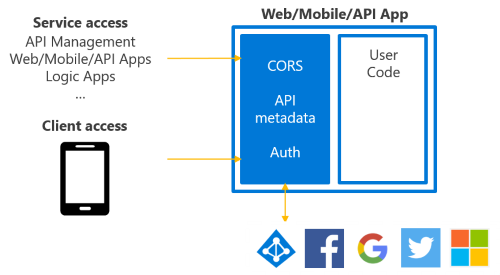

<properties
    pageTitle="App API del servizio App - novità | Microsoft Azure"
    description="Informazioni su quali sono le novità per le applicazioni di API in Azure App servizio."
    services="app-service\api"
    documentationCenter=".net"
    authors="mohitsriv"
    manager="wpickett"
    editor="tdykstra"/>

<tags
    ms.service="app-service-api"
    ms.workload="na"
    ms.tgt_pltfrm="na"
    ms.devlang="na"
    ms.topic="article"
    ms.date="06/29/2016"
    ms.author="rachelap"/>

# App API del servizio App - novità

In corrispondenza dell'evento Connect () in novembre 2015, numerosi miglioramenti al servizio di Azure App sono stati [annunciato](https://azure.microsoft.com/blog/azure-app-service-updates-november-2015/). Questi miglioramenti includono sottostante le modifiche alle API App meglio allineare con Mobile e Web Apps, ridurre il numero di concetto e migliorare le prestazioni di runtime e distribuzione. Avviare il 30 novembre 2015 nuove API App creato tramite il portale di gestione Azure o utensili ultimo rifletteranno le modifiche. Questo articolo descrive queste modifiche, nonché come ridistribuire App esistente per sfruttare le funzionalità.

## Modifiche delle caratteristiche
Caratteristiche chiave di App API – l'autenticazione, metadati CORS e API – sono state spostate direttamente nel servizio di App. Con questa modifica, le caratteristiche sono disponibili in Web, mobili e le API app. Infatti, tutti e tre condividano lo stesso tipo di risorsa **Microsoft.Web/sites** in Gestione risorse. Il gateway API App non è più necessaria o offerti con API app. Questo anche rende più semplice da utilizzare Azure API Management poiché appena il gateway di gestione dell'API singolo.

Un principio chiave della progettazione con l'aggiornamento di applicazioni API è che consentono di visualizzare l'API come, nella lingua scelta.  Se l'API è già distribuito come Web App o App Mobile, non è necessario ridistribuire le app per sfruttare le nuove caratteristiche. Se si è attualmente Preview App API, Guida alla migrazione è descritto di seguito.

### Autenticazione
Le caratteristiche di autenticazione Apps API, servizi/App Mobile e Web Apps pronte all'uso esistente sono state unificate e sono disponibili in un singolo blade autenticazione servizio App Azure nel portale di gestione. Per un'introduzione ai servizi di autenticazione nel servizio di App, vedere [espansione App autenticazione / autorizzazione](https://azure.microsoft.com/blog/announcing-app-service-authentication-authorization/).

Per gli scenari di API, sono disponibili numerose nuove funzionalità pertinenti:

- **Supporto per l'uso di Azure direttamente Active Directory**, senza dover exchange token AAD per un token di sessione il codice client: il client può includere solo i token AAD nell'intestazione autorizzazione secondo le specifiche di token del titolare. Questo significa anche SDK non specifico di applicazione del servizio è necessario sul lato client o del server. 
- **Accesso "Interno" o al servizio**: se si dispone di un processo daemon o un altro client la necessità di accedere alle API senza un'interfaccia, è possibile richiedere un token di un capitale di servizio AAD e passare al servizio di App per l'autenticazione con l'applicazione.
- **Autorizzazione rinviata**: molte applicazioni presentano restrizioni di accesso diversi per le diverse parti dell'applicazione. Si supponga di alcune API per essere accessibili, mentre altri richiedono accesso. La caratteristica di autenticazione/autorizzazione originale è stato radicale, con l'intero sito che richiede l'accesso. Questa opzione è ancora disponibile, ma in alternativa è possibile consentire il codice dell'applicazione per il rendering delle decisioni di accesso dopo servizio App ha autenticato l'utente.
 
Per ulteriori informazioni sulle nuove caratteristiche di autenticazione, vedere [l'autenticazione e l'autorizzazione per le applicazioni di API in Azure App servizio](app-service-api-authentication.md). Per informazioni su come eseguire la migrazione di applicazioni API esistenti dal modello di App API precedente a quello nuovo, vedere [migrazione esistente API App](#migrating-existing-api-apps) più avanti in questo articolo.
 
### CORS
Invece di un'impostazione di app **MS_CrossDomainOrigins** delimitato da virgola, è ora disponibile una pala nel portale di gestione Azure per la configurazione CORS. In alternativa, può essere configurato Gestione risorse utensili, ad esempio PowerShell di Azure, CLI o [Esplora risorse](https://resources.azure.com/). La proprietà **cors** viene impostata sul tipo di risorsa **Microsoft.Web/sites/config** per il ** &lt;nome sito&gt;/web** delle risorse. Per esempio:

    {
        "cors": {
            "allowedOrigins": [
                "https://localhost:44300"
            ]
        }
    } 

### API dei metadati
E il definizione API è ora disponibile in Web, mobili e le API app. Nel portale di gestione, è possibile specificare un url relativo o un url assoluto che punta a un endpoint tale rappresentazione hosts un 2.0 Swagger dell'API. In alternativa, può essere configurato con gli strumenti di gestione risorse. La proprietà **apiDefinition** viene impostata sul tipo di risorsa **Microsoft.Web/sites/config** per il ** &lt;nome sito&gt;/web** delle risorse. Per esempio:

    {
        "apiDefinition":
        {
            "url": "https://myStorageAccount.blob.core.windows.net/swagger/apiDefinition.json"
        }
    }

In questa fase, l'endpoint metadati deve essere accessibile al pubblico senza l'autenticazione per molti client downstream (generazione di client, ad esempio Visual Studio API REST e flusso PowerApps "Aggiungi API") per utilizzarlo. Le implicazioni che se si utilizza l'autenticazione del servizio di App e si desidera esporre la definizione di API dall'app stesso, sarà necessario utilizzare l'opzione autenticazione posticipato descritto in precedenza in modo che la distribuzione per i metadati Swagger pubblica.

## Portale di gestione
Selezione di **Nuovo > Web + Mobile > API App** nel portale creerà App API che riflettono le nuove funzionalità descritte in questo articolo. **Sfoglia > App API** verranno visualizzati solo queste nuove app API. Dopo la visualizzazione in un'app di API, e il condivide lo stesso layout e le funzionalità di quelli di Web e App Mobile. Solo le differenze sono contenuti Guida introduttiva e ordinamento delle impostazioni.

App API esistente (o App Marketplace API creati da app logica) con l'anteprima precedente funzionalità saranno visibili nella finestra di progettazione logica App e durante l'esplorazione tutte le risorse in un gruppo di risorse.

## Visual Studio

La maggior parte delle applicazioni Web utensili funzionerà con nuove app API dal momento che condividono lo stesso tipo di risorsa **Microsoft.Web/sites** sottostante. Azure Visual Studio utensili, tuttavia, dovrebbe essere aggiornato alla versione 2.8.1 o versione successiva in quanto vengono esposti un numero di funzionalità specifiche alle API. Scaricare il SDK dalla [pagina Download Azure](https://azure.microsoft.com/downloads/).

Con razionalizzazione dei tipi di servizio di App, pubblicare anche unificata in **pubblica > servizio di Microsoft Azure App**:

Per ulteriori informazioni sul SDK 2.8.1, leggere l' annuncio [post di blog](https://azure.microsoft.com/blog/announcing-azure-sdk-2-8-1-for-net/).

In alternativa, è possibile importare manualmente il profilo di pubblicazione dal portale di gestione per abilitare pubblica. Tuttavia, API app selezione/creazione, la generazione del codice e Cloud Explorer sarà necessario SDK 2.8.1 o versione successiva.

## Migrazione App API esistente
Se l'API personalizzato viene distribuito per la versione di anteprima precedente dell'API App, si richiedere di eseguire la migrazione nel nuovo modello per le applicazioni di API entro il 31 dicembre 2015. Poiché sia il modello vecchio e nuovo è basato su API Web ospitato nel servizio di App, la maggior parte del codice esistente può essere riutilizzata.

### Hosting e la ridistribuzione
La procedura per la ridistribuzione è diverso da quello di distribuzione di qualsiasi API Web esistente al servizio di App. Procedura:

1. Creare un'app API vuota. A tale scopo nel portale con nuovo > App API, in Visual Studio pubblica oppure utensili Manager delle risorse. Se si utilizza utensili Manager delle risorse o modelli, impostare il valore di **tipo** **all'api** il tipo di risorsa **Microsoft.Web/sites** disporre le guide rapide e impostazioni nel portale di gestione orientato verso scenari API.
2. Connettere e distribuire il progetto all'app API vuota utilizzando uno dei meccanismi di distribuzione supportati dal servizio di App. Leggere la [documentazione relativa alla distribuzione di Azure App servizio](../app-service-web/web-sites-deploy.md) per altre informazioni. 
  
### Autenticazione
I servizi di autenticazione servizio App supportano le stesse funzionalità disponibili con il modello di App API precedente. Se si usano i token di sessione e richiedere SDK, utilizzare le seguenti SDK client e server:

- Client: [Client Mobile Azure SDK](http://www.nuget.org/packages/Microsoft.Azure.Mobile.Client/)
- Server: [estensione Microsoft Azure per l'autenticazione di .NET App per dispositivi mobili](http://www.nuget.org/packages/Microsoft.Azure.Mobile.Server.Authentication/) 

Se invece si utilizzava alfa dell'App servizio SDK, questi vengono obsoleta:

- Client: [Microsoft Azure AppService SDK](http://www.nuget.org/packages/Microsoft.Azure.AppService)
- Server: [Microsoft.Azure.AppService.ApiApps.Service](http://www.nuget.org/packages/Microsoft.Azure.AppService.ApiApps.Service)

In particolare con Azure Active Directory, tuttavia, non specifico del servizio di App è necessario se si utilizza il token AAD direttamente.

### Accesso interno
Il modello di App API precedente incluso un livello di accesso interno incorporato. Utilizzo di SDK questo necessaria per le richieste di accesso. Come descritto in precedenza, con il nuovo modello di App API identità di servizio AAD utilizzabile come alternativa per l'autenticazione al servizio senza un'App specifica del servizio SDK. Informazioni su altre in [servizi di autenticazione principale per le applicazioni di API in Azure App servizio](app-service-api-dotnet-service-principal-auth.md).

### Individuazione
Il modello di App API precedente era API per il rilevamento delle altre App API in fase di esecuzione nello stesso gruppo di risorse dietro il gateway stesso. Questa operazione è particolarmente utile nelle architetture che implementano microservice modelli. Quando questa non è supportata direttamente, è disponibili diverse opzioni:

1. Utilizzare l'API di Azure Manager delle risorse per l'individuazione.
2. Inserire Azure API Management che precede l'API App servizio ospitato. Gestione API Azure funge facciata e possibile specificare un url di esposto esterni stabile anche se cambia topologia interno.
3. Creare applicazioni API individuazione e di avere altre App API registrare con l'app di individuazione all'avvio.
4. In fase di distribuzione inserire le impostazioni di app di tutte le app API (e client) con i punti finali di altre app di API. Questo è valido nelle distribuzioni di modello e dall'App API ora consentono di controllo dell'url.

## Usare le app di API con logica App

Il nuovo modello di App API funziona bene con [Logica App versione dello schema 2015-08-01](../app-service-logic/app-service-logic-schema-2015-08-01.md).

## Passaggi successivi

Per ulteriori informazioni, leggere gli articoli della [sezione API App documentazione](https://azure.microsoft.com/documentation/services/app-service/api/). Sono stati aggiornati per rispecchiare il nuovo modello per le applicazioni di API. Inoltre, la comunicazione nei forum per aggiungere ulteriori dettagli o indicazioni sulla migrazione:

- [Forum MSDN](https://social.msdn.microsoft.com/Forums/en-US/home?forum=AzureAPIApps)
- [Overflow dello stack](http://stackoverflow.com/questions/tagged/azure-api-apps)
