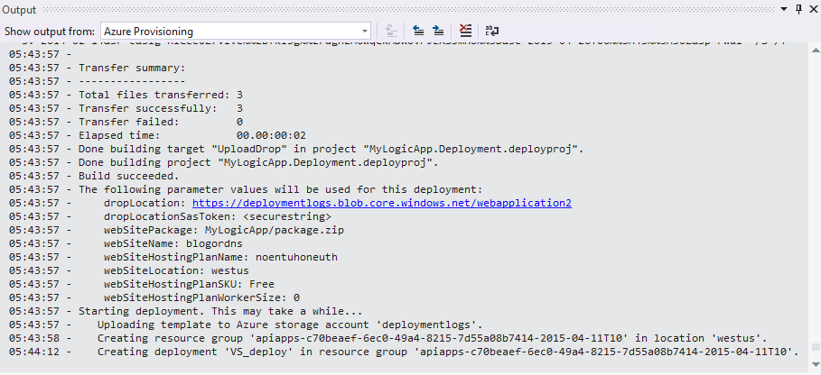

<properties 
    pageTitle="Creazione di applicazioni logica in Visual Studio | Microsoft Azure" 
    description="Creare un progetto in Visual Studio per creare e distribuire la logica app." 
    authors="jeffhollan" 
    manager="erikre" 
    editor="" 
    services="logic-apps" 
    documentationCenter=""/>

<tags
    ms.service="logic-apps"
    ms.workload="integration"
    ms.tgt_pltfrm="na"
    ms.devlang="na"
    ms.topic="article"
    ms.date="10/18/2016"
    ms.author="jehollan"/> 
    
# Compilare e distribuire le applicazioni di logica in Visual Studio

Anche se il [Portale di Azure](https://portal.azure.com/) offre un'ottima soluzione per progettare e gestire le app logica, è consigliabile anche progettare e implementare l'app logica da Visual Studio invece.  Logica App viene fornito con un RTF Visual Studio set di strumenti che consente di creare un'app di logica utilizzando la finestra di progettazione, configurare i modelli di distribuzione e automazione e distribuire in qualsiasi ambiente.  

## Procedura di installazione

Di seguito sono i passaggi per installare e configurare gli strumenti di Visual Studio per le applicazioni di logica.

### Prerequisiti

- [Visual Studio 2015](https://www.visualstudio.com/downloads/download-visual-studio-vs.aspx)
- [Versione più recente SDK Azure](https://azure.microsoft.com/downloads/) (2.9.1 o versione successiva)
- [PowerShell azure] (https://github.com/Azure/azure-powershell#installation)
- Accesso al web quando si usa la finestra di progettazione incorporato

### Installare gli strumenti di Visual Studio per le applicazioni di logica

Dopo avere i prerequisiti installati 

1. Aprire Visual Studio 2015 dal menu **Strumenti** e selezionare **le estensioni e aggiornamenti**
1. Selezionare la categoria **Online** la ricerca in linea
1. Cercare **App logica** visualizzare **Azure logica App Tools per Visual Studio**
1. Fare clic sul pulsante **Scarica** per scaricare e installare l'estensione
1. Riavviare Visual Studio dopo l'installazione

> [AZURE.NOTE] È inoltre possibile scaricare l'estensione direttamente da [questo collegamento](https://visualstudiogallery.msdn.microsoft.com/e25ad307-46cf-412e-8ba5-5b555d53d2d9)

Dopo l'installazione sarà possibile utilizzare il progetto di gruppo di risorse Azure con la finestra di progettazione di logica di App.

## Creare un progetto

1. Passare al menu **File** e selezionare **Nuovo** >  **progetto** (o, è possibile passare ad **Aggiungi** e quindi selezionare **Nuovo progetto** da aggiungere a una soluzione esistente):  

1. Nella finestra di dialogo Trova **Cloud**e quindi selezionare **Il gruppo di risorse di Azure**. Digitare un **nome** e quindi fare clic su **OK**.
    

1. Selezionare il modello di **app logica** . Per creare un modello di distribuzione app logica vuota per iniziare.
    

1. Dopo aver selezionato il **modello**, scegliere **OK**.

    A questo punto il progetto di app logica viene aggiunta alla soluzione. Verrà visualizzato il file di distribuzione in Esplora soluzioni:  

    

## Utilizzo di progettazione di App logica

Dopo avere inserito un progetto di gruppo di risorse Azure che contiene un'app di logica, è possibile aprire la finestra di progettazione in Visual Studio per semplificare la creazione del flusso di lavoro.  Finestra di progettazione richiede una connessione a internet per i connettori per le proprietà disponibili e i dati della query (ad esempio, se utilizzando il connettore Dynamics CRM Online, finestra di progettazione esegue una query l'istanza CRM per elencare le proprietà predefinite e personalizzati disponibili).

1. Fare clic sul `<template>.json` file e selezionare **Apri con logica App Designer** (o `Ctrl+L`)
1. Scegliere l'abbonamento, gruppo di risorse e il percorso per il modello di distribuzione
    - È importante tenere presente che la progettazione di un'app logica creerà le risorse di **Connessione dell'API** per eseguire una query per le proprietà in fase di progettazione.  Gruppo di risorse selezionato sarà il gruppo di risorse utilizzato per creare le connessioni in fase di progettazione.  È possibile visualizzare o modificare tutte le connessioni API passando al portale di Azure e esplorazione per **Le connessioni API**.
    
1. Finestra di progettazione deve eseguire il rendering in base alla definizione nel `<template>.json` file.
1. È ora possibile creare e progettare l'app logica e le modifiche apportate avranno nel modello di distribuzione.
    

Verrà anche visualizzato `Microsoft.Web/connections` risorse da aggiungere al file di risorse per tutte le connessioni necessarie per l'app logica alla funzione.  Queste proprietà di connessione possono essere impostate quando si distribuisce e gestite dopo la distribuzione di **Connessioni API** nel portale di Azure.

### Passare alla visualizzazione codice JSON

È possibile selezionare la scheda **Visualizzazione codice** nella parte inferiore della finestra di progettazione per passare alla rappresentazione JSON dell'app logica.  Per tornare alla risorsa completo JSON, rapida la `<template>.json` file e selezionare **Apri**.

### Salvare l'app logica

È possibile salvare l'app logica in qualsiasi momento tramite il pulsante **Salva** o `Ctrl+S`.  Se sono presenti errori con l'app logica al momento del che salvataggio, verrà visualizzato nella finestra di **output** di Visual Studio.

## Distribuzione di un'applicazione di logica

Infine, dopo aver configurato l'app, è possibile distribuire direttamente da Visual Studio in pochi passaggi. 

1. Pulsante destro del mouse sul progetto in Esplora soluzioni e passare alla **distribuzione** > **Nuova distribuzione...** 
     

2. Viene chiesto di accedere alle sottoscrizioni Azure. 

3. A questo punto è necessario scegliere i dettagli del gruppo di risorse che si desidera distribuire app logica a. 
    

     > [AZURE.NOTE]    Assicurarsi di selezionare i file di modello e parametri destro del gruppo di risorse (ad esempio se si distribuisce in un ambiente di produzione desiderato selezionare il file di parametri di produzione). 
4. Selezionare il pulsante di distribuzione
 
    
6. Lo stato della distribuzione viene visualizzato nella finestra di **Output** (potrebbe essere necessario scegliere **Il Provisioning di Azure**. 
    

In futuro, è possibile modificare l'app di logica di controllo di origine e utilizzare Visual Studio per distribuire nuove versioni. 

> [AZURE.NOTE] Se si modifica la definizione nel portale di Azure direttamente, verrà sovrascritti la volta successiva che si distribuiscono da Visual Studio queste modifiche.

## Passaggi successivi

- Per iniziare a utilizzare App logica, seguire l'esercitazione [creare un'App di logica](app-service-logic-create-a-logic-app.md) .  
- [Visualizzare esempi e scenari comuni](app-service-logic-examples-and-scenarios.md)
- [È possibile automatizzare processi aziendali con logica di App](http://channel9.msdn.com/Events/Build/2016/T694) 
- [Informazioni su come integrare i sistemi con logica di App](http://channel9.msdn.com/Events/Build/2016/P462)