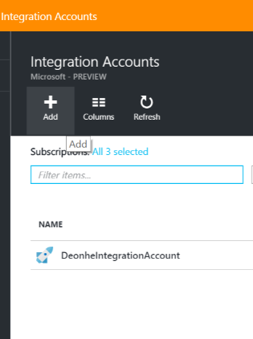

<properties 
    pageTitle="Panoramica dell'integrazione account e il Language Pack integrazione Enterprise | Servizio di Microsoft Azure App | Microsoft Azure" 
    description="Informazioni su tutte informazioni sugli account di integrazione Enterprise Integration Pack e App logica" 
    services="logic-apps" 
    documentationCenter=".net,nodejs,java"
    authors="msftman" 
    manager="erikre" 
    editor="cgronlun"/>

<tags 
    ms.service="logic-apps" 
    ms.workload="integration" 
    ms.tgt_pltfrm="na" 
    ms.devlang="na" 
    ms.topic="article" 
    ms.date="07/08/2016" 
    ms.author="deonhe"/>

# Panoramica degli account di integrazione

## Che cos'è un account di integrazione?
Un account di integrazione è un account Azure che consente l'integrazione di Enterprise App gestire gli elementi inclusi schemi, mappe, i certificati, partner e contratti. Si crea un'app qualsiasi integrazione sarà necessario usare un account di integrazione per accedere a uno schema, mappa o certificato, ad esempio.

## Creare un account di integrazione 
1. Selezionare **Sfoglia**   
  
2. Immettere **l'integrazione** nella casella filtro di ricerca e selezionare **Account integrazione** dall'elenco dei risultati     
   
3. Selezionare il pulsante *Aggiungi* dal menu nella parte superiore della pagina      
  
4. Immettere il **nome**, selezionare l' **abbonamento** che si desidera utilizzare, creare un nuovo **gruppo di risorse** o selezionare un gruppo di risorse esistente, quindi selezionare un **percorso** in cui l'account di integrazione verrà ospitata, selezionare un **livello di prezzo**e quindi selezionare il pulsante **Crea** .   

  A questo punto l'account di integrazione con cui eseguire il provisioning nella posizione selezionata. Verrà così completata entro 1 minuto.    
  
5. Aggiornare la pagina. Verrà visualizzato il nuovo account di integrazione elencati. Congratulazioni!  
 

## Come collegare un account di integrazione a un'app di logica
Affinché le app di logica accedere alle mappe, schemi, contratti e altri elementi che si trovano nell'account integrazione, è innanzitutto necessario collegare l'account di integrazione logica all'applicazione in uso.

### Ecco i passaggi per collegare un account di integrazione a un'app di logica 

#### Prerequisiti
- Un account di integrazione
- Un'app di logica

>[AZURE.NOTE]Assicurarsi che l'account di integrazione e la logica app siano nella **stessa posizione Azure** prima di iniziare

1. Selezionare il collegamento **Impostazioni** dal menu dell'app logica  
   
2. Selezionare l'elemento **Integrazione Account** e l'impostazioni  
   
3. Selezionare l'account di integrazione che si desidera creare un collegamento a logica casella di riepilogo a discesa app da **Selezionare un account di integrazione**  
   
4. Salvare il lavoro  
   
5. Verrà visualizzata una notifica che indica che l'account di integrazione è stata collegata all'app logica e che tutti gli elementi nell'account integrazione sono ora disponibili per l'app logica.  
   

Ora che l'account di integrazione è collegato all'app logica, è possibile passare all'app logica e utilizzare i connettori B2B, ad esempio la convalida XML, file Flat codificare/decodificare o trasformazione per creare le app con caratteristiche B2B.  
    
## Come è possibile eliminare un account di integrazione?
1. Selezionare **Sfoglia**  
    
2. Immettere **l'integrazione** nella casella filtro di ricerca e selezionare **Account integrazione** dall'elenco dei risultati     
   
3. Selezionare l' **account di integrazione** che si desidera eliminare  
  
4. Selezionare il collegamento **eliminare** si trova nel menu   
  
5. Confermare la scelta    

## Come spostare un account di integrazione?
È possibile spostare un account di integrazione con facilità a un nuovo abbonamento e un nuovo gruppo di risorse. Se è necessario spostare l'account di integrazione, procedere come segue:

>[AZURE.IMPORTANT] È necessario aggiornare tutti gli script per utilizzare la nuova risorsa ID dopo lo spostamento di un account di integrazione.

1. Selezionare **Sfoglia**  
    
2. Immettere **l'integrazione** nella casella filtro di ricerca e selezionare **Account integrazione** dall'elenco dei risultati     
   
3. Selezionare l' **account di integrazione** che si desidera eliminare  
  
4. Selezionare il collegamento di **spostamento** che si trova nel menu   
  
5. Confermare la scelta    

## Passaggi successivi
- [Altre informazioni sull'organizzazione Integration Pack] (./app-service-logic-enterprise-integration-overview.md "Informazioni sui Service Pack integrazione Enterprise")  
- [Ulteriori informazioni sui contratti] (./app-service-logic-enterprise-integration-agreements.md "Informazioni sui contratti di integrazione enterprise")  

 