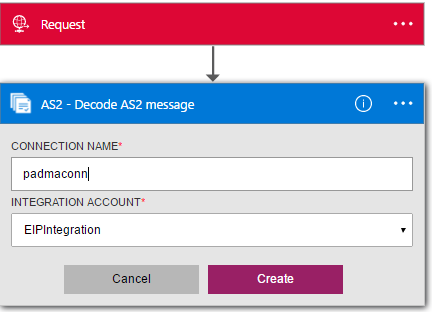
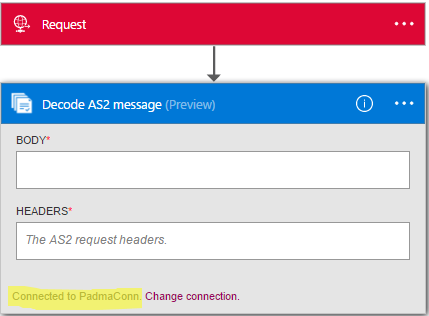

<properties 
    pageTitle="Informazioni sulle Enterprise Integration Pack decodificare AS2 messaggio Connctor | Servizio di Microsoft Azure App | Microsoft Azure" 
    description="Informazioni su come usare i partner con le app Enterprise Integration Pack e logica" 
    services="logic-apps" 
    documentationCenter=".net,nodejs,java"
    authors="padmavc" 
    manager="erikre" 
    editor=""/>

<tags 
    ms.service="logic-apps" 
    ms.workload="integration" 
    ms.tgt_pltfrm="na" 
    ms.devlang="na" 
    ms.topic="article" 
    ms.date="08/15/2016" 
    ms.author="padmavc"/>

# Guida introduttiva a decodificare AS2 messaggio

Connettersi a decodificare AS2 messaggio per stabilire l'affidabilità e protezione durante la trasmissione dei messaggi. Fornisce la firma digitale, decrittografia e riconoscimenti tramite messaggio dell'eliminazione delle notifiche (MDN).

## Creare la connessione

### Prerequisiti

* Un account Azure; è possibile creare un [account gratuito](https://azure.microsoft.com/free)

* Per utilizzare il connettore messaggio decodificare AS2 è necessario un Account di integrazione. Visualizzare i dettagli su come creare un [Account di integrazione](./app-service-logic-enterprise-integration-create-integration-account.md), [partner](./app-service-logic-enterprise-integration-partners.md) e un [contratto AS2](./app-service-logic-enterprise-integration-as2.md)

### Connettersi a decodificare AS2 messaggio procedendo come segue:

1. [Creare un'App logica](./app-service-logic-create-a-logic-app.md) viene fornito un esempio.

2. Il connettore non dispone di tutti i trigger. Usare altri trigger per avviare l'applicazione di logica, ad esempio un trigger di richiesta.  Nella finestra di progettazione logica App, aggiungere un trigger e aggiungere un'azione.  Selezionare Mostra Microsoft API gestite nell'elenco a discesa dell'elenco e quindi immettere "AS2" nella casella di ricerca.  AS2: consente di decodificare AS2 messaggio

    

3. Se è stata creata in precedenza tutte le connessioni all'integrazione di Account, verrà richiesto per i dettagli della connessione

    

4. Immettere i dettagli di integrazione Account.  Proprietà con un asterisco sono necessari

  	| Proprietà   | Dettagli |
  	| --------   | ------- |
  	| Nome della connessione *    | Immettere un nome per la connessione |
  	| Integrazione Account * | Immettere il nome dell'Account di integrazione. Assicurarsi che l'Account di integrazione e la logica app siano nella stessa posizione Azure |

    Una volta completato, dettagli relativi alla connessione un aspetto simile al seguente

    

5. Selezionare **Crea**
    
6. Si noti che la connessione è stata creata.  A questo punto, procedere con gli altri passaggi nell'App logica

     

7. Selezionare le intestazioni e corpo dall'output di richiesta

     

## Il AS2 decodificare esegue le operazioni seguenti

* Elabora intestazioni AS2/HTTP
* Verifica la firma (se configurati)
* Decrittografa i messaggi (se configurati)
* Decompresso il messaggio (se configurati)
* Riconcilia un MDN ricevuto con il messaggio in uscita originale
* Aggiorna e mette in correlazione i record del database non ripudio
* Scrive record per i report di stato AS2
* Il contenuto di payload output è codificato base 64
* Determina se un MDN è necessaria, se la MDN dovrebbe essere icona del o asincrono in base alla configurazione nel contratto AS2
* Genera un MDN icona del o asincrono (in base a configurazioni contratto)
* Imposta le proprietà e i token di correlazione sul MDN

##Provare per se stessi

Perché non Provatelo adesso. Fare clic [qui](https://azure.microsoft.com/documentation/templates/201-logic-app-as2-send-receive/) per distribuire un'app di logica pienamente operativo del proprio usando le caratteristiche di logica App AS2 

## Passaggi successivi

[Altre informazioni sull'organizzazione Integration Pack] (./app-service-logic-enterprise-integration-overview.md "Informazioni sui Service Pack integrazione Enterprise") 