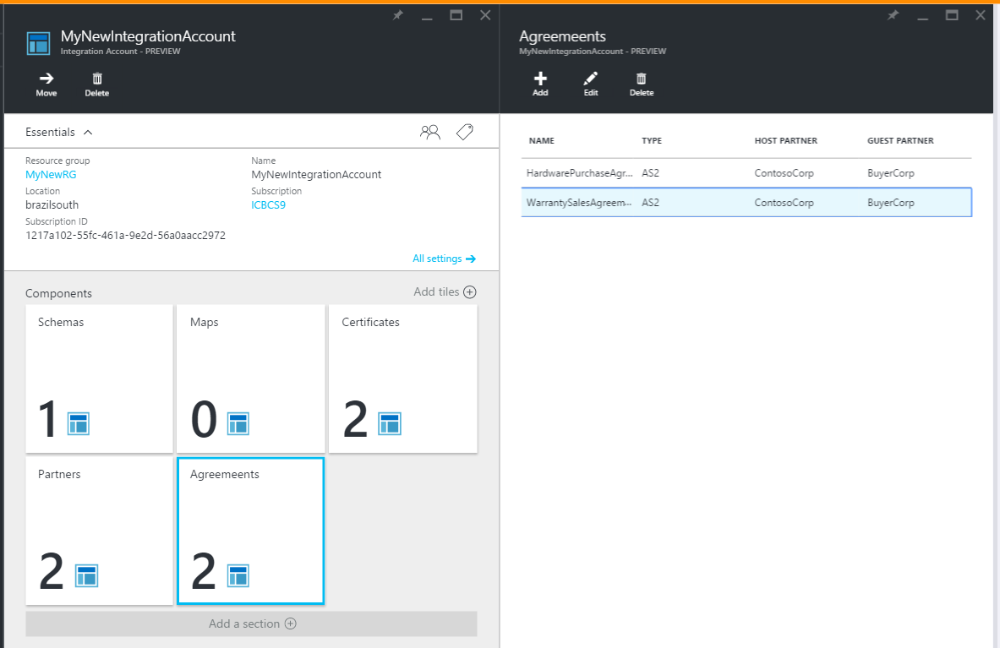

<properties 
    pageTitle="Informazioni su come creare un contratto AS2 per il pacchetto di integrazione Enterprise" 
    description="Informazioni su come creare un contratto AS2 per il pacchetto di integrazione Enterprise | Servizio di Microsoft Azure App" 
    services="logic-apps" 
    documentationCenter=".net,nodejs,java"
    authors="msftman" 
    manager="erikre" 
    editor="cgronlun"/>

<tags 
    ms.service="logic-apps" 
    ms.workload="integration" 
    ms.tgt_pltfrm="na" 
    ms.devlang="na" 
    ms.topic="article" 
    ms.date="06/29/2016" 
    ms.author="deonhe"/>

# Integrazione di Enterprise con AS2

## Creare un contratto AS2
Per usare le funzionalità dell'organizzazione in logica App, è necessario prima creare contratti. 

### Ecco cosa occorre prima di iniziare
- Un [account di integrazione](./app-service-logic-enterprise-integration-accounts.md) definito nell'abbonamento Azure  
- Almeno due [partner](./app-service-logic-enterprise-integration-partners.md) già definiti nell'account di integrazione  

>[AZURE.NOTE]Quando si crea un contratto, il contenuto nel file di contratto deve corrispondere al tipo di contratto.    

Dopo aver [creato un account di integrazione](./app-service-logic-enterprise-integration-accounts.md) e [aggiunto partner](./app-service-logic-enterprise-integration-partners.md), è possibile creare un contratto procedendo come segue:  

### Nella home page del portale Azure

Dopo aver eseguito l'accesso al [portale di Azure](http://portal.azure.com "Azure portale"):  
1. Selezionare **Sfoglia** dal menu a sinistra.  

>[AZURE.TIP]Se non è visibile il collegamento **Sfoglia** , potrebbe essere necessario espandere il menu prima di tutto. Eseguire questa operazione, fare clic sul collegamento **Mostra menu** che si trova in alto a sinistra del menu di scelta compresso.  

    
2. Digitare *l'integrazione* nella casella di ricerca di filtro, quindi selezionare **Gli account di integrazione** dall'elenco dei risultati.       
   
3. In e il **Account integrazione** aperta, selezionare l'account di integrazione che consente di creare il contratto. Se non viene visualizzato l'account di qualsiasi integrazione elenchi, [crearne uno prima](./app-service-logic-enterprise-integration-accounts.md "All about integration accounts").  
  
4.  Selezionare il riquadro **contratti** . Se non viene visualizzato il riquadro accordi aggiungerla prima.   
   
5. Selezionare il pulsante **Aggiungi** nella e accordi visualizzata.  
  
6. Immettere un **nome** per il contratto, quindi selezionare il **Partner Host** **Identità Host**, **Partner Guest**, **Guest identità**e l'accordi che verrà visualizzato.  
  

Ecco alcuni dettagli che possono risultare utili quando si configura le impostazioni per il contratto: 
  
|Proprietà|Descrizione|
|----|----|
|Host Partner|Un contratto deve partner host e guest. Partner host rappresenta l'organizzazione che la configurazione del contratto.|
|Identità host|Un identificatore per il partner host. |
|Partner guest|Un contratto deve partner host e guest. Partner guest rappresenta l'organizzazione di cui si intrattengono rapporti commerciali partner host.|
|Identità guest|Un identificatore per il partner guest.|
|Impostazioni di ricezione|Queste proprietà si applicano a tutti i messaggi ricevuti da un contratto|
|Le impostazioni di invio|Queste proprietà si applicano a tutti i messaggi inviati da un contratto|  
Continuare:  
7. Selezionare **Impostazioni di ricezione** per configurare come messaggi ricevuti tramite questo contratto devono essere gestiti.  
 
 - Facoltativamente, è possibile ignorare le proprietà nel messaggio di posta in arrivo. A tale scopo, selezionare la casella di controllo **Ignora le proprietà del messaggio** .
  - Selezionare la casella di controllo **messaggio deve essere firmato** in modo da richiedere tutti i messaggi in arrivo da firmare. Se si seleziona questa opzione, è anche necessario selezionare il **certificato** che verrà utilizzato per convalidare la firma ai messaggi.
  - Facoltativamente, è possibile richiedere messaggi crittografati anche. A tale scopo, selezionare la casella di controllo **messaggio deve essere crittografato** . Sarà quindi necessario selezionare il **certificato** che verrà utilizzato per decodificare i messaggi in arrivo.
  - È anche possibile richiedere messaggi deve essere compressa. A tale scopo, selezionare la casella di controllo **messaggio deve essere compresso** .  
  

Per ulteriori informazioni sulle quali la ricezione consentono la connessione, vedere la tabella seguente.  

|Proprietà|Descrizione|
|----|----|
|Ignorare le proprietà dei messaggi|Selezionare questa opzione per indicare che è possibile override proprietà nei messaggi ricevuti |
|Messaggio deve essere firmato|Abilitare questa opzione per richiedere i messaggi con firma digitale|
|Messaggio deve essere crittografato|Abilitare questa opzione per richiedere i messaggi crittografati. Messaggi crittografati non verranno rifiutati.|
|Messaggio deve essere compresso|Abilitare questa opzione per richiedere messaggi deve essere compressa. I messaggi compressi non verranno rifiutati.|
|Testo MDN|Si tratta di un valore predefinito MDN da inviare al mittente del messaggio|
|Invia MDN|Abilitare questa opzione per consentire a MDNs da inviare.|
|Invia MDN con firma|Abilitare questa opzione per richiedere MDNs da firmare.|
|Algoritmo di microfono||
|Invia MDN asincrono|Abilitare questa opzione per richiedere messaggi da inviare in modo asincrono.|
|URL|Questo è l'URL in cui i messaggi verranno inviati.|
A questo punto, continuare:  
8. Selezionare **Le impostazioni di invio** per configurare come i messaggi inviati tramite il presente contratto devono essere gestiti.  
  

Per ulteriori informazioni sulle quali invia consentono la connessione, vedere la tabella seguente.  

|Proprietà|Descrizione|
|----|----|
|Abilitare la firma|Selezionare questa casella di controllo per abilitare tutti i messaggi inviati dal contratto da firmare.|
|Algoritmo di microfono|Selezionare l'algoritmo da utilizzare nella firma dei messaggi|
|Certificato|Selezionare il certificato da utilizzare nella firma dei messaggi|
|Abilitare la crittografia dei messaggi|Selezionare questa casella di controllo per crittografare tutti i messaggi inviati dal presente contratto.|
|Algoritmo di crittografia|Selezionare l'algoritmo di crittografia per usare la crittografia dei messaggi|
|Unfold intestazioni HTTP|Selezionare questa casella di controllo a scoprire nuovi intestazione del tipo di contenuto HTTP in un'unica riga.|
|Richiesta MDN|Abilitare questa casella di controllo richiedere un MDN per tutti i messaggi inviati dal presente contratto|
|Richiesta di firma MDN|Abilita per richiedere l'invio di tutte le MDNs questo contratto hanno eseguito l'accesso|
|Richiedere MDN asincrono|Abilitare per richiedere MDN asincrono da inviare al presente contratto|
|URL|L'URL in cui verranno inviate MDNs|
|Attivare NRR|Selezionare questa casella di controllo per attivare Non ripudio di conferma|
Abbiamo quasi terminato!  
9. Selezionare il riquadro **accordi** nella e conto integrazione e verrà visualizzato il contratto appena aggiunto nell'elenco.  

