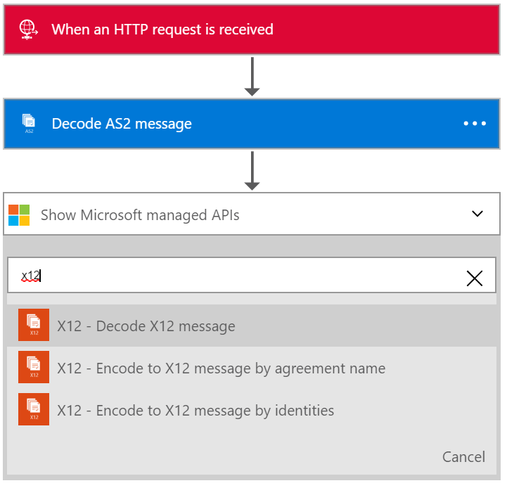
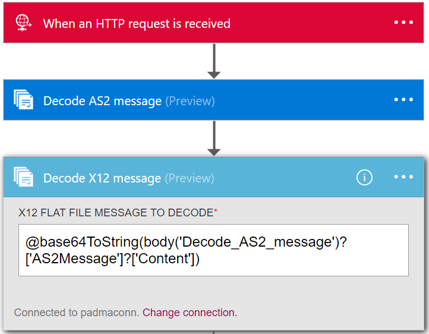

<properties 
    pageTitle="Creazione di soluzioni B2B con Service Pack integrazione Enterprise | Servizio di Microsoft Azure App | Microsoft Azure" 
    description="Conoscere la ricezione di dati usando le caratteristiche di B2B di Enterprise Integration Pack" 
    services="logic-apps" 
    documentationCenter=".net,nodejs,java"
    authors="msftman" 
    manager="erikre" 
    editor="cgronlun"/>

<tags 
    ms.service="logic-apps" 
    ms.workload="integration" 
    ms.tgt_pltfrm="na" 
    ms.devlang="na" 
    ms.topic="article" 
    ms.date="07/08/2016" 
    ms.author="deonhe"/>

# Conoscere la ricezione di dati usando le caratteristiche di B2B di Enterprise Integration Pack#

## Panoramica ##

In questo documento fa parte di logica di applicazioni Enterprise Integration Pack. Vedere la panoramica per ulteriori informazioni sulle [funzionalità di Pack integrazione Enterprise](./app-service-logic-enterprise-integration-overview.md).

## Prerequisiti ##

Usare la AS2 e X12 azioni è necessario un Account di integrazione Enterprise

[Come creare un Account di integrazione Enterprise](./app-service-logic-enterprise-integration-accounts.md)

## Come usare i connettori logica App B2B ##

Dopo aver creato un account di integrazione e aggiunto partner e accordi a tale si è pronti creare un'App di logica che implementato un flusso di lavoro per aziende (B2B).

In questo walkthru verrà visualizzato come usare la AS2 e X12 azioni seguenti per creare un'App di logica per aziende che riceve dati da un partner commerciale.

1. Creare un nuovo logica app e [collegarlo al proprio account di integrazione](./app-service-logic-enterprise-integration-accounts.md).  
2. Aggiungere un trigger **richiesta - richiesta HTTP un quando si riceve** l'app logica  
  
3. Aggiungere l'azione **Decodificare AS2** dal primo selezione **per aggiungere un'azione**  
  
4. Immettere la parola **as2** nella casella di ricerca per filtrare tutte le azioni a quello che si desidera utilizzare  
  
6. Selezionare l'azione **AS2 - decodificare AS2 messaggio**  
  
7. Come mostrato, aggiungere il **corpo** che avranno come input. In questo esempio, selezionare il corpo della richiesta HTTP che lo ha attivato l'app logica. In alternativa, è possibile immettere un'espressione per le intestazioni nella casella**intestazioni** di input:

    @triggerOutputs()['headers']

8. Aggiungere le **intestazioni** sono necessari per AS2. Questi saranno nelle intestazioni di richiesta HTTP. In questo esempio, selezionare le intestazioni della richiesta HTTP che lo ha attivato l'app logica.
9. A questo punto aggiungere l'azione messaggio Decode X12 selezionando nuovamente **aggiungere un'azione**  
   
10. Immettere la parola **x12** nella casella di ricerca per filtrare tutte le azioni a quello che si desidera utilizzare  
  
11. Selezionare il **X12-decodificare X12 messaggio** azione da aggiungere all'app logica  
  
12. A questo punto, è necessario specificare l'input di questa azione che sarà l'output dell'azione AS2 sopra. Il contenuto del messaggio effettivo è un oggetto JSON e viene codificata base 64. È quindi necessario specificare un'espressione, come l'input, quindi immettere l'espressione seguente nel campo di input **X12 piatta FILE messaggio a DECODE**  

    @base64ToString(body('Decode_AS2_message')?['AS2Message']?['Content'])  

13. Questo passaggio consente di decodificare X12 dati ricevono dal partner commerciali e verranno restituito un numero di elementi in un oggetto JSON. In modo da informare il partner di ricezione dei dati è possibile inviare nuovamente una risposta contenente AS2 messaggio disposizione notifica (MDN) un'azione di risposta HTTP  
14. Aggiungere l'azione di **risposta** selezionando **Aggiungi un'azione**   
  
15. Immettere la parola **risposta** nella casella di ricerca per filtrare tutte le azioni a quello che si desidera utilizzare  
  
16. Selezionare l'operazione di **risposta** per aggiungerlo  
  
17. Impostare il campo **corpo** della risposta utilizzando l'espressione seguente per accedere la MDN dall'output dell'azione **Decode X12 messaggio**  

    @base64ToString(body('Decode_AS2_message')?['OutgoingMdn']?['Content'])  

  
18. Salvare il lavoro  
  

A questo punto, non si desidera configurare l'app B2B logica. In un'applicazione di scenari reali, si desidera archiviare X12 codificato dati in un archivio di dati o applicazione line. È possibile aggiungere facilmente ulteriori azioni per eseguire questa operazione diapositive o scrivere API personalizzate per la connessione alle applicazioni line e utilizzare queste API nell'app logica.

## Caratteristiche e use case ##

- Il AS2 X12 decodificare e codificare azioni consentono di ricevere i dati e inviare dati a partner con protocolli standard usare le app di logica  
- È possibile utilizzare AS2 e X12 in con o senza tra loro per scambiare dati con partner commerciali in base alle esigenze
- Le azioni B2B semplificano la creazione di partner e contratti nella finestra Account di integrazione e utilizzarli in un'app di logica  
- Aumentando l'app logica con altre azioni è possibile inviare e ricevere dati e da altre applicazioni e servizi, ad esempio SalesForce  

## Ulteriori informazioni ##

[Ulteriori informazioni su Enterprise Integration Pack](./app-service-logic-enterprise-integration-overview.md)  