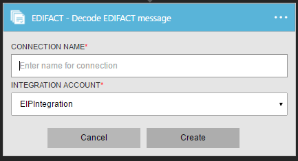

<properties 
    pageTitle="Informazioni sulle Enterprise Integration Pack decodificare EDIFACT messaggio connettore | Servizio di Microsoft Azure App | Microsoft Azure" 
    description="Informazioni su come usare i partner con le app Enterprise Integration Pack e logica" 
    services="logic-apps" 
    documentationCenter=".net,nodejs,java"
    authors="padmavc" 
    manager="erikre" 
    editor=""/>

<tags 
    ms.service="logic-apps" 
    ms.workload="integration" 
    ms.tgt_pltfrm="na" 
    ms.devlang="na" 
    ms.topic="article" 
    ms.date="08/15/2016" 
    ms.author="padmavc"/>

# Guida introduttiva a decodificare messaggio EDIFACT

Convalida EDI e proprietà specifiche del partner, vengono generate documento XML per ogni set di transazione e conferma per transazione elaborata.

## Creare la connessione

### Prerequisiti

* Un account Azure; è possibile creare un [account gratuito](https://azure.microsoft.com/free)

* Per utilizzare il connettore messaggio EDIFACT decodificare è necessario un Account di integrazione. Visualizzare i dettagli su come creare un [Account di integrazione](./app-service-logic-enterprise-integration-create-integration-account.md), [partner](./app-service-logic-enterprise-integration-partners.md) e [contratto EDIFACT](./app-service-logic-enterprise-integration-edifact.md)

### Connettersi a decodificare EDIFACT messaggio procedendo come segue:

1. [Creare un'App logica](./app-service-logic-create-a-logic-app.md) viene fornito un esempio.

2. Il connettore non dispone di tutti i trigger. Usare altri trigger per avviare l'applicazione di logica, ad esempio un trigger di richiesta.  Nella finestra di progettazione logica App, aggiungere un trigger e aggiungere un'azione.  Selezionare Mostra Microsoft API gestite nell'elenco a discesa dell'elenco e quindi immettere "EDIFACT" nella casella di ricerca.  Selezionare decodificare EDIFACT messaggio

    
    
3. Se è stata creata in precedenza tutte le connessioni all'integrazione di Account, verrà richiesto per i dettagli della connessione

      

4. Immettere i dettagli di integrazione Account.  Proprietà con un asterisco sono necessari

  	| Proprietà | Dettagli |
  	| -------- | ------- |
  	| Nome della connessione * | Immettere un nome per la connessione |
  	| Integrazione Account * | Immettere il nome dell'Account di integrazione. Assicurarsi che l'Account di integrazione e la logica app siano nella stessa posizione Azure |

    Una volta completato, dettagli relativi alla connessione un aspetto simile al seguente

      

5. Selezionare **Crea**

6. Si noti che la connessione è stata creata

      

7. Selezionare messaggio file flat EDIFACT decodificare

      

## Decodificare EDIFACT indica seguendo

* Consente di risolvere il contratto confrontando i qualificatore mittente identificatore e qualificatore ricevitore & identificatore
* Divide più svincoli in un singolo messaggio in separato.
* Convalida della busta contro trading contratto per i partner
* Separa l'interscambio.
* Convalida EDI e proprietà specifiche del partner include
    * Convalida della struttura della busta interscambio.
    * Convalida dello schema della busta lo schema di controllo.
    * Convalida dello schema set di transazioni elementi dei dati in base allo schema messaggio.
    * Convalida EDI eseguita sugli elementi di dati di set di transazioni
* Verifica che i numeri di controllo imposta interscambio, i gruppi e transazione non siano duplicati (se configurati) 
    * Controlla il numero di controllo di interscambio con svincoli ricevuti in precedenza. 
    * Controlla il numero di controllo di gruppo con altri numeri di controllo del gruppo di interscambio. 
    * Verifica che la transazione imposta il numero di controllo con altri numeri di controllo transazione set di tale gruppo.
* Generazione di un documento XML per il set di ogni transazione.
* Converte l'intero interscambio XML 
    * Dividi interscambio come transazione set - sospendere set transazioni errore: analizza ogni transazione impostare un interscambio in un documento XML separato. Se uno o più gruppi di transazione dell'interscambio non vengono convalidati, quindi EDIFACT decodificare sospende solo i set di transazioni. 
    * Dividi interscambio come transazione set - sospendere interscambio errore: analizza ogni transazione impostare un interscambio in un documento XML separato.  Se uno o più gruppi di transazione dell'interscambio non vengono convalidati, quindi EDIFACT decodificare sospende l'intero interscambio.
    * Mantenere interscambio - sospendere set transazioni errore: crea un documento XML per l'intero interscambio in batch. Decodificare EDIFACT sospende solo i set di transazioni non convalidati, pur continuando a elaborare tutti gli altri set di transazioni
    * Mantenere interscambio - sospendere interscambio errore: crea un documento XML per l'intero interscambio in batch. Se uno o più gruppi di transazione dell'interscambio non vengono convalidati, quindi EDIFACT decodificare sospende l'intero interscambio 
* Genera un problema tecnico (controllo) e/o riconoscimenti funzionali (se configurati).
    * Una conferma tecnico o ACK CONTRL segnala i risultati di un controllo sintattico dell'interscambio ricevuto completata.
    * Una conferma funziona riconosce accettare o rifiutare un interscambio ricevuto o un gruppo

## Passaggi successivi

[Altre informazioni sull'organizzazione Integration Pack] (./app-service-logic-enterprise-integration-overview.md "Informazioni sui Service Pack integrazione Enterprise") 