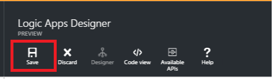

<properties
    pageTitle="Informazioni su come codificare o decodificare file flat utilizzando le app Enterprise Integration Pack e logica | Servizio di Microsoft Azure App | Microsoft Azure"
    description="Usare le caratteristiche di applicazioni Enterprise Integration Pack e logica di codificare o decodificare file flat"
    services="app-service\logic"
    documentationCenter=".net,nodejs,java"
    authors="msftman"
    manager="erikre"
    editor="cgronlun"/>

<tags 
    ms.service="logic-apps" 
    ms.workload="integration" 
    ms.tgt_pltfrm="na" 
    ms.devlang="na" 
    ms.topic="article" 
    ms.date="07/08/2016" 
    ms.author="deonhe"/>

# Integrazione di Enterprise con file flat

## Panoramica

È consigliabile codificare contenuto XML prima di inviarla a un partner di business in uno scenario di business-to-business (B2B). In un'app di logica apportata dalla funzionalità di App logica del servizio di App Azure, è possibile utilizzare il file flat codifica connettore per eseguire questa operazione. L'app logica creati possibile ottenere il codice XML contenuti da diverse origini, ad esempio da un trigger di richiesta HTTP, da un'altra applicazione o anche da uno dei molti [connettori](../connectors/apis-list.md). Per ulteriori informazioni sulle App logica, vedere la [documentazione App logica](./app-service-logic-what-are-logic-apps.md "altre informazioni sulle App logica").  

## Come creare il file flat codifica connettore

Seguire questa procedura per aggiungere un file flat codifica connettore logica all'applicazione in uso.

1. Creare una logica app e [collegarlo al proprio account di integrazione](./app-service-logic-enterprise-integration-accounts.md "su come collegare un account di integrazione per un'app di logica"). Questo account contiene lo schema che userà codificare i dati XML.  
2. Aggiungere un trigger **richiesta - richiesta HTTP un quando si riceve** logica all'applicazione in uso.  
    
3. Aggiungere il file flat codifica azione, come indicato di seguito:

    un. Selezionare il segno **più** .

    b. Selezionare il collegamento **Aggiungi un'azione** (viene visualizzato dopo aver selezionato il segno di addizione).

    c. Nella casella di ricerca immettere *Flat* per filtrare tutte le azioni a quello che si desidera utilizzare.

    d. Selezionare l'opzione **Di codifica dei File Flat** dall'elenco.   
   
4. Nella finestra di dialogo **Di codifica dei File Flat** selezionare la casella di testo **contenuto** .  
  
5. Selezionare il tag corpo come il contenuto che si desidera codificare. Il contrassegno corpo verrà compilato il campo del contenuto.     
  
6. Selezionare la casella di riepilogo **Nome dello Schema** e scegliere lo schema che si desidera utilizzare per la codifica del contenuto di input.    
  
7. Salvare il lavoro.   
  

A questo punto, non si desidera configurare il connettore codifica file flat. In un'applicazione di scenari reali, si desidera archiviare i dati codificati in un'applicazione line-of-business, ad esempio Salesforce. Oppure è possibile inviare che dati codificati da un trading partner. È possibile aggiungere facilmente un'azione per inviare l'output dell'operazione di codifica a Salesforce o ai partner commerciale, utilizzando uno qualsiasi dei connettori fornito.

È ora possibile testare il connettore da una richiesta all'endpoint HTTP e incluso il contenuto XML nel corpo della convocazione.  

## Come creare il file flat decodifica connettore

>[AZURE.NOTE] Per completare questa procedura, è necessario disporre di un file di schema già caricato in considerazione è l'integrazione.

1. Aggiungere un trigger **richiesta - richiesta HTTP un quando si riceve** logica all'applicazione in uso.  
    
2. Aggiungere il file flat decodifica azione, come indicato di seguito:

    un. Selezionare il segno **più** .

    b. Selezionare il collegamento **Aggiungi un'azione** (viene visualizzato dopo aver selezionato il segno di addizione).

    c. Nella casella di ricerca immettere *Flat* per filtrare tutte le azioni a quello che si desidera utilizzare.

    d. Selezionare l'opzione **File Flat decodifica** dall'elenco.   
   
- Selezionare il controllo **contenuto** . Questo produce un elenco del contenuto dai passaggi precedenti da utilizzare come contenuto decodificare. Si noti che il *corpo* della richiesta HTTP in arrivo è disponibile per essere utilizzato come contenuto decodificare. È inoltre possibile immettere il contenuto da decodificare direttamente nel controllo **contenuto** .     
- Selezionare il tag *corpo* . Si noti il contrassegno corpo ora nel controllo **contenuto** .
- Selezionare il nome dello schema che si desidera utilizzare per decodificare il contenuto. La schermata seguente mostra che *OrderFile* sia il nome dello schema selezionato. Questo nome schema era stato caricato in considerazione l'integrazione in precedenza.

     
- Salvare il lavoro.  
    

A questo punto, non si desidera configurare un file flat decodifica connettore. In un'applicazione di scenari reali, si desidera memorizzare i dati codificati in un'applicazione line-of-business, ad esempio Salesforce. È possibile aggiungere facilmente un'azione per inviare l'output dell'azione decompressione Salesforce.

È ora possibile testare il connettore da una richiesta all'endpoint HTTP e incluso il contenuto XML che si desidera decodificare nel corpo della convocazione.  

## Passaggi successivi
- [Altre informazioni sull'organizzazione Integration Pack] (./app-service-logic-enterprise-integration-overview.md "Informazioni sulle Enterprise integrazione Pack").  
