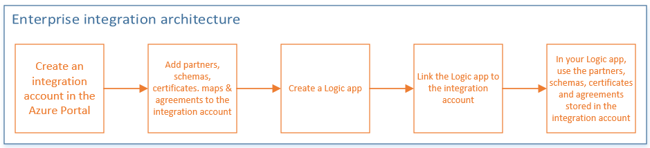

<properties 
    pageTitle="Panoramica dell'integrazione Enterprise | Servizio di Microsoft Azure App | Microsoft Azure" 
    description="Utilizzare le caratteristiche di integrazione aziendali per abilitare scenari aziendali processo e l'integrazione, usare le app di logica" 
    services="logic-apps" 
    documentationCenter=".net,nodejs,java"
    authors="msftman" 
    manager="erikre" 
    editor="cgronlun"/>

<tags 
    ms.service="logic-apps" 
    ms.workload="integration" 
    ms.tgt_pltfrm="na" 
    ms.devlang="na" 
    ms.topic="article" 
    ms.date="09/08/2016" 
    ms.author="deonhe"/>

# Panoramica di Pack integrazione Enterprise

## Che cos'è Enterprise Integration Pack?
Il pacchetto di integrazione Enterprise è soluzione basata su cloud Microsoft per l'attivazione diretta comunicazioni di business-to-business (B2B). Il language pack utilizza protocolli standard inclusi [AS2](./app-service-logic-enterprise-integration-as2.md), [X12](./app-service-logic-enterprise-integration-x12.md)ed [EDIFACT](./app-service-logic-enterprise-integration-edifact.md) per scambiare messaggi tra business partner. I messaggi possono essere protetti facoltativamente utilizzando le firme digitali e la crittografia. 

Il language pack consente alle organizzazioni che utilizzano i protocolli diversi e formati per scambiare messaggi in formato elettronico trasformando i diversi formati in un formato che i sistemi di entrambe le organizzazioni possono interpretare e intervenire su. 

Se si ha familiarità con BizTalk Server o Microsoft Azure BizTalk Services, sono disponibili facile da usare che le funzionalità dell'integrazione di Enterprise poiché la maggior parte dei concetti sono simile. La principale differenza è che l'integrazione di Enterprise utilizza account integrazione per semplificare l'archiviazione e la gestione degli elementi utilizzati nelle comunicazioni B2B. 

Strutturalmente, il Language Pack integrazione Enterprise è basato sugli **account di integrazione** che memorizzano tutti gli elementi che possono essere usati per progettare, distribuire e gestire le app B2B. Un account di integrazione è essenzialmente un contenitore basato sul cloud in cui sono archiviati gli elementi, ad esempio schemi, i partner, certificati, mappe e contratti. Questi elementi possono quindi essere usati nelle App logica per creare flussi di lavoro B2B. È possibile utilizzare gli elementi in un'app di logica, è necessario collegare il tuo account integrazione logica all'applicazione in uso. Dopo il link, l'app logica avrà accesso a elementi dell'account integrazione.  

## Perché è necessario utilizzare l'integrazione di enterprise?
- Con l'integrazione dell'organizzazione, in grado di archiviare tutti i elementi in un'unica posizione, ossia l'account di integrazione. 
- È possibile sfruttare il motore di App logica e tutti i connettori per creare flussi di lavoro B2B e integrazione con applicazioni SaaS 3 °, App locale, nonché applicazioni personalizzate
- È anche possibile sfruttare le funzioni di Azure

## Come è possibile iniziare a utilizzare l'integrazione di enterprise?
È possibile creare e gestire App B2B tramite Enterprise Integration Pack tramite la finestra di progettazione di applicazioni logica nel **portale di Azure**.  

Utilizzare [PowerShell](https://msdn.microsoft.com/library/azure/mt652195.aspx "logica App argomenti PowerShell") per gestire le app logica. 

Ecco una panoramica dei passaggi da eseguire prima di poter creare app nel portale di Azure:   

## Quali sono alcuni scenari comuni?

Integrazione di Enterprise supporta questi standard:   

- EDI - interscambio dati elettronico  
- Integrazione di applicazioni aziendali (EAI)  

## Ecco cosa occorre iniziare
- Una sottoscrizione Azure con un account di integrazione
- Visual Studio 2015 per creare mappe e degli schemi
- [Integrazione di applicazioni Enterprise logica di Microsoft Azure Tools per Visual Studio 2015 2.0](https://aka.ms/vsmapsandschemas)  

## Provare a
[Provare a questo punto](https://github.com/Azure/azure-quickstart-templates/tree/master/201-logic-app-as2-send-receive) per distribuire un campione pienamente operativo AS2 Invia / Ricevi in app logica che utilizza la funzionalità B2B di logica di App.

## Altre informazioni:
- [Contratti] (./app-service-logic-enterprise-integration-agreements.md "Informazioni sui contratti di integrazione enterprise")
- [Scenari di business to Business (B2B)] (./app-service-logic-enterprise-integration-b2b.md "Informazioni su come creare App logica con caratteristiche B2B")  
- [Certificati] (./app-service-logic-enterprise-integration-certificates.md "Informazioni sui certificati integrazione dell'organizzazione")
- [File flat codifica/decodifica] (./app-service-logic-enterprise-integration-flatfile.md "Informazioni su come codificare e decodificare il contenuto del file flat")  
- [Account di integrazione] (./app-service-logic-enterprise-integration-accounts.md "Informazioni sugli account di integrazione")
- [Mappe] (./app-service-logic-enterprise-integration-maps.md "Informazioni sull'integrazione di enterprise mappe")
- [Partner] (./app-service-logic-enterprise-integration-partners.md "Informazioni sui partner di integrazione enterprise")
- [Schemi] (./app-service-logic-enterprise-integration-schemas.md "Informazioni sugli schemi di integrazione enterprise")
- [Convalida messaggio XML] (./app-service-logic-enterprise-integration-xml.md "Informazioni su come eseguire la convalida dei messaggi XML con logica App")
- [Trasformazione XML] (./app-service-logic-enterprise-integration-transform.md "Informazioni sull'integrazione di enterprise mappe")
- [Connettori integrazione Enterprise] (../connectors/apis-list.md "Informazioni sui connettori pack di integrazione enterprise")

