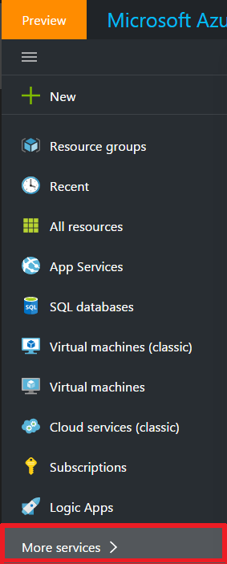
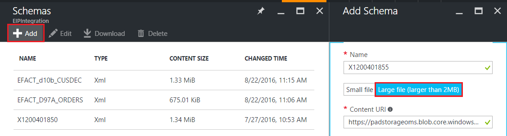
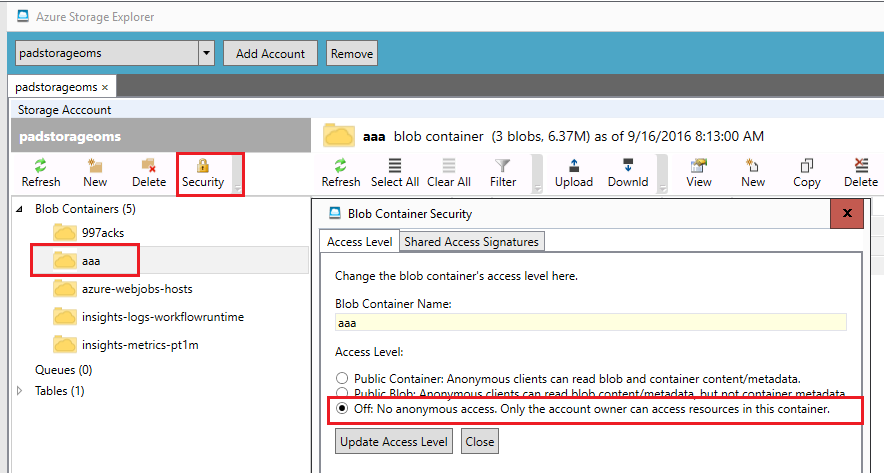
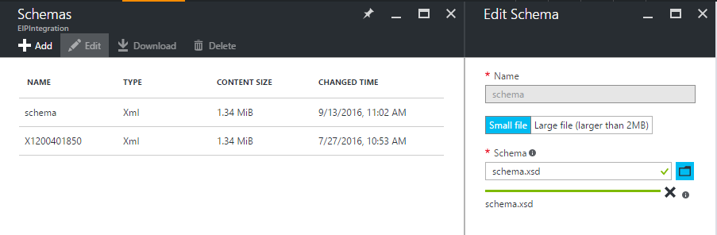

<properties
    pageTitle="Panoramica di schemi e il Language Pack integrazione Enterprise | Microsoft Azure"
    description="Informazioni su come usare schemi con le app Enterprise Integration Pack e logica"
    services="logic-apps"
    documentationCenter=".net,nodejs,java"
    authors="msftman"
    manager="erikre"
    editor="cgronlun"/>

<tags
    ms.service="logic-apps"
    ms.workload="integration"
    ms.tgt_pltfrm="na"
    ms.devlang="na"
    ms.topic="article"
    ms.date="07/29/2016"
    ms.author="deonhe"/>

# Informazioni sugli schemi e il Language Pack integrazione Enterprise  

## Perché usare uno schema?
Usare schemi per verificare che i documenti XML che viene visualizzato sono validi, con i dati previsti in un formato predefinito. Schemi vengono utilizzati per convalidare i messaggi scambiati in uno scenario B2B.

## Aggiungere uno schema
Dal portale di Azure:  

1. Selezionare **altri servizi**.  
    

2. Nella casella di ricerca filtro immettere **integrazione**e selezionare **Account integrazione** dall'elenco dei risultati.     
  
3. Selezionare l' **account di integrazione** a cui aggiungere lo schema.    
  

4. Selezionare il riquadro di **schemi** .  
  

### Aggiungere un file di schema minore di 2 MB  

1. Nella finestra e **schemi** che viene visualizzata (mediante la procedura precedente), selezionare **Aggiungi**.  
  

2. Immettere un nome per lo schema. Per caricare il file di schema, quindi selezionare l'icona di cartella accanto alla casella di testo **Schema** . Al termine il processo di caricamento, scegliere **OK**.    
  

### Aggiungere un file di schema superiore a 2 MB (fino a un massimo di 8 MB)  

Questo processo dipende dal livello di accesso contenitore blob: **pubblico** o **non consentire l'accesso anonimo**. Per determinare il livello di accesso, in **Esplora archivi Azure**in **Contenitori Blob**, selezionare il contenitore blob desiderato. Selezionare **protezione**e selezionare la scheda **Livello di accesso** .

1. Se il livello di accesso di sicurezza blob è **pubblico**, seguire questa procedura.  
    

    un. Caricare lo schema allo spazio di archiviazione e copiare l'URI.  
      

    b. In **Aggiungi Schema**, selezionare **file di grandi dimensioni**e fornire URI nella casella di testo **URI del contenuto** .  
      

2. Se il livello di accesso di sicurezza blob **non consentire l'accesso anonimo**, seguire questa procedura.  
    

    un. Caricare lo schema di spazio di archiviazione.  
    

    b. Generare una firma di accesso condiviso per lo schema.  
    

    c. In **Aggiungi Schema**, selezionare **file di grandi dimensioni**e fornire la firma di accesso condiviso URI nella casella di testo **URI del contenuto** .  
      

3. In e lo **schemi** dell'Account di integrazione EIP, viene visualizzato lo schema appena aggiunto.  

  

## Modificare gli schemi
1. Selezionare il riquadro di **schemi** .  
2. Selezionare lo schema che si desidera modificare da e lo **schemi** visualizzata.
3. Scegliere **Modifica**e lo **schemi** .  
    
4. Selezionare il file di schema che si desidera modificare utilizzando la finestra di dialogo per la selezione file che verrà visualizzato.
5. Selezionare **Apri** in selezione dei file.  
  
6. Si riceve una notifica che indica che il caricamento ha avuto esito positivo.  

## Eliminare gli schemi
1. Selezionare il riquadro di **schemi** .  
2. Selezionare lo schema che si desidera eliminare da e lo **schemi** visualizzata.  
3. Scegliere **Elimina**e lo **schemi** .
  

4. Per confermare la scelta, selezionare **Sì**.  
  
5. Infine, si noterà che consente di aggiornare l'elenco degli schemi in e lo **schemi** e lo schema che è stato eliminato non sia più presente.  
    

## Passaggi successivi

- [Altre informazioni sull'organizzazione Integration Pack] (./app-service-logic-enterprise-integration-overview.md "Informazioni sul language pack integrazione enterprise").  
