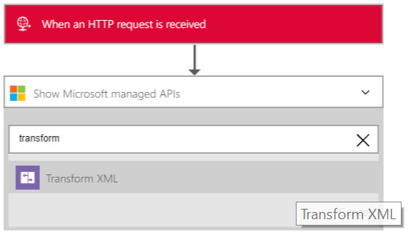

<properties 
    pageTitle="Panoramica di Pack integrazione Enterprise | Servizio di Microsoft Azure App | Microsoft Azure" 
    description="Usare le caratteristiche di Enterprise Integration Pack per scenari aziendali processo e l'integrazione con il servizio di Microsoft Azure App" 
    services="logic-apps" 
    documentationCenter=".net,nodejs,java"
    authors="msftman" 
    manager="erikre" 
    editor="cgronlun"/>

<tags 
    ms.service="logic-apps" 
    ms.workload="integration" 
    ms.tgt_pltfrm="na" 
    ms.devlang="na" 
    ms.topic="article" 
    ms.date="07/08/2016" 
    ms.author="deonhe"/>

# Integrazione di Enterprise con le trasformazioni XML

## Panoramica
Il connettore di trasformazione integrazione Enterprise converte i dati da un formato in un altro formato. Ad esempio, si dispone di un messaggio di posta in arrivo che contiene la data corrente nel formato YearMonthDay. È possibile utilizzare una trasformazione per riformattare la data in formato MonthDayYear.

## Cosa è una trasformazione?
Una trasformazione, è anche nota come una mappa, è costituito da uno schema XML di origine (input) e uno schema XML di destinazione (l'output). È possibile utilizzare funzioni predefinite diverse per modificare o controllare i dati tra stringhe, assegnazioni condizionale, le espressioni aritmetiche, formattatori ora data e persino costrutti di ciclo.

## Come è possibile creare una trasformazione?
È possibile creare una trasformazione/mappa utilizzando Visual Studio [Enterprise integrazione SDK](https://aka.ms/vsmapsandschemas). Dopo aver terminato la creazione e verifica la trasformazione, la trasformazione è caricare nel proprio account di integrazione. 

## Come usare una trasformazione
Dopo aver caricato la trasformazione all'account di integrazione, è possibile utilizzare per creare un'app di logica. L'app logica scorrerà le trasformazioni ogni volta che viene attivata l'app logica (e non vi è contenuto input che deve essere trasformato).

**Ecco la procedura per usare una trasformazione**:

### Prerequisiti 
Nel riquadro di anteprima, sarà necessario:  

-  [Creare un contenitore di funzioni di Azure] (https://ms.portal.azure.com/#create/Microsoft.FunctionApp "Creare un contenitore di funzioni di Azure")  
-  [Aggiungere una funzione al contenitore di funzioni di Azure] (https://portal.azure.com/#create/Microsoft.Template/uri/https%3A%2F%2Fraw.githubusercontent.com%2FAzure%2Fazure-quickstart-templates%2Fmaster%2F201-logic-app-transform-function%2Fazuredeploy.json "Questo modello consente di creare una funzione webhook in base a c# azure con funzionalità di trasformazione da utilizzare in scenari di integrazione App logica")    
-  Creare un account di integrazione e aggiungere una mappa  

>[AZURE.TIP] Annotare il nome del contenitore di funzioni di Azure e la funzione di Azure, saranno necessari nel passaggio successivo.  

Ora che è stata accettata attenzione i prerequisiti, è possibile creare l'applicazione di logica:  

1. Creare una logica app e [collegarlo al proprio account di integrazione](./app-service-logic-enterprise-integration-accounts.md "su come collegare un account di integrazione per un'app di logica") che contiene la mappa.
2. Aggiungere un trigger **richiesta - richiesta HTTP un quando si riceve** l'app logica  
    
3. Aggiungere l'azione **Trasformare XML** dal primo selezione **per aggiungere un'azione**   
   
4. Immettere la parola *trasformare* nella casella di ricerca per filtrare tutte le azioni a quello che si desidera utilizzare  
  
5. Selezionare l'azione di **Trasformazione XML**   
  
6. Selezionare il **Contenitore funzione** contenente la funzione che verrà utilizzato. Questo è il nome del contenitore di funzioni di Azure creata precedentemente in questa procedura.
7. Selezionare la **funzione** che si desidera utilizzare. Questo è il nome della funzione Azure creata in precedenza.
8. Aggiungere il **contenuto** che trasformerà codice XML. Si noti che è possibile utilizzare tutti i dati XML che viene visualizzato nella richiesta HTTP come **contenuto**. In questo esempio, selezionare il corpo della richiesta HTTP che lo ha attivato l'app logica.
9. Selezionare il nome della **mappa** che si desidera utilizzare per eseguire la trasformazione. La mappa deve essere già state nell'account di integrazione. In un passaggio precedente, l'accesso app logica assegnato automaticamente al proprio account di integrazione contenente la mappa già.
10. Salvare il lavoro  
 

A questo punto si aver impostato la mappa. In un'applicazione di scenari reali, si desidera archiviare i dati trasformati in un'applicazione line, ad esempio SalesForce. È possibile facilmente come un'azione per inviare l'output della trasformazione di Salesforce. 

È ora possibile verificare la trasformazione effettuando una richiesta all'endpoint HTTP.  

## Caratteristiche e use case

- Trasformazione creata in una mappa può essere semplice, ad esempio la copia di un nome e indirizzo da un documento a altro. In alternativa, è possibile creare trasformazioni più complesse utilizzando le operazioni di casella mappa.  
- Più operazioni mappa o funzioni sono disponibili, tra cui le stringhe, funzioni di data temporali e così via.  
- È possibile eseguire una copia diretta dei dati tra gli schemi. In mapping inclusi in SDK, si tratta costituiti semplicemente disegnando una linea che connette gli elementi dello schema di origine con le corrispondenti nello schema di destinazione.  
- Quando si crea una mappa, si visualizza una rappresentazione grafica di mappa, che mostra tutte le relazioni e i collegamenti creati.
- Utilizzare la funzionalità di mappa di Test per aggiungere un messaggio XML di esempio. Con un semplice clic, è possibile testare la mappa creata e vedere l'output generato.  
- Caricare i mapping esistenti  
- Include il supporto per il formato XML.

## Ulteriori informazioni
- [Altre informazioni sull'organizzazione Integration Pack] (./app-service-logic-enterprise-integration-overview.md "Informazioni sui Service Pack integrazione Enterprise")  
- [Ulteriori informazioni, vedere mappe] (./app-service-logic-enterprise-integration-maps.md "Informazioni sull'integrazione di enterprise mappe")  
 