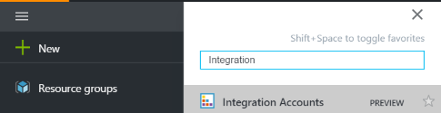
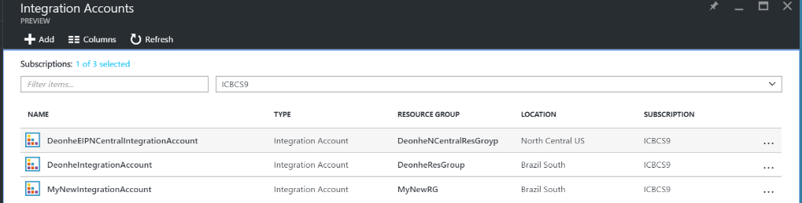
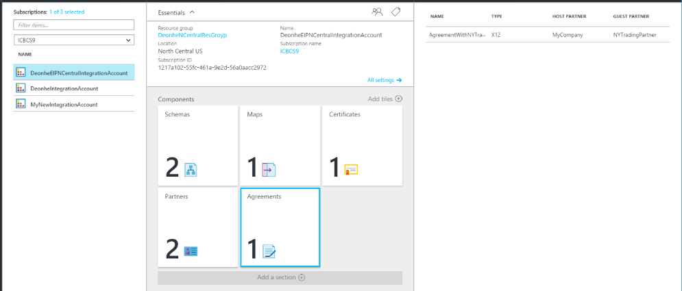
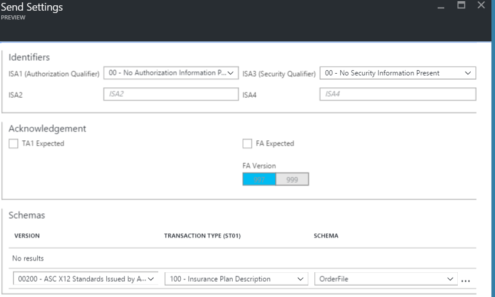

<properties 
    pageTitle="Panoramica di X12 e il Language Pack integrazione Enterprise | Servizio di Microsoft Azure App | Microsoft Azure" 
    description="Informazioni su come usare X12 accordi per creare App logica" 
    services="logic-apps" 
    documentationCenter=".net,nodejs,java"
    authors="msftman" 
    manager="erikre" 
    editor="cgronlun"/>

<tags 
    ms.service="app-service-logic" 
    ms.workload="integration" 
    ms.tgt_pltfrm="na" 
    ms.devlang="na" 
    ms.topic="article" 
    ms.date="07/08/2016" 
    ms.author="deonhe"/>

# Integrazione di Enterprise con X12 

>[AZURE.NOTE]Caratteristiche di copertine il X12 questa pagina delle App logica. Per informazioni su EDIFACT fare clic [qui](app-service-logic-enterprise-integration-edifact.md).

## Creare un X12 contratto 
Prima di poter scambiare X12 messaggi, è necessario creare un X12 contratto e archiviarlo nel proprio account di integrazione. I passaggi seguenti illustrano le fasi del processo di creazione di un X12 contratto.

### Ecco cosa occorre prima di iniziare
- Un [account di integrazione](./app-service-logic-enterprise-integration-accounts.md) definito nell'abbonamento Azure  
- Almeno due [partner](./app-service-logic-enterprise-integration-partners.md) già definiti nell'account di integrazione  

>[AZURE.NOTE]Quando si crea un contratto, il contenuto nel file di contratto deve corrispondere al tipo di contratto.    

Dopo aver [creato un account di integrazione](./app-service-logic-enterprise-integration-accounts.md) e [aggiunto partner](./app-service-logic-enterprise-integration-partners.md), è possibile creare un X12 contratto procedendo come segue:  

### Nella home page del portale Azure

Dopo aver eseguito l'accesso al [portale di Azure](http://portal.azure.com "Azure portale"):  
1. Selezionare **Sfoglia** dal menu a sinistra.  

>[AZURE.TIP]Se non è visibile il collegamento **Sfoglia** , potrebbe essere necessario espandere il menu prima di tutto. Eseguire questa operazione, fare clic sul collegamento **Mostra menu** che si trova in alto a sinistra del menu di scelta compresso.  

    
2. Digitare *l'integrazione* nella casella di ricerca di filtro, quindi selezionare **Gli account di integrazione** dall'elenco dei risultati.       
    
3. In e il **Account integrazione** aperta, selezionare l'account di integrazione che consente di creare il contratto. Se non viene visualizzato l'account di qualsiasi integrazione elenchi, [crearne uno prima](./app-service-logic-enterprise-integration-accounts.md "All about integration accounts").  
  
4.  Selezionare il riquadro **contratti** . Se non viene visualizzato il riquadro accordi aggiungerla prima.   
     
5. Selezionare il pulsante **Aggiungi** nella e accordi visualizzata.  
  
6. Immettere un **nome** per il contratto, quindi selezionare **tipo contratto**, **Host Partner**, **Identità Host**, **Guest Partner**, **Identità Guest**, e l'accordi che verrà visualizzato.  
  
7. Dopo aver impostato la ricezione delle proprietà di impostazioni, selezionare il pulsante **OK**  
Continuare:  
8. Selezionare **Impostazioni di ricezione** per configurare come messaggi ricevuti tramite questo contratto devono essere gestiti.  
9. Controllo impostazioni di ricezione è diviso in sezioni, inclusi gli identificatori, messaggio di conferma, schemi, buste, numeri di controllo, convalida e impostazioni interne. Configurare le proprietà in base al contratto con il partner che è verrà scambiare messaggi con. Ecco una visualizzazione di questi controlli, configurarli in base a come si desidera il presente contratto per identificare e gestire i messaggi in arrivo:  
  

  
10. Selezionare il pulsante **OK** per salvare le impostazioni.  

### Identificatori

|Proprietà|Descrizione |
|---|---|
|ISA1 (autorizzazione qualificatore)|Selezionare il valore di qualificatore autorizzazione dall'elenco a discesa.|
|ISA2|Facoltativo. Immettere il valore di informazioni autorizzazione. Se il valore che immesso nel campo relativo ISA1 è diversa da quella 00, immettere un numero minimo di un carattere alfanumerico e un massimo di 10.|
|ISA3 (sicurezza qualificatore)|Selezionare il valore qualificatore di sicurezza dall'elenco a discesa.|
|ISA4|Facoltativo. Immettere il valore di informazioni di sicurezza. Se il valore che immesso nel campo relativo ISA3 è diversa da quella 00, immettere almeno un carattere alfanumerico e un massimo di 10.|

### Riconoscimenti 

|Proprietà|Descrizione |
|----|----|
|TA1 previsto|Selezionare questa casella di controllo per restituire una tecnica conferma (TA1) al mittente di interscambio. Questi riconoscimenti vengono inviati al mittente di interscambio in base alle impostazioni per il contratto di inviare.|
|FA previsto|Selezionare questa casella di controllo per restituire un riconoscimento funzionale (FA) al mittente di interscambio. Scegliere se si desidera riconoscimenti 997 o 999, in base alle versioni schema in uso. Questi riconoscimenti vengono inviati al mittente di interscambio in base alle impostazioni per il contratto di inviare.|
|Includere AK2/IK2 Esegui ciclo continuo|Selezionare questa casella di controllo per attivare la generazione di AK2 cicli di riconoscimenti funzionali per set di transazioni accettate. Nota: Questa casella di controllo è disponibile solo se è stata selezionata la casella di controllo FA previsto.|

### Schemi

Scegliere uno schema per ogni tipo di transazione (ST1) e l'applicazione mittente (GS2). La pipeline di ricezione separa il messaggio di posta in arrivo confrontando i valori per ST1 e GS2 nel messaggio di posta in arrivo con i valori che impostare qui e lo schema del messaggio di posta in arrivo con lo schema che impostare qui.

|Proprietà|Descrizione |
|----|----|
|Versione|Selezionare il X12 versione|
|Tipo di transazione (ST01)|Selezionare il tipo di transazione|
|Applicazione mittente (GS02)|Selezionare l'applicazione del mittente|
|Schema|Selezionare il file di schema che si desidera Contattaci. File di schema si trovano nell'account integrazione.|

### Buste

|Proprietà|Descrizione |
|----|----|
|Uso di ISA11|Utilizzare questo campo per specificare il separatore in un set di transazioni:  Selezionare l'identificatore Standard da utilizzare la parte decimale di "." anziché decimale del documento in arrivo nel EDI pipeline di ricezione.  Selezionare il separatore di ripetizione per specificare il separatore per ripetute occorrenze di un elemento di dati semplici o di una struttura di dati ripetuti. Ad esempio (^) in genere viene utilizzato come separatore di ripetizione. Per gli schemi HIPAA, è possibile utilizzare solo (^).|

### Numeri di controllo

|Proprietà|Descrizione |
|----|----|
|Non consentire i duplicati Interchange il numero di controllo|Selezionare questa opzione per bloccare svincoli duplicati. Se selezionata, il portale di servizi BizTalk controlla che il numero di controllo di interscambio (ISA13) per l'interscambio ricevuto non corrisponde al numero di controllo di interscambio. Se viene rilevata una corrispondenza, la pipeline di ricezione non elabora l'interscambio. Se si è scelto di non consentire i numeri di controllo di interscambio duplicati, è possibile specificare il numero di giorni in cui il controllo viene eseguito assegnando il valore appropriato per il controllo per ISA13 duplicati ogni x giorni.|
|Non consentire i duplicati numerici controllo di gruppo|Selezionare questa opzione per bloccare svincoli con numeri di controllo gruppo duplicato.|
|Non consentire transazione set di controllo numerici duplicati|Selezionare questa opzione per bloccare svincoli con numeri di controllo imposta transazione duplicata.|

### Convalida

|Proprietà|Descrizione |
|----|----|
|Tipo di messaggio|Tipo di messaggio EDI, ad esempio l'ordine di acquisto 850 o 999 implementazione conferma.|
|Convalida EDI|Esegue la convalida EDI sui tipi di dati come definito dalle proprietà EDI dello schema, restrizioni di lunghezza, elementi di dati vuota e separatori finali.|
|Convalida "Extended"|Se il tipo di dati non è EDI, convalida è il requisito di elemento di dati e consentito ripetizione, enumerazioni e convalida lunghezza elemento di dati (min o max).|
|Consenti gli zeri iniziali o finali|Spazio aggiuntivo e zeri iniziali o finali vengono mantenuti. Non vengono rimossi.|
|Criteri separatore finali|Genera separatori finali su interscambio ricevuti. Opzioni includono per QueuedDeliveryRequirements, facoltativo e obbligatorio.|

### Impostazioni interne

|Proprietà|Descrizione |
|----|----|
|Conversione implicito formato decimale Nn in base 10 di valore numerico|Converte un numero EDI specificata nel formato Nn a un valore numerico di base 10 in formato XML intermedio nel portale servizi BizTalk.|
|Creare tag XML vuoti se sono consentiti i separatori finali|Selezionare questa casella di controllo per includere tag XML vuoti per i separatori finali al mittente di interscambio.|
|Elaborazione batch in ingresso|Dividi interscambio come transazione set - sospendere set transazioni errore: analizza ogni transazione impostare un interscambio in un documento XML separato applicando la busta appropriata per il set di transazione. Con questa opzione se transazione uno o più set di interscambio la convalida non riesce, quindi servizi BizTalk sospende solo i set di transazioni.   Dividi interscambio come transazione set - sospendere interscambio errore: analizza ogni transazione impostare un interscambio in un documento XML separato applicando la busta appropriata. Con questa opzione se transazione uno o più set di interscambio la convalida non riesce, quindi servizi BizTalk sospende l'intero interscambio.  Mantenere interscambio - sospendere set transazioni errore: si lascia intatto, creazione di un documento XML per l'intero interscambio in batch l'interscambio. Con questa opzione se onAe o transazione più set di interscambio la convalida non riesce, quindi servizi BizTalk sospende solo i set di transazione, pur continuando a elaborare tutti gli altri set di transazione.  Mantenere interscambio - sospendere interscambio errore: si lascia intatto, creazione di un documento XML per l'intero interscambio in batch l'interscambio. Con questa opzione se transazione uno o più set di interscambio la convalida non riesce, quindi servizi BizTalk sospende l'intero interscambio.  |

Il presente contratto è pronto per gestire i messaggi in arrivo conforme allo schema selezionato.

Per configurare le impostazioni di gestiscono i messaggi inviati per i partner:  
11. Selezionare **Le impostazioni di invio** per configurare come i messaggi inviati tramite il presente contratto devono essere gestiti.  

Controllo Impostazioni invio è diviso in sezioni, inclusi gli identificatori, messaggio di conferma, schemi, buste, numeri di controllo, set di caratteri e separatori e convalida. 

Ecco una visualizzazione di questi controlli. Effettuare le selezioni in base a come si desidera gestire i messaggi inviati per i partner tramite il presente contratto:   
  

  

  
12. Selezionare il pulsante **OK** per salvare le impostazioni.  

### Identificatori
|Proprietà|Descrizione |
|----|----|
|Qualificatore autorizzazione (ISA1)|Selezionare il valore di qualificatore autorizzazione dall'elenco a discesa.|
|ISA2|Immettere il valore di informazioni autorizzazione. Se questo valore è diversa da quella 00, immettere un numero minimo di un carattere alfanumerico e un massimo di 10.|
|Qualificatore di sicurezza (ISA3)|Selezionare il valore qualificatore di sicurezza dall'elenco a discesa.|
|ISA4|Immettere il valore di informazioni di sicurezza. Se questo valore è diversa da quella 00, per la casella di testo valore (ISA4), immettere un numero minimo di un valore alfanumerico e un massimo di 10.|

### Messaggio di conferma
|Proprietà|Descrizione |
|----|----|
|TA1 previsto|Selezionare questa casella di controllo per restituire una tecnica conferma (TA1) al mittente di interscambio. Questa impostazione specifica che il partner host che invia il messaggio richiede una conferma dal partner guest nel contratto relativo al. Questi riconoscimenti previsto dal partner host in base alle impostazioni del contratto di ricevere.|
|FA previsto|Selezionare questa casella di controllo per restituire un riconoscimento funzionale (FA) al mittente di interscambio e quindi scegliere se si desidera riconoscimenti 997 o 999, in base alle versioni schema che si sta utilizzando. Questi riconoscimenti previsto dal partner host in base alle impostazioni del contratto di ricevere.|
|Versione FA|Selezionare la versione FA|

### Schemi
|Proprietà|Descrizione |
|----|----|
|Versione|Selezionare il X12 versione|
|Tipo di transazione (ST01)|Selezionare il tipo di transazione|
|SCHEMA|Selezionare lo schema da utilizzare. Schemi si trovano nell'account integrazione. Per accedere agli schemi, collegare l'account di integrazione logica all'applicazione in uso.|

### Buste
|Proprietà|Descrizione |
|----|----|
|Uso di ISA11|Utilizzare questo campo per specificare il separatore in un set di transazioni:  Selezionare l'identificatore Standard da utilizzare la parte decimale di "." anziché decimale del documento in arrivo nel EDI pipeline di ricezione.  Selezionare il separatore di ripetizione per specificare il separatore per ripetute occorrenze di un elemento di dati semplici o di una struttura di dati ripetuti. Ad esempio (^) in genere viene utilizzato come separatore di ripetizione. Per gli schemi HIPAA, è possibile utilizzare solo (^). |
|Separatore di ripetizione|Immettere il separatore di ripetizione|
|Numero di versione di controllo (ISA12)|Selezionare la versione di X12 standard che viene utilizzata dal portale dei servizi BizTalk per generare un interscambio in uscita.|
|Indicatore di utilizzo (ISA15)|Specificare se il contesto di un interscambio di informazioni (I), i dati di produzione (P) o verificare dati (T). Ricevere l'EDI pipeline promuove questa proprietà per il contesto.|
|Schema|È possibile immettere come il portale di servizi BizTalk genera segmenti GS e ST per un interscambio codificato X12 che viene inviato alla Pipeline di trasmissione.  È possibile associare i valori di GS1, GS2, GS3, GS4, GS5, GS7 e GS8 elementi di dati con valori di tipo transazione e gli elementi di dati / versione. Quando il portale di servizi BizTalk determina che un messaggio XML contiene i valori di impostare per il tipo di transazione e gli elementi / versione di una riga della griglia, quindi popola gli elementi di dati GS1, GS2, GS3, GS4, GS5, GS7 e GS8 all'interno della busta di interscambio in uscita con i valori della stessa riga della griglia. I valori di tipo di transazione e gli elementi di versione/devono essere univoci.  Facoltativo. Per GS1, selezionare un valore per il codice funziona dall'elenco a discesa.  Obbligatorio. Per GS2, immettere un valore alfanumerico per il mittente di applicazione con almeno due caratteri e massimo 15 caratteri.  Obbligatorio. Per GS3, immettere un valore alfanumerico per il destinatario applicazione con almeno due caratteri e massimo 15 caratteri.  Facoltativo. Per GS4, selezionare SSAAMMGG o AAMMGG.  Facoltativo. Per GS5, selezionare HHMM, HHMMSS o HHMMSSdd.  Facoltativo. Per GS7, selezionare un valore per l'Agenzia responsabile dall'elenco a discesa.  Facoltativo. Per GS8, immettere un valore alfanumerico per il documento identificato con un massimo di 12 caratteri e almeno un carattere.  **Nota**: sono i valori che il portale di servizi BizTalk immette nei campi GS di interscambio la compilazione se la transazione digitare e versione/elementi nella stessa riga sono una corrispondenza per quelli associati all'interscambio.|

### Numeri di controllo
|Proprietà|Descrizione |
|----|----|
|Numero di controllo (ISA13) interscambio|Obbligatorio. Immettere un intervallo di valori per il numero di controllo di interscambio utilizzato dal portale dei servizi BizTalk per generare un interscambio in uscita. Immettere un valore numerico con un minimo di 1 e un massimo di 999999999.|
|Numero di controllo di gruppo (GS06)|Obbligatorio. Immettere l'intervallo di numeri che il portale di servizi BizTalk deve essere utilizzato per il numero di controllo di gruppo. Immettere un valore numerico con un massimo di nove caratteri e almeno un carattere.|
|Numero di controllo imposta transazione (ST02)|Per il numero di controllo imposta delle transazioni (ST02), immettere un intervallo di valori numerici per i campi obbligatori centrale e valori alfanumerici per il prefisso facoltativo e un suffisso. La lunghezza massima di tutti i quattro campi è nove caratteri.|
|Prefisso|Per definire l'intervallo di numeri di controllo imposta transazione utilizzati in un messaggio di conferma, immettere i valori nei campi numero (ST02) controllo ACK. Immettere un valore numerico per i campi di due secondo nome e un valore alfanumerico (se si desidera) per i campi prefisso e un suffisso. I campi secondo necessari e contengono i valori minimi e massimo per il numero di controllo; il prefisso e suffisso sono facoltativi. La lunghezza massima di tutti i campi è nove caratteri.|
|Suffisso|Per definire l'intervallo di numeri di controllo imposta transazione utilizzati in un messaggio di conferma, immettere i valori nei campi numero (ST02) controllo ACK. Immettere un valore numerico per i campi di due secondo nome e un valore alfanumerico (se si desidera) per i campi prefisso e un suffisso. I campi secondo necessari e contengono i valori minimi e massimo per il numero di controllo; il prefisso e suffisso sono facoltativi. La lunghezza massima di tutti i campi è nove caratteri.|

### Set di caratteri e separatori
Diverso dal set di caratteri, è possibile immettere un set di delimitatori da utilizzare per ogni tipo di messaggio diverso. Se per uno schema di un determinato messaggio non viene specificato un set di caratteri, verrà usato il set di caratteri predefinito.

|Proprietà|Descrizione |
|----|----|
|Set di caratteri da utilizzare|Selezionare il X12 set di caratteri da convalidare le proprietà specificate per il contratto.  **Nota**: nel portale di servizi BizTalk utilizza solo questa impostazione per convalidare i valori immessi per le proprietà del contratto correlato. La pipeline di ricezione o pipeline di trasmissione Ignora questa proprietà set di caratteri durante l'elaborazione di runtime.|
|Schema|Simbolo selezionare (+) e selezionare uno schema dall'elenco a discesa. Selezionare i separatori di essere utilizzato per lo schema selezionato:  Separatore di elementi componente: immettere un unico carattere per separare gli elementi di dati composto.  Separatore di elementi di dati: immettere un unico carattere per separare semplici elementi di dati all'interno degli elementi di dati composto.    Carattere di sostituzione: selezionare questa casella di controllo se payload dati contengono i caratteri che possono essere utilizzati anche di dati, segmento o componenti separatori. È quindi possibile immettere un carattere di sostituzione. Quando si genera in uscita X12 del messaggio, tutte le istanze di caratteri separatori nel payload dati vengono sostituiti con il carattere specificato.  Segmento terminatore: immettere un singolo carattere per indicare la fine di un segmento EDI.  Suffisso: selezionare il carattere usato con l'identificatore di segmento. Se è possibile designare un suffisso, l'elemento di dati terminatore segmento può essere vuoto. Se il terminatore segmento è vuota, è necessario designare un suffisso.|

### Convalida
|Proprietà|Descrizione |
|----|----|
|Tipo di messaggio|Se si seleziona questa opzione consente la convalida del ricevitore di interscambio. Questa convalida esegue la convalida EDI sugli elementi di dati di set di transazioni, la convalida dei tipi di dati, lunghezza restrizioni e gli elementi di dati vuota iniziali e finali separatori.|
|Convalida EDI||
|Convalida "Extended"|Se si seleziona questa opzione consente la convalida "Extended" di svincoli ricevuto dal mittente interscambio. Convalida della lunghezza del campo, facoltativo e numero di ripetizioni oltre la convalida del tipo di dati XSD inclusi. È possibile abilitare la convalida estensione senza abilitare la convalida EDI, o viceversa.|
|Consenti gli zeri iniziali / finali|Se si seleziona questa opzione specifica un interscambio EDI ricevuto dalla parte non esito negativo convalida se un elemento di dati in un interscambio EDI non è conforme al relativo requisito a causa di lunghezza o gli spazi finali, ma è conforme i loro requisiti di lunghezza quando vengono rimossi.|
|Separatore finali|Se si seleziona questa opzione consente di specificare un interscambio EDI ricevuto le parti non vengono convalidati se un elemento di dati in un interscambio EDI non è conforme i loro requisiti di lunghezza a causa di zeri iniziali (o finali) o spazi finali, ma è conforme i loro requisiti di lunghezza quando vengono rimossi.  Selezionare non consentito se non si desidera consentire finali delimitatori e separatori un interscambio ricevuto dal mittente interscambio. Se il servizio di interscambio contiene finali delimitatori e separatori, vengono dichiarato non validi.  Selezionare facoltativo per accettare svincoli con o senza separatori e delimitatori finali.  Selezionare obbligatorio se interscambio ricevuto deve contenere finali delimitatori e separatori.|

Dopo aver selezionato **OK** sui blade aperti:  
13. Selezionare il riquadro **accordi** nella e conto integrazione e verrà visualizzato il contratto appena aggiunto nell'elenco.  
   

## Ulteriori informazioni
- [Altre informazioni sull'organizzazione Integration Pack] (./app-service-logic-enterprise-integration-overview.md "Informazioni sui Service Pack integrazione Enterprise")  
