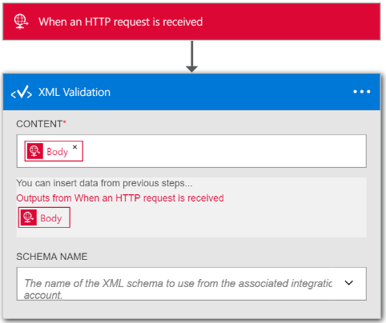

<properties 
    pageTitle="Panoramica della convalida XML nel pacchetto di integrazione Enterprise | Servizio di Microsoft Azure App | Microsoft Azure" 
    description="Informazioni sul funzionamento di convalida nelle App Enterprise Integration Pack e logica" 
    services="logic-apps" 
    documentationCenter=".net,nodejs,java"
    authors="msftman" 
    manager="erikre" 
    editor="cgronlun"/>

<tags 
    ms.service="logic-apps" 
    ms.workload="integration" 
    ms.tgt_pltfrm="na" 
    ms.devlang="na" 
    ms.topic="article" 
    ms.date="07/08/2016" 
    ms.author="deonhe"/>

# Integrazione di Enterprise con convalida XML

## Panoramica
Spesso in scenari B2B, i partner per un contratto necessario per convalidare messaggi scambiati tra loro validi prima di poter iniziare l'elaborazione dei dati. Nel pacchetto di integrazione dell'organizzazione, è possibile utilizzare il connettore convalida XML per convalidare documenti rispetto a uno schema predefinito.  

## Come eseguire la convalida di un documento con il connettore convalida XML
1. Creare una logica app e [collegarlo al proprio account di integrazione](./app-service-logic-enterprise-integration-accounts.md "su come collegare un account di integrazione per un'app di logica") che contiene lo schema che verrà utilizzato per convalidare i dati XML.
2. Aggiungere un trigger **richiesta - richiesta HTTP un quando si riceve** l'app logica  
    
3. Aggiungere l'azione **Convalida XML** dal primo selezione **per aggiungere un'azione**  
4. Immettere *xml* nella casella di ricerca per filtrare tutte le azioni a quello che si desidera utilizzare 
5. Selezionare **la convalida XML**     
   
6. Selezionare la casella di testo **del contenuto**  

7. Selezionare il tag corpo come il contenuto che verrà convalidato.   
  
8. Selezionare la casella di riepilogo **Nome dello SCHEMA** e scegliere lo schema che si desidera utilizzare per convalidare l' input *contenuto* precedente     
 
9. Salvare il lavoro  
 

A questo punto, non si desidera configurare il connettore di convalida. In un'applicazione di scenari reali, si desidera memorizzare i dati convalidati in un'applicazione line, ad esempio SalesForce. È possibile aggiungere facilmente un'azione per inviare l'output della convalida in Salesforce. 

È ora possibile verificare l'azione convalida effettuando una richiesta all'endpoint HTTP.  

## Passaggi successivi

[Altre informazioni sull'organizzazione Integration Pack] (./app-service-logic-enterprise-integration-overview.md "Informazioni sui Service Pack integrazione Enterprise")   