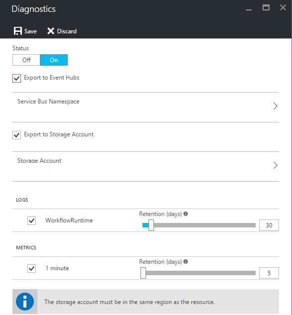

<properties 
    pageTitle="Monitorare le app logica nel servizio App Azure | Microsoft Azure" 
    description="Come visualizzare operazioni eseguite le app logica" 
    authors="jeffhollan" 
    manager="erikre" 
    editor="" 
    services="logic-apps" 
    documentationCenter=""/>

<tags
    ms.service="logic-apps"
    ms.workload="integration"
    ms.tgt_pltfrm="na"
    ms.devlang="na"
    ms.topic="article"
    ms.date="10/18/2016"
    ms.author="jehollan"/>

# <a name="monitor-your-logic-apps"></a>Monitorare le app logica

Dopo aver [creare un'app di logica](app-service-logic-create-a-logic-app.md), è possibile visualizzare la cronologia completa della relativa esecuzione nel portale di Azure.  È anche possibile impostare servizi come diagnostica Azure e Azure avvisi per monitorare gli eventi in tempo reale e degli avvisi per gli eventi desiderato "quando viene eseguito più di 5 hanno esito negativo entro un'ora."

## <a name="monitor-in-the-azure-portal"></a>Monitor nel portale di Azure

Per visualizzare la cronologia, selezionare **Sfoglia**e selezionare **App logica**. Viene visualizzato un elenco di tutte le app logica nell'abbonamento.  Selezionare l'app logica che si desidera eseguire il monitoraggio.  Verrà visualizzato un elenco di tutte le azioni e trigger che si sono verificati per questa app logica.


Esistono alcune sezioni in questo blade utili:

- **Riepilogo** sono elencati **tutti viene eseguito** e la **Cronologia di Trigger**
    - Elenco **tutto viene eseguito** l'ultima versione del logica app viene eseguita.  È possibile fare clic su una riga qualsiasi per altri dettagli nella finestra Esegui oppure fare clic sul riquadro per visualizzare un elenco più sequenze.
    - **La cronologia di trigger** Elenca tutte le attività di trigger per questa app logica.  Attività di trigger potrebbero essere un controllo "Ignorato" per i nuovi dati (ad esempio una ricerca per verificare se è stato aggiunto un nuovo file a FTP), "Riuscita", ovvero sono stati restituiti dati di un'app logica oppure "Non riuscita" corrispondente un errore nella configurazione.
- **Diagnostica** consente di visualizzare i dettagli di runtime e gli eventi e sottoscrivere [Gli avvisi di Azure](#adding-azure-alerts)

>[AZURE.NOTE] Tutti gli eventi e i dettagli di runtime vengono crittografati inattivi all'interno del servizio di logica App. Sono disponibili solo decrittografare su una richiesta di visualizzazione da un utente. Accesso a questi eventi può essere controllato anche dal controllo accesso Azure Role-Based (RBAC).

### <a name="view-the-run-details"></a>Visualizzare i dettagli della fase

In questo elenco di esecuzioni Mostra lo **stato**, l' **Ora di inizio**e la **durata** dello specifico Esegui. Selezionare una riga qualsiasi per visualizzare informazioni dettagliate su che eseguono.

La visualizzazione Monitoraggio permette di ogni passaggio della sequenza, gli input e output e messaggi di errore che potrebbero avere occurre.


Se è necessario eventuali dettagli aggiuntivi come l' esecuzione **ID di correlazione** (che può essere usata per l'API REST), è possibile fare clic sul pulsante **Dettagli esecuzione** .  Sono inclusi tutti i passaggi, stato e input/output per l'esecuzione.

## <a name="azure-diagnostics-and-alerts"></a>Avvisi e diagnostica Windows Azure

Oltre a informazioni dettagliate fornite dal portale di Azure e API REST sopra, è possibile configurare l'app logica per l'utilizzo di Azure diagnostica per altri dettagli RTF e il debug.

1. Fare clic sulla sezione **diagnostica** della stessa e di app logica
1. Fare clic per configurare le **Impostazioni di diagnostica**
1. Configurare un evento Hub o un Account di archiviazione per generare dati

    

### <a name="adding-azure-alerts"></a>Aggiunta di avvisi Azure

Una volta configurata diagnostica, è possibile aggiungere gli avvisi di Azure al momento determinate soglie sono incrociate.  In e il **diagnostica** , selezionare il riquadro **avvisi** e **Aggiungi avviso**.  Questo consentono all'utente la configurazione di un avviso in base a un numero di soglie e metriche.


È possibile configurare la **condizione**, **limite**e **periodo** in base alle esigenze.  Infine, è possibile configurare un indirizzo di posta elettronica per inviare una notifica o configurare un webhook.  È possibile utilizzare [trigger richiesta](../connectors/connectors-native-reqres.md) in un'app di logica per eseguire su un avviso anche (per eseguire operazioni come [inserimento di post nel margine di flessibilità](https://github.com/Azure/azure-quickstart-templates/tree/master/201-alert-to-slack-with-logic-app), [inviare un testo](https://github.com/Azure/azure-quickstart-templates/tree/master/201-alert-to-text-message-with-logic-app)o [aggiungere un messaggio a una coda](https://github.com/Azure/azure-quickstart-templates/tree/master/201-alert-to-queue-with-logic-app)).

### <a name="azure-diagnostics-settings"></a>Impostazioni di diagnostica Windows Azure

Ciascuno di questi eventi contiene i dettagli dell'app logica e di un evento come stato.  Ecco un esempio di un evento *ActionCompleted* :

```javascript
{
            "time": "2016-07-09T17:09:54.4773148Z",
            "workflowId": "/SUBSCRIPTIONS/80D4FE69-ABCD-EFGH-A938-9250F1C8AB03/RESOURCEGROUPS/MYRESOURCEGROUP/PROVIDERS/MICROSOFT.LOGIC/WORKFLOWS/MYLOGICAPP",
            "resourceId": "/SUBSCRIPTIONS/80D4FE69-ABCD-EFGH-A938-9250F1C8AB03/RESOURCEGROUPS/MYRESOURCEGROUP/PROVIDERS/MICROSOFT.LOGIC/WORKFLOWS/MYLOGICAPP/RUNS/08587361146922712057/ACTIONS/HTTP",
            "category": "WorkflowRuntime",
            "level": "Information",
            "operationName": "Microsoft.Logic/workflows/workflowActionCompleted",
            "properties": {
                "$schema": "2016-06-01",
                "startTime": "2016-07-09T17:09:53.4336305Z",
                "endTime": "2016-07-09T17:09:53.5430281Z",
                "status": "Succeeded",
                "code": "OK",
                "resource": {
                    "subscriptionId": "80d4fe69-ABCD-EFGH-a938-9250f1c8ab03",
                    "resourceGroupName": "MyResourceGroup",
                    "workflowId": "cff00d5458f944d5a766f2f9ad142553",
                    "workflowName": "MyLogicApp",
                    "runId": "08587361146922712057",
                    "location": "eastus",
                    "actionName": "Http"
                },
                "correlation": {
                    "actionTrackingId": "e1931543-906d-4d1d-baed-dee72ddf1047",
                    "clientTrackingId": "my-custom-tracking-id"
                },
                "trackedProperties": {
                    "myProperty": "<value>"
                }
            }
        }
```

Le due proprietà sono particolarmente utili per la registrazione e monitoraggio sono *clientTrackingId* e *trackedProperties*.  

#### <a name="client-tracking-id"></a>ID acquirente rilevamento modifiche

Il client verifica ID è un valore che verrà correlare gli eventi in un'app di logica eseguita, incluse eventuali annidate flussi di lavoro denominati come parte di un'app di logica.  Questo ID viene generato automaticamente se non è fornito, ma è possibile specificare manualmente il client verifica ID da un trigger passando un `x-ms-client-tracking-id` intestazione con il valore di ID nella richiesta di trigger (trigger richiesta, trigger HTTP o trigger webhook).

#### <a name="tracked-properties"></a>Proprietà rilevate

Proprietà rilevate possono essere aggiunti in azioni nella definizione del flusso di lavoro per tenere traccia di input o output di dati di diagnostica.  Può essere utile se si desidera tenere traccia dei dati come un "ID ordine" nel telemetria.  Per aggiungere una proprietà rilevata, includere il `trackedProperties` proprietà di un'azione.  Proprietà rilevate può solo Tieni traccia un input azioni singole e output, ma è possibile utilizzare il `correlation` proprietà degli eventi per correlare tra azioni in una sequenza.

```javascript
{
    "myAction": {
        "type": "http",
        "inputs": {
            "uri": "http://uri",
            "headers": {
                "Content-Type": "application/json"
            },
            "body": "@triggerBody()"
        },
        "trackedProperties":{
            "myActionHTTPStatusCode": "@action()['outputs']['statusCode']",
            "myActionHTTPValue": "@action()['outputs']['body']['foo']",
            "transactionId": "@action()['inputs']['body']['bar']"
        }
    }
}
```

### <a name="extending-your-solutions"></a>Estendere le soluzioni

È possibile sfruttare questa telemetria dall'Hub evento o lo spazio di archiviazione in altri servizi come [Operazioni Management Suite](https://www.microsoft.com/cloud-platform/operations-management-suite), [Azure flusso Analitica](https://azure.microsoft.com/services/stream-analytics/)e [Power BI](https://powerbi.com) per ottenere in tempo reale monitoraggio del flusso di lavoro integrazione.

## <a name="next-steps"></a>Passaggi successivi
- [Esempi e scenari per l'App logica comuni](app-service-logic-examples-and-scenarios.md)
- [Creazione di un modello di distribuzione App logica](app-service-logic-create-deploy-template.md)
- [Caratteristiche di integrazione Enterprise](app-service-logic-enterprise-integration-overview.md)
