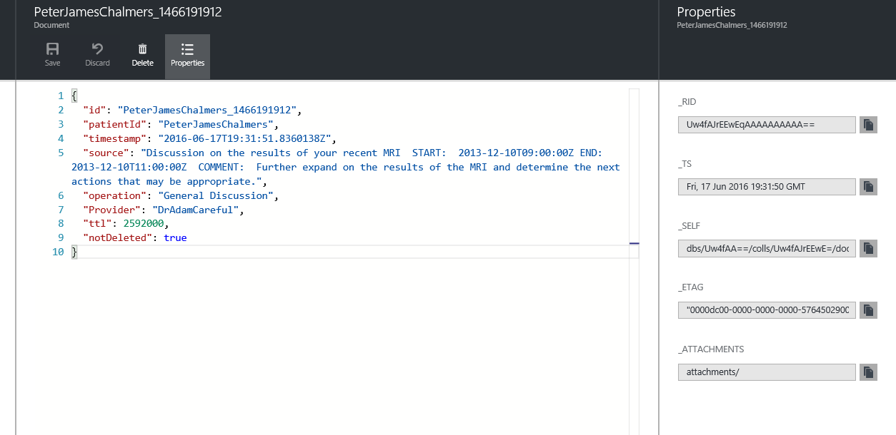

<properties
    pageTitle="Registrazione e gestione degli errori in App logica | Microsoft Azure"
    description="Visualizzare un caso di utilizzo reali dell'errore avanzata con le applicazioni di logica di registrazione e gestione"
    keywords=""
    services="logic-apps"
    authors="hedidin"
    manager="anneta"
    editor=""
    documentationCenter=""/>

<tags
    ms.service="logic-apps"
    ms.workload="na"
    ms.tgt_pltfrm="na"
    ms.devlang="na"
    ms.topic="article"
    ms.date="07/29/2016"
    ms.author="b-hoedid"/>

# <a name="logging-and-error-handling-in-logic-apps"></a>Registrazione e gestione degli errori in App logica

Questo articolo descrive come è possibile estendere un'applicazione di logica per un migliore supporto eccezioni. Si tratta di un caso di utilizzo reali e la risposta alla domanda di "Logica App supporta eccezione e la gestione degli errori?"

>[AZURE.NOTE]La versione corrente della caratteristica di logica App del servizio di Microsoft Azure App fornisce un modello standard per le risposte di azione.
>Sono inclusi convalida interno e risposte di errore restituite da un'app API.

## <a name="overview-of-the-use-case-and-scenario"></a>Panoramica del caso di utilizzo e scenari

Il brano seguente è il caso di utilizzo di questo articolo.
Un'organizzazione sanitaria nota viva l'attenzione di sviluppare una soluzione di Azure che comportano la creazione di un portale pazienti tramite Microsoft Dynamics CRM Online. Sono necessarie per inviare il record di un appuntamento tra il portale di pazienti Dynamics CRM Online e Salesforce.  Stava è necessario utilizzare lo standard [HL7 FHIR](http://www.hl7.org/implement/standards/fhir/) per tutti i record dei pazienti.

Il progetto ha due requisiti principali:  

 -  Un metodo per registrare i record inviati dal portale di Dynamics CRM Online
 -  Un modo per visualizzare gli eventuali errori che si sono verificati all'interno del flusso di lavoro


## <a name="how-we-solved-the-problem"></a>Come abbiamo risolto il problema

>[AZURE.TIP] È possibile visualizzare un video di alto livello del progetto del [Gruppo di utenti integrazione](http://www.integrationusergroup.com/do-logic-apps-support-error-handling/ "Integrazione utente del gruppo").

Si è scelto di [Azure DocumentDB](https://azure.microsoft.com/services/documentdb/ "DocumentDB Azure") come funge da archivio per i record di log e di errore (DocumentDB fa riferimento a record come documenti). Poiché App logica dispone di un modello standard per tutte le risposte, è non necessario creare uno schema personalizzato. È possibile creare un'app di API per **inserire** e **Query** per i record errore e registro. È anche possibile definire uno schema per ogni all'interno dell'app API.  

Un altro requisito è stato per eliminare i record dopo una certa data. DocumentDB ha una proprietà denominata [Time to Live](https://azure.microsoft.com/blog/documentdb-now-supports-time-to-live-ttl/ "Time to Live") (TTL), che consente di impostare un valore **Time to Live** per ogni record o una raccolta. Non è più necessario eliminare manualmente i record in DocumentDB.

### <a name="creation-of-the-logic-app"></a>Creazione dell'app logica

Il primo passaggio consiste nel creare app logica e caricarla nella finestra di progettazione. In questo esempio si utilizza App logica padre-figlio. Si supponga che è già stato creato l'elemento padre e sta per creare un'applicazione di logica figlio.

Dato che verranno essersi record proveniente dalla Dynamics CRM Online, iniziare l'esercitazione nella parte superiore. È necessario utilizzare un trigger di richiesta in quanto l'app di logica padre attiva il secondario.

> [AZURE.IMPORTANT] Per completare questa esercitazione, è necessario creare un database DocumentDB e due raccolte (registrazione ed errori).

### <a name="logic-app-trigger"></a>Trigger app logica

Si utilizza un trigger di richiesta come illustrato nell'esempio seguente.

```` json
"triggers": {
        "request": {
          "type": "request",
          "kind": "http",
          "inputs": {
            "schema": {
              "properties": {
                "CRMid": {
                  "type": "string"
                },
                "recordType": {
                  "type": "string"
                },
                "salesforceID": {
                  "type": "string"
                },
                "update": {
                  "type": "boolean"
                }
              },
              "required": [
                "CRMid",
                "recordType",
                "salesforceID",
                "update"
              ],
              "type": "object"
            }
          }
        }
      },

````


### <a name="steps"></a>Procedura

È necessario registrare l'origine (richiesta) del record pazienti dal portale di Dynamics CRM Online.

1. È necessario ottenere un nuovo record di un appuntamento dal Dynamics CRM Online.
    Trigger provenienti da CRM ci offre la **PatentId CRM**, **tipo di record**, **nuovo o aggiornato Record** (nuovo o aggiornare un valore Boolean) e **SalesforceId**. **SalesforceId** può essere null, poiché viene utilizzato solo per un aggiornamento.
    Si otterrà record CRM utilizzando il CRM **PatientID** e il **Tipo di Record**.
1. È necessario aggiungere l'app API DocumentDB **InsertLogEntry** operazione come illustrato nella figura riportata di seguito.


#### <a name="insert-log-entry-designer-view"></a>Inserimento di visualizzazione della finestra di progettazione voce log


#### <a name="insert-error-entry-designer-view"></a>Inserimento di visualizzazione della finestra di progettazione voce di errore


#### <a name="check-for-create-record-failure"></a>Controllo per creare record errore


## <a name="logic-app-source-code"></a>Codice sorgente app logica

>[AZURE.NOTE]  Di seguito sono solo gli esempi. Poiché questa esercitazione si basa su un'implementazione attualmente in produzione, il valore di un **Nodo di origine** non possono essere visualizzate le proprietà correlate alla pianificazione di un appuntamento.

### <a name="logging"></a>Registrazione
Logica app codice di esempio seguente viene illustrato come gestire la registrazione.

#### <a name="log-entry"></a>Voce di log
Questo è il codice sorgente app logica per l'inserimento di una voce di log.

``` json
"InsertLogEntry": {
        "metadata": {
        "apiDefinitionUrl": "https://.../swagger/docs/v1",
        "swaggerSource": "website"
        },
        "type": "Http",
        "inputs": {
        "body": {
            "date": "@{outputs('Gets_NewPatientRecord')['headers']['Date']}",
            "operation": "New Patient",
            "patientId": "@{triggerBody()['CRMid']}",
            "providerId": "@{triggerBody()['providerID']}",
            "source": "@{outputs('Gets_NewPatientRecord')['headers']}"
        },
        "method": "post",
        "uri": "https://.../api/Log"
        },
        "runAfter":    {
            "Gets_NewPatientecord": ["Succeeded"]
        }
}
```

#### <a name="log-request"></a>Richiesta di log

Questo è il messaggio di richiesta registro inserito all'API app.

``` json
    {
    "uri": "https://.../api/Log",
    "method": "post",
    "body": {
        "date": "Fri, 10 Jun 2016 22:31:56 GMT",
        "operation": "New Patient",
        "patientId": "6b115f6d-a7ee-e511-80f5-3863bb2eb2d0",
        "providerId": "",
        "source": "{\"Pragma\":\"no-cache\",\"x-ms-request-id\":\"e750c9a9-bd48-44c4-bbba-1688b6f8a132\",\"OData-Version\":\"4.0\",\"Cache-Control\":\"no-cache\",\"Date\":\"Fri, 10 Jun 2016 22:31:56 GMT\",\"Set-Cookie\":\"ARRAffinity=785f4334b5e64d2db0b84edcc1b84f1bf37319679aefce206b51510e56fd9770;Path=/;Domain=127.0.0.1\",\"Server\":\"Microsoft-IIS/8.0,Microsoft-HTTPAPI/2.0\",\"X-AspNet-Version\":\"4.0.30319\",\"X-Powered-By\":\"ASP.NET\",\"Content-Length\":\"1935\",\"Content-Type\":\"application/json; odata.metadata=minimal; odata.streaming=true\",\"Expires\":\"-1\"}"
        }
    }

```


#### <a name="log-response"></a>Registra risposta

Questo è il messaggio di risposta log dall'app API.

``` json
{
    "statusCode": 200,
    "headers": {
        "Pragma": "no-cache",
        "Cache-Control": "no-cache",
        "Date": "Fri, 10 Jun 2016 22:32:17 GMT",
        "Server": "Microsoft-IIS/8.0",
        "X-AspNet-Version": "4.0.30319",
        "X-Powered-By": "ASP.NET",
        "Content-Length": "964",
        "Content-Type": "application/json; charset=utf-8",
        "Expires": "-1"
    },
    "body": {
        "ttl": 2592000,
        "id": "6b115f6d-a7ee-e511-80f5-3863bb2eb2d0_1465597937",
        "_rid": "XngRAOT6IQEHAAAAAAAAAA==",
        "_self": "dbs/XngRAA==/colls/XngRAOT6IQE=/docs/XngRAOT6IQEHAAAAAAAAAA==/",
        "_ts": 1465597936,
        "_etag": "\"0400fc2f-0000-0000-0000-575b3ff00000\"",
        "patientID": "6b115f6d-a7ee-e511-80f5-3863bb2eb2d0",
        "timestamp": "2016-06-10T22:31:56Z",
        "source": "{\"Pragma\":\"no-cache\",\"x-ms-request-id\":\"e750c9a9-bd48-44c4-bbba-1688b6f8a132\",\"OData-Version\":\"4.0\",\"Cache-Control\":\"no-cache\",\"Date\":\"Fri, 10 Jun 2016 22:31:56 GMT\",\"Set-Cookie\":\"ARRAffinity=785f4334b5e64d2db0b84edcc1b84f1bf37319679aefce206b51510e56fd9770;Path=/;Domain=127.0.0.1\",\"Server\":\"Microsoft-IIS/8.0,Microsoft-HTTPAPI/2.0\",\"X-AspNet-Version\":\"4.0.30319\",\"X-Powered-By\":\"ASP.NET\",\"Content-Length\":\"1935\",\"Content-Type\":\"application/json; odata.metadata=minimal; odata.streaming=true\",\"Expires\":\"-1\"}",
        "operation": "New Patient",
        "salesforceId": "",
        "expired": false
    }
}

```

Ora possibile esaminare le operazioni di gestione degli errori.


### <a name="error-handling"></a>Gestione degli errori

Esempio di codice logica App seguente mostra come è possibile implementare la gestione degli errori.

#### <a name="create-error-record"></a>Creare record di errore

Questo è il codice sorgente logica App per la creazione di un record di errore.

``` json
"actions": {
    "CreateErrorRecord": {
        "metadata": {
        "apiDefinitionUrl": "https://.../swagger/docs/v1",
        "swaggerSource": "website"
        },
        "type": "Http",
        "inputs": {
        "body": {
            "action": "New_Patient",
            "isError": true,
            "crmId": "@{triggerBody()['CRMid']}",
            "patientID": "@{triggerBody()['CRMid']}",
            "message": "@{body('Create_NewPatientRecord')['message']}",
            "providerId": "@{triggerBody()['providerId']}",
            "severity": 4,
            "source": "@{actions('Create_NewPatientRecord')['inputs']['body']}",
            "statusCode": "@{int(outputs('Create_NewPatientRecord')['statusCode'])}",
            "salesforceId": "",
            "update": false
        },
        "method": "post",
        "uri": "https://.../api/CrMtoSfError"
        },
        "runAfter":
        {
            "Create_NewPatientRecord": ["Failed" ]
        }
    }
}          
```

#### <a name="insert-error-into-documentdb--request"></a>Errore di inserimento in DocumentDB - richiesta

``` json

{
    "uri": "https://.../api/CrMtoSfError",
    "method": "post",
    "body": {
        "action": "New_Patient",
        "isError": true,
        "crmId": "6b115f6d-a7ee-e511-80f5-3863bb2eb2d0",
        "patientId": "6b115f6d-a7ee-e511-80f5-3863bb2eb2d0",
        "message": "Salesforce failed to complete task: Message: duplicate value found: Account_ID_MED__c duplicates value on record with id: 001U000001c83gK",
        "providerId": "",
        "severity": 4,
        "salesforceId": "",
        "update": false,
        "source": "{\"Account_Class_vod__c\":\"PRAC\",\"Account_Status_MED__c\":\"I\",\"CRM_HUB_ID__c\":\"6b115f6d-a7ee-e511-80f5-3863bb2eb2d0\",\"Credentials_vod__c\",\"DTC_ID_MED__c\":\"\",\"Fax\":\"\",\"FirstName\":\"A\",\"Gender_vod__c\":\"\",\"IMS_ID__c\":\"\",\"LastName\":\"BAILEY\",\"MasterID_mp__c\":\"\",\"C_ID_MED__c\":\"851588\",\"Middle_vod__c\":\"\",\"NPI_vod__c\":\"\",\"PDRP_MED__c\":false,\"PersonDoNotCall\":false,\"PersonEmail\":\"\",\"PersonHasOptedOutOfEmail\":false,\"PersonHasOptedOutOfFax\":false,\"PersonMobilePhone\":\"\",\"Phone\":\"\",\"Practicing_Specialty__c\":\"FM - FAMILY MEDICINE\",\"Primary_City__c\":\"\",\"Primary_State__c\":\"\",\"Primary_Street_Line2__c\":\"\",\"Primary_Street__c\":\"\",\"Primary_Zip__c\":\"\",\"RecordTypeId\":\"012U0000000JaPWIA0\",\"Request_Date__c\":\"2016-06-10T22:31:55.9647467Z\",\"ONY_ID__c\":\"\",\"Specialty_1_vod__c\":\"\",\"Suffix_vod__c\":\"\",\"Website\":\"\"}",
        "statusCode": "400"
    }
}
```

#### <a name="insert-error-into-documentdb--response"></a>Errore di inserimento in DocumentDB - risposta


``` json
{
    "statusCode": 200,
    "headers": {
        "Pragma": "no-cache",
        "Cache-Control": "no-cache",
        "Date": "Fri, 10 Jun 2016 22:31:57 GMT",
        "Server": "Microsoft-IIS/8.0",
        "X-AspNet-Version": "4.0.30319",
        "X-Powered-By": "ASP.NET",
        "Content-Length": "1561",
        "Content-Type": "application/json; charset=utf-8",
        "Expires": "-1"
    },
    "body": {
        "id": "6b115f6d-a7ee-e511-80f5-3863bb2eb2d0-1465597917",
        "_rid": "sQx2APhVzAA8AAAAAAAAAA==",
        "_self": "dbs/sQx2AA==/colls/sQx2APhVzAA=/docs/sQx2APhVzAA8AAAAAAAAAA==/",
        "_ts": 1465597912,
        "_etag": "\"0c00eaac-0000-0000-0000-575b3fdc0000\"",
        "prescriberId": "6b115f6d-a7ee-e511-80f5-3863bb2eb2d0",
        "timestamp": "2016-06-10T22:31:57.3651027Z",
        "action": "New_Patient",
        "salesforceId": "",
        "update": false,
        "body": "CRM failed to complete task: Message: duplicate value found: CRM_HUB_ID__c duplicates value on record with id: 001U000001c83gK",
        "source": "{\"Account_Class_vod__c\":\"PRAC\",\"Account_Status_MED__c\":\"I\",\"CRM_HUB_ID__c\":\"6b115f6d-a7ee-e511-80f5-3863bb2eb2d0\",\"Credentials_vod__c\":\"DO - Degree level is DO\",\"DTC_ID_MED__c\":\"\",\"Fax\":\"\",\"FirstName\":\"A\",\"Gender_vod__c\":\"\",\"IMS_ID__c\":\"\",\"LastName\":\"BAILEY\",\"MterID_mp__c\":\"\",\"Medicis_ID_MED__c\":\"851588\",\"Middle_vod__c\":\"\",\"NPI_vod__c\":\"\",\"PDRP_MED__c\":false,\"PersonDoNotCall\":false,\"PersonEmail\":\"\",\"PersonHasOptedOutOfEmail\":false,\"PersonHasOptedOutOfFax\":false,\"PersonMobilePhone\":\"\",\"Phone\":\"\",\"Practicing_Specialty__c\":\"FM - FAMILY MEDICINE\",\"Primary_City__c\":\"\",\"Primary_State__c\":\"\",\"Primary_Street_Line2__c\":\"\",\"Primary_Street__c\":\"\",\"Primary_Zip__c\":\"\",\"RecordTypeId\":\"012U0000000JaPWIA0\",\"Request_Date__c\":\"2016-06-10T22:31:55.9647467Z\",\"XXXXXXX\":\"\",\"Specialty_1_vod__c\":\"\",\"Suffix_vod__c\":\"\",\"Website\":\"\"}",
        "code": 400,
        "errors": null,
        "isError": true,
        "severity": 4,
        "notes": null,
        "resolved": 0
        }
}
```

#### <a name="salesforce-error-response"></a>Risposta a un errore Salesforce

``` json
{
    "statusCode": 400,
    "headers": {
        "Pragma": "no-cache",
        "x-ms-request-id": "3e8e4884-288e-4633-972c-8271b2cc912c",
        "X-Content-Type-Options": "nosniff",
        "Cache-Control": "no-cache",
        "Date": "Fri, 10 Jun 2016 22:31:56 GMT",
        "Set-Cookie": "ARRAffinity=785f4334b5e64d2db0b84edcc1b84f1bf37319679aefce206b51510e56fd9770;Path=/;Domain=127.0.0.1",
        "Server": "Microsoft-IIS/8.0,Microsoft-HTTPAPI/2.0",
        "X-AspNet-Version": "4.0.30319",
        "X-Powered-By": "ASP.NET",
        "Content-Length": "205",
        "Content-Type": "application/json; charset=utf-8",
        "Expires": "-1"
    },
    "body": {
        "status": 400,
        "message": "Salesforce failed to complete task: Message: duplicate value found: Account_ID_MED__c duplicates value on record with id: 001U000001c83gK",
        "source": "Salesforce.Common",
        "errors": []
    }
}

```

### <a name="returning-the-response-back-to-the-parent-logic-app"></a>Restituisce la risposta tornare all'app logica padre

Dopo avere ottenuto la risposta, è possibile passare tornare all'app logica padre.

#### <a name="return-success-response-to-the-parent-logic-app"></a>Restituire risposta successo all'app logica padre

``` json
"SuccessResponse": {
    "runAfter":
        {
            "UpdateNew_CRMPatientResponse": ["Succeeded"]
        },
    "inputs": {
        "body": {
            "status": "Success"
    },
    "headers": {
    "   Content-type": "application/json",
        "x-ms-date": "@utcnow()"
    },
    "statusCode": 200
    },
    "type": "Response"
}
```

#### <a name="return-error-response-to-the-parent-logic-app"></a>Risposta di errore restituito all'app logica padre

``` json
"ErrorResponse": {
    "runAfter":
        {
            "Create_NewPatientRecord": ["Failed"]
        },
    "inputs": {
        "body": {
            "status": "BadRequest"
        },
        "headers": {
            "Content-type": "application/json",
            "x-ms-date": "@utcnow()"
        },
        "statusCode": 400
    },
    "type": "Response"
}

```


## <a name="documentdb-repository-and-portal"></a>Portale e dell'archivio DocumentDB

Soluzione aggiunta funzionalità aggiuntive con [DocumentDB](https://azure.microsoft.com/services/documentdb).

### <a name="error-management-portal"></a>Portale di gestione di errore

Per visualizzare gli errori, è possibile creare un'app web MVC per visualizzare i record di errore da DocumentDB. Sono incluse le operazioni di **elenco**, **Dettagli**, **modificare**ed **eliminare** la versione corrente.

> [AZURE.NOTE]Modificare l'operazione: DocumentDB sostituisce dell'intero documento.
> I record visualizzati **nell'elenco** e le viste di **dettaglio** sono solo gli esempi. Non sono record appuntamento pazienti effettivo.

Ecco alcuni esempi dei dettagli di app MVC creati con l'approccio descritto in precedenza.

#### <a name="error-management-list"></a>Elenco di gestione di errori


#### <a name="error-management-detail-view"></a>Visualizzazione dettagli di gestione errore


### <a name="log-management-portal"></a>Portale di gestione dei log

Per visualizzare i registri, è inoltre creata un'app web MVC.  Ecco alcuni esempi dei dettagli di app MVC creati con l'approccio descritto in precedenza.

#### <a name="sample-log-detail-view"></a>Visualizzazione di dettagli del Registro di esempio



### <a name="api-app-details"></a>Dettagli dell'API app

#### <a name="logic-apps-exception-management-api"></a>API di gestione di eccezione App logica

Apri origine logica App eccezione Gestione API applicazione fornisce le seguenti funzionalità.

Esistono due controller:

- **ErrorController** inserisce un record di errore (documento) in una raccolta di DocumentDB.
- **LogController** Inserisce un record di log (documento) in una raccolta di DocumentDB.

> [AZURE.TIP] Usare entrambi i controller `async Task<dynamic>` operazioni. In questo modo operazioni essere risolti in fase di esecuzione, in modo che è possibile creare lo schema DocumentDB nel corpo dell'operazione.

Ogni documento in DocumentDB deve avere un ID univoco. Si sta utilizzando `PatientId` e aggiunta di un timestamp viene convertito in un valore di timestamp Unix (double). Abbiamo troncare i valori in modo da rimuovere il valore frazionario.

È possibile visualizzare il codice sorgente della nostro controller Errore API [da GitHub](https://github.com/HEDIDIN/LogicAppsExceptionManagementApi/blob/master/Logic App Exception Management API/Controllers/ErrorController.cs).

Abbiamo chiamare l'API da un'app per logica utilizzando la sintassi seguente.

``` json
 "actions": {
        "CreateErrorRecord": {
          "metadata": {
            "apiDefinitionUrl": "https://.../swagger/docs/v1",
            "swaggerSource": "website"
          },
          "type": "Http",
          "inputs": {
            "body": {
              "action": "New_Patient",
              "isError": true,
              "crmId": "@{triggerBody()['CRMid']}",
              "prescriberId": "@{triggerBody()['CRMid']}",
              "message": "@{body('Create_NewPatientRecord')['message']}",
              "salesforceId": "@{triggerBody()['salesforceID']}",
              "severity": 4,
              "source": "@{actions('Create_NewPatientRecord')['inputs']['body']}",
              "statusCode": "@{int(outputs('Create_NewPatientRecord')['statusCode'])}",
              "update": false
            },
            "method": "post",
            "uri": "https://.../api/CrMtoSfError"
          },
          "runAfter": {
              "Create_NewPatientRecord": ["Failed"]
            }
        }
 }
```

L'espressione nel codice di esempio verifica dello stato *Create_NewPatientRecord* **dell'errore**.

## <a name="summary"></a>Riepilogo

- È possibile implementare la registrazione e gestione degli errori in un'app di logica.
- È possibile utilizzare DocumentDB come archivio per i record di log ed errore (documenti).
- È possibile utilizzare MVC per creare un portale per visualizzare i record di log e di errore.

### <a name="source-code"></a>Codice sorgente
Il codice sorgente per la gestione delle eccezioni logica app applicazione API è disponibile in questa [GitHub repository](https://github.com/HEDIDIN/LogicAppsExceptionManagementApi "API di gestione di logica App eccezione").


## <a name="next-steps"></a>Passaggi successivi
- [Visualizzare ulteriori esempi di logica App e scenari](app-service-logic-examples-and-scenarios.md)
- [Informazioni sulle App logica di strumenti di monitoraggio](app-service-logic-monitor-your-logic-apps.md)
- [Creare un modello di distribuzione automatica di App logica](app-service-logic-create-deploy-template.md)
