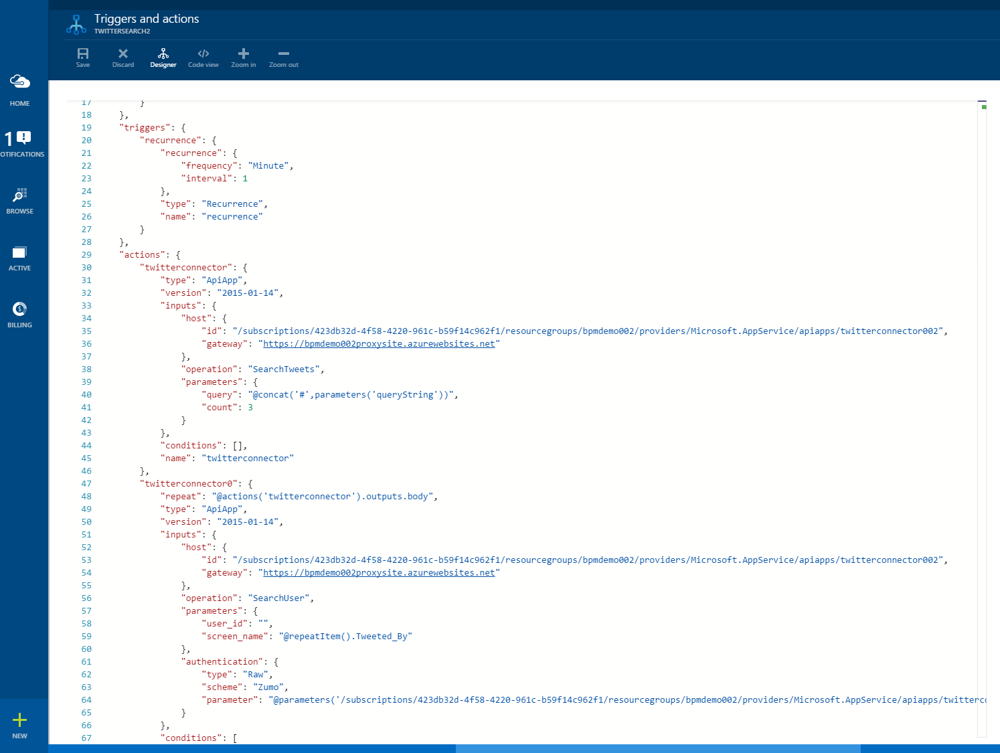

<properties 
    pageTitle="Utilizzo delle funzionalità di logica App | Microsoft Azure" 
    description="Informazioni su come usare le funzionalità avanzate di logica app." 
    authors="stepsic-microsoft-com" 
    manager="erikre" 
    editor="" 
    services="logic-apps" 
    documentationCenter=""/>

<tags
    ms.service="logic-apps"
    ms.workload="integration"
    ms.tgt_pltfrm="na"
    ms.devlang="na"
    ms.topic="article"
    ms.date="03/28/2016"
    ms.author="stepsic"/> 
    
# Usare le funzionalità App logica

Nell' [argomento precedente](app-service-logic-create-a-logic-app.md)app è stata creata la prima logica. A questo punto si illustra come creare un processo più completo utilizzando App servizi logica app. In questo argomento sono stati introdotti nuovi concetti di App logica seguenti:

- Logica condizionale, che viene eseguita un'azione solo quando una determinata condizione.
- Visualizzazione di codice per modificare un'app logica esistente.
- Opzioni per avviare un flusso di lavoro.

Prima di completare in questo argomento, è necessario completare i passaggi in [creare una nuova app logica](app-service-logic-create-a-logic-app.md). Nel [portale di Azure], passare all'app logica e fare clic su **trigger e le azioni** di riepilogo per modificare la definizione di app logica.

## Materiale di riferimento

I documenti seguenti possono risultare utili:

- [Gestione e API REST di runtime](https://msdn.microsoft.com/library/azure/mt643787.aspx) - ad esempio come richiamare direttamente App logica
- [Riferimento](https://msdn.microsoft.com/library/azure/mt643789.aspx) : un elenco completo di tutte le funzioni supportate/le espressioni
- [Tipi di trigger e azione](https://msdn.microsoft.com/library/azure/mt643939.aspx) - i diversi tipi di azioni e gli input che richiedono
- [Panoramica del servizio di App](../app-service/app-service-value-prop-what-is.md) - descrizione dei quali componenti per selezionare quando creare una soluzione

## Aggiunta di logica condizionale

Anche se il flusso originale funziona, esistono alcune aree che potrebbero essere migliorate. 

### Condizionale
Questa app logica potrebbe si ricevono grandi quantità di messaggi di posta elettronica. La procedura seguente aggiunta logica per assicurarsi di ricevere un messaggio di posta elettronica solo quando il tweet proviene da un utente con un determinato numero di FOLLOWER. 

1. Fare clic sul segno più e trovare l'azione *Utente ottenere* per Twitter.

2. Passare il campo **Tweeted da** trigger per ottenere le informazioni relative all'utente di Twitter.

    

3. Fare di nuovo clic sul segno più, ma questa volta selezionare **Aggiungi condizione**

4. Nella prima casella, fare clic su **...** di sotto di **Ottenere utente** per trovare il campo del **conteggio follower** .

5. Nell'elenco a discesa, selezionare **maggiore di**

6. Nella seconda casella digitare il numero di follower che si desidera che gli utenti.

    

7.  Infine, trascinare il messaggio di posta elettronica casella nella casella **Se Sì** . Ciò significa che solo vengono fornite messaggi di posta elettronica quando verrà soddisfatti conteggio follower.

## Ripetizione su un elenco con forEach

Ciclo forEach specifica una matrice per ripetere un'azione su. Se non è una matrice non riesce il flusso. Ad esempio, se si dispone di action1 che restituisce una matrice dei messaggi e si desidera inviare un messaggio, è possibile includere l'istruzione forEach nelle proprietà dell'azione: forEach:"@action('action1').outputs.messages"
 

## Utilizzo della visualizzazione codice per modificare un'App di logica

Oltre la finestra di progettazione, è possibile modificare direttamente il codice che definisce un'app di logica, come indicato di seguito. 

1. Fare clic sul pulsante **alla visualizzazione codice** nella barra dei comandi. 

    Verrà aperto un editor completo che mostra la definizione che appena modificata.

    

    Utilizzando l'editor di testo, è possibile copiare e incollare qualsiasi numero di azioni all'interno della stessa applicazione di logica o tra App logica. È possibile aggiungere o rimuovere intere sezioni dalla definizione facilmente ed è anche possibile condividere definizioni con altri utenti.

2. Dopo aver apportato le modifiche nella visualizzazione codice, fare semplicemente clic su **Salva**. 

### Parametri
Esistono alcune funzionalità di App logica che può essere utilizzato solo nella visualizzazione codice. Un esempio di questi è parametri. Parametri rendono più semplice riutilizzare in tutto l'app logica. Ad esempio, se si dispone di un indirizzo di posta elettronica che si desidera utilizzare in più azioni, è necessario definirla come parametro.

Le operazioni seguenti consente di aggiornare l'app logica esistente per l'utilizzo di parametri per i termini di query.

1. Nella visualizzazione codice individuare il `parameters : {}` oggetto e inserire l'oggetto argomento seguente:

        "topic" : {
            "type" : "string",
            "defaultValue" : "MicrosoftAzure"
        }
    
2. Scorrere verso il `twitterconnector` azione, individuare il valore di query e sostituirlo con `#@{parameters('topic')}`.
    È anche possibile utilizzare la funzione **concatena** per unire due o più stringhe, ad esempio: `@concat('#',parameters('topic'))` è identica a quella sopra indicata. 
 
Parametri sono un'ottima soluzione per estrarre i valori che potrebbero cambiare di molto. Sono particolarmente utili quando è necessario sostituire parametri in ambienti diversi. Per ulteriori informazioni su come sostituire parametri basati sull'ambiente, vedere la [documentazione API REST](https://msdn.microsoft.com/library/mt643787.aspx).

A questo punto, quando si fa clic su **Salva**, ogni ora si ottiene qualsiasi nuova tweet con più di 5 retweets recapitato a una cartella denominata **TWEET** il Dropbox.

Per ulteriori informazioni sulle definizioni di logica App, vedere [creare definizioni di logica di App](app-service-logic-author-definitions.md).

## Avviare un flusso di lavoro app logica
Sono disponibili diverse opzioni per avviare il flusso di lavoro definito in logica app. Un flusso di lavoro può essere sempre avviata su richiesta nel [portale di Azure].

### Trigger di ricorrenza
Un trigger di ricorrenza viene eseguito su un intervallo specificato. Quando il trigger include una logica condizionale, il trigger determina se non è necessario eseguire il flusso di lavoro. Un trigger indica deve essere eseguita tramite la restituzione di un `200` codice di stato. Quando non è necessario eseguire, viene restituito un `202` codice di stato.

### Callback utilizzando le API REST
Servizi possono chiamare un endpoint di app logica per avviare un flusso di lavoro. Per ulteriori informazioni, vedere [App logica come endpoint chiamare](app-service-logic-connector-http.md) . Per iniziare a quel tipo di app logica su richiesta, fare clic sul pulsante **Esegui** sulla barra dei comandi. 

<!-- Shared links -->
[Portale di Azure]: https://portal.azure.com 