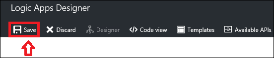

<properties
 pageTitle="Modelli di App logica | Microsoft Azure"
 description="Informazioni su come usare i modelli di app logica già creati per iniziare"
 authors="kevinlam1"
 manager="dwrede"
 editor=""
 services="app-service\logic"
 documentationCenter=""/>

<tags
    ms.service="app-service-logic"
    ms.workload="integration"
    ms.tgt_pltfrm="na"
    ms.devlang="na"
    ms.topic="article"
    ms.date="08/24/2016"
    ms.author="klam"/>

# Modelli di App logica

## Quali sono i modelli di app logica

Un modello di app logica è un'app di logica predefiniti che è possibile utilizzare per iniziare rapidamente a creare il proprio flusso di lavoro. 

Questi modelli sono un'ottima soluzione per scoprire diversi modelli che possono essere compilati utilizzando app logica. È possibile utilizzare questi modelli come- o modificarle in modo da adattarlo allo scenario.

## Panoramica dei modelli disponibili

Sono disponibili molti modelli disponibili attualmente pubblicati nella piattaforma app logica. Alcune categorie di esempio, come il tipo di connettori utilizzati, è elencato di seguito.

### Modelli aziendali cloud
Modelli che si integrano Dynamics CRM, Salesforce, casella Blob Azure e altri connettori adatti alle proprie esigenze cloud dell'organizzazione. Alcuni esempi di operazioni eseguibili con questi modelli includono organizzare le opportunità di vendita e backup dei dati di file aziendale.

### Modelli di pack integrazione Enterprise
Configurazioni di VETER (convalidare, estrarre, trasformare, arricchire, instradare) condutture, la ricezione di un X12 EDI su AS2 del documento e trasformare in formato XML, come il messaggio X12 e AS2 gestione.

### Modelli di motivo protocollo
Questi modelli sono costituiti da app logica che contengono modelli di protocollo, ad esempio risposta convocazione su HTTP, nonché le integrazioni tra FTP e SFTP. Utilizzare queste esistenti o come base per la creazione di modelli di protocollo più complessi.  

### Modelli per la produttività personale
Motivi per migliorare la produttività personale includono modelli che impostare promemoria giornalieri, importanti elementi di lavoro si trasformano in elenchi di attività e automatizzare le attività lunga fino a un passaggio di approvazione singolo utente.

### Modelli di consumer cloud
Modelli di semplici che si integrano con servizi di social networking, ad esempio Twitter, margine di flessibilità e posta elettronica, infine in grado di rafforzare social network iniziative di marketing. Sono incluse anche modelli, ad esempio la copia nuvoloso, che consentono di migliorare la produttività salvando tempo dedicato alle attività ripetitive in genere. 

## Come creare un'app di logica utilizzando un modello 

Per iniziare a usare un modello di app logica, passare nella finestra di progettazione di app logica. Se si immette la finestra di progettazione, aprire un'app logica esistente, l'app logica vengono caricati automaticamente nella visualizzazione della finestra di progettazione. Tuttavia, se si sta creando una nuova app logica, viene visualizzata la schermata seguente.  
   

Nella schermata, è possibile scegliere a partire da un'app vuota logica o a un modello predefinito. Se si seleziona uno dei modelli, vengono fornite informazioni aggiuntive. In questo esempio abbiamo utilizzare il modello *quando viene creato un nuovo file in Dropbox, copiarlo in OneDrive* .  
   

Se si sceglie di utilizzare il modello, basta selezionare il pulsante *usare questo modello* . Verrà chiesto per accedere all'account basato su quali connettori utilizza il modello. Oppure, se in precedenza è stata stabilita una connessione con questi connettori, è possibile selezionare procedere come indicato di seguito.  
   

Dopo avere stabilito la connessione e la selezione di *continuare*, l'app logica viene aperto in visualizzazione struttura.  
   

Nell'esempio precedente, come nel caso con numerosi modelli, alcuni dei campi di proprietà obbligatoria possono essere compilati all'interno di connettori. Tuttavia, alcune ancora potrebbe richiedere un valore prima di poter distribuire correttamente l'app logica. Se si tenta di distribuire senza immettere alcuni campi mancanti, riceve una notifica con un messaggio di errore.

Se si desidera tornare al visualizzatore modello, selezionare il pulsante *modelli* nella barra di spostamento superiore. Passando al visualizzatore modello, si perde qualsiasi progresso non salvato. Prima di passare al Visualizzatore di modello, si verrà visualizzato un messaggio di avviso di notifica.  
   

## Come distribuire un'app di logica creata da un modello

Dopo avere caricato il modello e apportato le modifiche desiderate, selezionare Salva pulsante nell'angolo superiore sinistro. Questa operazione Salva e pubblica l'app logica.  
   

Se si desiderano ulteriori informazioni su come aggiungere altre procedure in un modello di app logica esistente o apportare modifiche in generale, altre informazioni su [creare un'app di logica](app-service-logic-create-a-logic-app.md).