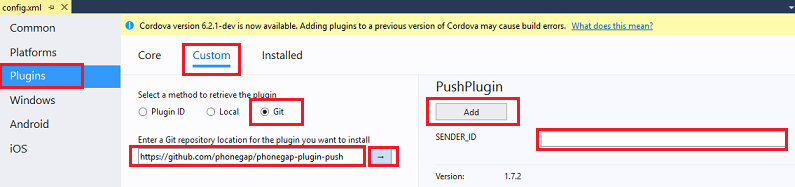
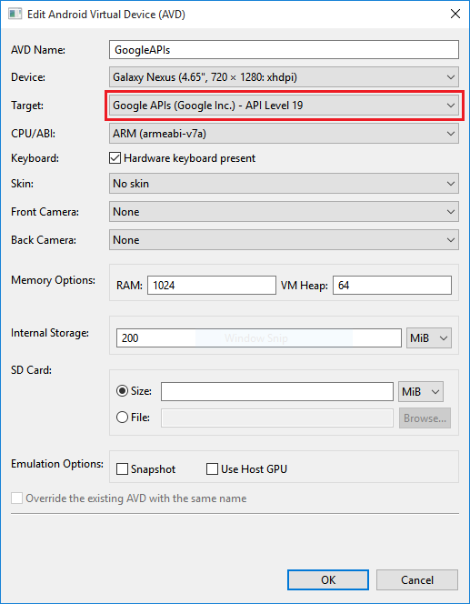

<properties
    pageTitle="Aggiungere le notifiche Push Apache Cordova App con Azure App per dispositivi mobili | Servizio App Azure"
    description="Informazioni su come usare le app Mobile Azure per inviare le notifiche push Apache Cordova all'applicazione in uso."
    services="app-service\mobile"
    documentationCenter="javascript"
    manager="erikre"
    editor=""
    authors="ysxu"/>

<tags
    ms.service="app-service-mobile"
    ms.workload="mobile"
    ms.tgt_pltfrm="mobile-html"
    ms.devlang="javascript"
    ms.topic="article"
    ms.date="10/01/2016"
    ms.author="yuaxu"/>

# Aggiungere l'app Apache Cordova le notifiche push

[AZURE.INCLUDE [app-service-mobile-selector-get-started-push](../../includes/app-service-mobile-selector-get-started-push.md)]

## Panoramica

In questa esercitazione, aggiungere le notifiche push su [Apache Cordova rapido avvia] progetto in modo che una notifica push viene inviata al dispositivo ogni volta che viene inserito un record.

Se non si utilizza il progetto di server introduttive scaricato, sarà necessario il pacchetto di estensione di notifica push. Per ulteriori informazioni, vedere [lavorare con il server di back-end .NET SDK per App Mobile Azure](app-service-mobile-dotnet-backend-how-to-use-server-sdk.md) .

##Prerequisiti

In questa esercitazione copre un'applicazione di Apache Cordova sviluppata con Visual 2015 Studio che viene eseguita nel emulatore Android di Google, un dispositivo Android, un dispositivo Windows e i dispositivi iOS.

Per completare questa esercitazione, è necessario:

* Un PC con [Visual Studio Community 2015] o versioni successive.
* [Strumenti di visual Studio per Apache Cordova].
* Un [account Azure attivo](https://azure.microsoft.com/pricing/free-trial/).
* Un progetto [Cordova Apache Guida introduttiva] completato.
* (Android) Un [account Google] con un indirizzo di posta elettronica verificato.
* (iOS) Appartenenza a un programma per sviluppatori di Apple e i dispositivi iOS (iOS simulatore non supporta push).
* (Windows) Un Account di sviluppo di Windows Store e un dispositivo con Windows 10.

##Configurare un hub di notifica

[AZURE.INCLUDE [app-service-mobile-configure-notification-hub](../../includes/app-service-mobile-configure-notification-hub.md)]

[Guardare un video che mostra i passaggi di questa sezione](https://channel9.msdn.com/series/Azure-connected-services-with-Cordova/Azure-connected-services-task-3-Create-azure-notification-hub)

##Aggiornare project server per l'invio di notifiche push

[AZURE.INCLUDE [app-service-mobile-update-server-project-for-push-template](../../includes/app-service-mobile-update-server-project-for-push-template.md)]

##Modificare l'app Cordova per ricevere notifiche push

Assicurarsi che il progetto di app Cordova Apache è pronto per gestire le notifiche push per l'installazione del plug-in push Cordova plus uno o più servizi push specifico della piattaforma.

#### Aggiornare la versione di Cordova nel progetto.

Si consiglia di aggiornare il progetto client a Cordova 6.1.1 se il progetto è configurato con una versione precedente. Per aggiornare il progetto, fare doppio clic per aprire la finestra di progettazione di configurazione config. Selezionare la scheda piattaforme e scegliere 6.1.1 nella casella di testo **Cordova CLI** .

Scegliere **compilare**e quindi **Compila soluzione** per aggiornare il progetto.

#### Installare il plug-in push

Applicazioni Cordova Apache a livello nativo non gestiscono funzionalità dispositivo o della rete.  Queste funzionalità sono fornite dal plug-in pubblicati su [npm](https://www.npmjs.com/) o su GitHub.  Il `phonegap-plugin-push` plug-in viene utilizzato per gestire le notifiche push di rete.

È possibile installare il plug-in push in uno dei modi seguenti:

**Al prompt:**

Eseguire il comando seguente:

    cordova plugin add phonegap-plugin-push

**Da Visual Studio:**

1.  In Esplora risorse, aprire la `config.xml` file fare clic su **plug-in** > **personalizzata**, selezionare **fra** come origine di installazione, quindi immettere `https://github.com/phonegap/phonegap-plugin-push` come origine.

    

2.  Fare clic sulla freccia accanto all'origine di installazione.

3. In **SENDER_ID**, se si dispone già di un ID progetto numerico per il progetto Console di sviluppo di Google, è possibile aggiungerla qui. In caso contrario, immettere un valore di segnaposto, ad esempio 777777, e se la destinazione Android è possibile aggiornare questo valore in config. XML in un secondo momento.

4. Fare clic su **Aggiungi**.

È stato installato il plug-in push.

####Installare il plug-in di dispositivo

Seguire la stessa procedura usato per installare il plug-in push, ma si possono trovare il plug-in di dispositivo nell'elenco plug-in base (fare clic su **plug-in** > **Core** a trovarla). È necessario il plug-in per ottenere il nome della piattaforma (`device.platform`).

#### Registrare il dispositivo per push all'avvio

Inizialmente, si includerà codice minimo per Android. In un secondo momento, si verranno apportare alcune modifiche small per l'esecuzione in iOS o Windows 10.

1. Aggiungere una chiamata a **registerForPushNotifications** durante il callback per la procedura di accesso o nella parte inferiore del metodo **onDeviceReady** :

        // Login to the service.
        client.login('google')
            .then(function () {
                // Create a table reference
                todoItemTable = client.getTable('todoitem');

                // Refresh the todoItems
                refreshDisplay();

                // Wire up the UI Event Handler for the Add Item
                $('#add-item').submit(addItemHandler);
                $('#refresh').on('click', refreshDisplay);

                    // Added to register for push notifications.
                registerForPushNotifications();

            }, handleError);

    In questo esempio mostra la chiamata **registerForPushNotifications** dopo l'autenticazione ha avuto esito positivo, che è consigliabile quando si utilizza l'autenticazione e le notifiche push nell'app.

2. Aggiungere il nuovo metodo di **registerForPushNotifications** come segue:

        // Register for Push Notifications. Requires that phonegap-plugin-push be installed.
        var pushRegistration = null;
        function registerForPushNotifications() {
          pushRegistration = PushNotification.init({
              android: { senderID: 'Your_Project_ID' },
              ios: { alert: 'true', badge: 'true', sound: 'true' },
              wns: {}
          });

        // Handle the registration event.
        pushRegistration.on('registration', function (data) {
          // Get the native platform of the device.
          var platform = device.platform;
          // Get the handle returned during registration.
          var handle = data.registrationId;
          // Set the device-specific message template.
          if (platform == 'android' || platform == 'Android') {
              // Register for GCM notifications.
              client.push.register('gcm', handle, {
                  mytemplate: { body: { data: { message: "{$(messageParam)}" } } }
              });
          } else if (device.platform === 'iOS') {
              // Register for notifications.            
              client.push.register('apns', handle, {
                  mytemplate: { body: { aps: { alert: "{$(messageParam)}" } } }
              });
          } else if (device.platform === 'windows') {
              // Register for WNS notifications.
              client.push.register('wns', handle, {
                  myTemplate: {
                      body: '<toast><visual><binding template="ToastText01"><text id="1">$(messageParam)</text></binding></visual></toast>',
                      headers: { 'X-WNS-Type': 'wns/toast' } }
              });
          }
        });

        pushRegistration.on('notification', function (data, d2) {
          alert('Push Received: ' + data.message);
        });

        pushRegistration.on('error', handleError);
        }

3. (Android) Nel codice precedente, sostituire `Your_Project_ID` con il valore numerico ID di progetto per un'app dalla [Console di sviluppo di Google].

## (Facoltativo) Configurare ed eseguire l'app in Android

Completare questa sezione per attivare le notifiche push per Android.

####Abilitare Firebase Cloud messaggistica

Poiché destinazione la piattaforma Google Android inizialmente, è necessario attivare la messaggistica Cloud Firebase. Analogamente, se è utilizzato per dispositivi Microsoft Windows, attivare WNS supporto.

[AZURE.INCLUDE [notification-hubs-enable-firebase-cloud-messaging](../../includes/notification-hubs-enable-firebase-cloud-messaging.md)]

####Configurare il back-end App Mobile per inviare richieste push utilizzando FCM

[AZURE.INCLUDE [app-service-mobile-android-configure-push](../../includes/app-service-mobile-android-configure-push.md)]

####Configurare l'app Cordova per Android

Nell'app Cordova, aprire config. XML e sostituire `Your_Project_ID` con il valore numerico ID di progetto per un'app dalla [Console di sviluppo di Google].

        <plugin name="phonegap-plugin-push" version="1.7.1" src="https://github.com/phonegap/phonegap-plugin-push.git">
            <variable name="SENDER_ID" value="Your_Project_ID" />
        </plugin>

Aprire index.js e aggiornare il codice per usare l'ID di progetto numerico.

        pushRegistration = PushNotification.init({
            android: { senderID: 'Your_Project_ID' },
            ios: { alert: 'true', badge: 'true', sound: 'true' },
            wns: {}
        });

####Configurare un dispositivo Android per il debug USB

Prima di distribuire l'applicazione al dispositivo Android, è necessario attivare il debug USB.  Nel telefono Android, procedere come segue:

1. Passare a **Impostazioni** > **su telefono**, quindi toccare il **numero di Build** fino a modalità sviluppatore è attivata (circa 7 volte).

2. In **Impostazioni** > **Opzioni sviluppatore** attivare **il debug USB**, quindi collegare il telefono Android al computer tramite un cavo USB di sviluppo.

Sono stati testati si usa un dispositivo X Google Nexus 5 esegue Android 6.0 (caramella).  Tuttavia, le tecniche sono comuni a qualsiasi versione Android moderno.

#### Installazione di Google Play Services

Plug-in push si basa su Android Google Play Services per le notifiche push.  

1.  In **Visual Studio**, fare clic su **Strumenti** > **Android** > **Android SDK Manager**, espandere la cartella **extra** e selezionare la casella per assicurarsi che ognuna delle seguenti SDK sia installato.
    * Android 2.3 o versione successiva
    * Revisione di archivio di Google 27 o versioni successiva
    * Google Play Services 9.0.2 dei o versioni successive

2.  Fare clic su **Installa package** e attendere il completamento dell'installazione.

Corrente necessarie raccolte sono elencate nella [documentazione di installazione push di plug-in phonegap].

#### Notifiche push di test nell'app in Android

È possibile le notifiche push test adesso eseguendo l'app e l'inserimento di elementi nella tabella TodoItem. È possibile eseguire questa operazione dal dispositivo stesso o da un dispositivo secondo come si usa lo stessa back-end. Provare l'app Cordova sulla piattaforma Android in uno dei modi seguenti:

- **In un dispositivo fisico:**  
Collegare il dispositivo Android nel computer di sviluppo tramite un cavo USB.  Invece di **Google Android emulatore**, selezionare **dispositivo**. Verrà distribuire l'applicazione al dispositivo ed eseguirlo.  È quindi possibile interagire con l'applicazione sul dispositivo.  
Migliorare l'esperienza di sviluppo.  La condivisione di applicazioni, ad esempio [Mobizen] dello schermo può risultare utili per lo sviluppo di un'applicazione di Android proiettando schermo Android a un web browser sul PC.

- **In un emulatore Android:**  
Sono disponibili ulteriori passaggi di configurazione richieste durante l'esecuzione su un emulatore.

    Verificare che si sta per distribuzione o il debug su un dispositivo virtuale che dispone di Google APIs impostare come destinazione, come illustrato di seguito in Gestione dispositivi virtuale Android (AVD).

    

    Se si desidera utilizzare un processore x86 emulatore, è [installare il driver HAXM](https://taco.visualstudio.com/en-us/docs/run-app-apache/#HAXM) e configurare l'emulatore usarlo.

    Aggiungere un account di Google in un dispositivo Android facendo clic su **App** > **Impostazioni** > **Aggiungi account**e quindi seguire le istruzioni visualizzate per aggiungere un Google esistente account al dispositivo (è consigliabile utilizzare un account esistente anziché crearne uno nuovo).

    

    Eseguire l'app di elenco attività come prima di inserire un nuovo elemento todo. In questo caso, viene visualizzata un'icona di notifica nell'area di notifica. È possibile aprire il cassetto della notifica per visualizzare il testo completo della notifica.

    

##(Facoltativo) Configurare ed eseguire in iOS

In questa sezione è per l'esecuzione del progetto Cordova in dispositivi iOS. È possibile ignorare questa sezione se non si lavora con i dispositivi iOS.

####Installare ed eseguire l'agente di remotebuild iOS in un servizio cloud o Mac

Prima di eseguire un'app Cordova in iOS utilizzando Visual Studio, seguire i passaggi indicati nella [Guida all'installazione di iOS](http://taco.visualstudio.com/en-us/docs/ios-guide/) per installare ed eseguire l'agente remotebuild.

Assicurarsi che è possibile creare l'app per iOS. I passaggi indicati nella Guida alla configurazione è necessario creare per iOS da Visual Studio. Se non si dispone di un computer Mac, è possibile creare per iOS tramite l'agente di remotebuild in un servizio come MacInCloud. Per ulteriori informazioni, vedere [eseguire l'app iOS nel cloud](http://taco.visualstudio.com/en-us/docs/build_ios_cloud/).

>[AZURE.NOTE] Per utilizzare il plug-in push in iOS, è necessario XCode 7 o versione successiva.

####Trovare l'ID da utilizzare come ID App

Prima di registrare l'app per le notifiche push, config. XML aperto nell'applicazione Cordova trovare il `id` valore nell'elemento widget dell'attributo e copiarla per successivi utilizzi. Il seguente codice XML, l'ID è `io.cordova.myapp7777777`.

        <widget defaultlocale="en-US" id="io.cordova.myapp7777777"
        version="1.0.0" windows-packageVersion="1.1.0.0" xmlns="http://www.w3.org/ns/widgets"
            xmlns:cdv="http://cordova.apache.org/ns/1.0" xmlns:vs="http://schemas.microsoft.com/appx/2014/htmlapps">

Utilizzare questo identificatore in un secondo momento, quando si crea un ID App nel portale per sviluppatori di Apple. (Se si crea un ID diverso App nel portale di sviluppo e da usare che, sarà necessario eseguire alcune operazioni aggiuntive più avanti in questa esercitazione per modificare questo ID in config. L'ID nell'elemento widget deve corrispondere l'ID di App nel portale per sviluppatori.)

####Registrare l'app per le notifiche push nel portale per sviluppatori di Apple

[AZURE.INCLUDE [Enable Apple Push Notifications](../../includes/enable-apple-push-notifications.md)]

[Guardare un video che mostra una procedura simile](https://channel9.msdn.com/series/Azure-connected-services-with-Cordova/Azure-connected-services-task-5-Set-up-apns-for-push)

####Configurare Azure per inviare le notifiche push

[AZURE.INCLUDE [app-service-mobile-apns-configure-push](../../includes/app-service-mobile-apns-configure-push.md)]

####Verificare che il proprio ID App corrisponda l'app Cordova

Se l'ID di App creata nell'Account di sviluppo di Apple già corrisponde all'ID dell'elemento widget in config. XML, è possibile ignorare questo passaggio. Tuttavia, se non corrispondono agli ID, eseguire le operazioni seguenti:

1. Eliminare la cartella piattaforme dal progetto.

2. Eliminare la cartella plug-in dal progetto.

3. Eliminare la cartella node_modules dal progetto.

4. Aggiornare l'attributo id dell'elemento widget in config usare l'ID di App creata nell'Account di sviluppo di Apple.

5. Rigenerare il progetto.

#####Notifiche push di test nell'app iOS

1. In Visual Studio, verificare che sia selezionata che **iOS** come destinazione di distribuzione e quindi scegliere **dispositivo** per l'esecuzione in un dispositivo iOS connessi.

    È possibile eseguire in un dispositivo iOS collegato al PC tramite iTunes. IOS simulatore non supporta le notifiche push.

2. Premere il pulsante **Esegui** o **F5** in Visual Studio per generare il progetto e avviare l'app in un dispositivo iOS, quindi fare clic su **OK** per accettare le notifiche push.

    >[AZURE.NOTE] È necessario accettare in modo esplicito notifiche push dell'app. Questa richiesta si verifica solo la prima volta che viene eseguita l'app.

3. Nell'app, digitare un'attività e quindi fare clic sul segno più (+) sull'icona.

4. Verificare che si riceve una notifica, quindi fare clic su OK per chiudere la notifica.

##(Facoltativo) Configurare ed eseguire in Windows

In questa sezione è per l'esecuzione del progetto di app Apache Cordova in dispositivi Windows 10 (il plug-in push PhoneGap è supportato in Windows 10). Se non si lavora con i dispositivi di Windows, è possibile ignorare questa sezione.

####Registrare l'app di Windows per le notifiche push con WNS

Per usare le opzioni di archiviazione in Visual Studio, selezionare un valore di destinazione Windows dall'elenco piattaforme soluzione, ad esempio **Windows x86** o **x64 Windows** (evitare **AnyCPU di Windows** per le notifiche push).

[AZURE.INCLUDE [app-service-mobile-register-wns](../../includes/app-service-mobile-register-wns.md)]

[Guardare un video che mostra una procedura simile](https://channel9.msdn.com/series/Azure-connected-services-with-Cordova/Azure-connected-services-task-6-Set-up-wns-for-push)

####Configurare l'hub di notifica per WNS

[AZURE.INCLUDE [app-service-mobile-configure-wns](../../includes/app-service-mobile-configure-wns.md)]

####Configurare l'app Cordova per supportare le notifiche push di Windows

Aprire la finestra di progettazione di configurazione (pulsante destro del mouse su config. XML e selezionare **Progettazione**), selezionare la scheda di **Windows** e scegliere **Windows 10** in **Versione di destinazione di Windows**.

>[AZURE.NOTE] Se si utilizza una versione Cordova prima Cordova 5.1.1 (6.1.1 consigliato), è necessario impostare anche il contrassegno in grado di tipo avviso popup su true in config.

Per supportare push notifiche nel predefinito (debug) build, build.json Apri file. Copiare la configurazione di "release" alla configurazione debug.

        "windows": {
            "release": {
                "packageCertificateKeyFile": "res\\native\\windows\\CordovaApp.pfx",
                "publisherId": "CN=yourpublisherID"
            }
        }

Dopo l'aggiornamento del codice precedente dovrebbe risultare analoga alla seguente.

    "windows": {
        "release": {
            "packageCertificateKeyFile": "res\\native\\windows\\CordovaApp.pfx",
            "publisherId": "CN=yourpublisherID"
            },
        "debug": {
            "packageCertificateKeyFile": "res\\native\\windows\\CordovaApp.pfx",
            "publisherId": "CN=yourpublisherID"
            }
        }

Creare l'app e verificare che non siano presenti errori. Client app dovrebbe ora eseguire la registrazione per le notifiche di back-end App Mobile. Ripetere questa sezione per ogni progetto Windows della soluzione.

####Notifiche push test nelle applicazioni di Windows

In Visual Studio, assicurarsi che sia selezionata una piattaforma Windows come destinazione di distribuzione, ad esempio **Windows x86**o **x64 Windows** . Per eseguire l'app in un PC con Windows 10 hosting Visual Studio, scegliere **Computer locale**.

Fare clic sul pulsante Esegui per compilare il progetto e avviare l'app.

Nell'app, digitare un nome per un nuovo todoitem e quindi fare clic sul segno più (+) sull'icona per aggiungerlo.

Verificare che si riceve una notifica quando l'elemento viene aggiunto.

##Passaggi successivi

* Informazioni sull' [Hub di notifica] per conoscere le notifiche push.
* Se non è già stato fatto, continuare l'esercitazione con [l'Aggiunta di autenticazione] Apache Cordova all'applicazione in uso.

Informazioni su come usare gli SDK.

* [Apache Cordova SDK]
* [Server di ASP.NET SDK]
* [Server Node SDK]

<!-- URLs -->
[Aggiunta di autenticazione]: app-service-mobile-cordova-get-started-users.md
[Guida introduttiva Cordova Apache]: app-service-mobile-cordova-get-started.md
[authentication]: app-service-mobile-cordova-get-started-users.md
[Work with the .NET backend server SDK for Azure Mobile Apps]: app-service-mobile-dotnet-backend-how-to-use-server-sdk.md
[Account di Google]: http://go.microsoft.com/fwlink/p/?LinkId=268302
[Console di sviluppo di Google]: https://console.developers.google.com/home/dashboard
[documentazione di installazione push di plug-in phonegap]: https://github.com/phonegap/phonegap-plugin-push/blob/master/docs/INSTALLATION.md
[Mobizen]: https://www.mobizen.com/
[Community di Visual Studio 2015]: http://www.visualstudio.com/
[Strumenti di Visual Studio per Apache Cordova]: https://www.visualstudio.com/en-us/features/cordova-vs.aspx
[Hub di notifica]: ../notification-hubs/notification-hubs-push-notification-overview.md
[Apache Cordova SDK]: app-service-mobile-cordova-how-to-use-client-library.md
[Server di ASP.NET SDK]: app-service-mobile-dotnet-backend-how-to-use-server-sdk.md
[Server Node SDK]: app-service-mobile-node-backend-how-to-use-server-sdk.md
