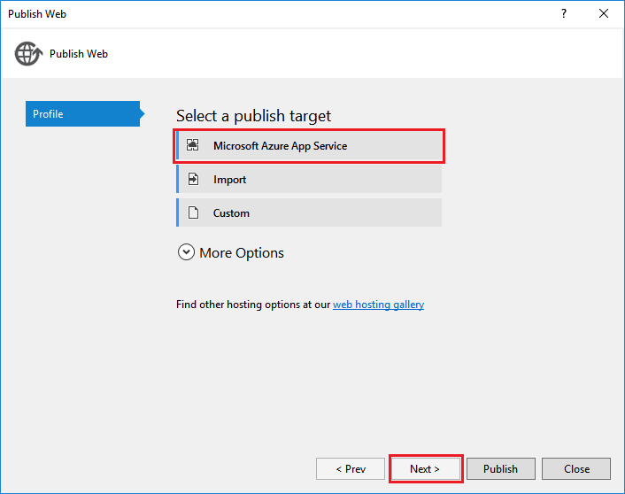

<properties
    pageTitle="Come collaborare con il server di back-end .NET SDK per App Mobile | Servizio App Azure"
    description="Informazioni su come lavorare con il server di back-end .NET SDK per App di Azure App servizio Mobile."
    keywords="servizio di App, servizio app azure, app per dispositivi mobili, servizio mobile, scala, scalable, app distribuzione, azure app distribuzione"
    services="app-service\mobile"
    documentationCenter=""
    authors="adrianhall"
    manager="erikre"
    editor=""/>

<tags
    ms.service="app-service-mobile"
    ms.workload="mobile"
    ms.tgt_pltfrm="mobile-multiple"
    ms.devlang="dotnet"
    ms.topic="article"
    ms.date="10/01/2016"
    ms.author="adrianha"/>

# Lavorare con il server di back-end .NET SDK per App Mobile Azure

[AZURE.INCLUDE [app-service-mobile-selector-server-sdk](../../includes/app-service-mobile-selector-server-sdk.md)]

In questo argomento viene illustrato come utilizzare il server di back-end .NET SDK in scenari principali app di Azure App servizio Mobile. Azure Mobile App SDK consente di lavorare con i client mobili dall'applicazione ASP.NET.

>[AZURE.TIP] Il [server di .NET SDK per App Mobile Azure] [ 2] è open source in GitHub. Il repository contiene tutto il codice sorgente tra il gruppo di test intero server SDK unità e alcuni progetti di esempio.

## Documentazione di riferimento

La documentazione di riferimento per il server SDK si trova in: [Azure Mobile app .NET riferimento][1].

## Procedura: creare un back-end App Mobile .NET

Se si avvia un nuovo progetto, è possibile creare un'applicazione di servizio App tramite il [portale di Azure] e Visual Studio. È possibile eseguire l'applicazione di servizio App in locale o pubblicare il progetto per l'app per dispositivi mobili App servizio basato sul cloud.  

Se si stanno aggiungendo funzionalità mobile a un progetto esistente, vedere la sezione [Download e inizializzare SDK](#install-sdk) .

### Creare un back-end .NET tramite il portale di Azure

Per creare un servizio di App per dispositivi mobili la copia nel server, uno seguire l' [esercitazione rapida] [ 3] o eseguire la procedura seguente:

[AZURE.INCLUDE [app-service-mobile-dotnet-backend-create-new-service-classic](../../includes/app-service-mobile-dotnet-backend-create-new-service-classic.md)]

Di nuovo nel e il _per iniziare_ , nella scheda **Crea una tabella API**, scegliere **c#** come la **lingua di back-end**. Fare clic su **Scarica**, estrarre i file di progetto compressi al computer locale e aprire la soluzione in Visual Studio.

### Creare un back-end .NET mediante Visual Studio 2013 e Visual Studio 2015

Installare [Azure SDK per .NET] [ 4] (versione 2.9.0 o versioni successive) per creare un progetto App Mobile Azure in Visual Studio. Dopo aver installato il SDK, creare un'applicazione ASP.NET mediante la procedura seguente:

1. Aprire la finestra di dialogo **Nuovo progetto** (dal *File* > **Nuovo** > **progetto...**).
2. Espandere **modelli** > **Visual c#**e selezionare **Web**.
3. Selezionare **l'applicazione Web ASP.NET**.
4. Immettere il nome del progetto. Fare clic su **OK**.
5. In _ASP.NET 4.5.2 modelli_, selezionare **App Mobile Azure**. Verificare l' **Host nel cloud** per creare un back-end per dispositivi mobili nel cloud a cui è possibile pubblicare il progetto.
6. Fare clic su **OK**.

## Procedura: scaricare e inizializzare SDK

SDK è disponibile in [NuGet.org]. Il pacchetto include la funzionalità di base necessaria per iniziare a utilizzare il SDK. Per inizializzare SDK, è necessario eseguire azioni su oggetto **HttpConfiguration** .

### Installare SDK

Per installare SDK, fare clic su project server in Visual Studio, selezionare **Gestisci pacchetti NuGet**, eseguire una ricerca per il pacchetto di [Microsoft.Azure.Mobile.Server] , quindi fare clic su **Installa**.

###Inizializzare project server

Un progetto di server di back-end .NET viene inizializzato simile ad altri progetti ASP.NET facilmente individuabili perché includono una classe di avvio OWIN. Verificare che si è fatto riferimento il pacchetto NuGet `Microsoft.Owin.Host.SystemWeb`. Per aggiungere questa classe in Visual Studio, fare clic su progetto server e selezionare **Aggiungi** > 
**Nuovo elemento**, quindi **Web** > **generali** > **OWIN avvio classe**.  Viene generata una classe con l'attributo seguente:

    [assembly: OwinStartup(typeof(YourServiceName.YourStartupClassName))]

Nel `Configuration()` metodo della classe di avvio delle OWIN, utilizzare un oggetto **HttpConfiguration** per configurare l'ambiente di App Mobile Azure.
Nell'esempio seguente consente di inizializzare il progetto di server con nessuna funzionalità aggiuntive:

    // in OWIN startup class
    public void Configuration(IAppBuilder app)
    {
        HttpConfiguration config = new HttpConfiguration();

        new MobileAppConfiguration()
            // no added features
            .ApplyTo(config);

        app.UseWebApi(config);
    }

Per abilitare la funzionalità di singoli, è necessario chiamare metodi di estensione sull'oggetto **MobileAppConfiguration** prima di chiamare **Applica**. Ad esempio, il codice seguente aggiunge route predefinite per tutti i controller di API che dispongono dell'attributo `[MobileAppController]` durante l'inizializzazione:

    new MobileAppConfiguration()
        .MapApiControllers()
        .ApplyTo(config);

Guida rapida di server dal portale di Azure chiama **UseDefaultConfiguration()**. Questo equivalente per le seguenti impostazioni:

        new MobileAppConfiguration()
            .AddMobileAppHomeController()             // from the Home package
            .MapApiControllers()
            .AddTables(                               // from the Tables package
                new MobileAppTableConfiguration()
                    .MapTableControllers()
                    .AddEntityFramework()             // from the Entity package
                )
            .AddPushNotifications()                   // from the Notifications package
            .MapLegacyCrossDomainController()         // from the CrossDomain package
            .ApplyTo(config);

I metodi di estensione utilizzati sono:

* `AddMobileAppHomeController()`fornisce la home page predefinita App Mobile Azure.
* `MapApiControllers()`funzionalità di supporto personalizzato API per WebAPI controller decorata con la `[MobileAppController]` attributo.
* `AddTables()`fornisce un mapping del `/tables` i punti finali al controller di tabella.
* `AddTablesWithEntityFramework()`è disponibile una breve per il mapping di `/tables` controller basati su endpoint utilizzando il Framework entità.
* `AddPushNotifications()`fornisce un semplice metodo di registrazione di dispositivi per hub di notifica.
* `MapLegacyCrossDomainController()`fornisce le intestazioni CORS standard per lo sviluppo locale.

### Estensioni SDK

I pacchetti di estensione basato su NuGet seguenti forniscono varie caratteristiche di dispositivi mobili che possono essere utilizzati dall'applicazione in uso. Per attivare le estensioni durante l'inizializzazione, usando l'oggetto **MobileAppConfiguration** .

- [Microsoft.Azure.Mobile.Server.Quickstart] supporta la configurazione di App Mobile base. Aggiungere la configurazione chiamando il metodo di estensione **UseDefaultConfiguration** durante l'inizializzazione. Questa estensione include le seguenti estensioni: le notifiche, l'autenticazione, entità, tabelle, domini e pacchetti Home. Questo pacchetto viene utilizzato per la Guida introduttiva App Mobile disponibili nel portale di Azure.

- [Microsoft.Azure.Mobile.Server.Home](http://www.nuget.org/packages/Microsoft.Azure.Mobile.Server.Home/) 
   implementa predefinito *questa app per dispositivi mobili sia in esecuzione pagina* per la radice del sito web. Aggiungere la configurazione utilizzando il metodo di estensione   **AddMobileAppHomeController** .

- [Microsoft.Azure.Mobile.Server.Tables](http://www.nuget.org/packages/Microsoft.Azure.Mobile.Server.Tables/) 
   include le classi per l'utilizzo di dati e set-up pipeline di dati. Aggiungere la configurazione utilizzando il metodo di estensione **AddTables** .

- [Microsoft.Azure.Mobile.Server.Entity](http://www.nuget.org/packages/Microsoft.Azure.Mobile.Server.Entity/) 
   consente al Framework entità per accedere ai dati nel Database di SQL. Aggiungere la configurazione utilizzando il metodo di estensione **AddTablesWithEntityFramework** .

- [Microsoft.Azure.Mobile.Server.Authentication] consente l'autenticazione e set-up middleware OWIN utilizzato per convalidare i token. Aggiungere la configurazione chiamando **AddAppServiceAuthentication**  
   e **IAppBuilder**. Metodi di estensione **UseAppServiceAuthentication** .

- [Microsoft.Azure.Mobile.Server.Notifications] Abilita notifiche push e definisce un endpoint di registrazione push. Aggiungere la configurazione utilizzando il metodo di estensione **AddPushNotifications** .

- [Microsoft.Azure.Mobile.Server.CrossDomain](http://www.nuget.org/packages/Microsoft.Azure.Mobile.Server.CrossDomain/) 
   crea un controller che fornisce dati per i browser web legacy dell'App Mobile. Aggiungere la configurazione utilizzando il metodo di estensione   **MapLegacyCrossDomainController** .

- [Microsoft.Azure.Mobile.Server.Login] fornisce il metodo AppServiceLoginHandler.CreateToken(), che viene utilizzato durante gli scenari di autenticazione personalizzata statico.   

## Procedura: pubblicare il progetto di server

In questa sezione viene illustrato come pubblicare un progetto di back-end .NET da Visual Studio. È inoltre possibile distribuire il progetto di back-end con fra o uno dei metodi trattati nella [documentazione relativa alla distribuzione di Azure App servizio](../app-service-web/web-sites-deploy.md).

1. In Visual Studio, rigenerare il progetto per ripristinare NuGet pacchetti.

2. In Esplora soluzioni fare clic sul progetto, fare clic su **pubblica**. La prima volta che si pubblica, è necessario definire un profilo di pubblicazione. Quando si dispone già di un profilo definito, è possibile selezionarla e fare clic su **pubblica**.

2. Se viene richiesto di selezionare una destinazione di pubblicazione, fare clic su **Servizio di Microsoft Azure App** > **successivo**, quindi, se necessario, effettuare l'accesso con le credenziali di Azure. 
   Download di Visual Studio e sicuro memorizza le impostazioni direttamente da Azure di pubblicazione.

    

3. Scegliere l' **abbonamento**, selezionare **Il tipo di risorsa** dalla **visualizzazione**, espandere **App Mobile**e fare clic sul back-end App Mobile, quindi fare clic su **OK**.

    

4. Verificare le informazioni sul profilo di pubblicazione e fare clic su **pubblica**.

    

    Quando il back-end App Mobile pubblicato, viene visualizzata una pagina di destinazione che indica la riuscita.

    

##Procedura: definire un controller di tabella

Definire un Controller di tabella per esporre una tabella SQL per client mobili.  Configurazione di un Controller di tabella richiede tre passaggi:

1. Creare una classe oggetto di trasferire dati (DTO).
2. Configurare un riferimento di tabella nella classe DbContext Mobile.
3. Creare un controller di tabella.

Un oggetto di trasferire dati (DTO) è un oggetto c# semplice che eredita `EntityData`.  Per esempio:

    public class TodoItem : EntityData
    {
        public string Text { get; set; }
        public bool Complete {get; set;}
    }

Il DTO viene utilizzato per definire la tabella nel database SQL.  Per creare la voce del database, aggiungere un `DbSet<>` DbContext si usa la proprietà.  In modello di progetto predefinito per le App per dispositivi mobili Azure, si chiama la DbContext `Models\MobileServiceContext.cs`:

    public class MobileServiceContext : DbContext
    {
        private const string connectionStringName = "Name=MS_TableConnectionString";

        public MobileServiceContext() : base(connectionStringName)
        {

        }

        public DbSet<TodoItem> TodoItems { get; set; }

        protected override void OnModelCreating(DbModelBuilder modelBuilder)
        {
            modelBuilder.Conventions.Add(
                new AttributeToColumnAnnotationConvention<TableColumnAttribute, string>(
                    "ServiceColumnTable", (property, attributes) => attributes.Single().ColumnType.ToString()));
        }
    }

Se si dispone di Azure SDK installato, è ora possibile creare un controller di tabella modello come indicato di seguito:

1. Pulsante destro del mouse sulla cartella controller e selezionare **Aggiungi** > **Controller...**.
2. Selezionare l'opzione di **Azure Mobile App tabella Controller** , quindi fare clic su **Aggiungi**.
3. Nella finestra di dialogo **Aggiungi Controller** :
    * Nell'elenco a discesa **classe modello** , selezionare il nuovo DTO.
    * Nell'elenco a discesa **DbContext** , selezionare la classe DbContext servizio Mobile.
    * Il nome del Controller viene creata automaticamente.
4. Fare clic su **Aggiungi**.

Il progetto di server Guida introduttiva contiene un esempio per un semplice **TodoItemController**.

### Procedura: modificare le dimensioni di spostamento della tabella

Per impostazione predefinita, App Mobile Azure restituisce 50 record per ogni richiesta.  Spostamento garantisce che il client non vincolano la loro thread dell'interfaccia utente né server troppo a lungo, garantendo un'esperienza utente ottimale. Per modificare le dimensioni della tabella suddivisione in pagine, aumenta il lato server "query dimensione consentito" e lato server la dimensione della pagina sul lato client "query dimensione consentita" viene regolata con la `EnableQuery` attributo:

    [EnableQuery(PageSize = 500)]

Assicurarsi che il valore di PageSize è uguale o maggiore della dimensione richiesta dal client.  Fare riferimento ai client specifico documentazione delle procedure per informazioni dettagliate su come modificare le dimensioni della pagina client.

## Procedura: definire un controller di API personalizzato

Controller di API personalizzato offre la funzionalità di base per il back-end App Mobile, esposizione di un estremo. È possibile registrare un controller di API specifiche mobile utilizzando l'attributo [MobileAppController]. Il `MobileAppController` attributo registra la route configura automaticamente il serializzatore JSON App Mobile e attiva il [controllo della versione client](app-service-mobile-client-and-server-versioning.md).

1. In Visual Studio, fare clic sulla cartella controller, quindi fare clic su **Aggiungi** > **Controller**, selezionare **Controller 2 API Web&mdash;vuota** e fare clic su **Aggiungi**.

2. Fornire un **nome di Controller**, ad esempio `CustomController`, fare clic su **Aggiungi**.

3. In nuovo file di classe controller, aggiungere la seguente istruzione:

        using Microsoft.Azure.Mobile.Server.Config;

4. Applicare l'attributo **[MobileAppController]** per la definizione della classe controller API, come illustrato nell'esempio seguente:

        [MobileAppController]
        public class CustomController : ApiController
        {
              //...
        }

4. Nel file App_Start/Startup.MobileApp.cs, aggiungere una chiamata al metodo di estensione **MapApiControllers** , come illustrato nell'esempio seguente:

        new MobileAppConfiguration()
            .MapApiControllers()
            .ApplyTo(config);

È inoltre possibile utilizzare il `UseDefaultConfiguration()` metodo di estensione anziché `MapApiControllers()`. Qualsiasi controller che non ha **MobileAppControllerAttribute** applicati è ancora possibile accedervi dai client, ma che può essere utilizzata non correttamente dai client tramite un client Mobile App SDK.

## Procedura: lavorare con l'autenticazione

Azure App Mobile utilizza l'autenticazione di servizio App / autorizzazione per proteggere il back-end per dispositivi mobili.  In questa sezione viene descritto come eseguire le attività seguenti relativi all'autenticazione di un progetto di server di back-end .NET:

+ [Procedura: aggiungere l'autenticazione a un progetto server](#add-auth)
+ [Procedura: utilizzare l'autenticazione personalizzato per l'applicazione](#custom-auth)
+ [Procedura: recuperare autenticato informazioni utente](#user-info)
+ [Procedura: limitare l'accesso ai dati per gli utenti autorizzati](#authorize)

### Procedura: aggiungere l'autenticazione a un progetto server

È possibile aggiungere l'autenticazione al progetto server estendere l'oggetto **MobileAppConfiguration** e configurando middleware OWIN. Quando si installa il pacchetto di [Microsoft.Azure.Mobile.Server.Quickstart] e si chiama il metodo di estensione **UseDefaultConfiguration** , è possibile procedere al passaggio 3.

1. In Visual Studio, installare il pacchetto [Microsoft.Azure.Mobile.Server.Authentication] .

2. Nel file di progetto Startup.cs aggiungere la riga di codice seguente all'inizio del metodo **configurazione** :

        app.UseAppServiceAuthentication(config);

    Questo componente middleware OWIN convalida i token emessi gateway App servizio associato.

3. Aggiungere il `[Authorize]` dell'attributo a qualsiasi controller o metodo che richiede l'autenticazione. 

Per informazioni su come autenticare i client per il back-end App Mobile, vedere [aggiungere autenticazione all'app](app-service-mobile-ios-get-started-users.md).

### Procedura: utilizzare l'autenticazione personalizzato per l'applicazione

Se non si desidera utilizzare uno dei provider di servizi di autenticazione/autorizzazione App del servizio, è possibile implementare sistema di accesso. Installare il pacchetto di [Microsoft.Azure.Mobile.Server.Login] per contribuire alla generazione token di autenticazione.  Fornire il proprio codice per la convalida le credenziali dell'utente. Ad esempio, è possibile estrarre contro salt e hashing password in un database. Nell'esempio seguente, la `isValidAssertion()` metodo, definito altrove, è responsabile per questi controlli.

Autenticazione personalizzata viene esposta creando un ApiController e esposizione `register` e `login` azioni. Il client deve utilizzare un'interfaccia utente personalizzata per raccogliere le informazioni da parte dell'utente.  Le informazioni viene quindi inviate all'API con una chiamata HTTP POST standard. Dopo il server convalida l'asserzione, rilasciato un token utilizzando il `AppServiceLoginHandler.CreateToken()` metodo.  L'utilizzo **non** ApiController il `[MobileAppController]` attributo. 

Un esempio `login` azione:

        public IHttpActionResult Post([FromBody] JObject assertion)
        {
            if (isValidAssertion(assertion)) // user-defined function, checks against a database
            {
                JwtSecurityToken token = AppServiceLoginHandler.CreateToken(new Claim[] { new Claim(JwtRegisteredClaimNames.Sub, assertion["username"]) },
                    mySigningKey,
                    myAppURL,
                    myAppURL,
                    TimeSpan.FromHours(24) );
                return Ok(new LoginResult()
                {
                    AuthenticationToken = token.RawData,
                    User = new LoginResultUser() { UserId = userName.ToString() }
                });
            }
            else // user assertion was not valid
            {
                return this.Request.CreateUnauthorizedResponse();
            }
        }

Nell'esempio precedente, LoginResult e LoginResultUser sono riguardo esporre le proprietà necessarie. Il client prevede le risposte di accesso vengano restituiti come oggetti JSON del modulo:

        {
            "authenticationToken": "<token>",
            "user": {
                "userId": "<userId>"
            }
        }

Il `AppServiceLoginHandler.CreateToken()` metodo include un _gruppo di destinatari_ e un parametro _emittente_ . Entrambi i parametri sono impostate per l'URL del dominio principale dell'applicazione, utilizzando lo schema HTTPS. In modo analogo è necessario impostare _secretKey_ sia che il valore dell'applicazione chiave di firma. Non distribuire la chiave della firma in un client come possono essere utilizzato per Farcia alla tasti e rappresentare utenti. È possibile ottenere la chiave di firma mentre ospitato nel servizio App facendo riferimento il _sito Web\_AUTH\_firma\_chiave_ variabile di ambiente. Se necessario in un contesto di debug locale, seguire le istruzioni nella sezione [locale il debug autenticazione](#local-debug) per recuperare la chiave e archiviarlo come impostazione dell'applicazione.

Token emessi possono includere altre controversie e una data di scadenza.  Minima, il token emesso deve includere una domanda di oggetto (**sub**).

È possibile supportare client standard `loginAsync()` metodo overload route l'autenticazione.  Se il client chiama `client.loginAsync('custom');` per l'accesso, è necessario essere l'itinerario `/.auth/login/custom`.  È possibile impostare la distribuzione del controller di autenticazione personalizzati utilizzando `MapHttpRoute()`:

    config.Routes.MapHttpRoute("custom", ".auth/login/custom", new { controller = "CustomAuth" });

>[AZURE.TIP] Utilizzo di `loginAsync()` approccio garantisce che il token di autenticazione è collegato a ogni chiamata successiva al servizio.

###Procedura: recuperare autenticato informazioni utente

Quando un utente viene autenticato dal servizio di App, è possibile accedere l'ID utente assegnato e altre informazioni nel codice .NET back-end. Le informazioni utente possono essere utilizzate per prendere decisioni relative alle autorizzazioni in back-end. Il codice seguente ottiene l'ID utente associato a una richiesta:

    // Get the SID of the current user.
    var claimsPrincipal = this.User as ClaimsPrincipal;
    string sid = claimsPrincipal.FindFirst(ClaimTypes.NameIdentifier).Value;

Il SID deriva dall'ID utente specifiche del provider e statico per un determinato utente e il provider di accesso.  Il SID è null per i token di autenticazione non valido.

Servizio di App è anche possibile richiedere specifiche sulle attestazioni dal provider di accesso. Ogni provider di identità può fornire informazioni mediante il provider di identità SDK.  Ad esempio, è possibile utilizzare l'API di Facebook grafico per informazioni sugli amici.  È possibile specificare delle attestazioni richiesti in e il provider nel portale di Azure. Alcune delle attestazioni richiedono un'ulteriore configurazione con il provider di identità.

Il codice seguente chiama il metodo di estensione **GetAppServiceIdentityAsync** per ottenere le credenziali di accesso, che includono il token di accesso necessario per rendere richieste per l'API di Facebook grafico:

    // Get the credentials for the logged-in user.
    var credentials =
        await this.User
        .GetAppServiceIdentityAsync<FacebookCredentials>(this.Request);

    if (credentials.Provider == "Facebook")
    {
        // Create a query string with the Facebook access token.
        var fbRequestUrl = "https://graph.facebook.com/me/feed?access_token="
            + credentials.AccessToken;

        // Create an HttpClient request.
        var client = new System.Net.Http.HttpClient();

        // Request the current user info from Facebook.
        var resp = await client.GetAsync(fbRequestUrl);
        resp.EnsureSuccessStatusCode();

        // Do something here with the Facebook user information.
        var fbInfo = await resp.Content.ReadAsStringAsync();
    }

Aggiungere un tramite istruzione per `System.Security.Principal` per fornire il metodo di estensione **GetAppServiceIdentityAsync** .

### Procedura: limitare l'accesso ai dati per gli utenti autorizzati

Nella sezione precedente è stato illustrato come recuperare l'ID utente di un utente autenticato. È possibile limitare l'accesso ai dati e altre risorse in base a questo valore. Ad esempio aggiungendo una colonna ID utente alle tabelle e filtrare i risultati della query per l'ID utente è un modo semplice per limitare i dati restituiti solo a utenti autorizzati. Il codice seguente restituisce righe di dati solo quando il SID associa il valore nella colonna ID utente nella tabella TodoItem:

    // Get the SID of the current user.
    var claimsPrincipal = this.User as ClaimsPrincipal;
    string sid = claimsPrincipal.FindFirst(ClaimTypes.NameIdentifier).Value;

    // Only return data rows that belong to the current user.
    return Query().Where(t => t.UserId == sid);

Il `Query()` restituisce un `IQueryable` che possono essere modificati da LINQ per gestire il filtro.

## Procedura: aggiungere push notifiche a un progetto server

Aggiungere le notifiche push al progetto server estendendo l'oggetto **MobileAppConfiguration** e creazione di un client hub di notifica.

1. In Visual Studio, fare clic sul progetto server e fare clic su **Gestisci pacchetti NuGet**, cercare `Microsoft.Azure.Mobile.Server.Notifications`, quindi fare clic su **Installa**. 

2. Ripetere questo passaggio per installare il `Microsoft.Azure.NotificationHubs` pacchetto, che include la raccolta di client hub di notifica.

3. In App_Start/Startup.MobileApp.cs e aggiungere una chiamata al metodo di estensione **AddPushNotifications()** durante l'inizializzazione:

        new MobileAppConfiguration()
            // other features...
            .AddPushNotifications()
            .ApplyTo(config);

4. Aggiungere il codice seguente che consente di creare un client hub di notifica:

        // Get the settings for the server project.
        HttpConfiguration config = this.Configuration;
        MobileAppSettingsDictionary settings =
            config.GetMobileAppSettingsProvider().GetMobileAppSettings();

        // Get the Notification Hubs credentials for the Mobile App.
        string notificationHubName = settings.NotificationHubName;
        string notificationHubConnection = settings
            .Connections[MobileAppSettingsKeys.NotificationHubConnectionString].ConnectionString;

        // Create a new Notification Hub client.
        NotificationHubClient hub = NotificationHubClient
            .CreateClientFromConnectionString(notificationHubConnection, notificationHubName);

È ora possibile usare il client di notifica hub di inviare le notifiche push ai dispositivi registrati. Per ulteriori informazioni, vedere [aggiungere le notifiche push per l'app](app-service-mobile-ios-get-started-push.md). Per altre informazioni sull'hub di notifica, vedere [Panoramica di hub di notifica](../notification-hubs/notification-hubs-push-notification-overview.md).

##Procedura: abilitare destinate push utilizzando i tag

Notifica hub consente di inviare le notifiche di destinazione a registrazioni specifiche utilizzando tag. Tag diversi vengono creati automaticamente:

* L'ID di installazione identifica un dispositivo specifico.
* L'Id utente in base all'identificatore di protezione autenticato identifica un utente specifico.

L'ID di installazione è possibile accedervi dalla proprietà **ID di installazione** **MobileServiceClient**.  Nell'esempio seguente viene illustrato come utilizzare un ID di installazione per aggiungere un contrassegno a un'installazione a specifica nell'hub di notifica:

    hub.PatchInstallation("my-installation-id", new[]
    {
        new PartialUpdateOperation
        {
            Operation = UpdateOperationType.Add,
            Path = "/tags",
            Value = "{my-tag}"
        }
    });

Eventuali tag fornito dal client durante la registrazione di notifica push vengono ignorate dal back-end durante la creazione dell'installazione. Per abilitare un client aggiungere tag per l'installazione, è necessario creare un'API personalizzata che consente di aggiungere contrassegni con il motivo precedente. 

Vedere [tag di notifica push Client aggiunto] [ 5] nell'esempio di Guida introduttiva completa App Mobile servizio App per un esempio.

##Procedura: consente di inviare notifiche push per un utente autenticato

Quando un utente autenticato registrati per le notifiche push, un tag ID utente verrà automaticamente aggiunti alla registrazione. Con questo tag, è possibile inviare le notifiche push per tutti i dispositivi registrati da tale persona. Il codice seguente ottiene il SID dell'utente che effettua la richiesta e invia una notifica push di modello a ogni iscrizione dispositivo per tale persona:

    // Get the current user SID and create a tag for the current user.
    var claimsPrincipal = this.User as ClaimsPrincipal;
    string sid = claimsPrincipal.FindFirst(ClaimTypes.NameIdentifier).Value;
    string userTag = "_UserId:" + sid;

    // Build a dictionary for the template with the item message text.
    var notification = new Dictionary<string, string> { { "message", item.Text } };

    // Send a template notification to the user ID.
    await hub.SendTemplateNotificationAsync(notification, userTag);

Durante la registrazione per le notifiche push da un client autenticato, assicurarsi che l'autenticazione è stata completata prima di eseguire la registrazione. Per ulteriori informazioni, vedere [Push agli utenti] [ 6] nel campione Guida introduttiva completa App Mobile servizio App per .NET back-end.

## Procedura: eseguire il Debug e risolvere i problemi di .NET Server SDK

Servizio di App Azure offre diversi debug e risoluzione dei problemi tecniche per le applicazioni ASP.NET:

- [Monitoraggio di un servizio di App Azure](../app-service-web/web-sites-monitor.md)
- [Attivare la registrazione diagnostica nel servizio App Azure](../app-service-web/web-sites-enable-diagnostic-log.md)
- [Risolvere i problemi di un servizio di App Azure in Visual Studio](../app-service-web/web-sites-dotnet-troubleshoot-visual-studio.md)

### Registrazione

È possibile scrivere a log diagnostici App servizio mediante la scrittura di traccia ASP.NET standard. Prima di poter scrivere ai registri, è necessario abilitare diagnostica nel back-end App Mobile.

Per attivare la diagnostica e scrivere i log:

1. Seguire la procedura descritta in [come abilitare diagnostica](../app-service-web/web-sites-enable-diagnostic-log.md#enablediag).

2. Aggiungere la seguente istruzione nel file di codice:

        using System.Web.Http.Tracing;

3. Creare un writer traccia scrivere da back-end .NET registri diagnostici, come indicato di seguito:

        ITraceWriter traceWriter = this.Configuration.Services.GetTraceWriter();
        traceWriter.Info("Hello, World");

4. Pubblicare il progetto server e accedere a back-end App Mobile per eseguire il percorso del codice con la registrazione.

5. Scaricare e valutare i log, come descritto in [come: scaricare registri](../app-service-web/web-sites-enable-diagnostic-log.md#download).

### Il debug autenticazione locale

È possibile eseguire l'applicazione localmente per verificare le modifiche prima di pubblicarli nel cloud. Per la maggior parte dei back-end App Mobile Azure, premere *F5* in Visual Studio. Esistono tuttavia alcune considerazioni quando si utilizza l'autenticazione.

È necessario disporre un'app per dispositivi mobili basate su cloud con App servizio di autenticazione/autorizzazione configurato e il client deve disporre endpoint del cloud specificato come host di accesso alternativo. Vedere la documentazione per la piattaforma client per i passaggi specifici necessari.

Assicurarsi che i dispositivi mobili back-end disponga [Microsoft.Azure.Mobile.Server.Authentication] installato. Quindi, in classe di avvio dell'applicazione OWIN, aggiungere la seguente azione dopo `MobileAppConfiguration` è stato applicato il `HttpConfiguration`:

        app.UseAppServiceAuthentication(new AppServiceAuthenticationOptions()
        {
            SigningKey = ConfigurationManager.AppSettings["authSigningKey"],
            ValidAudiences = new[] { ConfigurationManager.AppSettings["authAudience"] },
            ValidIssuers = new[] { ConfigurationManager.AppSettings["authIssuer"] },
            TokenHandler = config.GetAppServiceTokenHandler()
        });

Nell'esempio precedente, è necessario configurare le impostazioni di applicazione _authAudience_ e _authIssuer_ all'interno del file config a ogni essere l'URL del dominio principale dell'applicazione, utilizzando lo schema HTTPS. In modo analogo è necessario impostare _authSigningKey_ sia che il valore dell'applicazione chiave di firma. Per ottenere la chiave di firma:

1. Passare all'app all'interno del [portale di Azure] 
2. Fare clic su **Strumenti**, **Kudu**, **passare**.
3. Nel sito di gestione Kudu, fare clic su **ambiente**.
4. Trovare il valore per _sito Web\_AUTH\_firma\_chiave_. 

Utilizzare la chiave di firma per il parametro _authSigningKey_ nel file config applicazione locale.  Il back-end mobile è dotato di ora per convalidare i token durante l'esecuzione in locale, il client ottiene il token da endpoint basato sul cloud.

[1]: https://msdn.microsoft.com/library/azure/dn961176.aspx
[2]: https://github.com/Azure/azure-mobile-apps-net-server
[3]: app-service-mobile-ios-get-started.md
[4]: https://azure.microsoft.com/downloads/
[5]: https://github.com/Azure-Samples/app-service-mobile-dotnet-backend-quickstart/blob/master/README.md#client-added-push-notification-tags
[6]: https://github.com/Azure-Samples/app-service-mobile-dotnet-backend-quickstart/blob/master/README.md#push-to-users
[Portale di Azure]: https://portal.azure.com
[NuGet.org]: http://www.nuget.org/
[Microsoft.Azure.Mobile.Server]: http://www.nuget.org/packages/Microsoft.Azure.Mobile.Server/
[Microsoft.Azure.Mobile.Server.Quickstart]: http://www.nuget.org/packages/Microsoft.Azure.Mobile.Server.Quickstart/
[Microsoft.Azure.Mobile.Server.Authentication]: http://www.nuget.org/packages/Microsoft.Azure.Mobile.Server.Authentication/
[Microsoft.Azure.Mobile.Server.Login]: http://www.nuget.org/packages/Microsoft.Azure.Mobile.Server.Login/
[Microsoft.Azure.Mobile.Server.Notifications]: http://www.nuget.org/packages/Microsoft.Azure.Mobile.Server.Notifications/
[MapHttpAttributeRoutes]: https://msdn.microsoft.com/library/dn479134(v=vs.118).aspx

