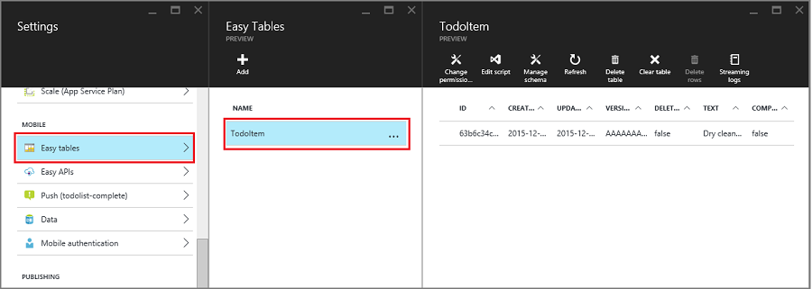

<properties
    pageTitle="Come collaborare con il server di back-end Node SDK per App Mobile | Servizio App Azure"
    description="Informazioni su come lavorare con il server di back-end Node SDK per App di Azure App servizio Mobile."
    services="app-service\mobile"
    documentationCenter=""
    authors="adrianhall"
    manager="erikre"
    editor=""/>

<tags
    ms.service="app-service-mobile"
    ms.workload="mobile"
    ms.tgt_pltfrm="mobile-multiple"
    ms.devlang="node"
    ms.topic="article"
    ms.date="10/01/2016"
    ms.author="adrianha"/>

# Come usare Azure Mobile App Node SDK

[AZURE.INCLUDE [app-service-mobile-selector-server-sdk](../../includes/app-service-mobile-selector-server-sdk.md)]

Questo articolo fornisce informazioni dettagliate ed esempi che mostra come lavorare con un back-end Node nell'App Mobile di Azure App servizio.

## Introduzione

App di Azure App servizio Mobile offre la possibilità di aggiungere un accesso ai dati ottimizzata API Web a un'applicazione web.  Il servizio di Azure App Mobile App SDK è disponibile per le applicazioni web ASP.NET e Node.  SDK fornisce le seguenti operazioni:

- Operazioni con tabelle (lettura, inserimento, aggiornamento, eliminazione) per accedere ai dati
- Operazioni personalizzate API

Entrambe le operazioni di forniscono per l'autenticazione per tutti i provider di identità consentiti dal servizio di App Azure, inclusi i provider di identità di social networking, ad esempio Facebook, Twitter, Google e Microsoft, nonché Azure Active Directory per identità dell'organizzazione.

È possibile trovare esempi per ogni caso di utilizzo nella [directory di esempi su GitHub].

## Piattaforme supportate

Azure Mobile App nodo SDK supporta la versione corrente di risultati del nodo e versioni successive.  Stesura, l'ultima versione di risultati è nodo v4.5.0.  Altre versioni di nodo funzionino, ma non sono supportate.

Azure Mobile App nodo SDK supporta due driver di database: il driver di nodo mssql supporta SQL Azure e istanze di SQL Server locale.  Il driver sqlite3 supporta SQLite database in una singola istanza.

### Procedura: creare un back-end Node base dalla riga di comando

Ogni back-end Azure App servizio Mobile App Node inizia come un'applicazione ExpressJS.  ExpressJS è più popolari web servizio framework per Node.  È possibile creare un basic applicazione [Express] come descritto di seguito:

1. In una finestra di PowerShell o un comando, creare una directory per il progetto.

        mkdir basicapp

2. Eseguire npm inizializzazione per inizializzare la struttura del pacchetto.

        cd basicapp
        npm init

    Il comando di inizializzazione npm richiede un insieme di domande inizializzare il progetto.  Visualizzare l'output di esempio:

    ![L'output di inizializzazione npm][0]

3. Installare le librerie express e App di mobile azure dal repository npm.

        npm install --save express azure-mobile-apps

4. Creare un file di app.js per implementare il base server per dispositivi mobili.

        var express = require('express'),
            azureMobileApps = require('azure-mobile-apps');

        var app = express(),
            mobile = azureMobileApps();

        // Define a TodoItem table
        mobile.tables.add('TodoItem');

        // Add the mobile API so it is accessible as a Web API
        app.use(mobile);

        // Start listening on HTTP
        app.listen(process.env.PORT || 3000);

Questa applicazione crea un WebAPI ottimizzato per dispositivi mobili con un unico endpoint (`/tables/TodoItem`) che fornisce l'accesso non autenticato a un archivio di dati SQL sottostante utilizzando uno schema dinamico.  È adatto per dopo l'avvio rapido raccolta client:

- [Guida introduttiva di Client Android]
- [Guida introduttiva Cordova Client Apache]
- [Guida introduttiva di Client iOS]
- [Guida introduttiva di Client di Windows Store]
- [Guida introduttiva Xamarin.iOS Client]
- [Guida introduttiva Xamarin.Android Client]
- [Guida introduttiva Xamarin.Forms Client]

È possibile trovare il codice dell'applicazione di base nel [campione basicapp su GitHub].

### Procedura: creare un nodo back-end con Visual Studio 2015

Visual Studio 2015 richiede un'estensione per lo sviluppo di applicazioni Node all'interno dell'IDE.  Per iniziare, installare [Node 1.1 Tools per Visual Studio].  Dopo avere installati gli strumenti di node per Visual Studio, creare un'applicazione di 4 Express:

1. Aprire la finestra di dialogo **Nuovo progetto** (dal **File** > **Nuovo** > **progetto...**).

2. Espandere **modelli** > **JavaScript** > **Node**.

3. Selezionare l' **applicazione di base Azure Node Express 4**.

4. Immettere il nome del progetto.  Fare clic su *OK*.

    ![Nuovo progetto di Visual Studio 2015][1]

5. Il pulsante destro il nodo **npm** e selezionare **Installa nuovi pacchetti di npm...**.

6. Potrebbe essere necessario aggiornare il catalogo npm sulla creazione di un'applicazione di Node.  Se necessario, fare clic su **Aggiorna** .

7. Immettere _app di azure mobile_ nella casella di ricerca.  Fare clic su pacchetto **app di mobile azure 2.0.0** , quindi fare clic su **Installa pacchetto**.

    ![Installare nuovi pacchetti npm][2]

8. Fare clic su **Chiudi**.

9. Aprire il file _app.js_ per aggiungere supporto per Azure Mobile App SDK.  Nella riga at 6 nella parte inferiore della raccolta richiedono istruzioni, aggiungere il codice seguente:

        var bodyParser = require('body-parser');
        var azureMobileApps = require('azure-mobile-apps');

    Circa riga 27 dopo le altre istruzioni app.use, aggiungere il codice seguente:

        app.use('/users', users);

        // Azure Mobile Apps Initialization
        var mobile = azureMobileApps();
        mobile.tables.add('TodoItem');
        app.use(mobile);

    Salvare il file.

10. Eseguire l'applicazione in locale (l'API sia served in http://localhost:3000) o pubblicare in Azure.

### Procedura: creare un back-end Node tramite il portale di Azure

È possibile creare un diritto di back-end App Mobile nel [portale di Azure]. È possibile seguire la procedura seguente o creare un client e server insieme seguendo l'esercitazione [creare un'app per dispositivi mobili](app-service-mobile-ios-get-started.md) . L'esercitazione contiene una versione semplificata di queste istruzioni ed è adatto per prova di progetti concetto.

[AZURE.INCLUDE [app-service-mobile-dotnet-backend-create-new-service-classic](../../includes/app-service-mobile-dotnet-backend-create-new-service-classic.md)]

Di nuovo nel e il _per iniziare_ , nella scheda **Crea una tabella API**, scegliere **Node** come la **lingua di back-end**. Selezionare la casella relativa "**confermo che verranno sovrascritti tutti contenuto del sito.**", quindi fare clic su **Crea TodoItem tabella**.

### Procedura: scaricare il progetto di codice Guida introduttiva di back-end Node utilizzando fra

Quando si crea un back-end App Mobile Node tramite il portale **introduttive** blade, un Node creato e distribuzione progetto al sito. È possibile aggiungere tabelle e le API e modificare file di codice per back-end Node nel portale. È anche possibile utilizzare diversi strumenti di distribuzione per scaricare il progetto di back-end in modo che è possibile aggiungere o modificare tabelle e le API quindi ripubblicare il progetto. Per ulteriori informazioni, vedere la [Guida alla distribuzione di Azure App Service]. la procedura seguente viene utilizzato un repository fra per scaricare il codice di progetto Guida introduttiva.

1. Installare fra, se non è già stato fatto. I passaggi necessari per installare fra variano tra i sistemi operativi. Per distribuzioni specifiche del sistema operativo e indicazioni per l'installazione, vedere [Fra l'installazione](http://git-scm.com/book/en/Getting-Started-Installing-Git) .

2. Seguire i passaggi descritti in [abilitare l'archivio di app del servizio di App](../app-service-web/app-service-deploy-local-git.md#Step3) per abilitare l'archivio fra per il sito di back-end, effettuare una nota di distribuzione nome utente e password.

3. In blade per il back-end App Mobile, prendere nota dell'impostazione **fra Clona URL** .

4. Eseguire il `git clone` comando utilizzando operazioni Duplica URL, immettere la password quando richiesto, come illustrato nell'esempio seguente:

        $ git clone https://username@todolist.scm.azurewebsites.net:443/todolist.git

5. Passare alla directory locale, ossia nell'esempio precedente /todolist e notare che il file di progetto sono stati scaricati. Individuare il `todoitem.json` dei file nel `/tables` directory.  Questo file definisce autorizzazioni della tabella.  Anche il `todoitem.js` file nella stessa directory, che definisce l'operazione CRUD script per la tabella.

6. Dopo che sono state apportate modifiche ai file di progetto, eseguire i comandi seguenti per aggiungere, eseguire il commit e quindi caricare le modifiche nel sito:

        $ git commit -m "updated the table script"
        $ git push origin master

    Quando si aggiungono nuovi file al progetto, è innanzitutto necessario eseguire il `git add .` comando.

Il sito è ripubblicare ogni volta che viene inserito un nuovo set di commit al sito.

### Procedura: pubblicare il back-end Node Azure

Microsoft Azure fornisce numerosi meccanismi per la pubblicazione il back-end Azure App servizio Mobile App Node al servizio di Azure.  Ad esempio che utilizzano strumenti di distribuzione integrati in Visual Studio, strumenti della riga di comando e opzioni di distribuzione continua in base a controllo del codice sorgente.  Per ulteriori informazioni su questo argomento, vedere la [Guida alla distribuzione di Azure App Service].

Servizio App Azure sono suggerimenti specifici per applicazione Node che è necessario verificare prima di distribuire:

- Come [specificare la versione di nodo]
- Come [usare i moduli di nodo]

### Procedura: abilitare una Home Page dell'applicazione

Molte applicazioni sono una combinazione di web e App per dispositivi mobili e il framework degli ExpressJS consente di combinare due aspetti.  In alcuni casi, tuttavia, si consiglia di implementare solo un'interfaccia per dispositivi mobili.  È utile per fornire una pagina di destinazione per assicurarsi che il servizio di app sia in esecuzione.  È possibile fornire la propria home page o consentire a una pagina home temporanea.  Per abilitare la pagina iniziale temporanea, utilizzare le operazioni seguenti per creare un'istanza di Azure Mobile App:

    var mobile = azureMobileApps({ homePage: true });

Se si vuole questa opzione è disponibile solo quando si sviluppano in locale, è possibile aggiungere questa impostazione per il `azureMobile.js` file.

## Operazioni di tabella 

App di mobile azure Node Server SDK offre meccanismi per esporre le tabelle dati archiviate nel Database di SQL Azure come un WebAPI.  Sono disponibili cinque operazioni.

| Operazione | Descrizione |
| --------- | ----------- |
| OTTENERE /tables/_tablename_ | Ottenere tutti i record nella tabella |
| OTTENERE /tables/_tablename_/:id | Ottenere un record specifico nella tabella |
| POST /tables/_tablename_ | Creare un record della tabella |
| PATCH /tables/_tablename_/:id | Aggiornare un record della tabella |
| ELIMINARE /tables/_tablename_/:id | Eliminare un record della tabella |

Questo WebAPI supporta [OData] ed estende lo schema di tabella per il supporto di [sincronizzazione di dati non in linea].

### Procedura: definire le tabelle utilizzando uno schema dinamico

Prima di utilizzare una tabella, è necessario definire.  Tabelle possono essere definite con uno schema statico (in cui lo sviluppatore definisce le colonne nello schema) o in modo dinamico (dove SDK controlla lo schema basato sulle richieste in arrivo). Inoltre, lo sviluppatore è possibile controllare aspetti specifici del WebAPI mediante l'aggiunta di codice Javascript per la definizione.

Come ottimale, è necessario definire tutte le tabelle in un file Javascript nella directory di tabelle, quindi utilizzare il metodo tables.import() per importare le tabelle.  Si estende l'app di base, il file app.js da corretti:

    var express = require('express'),
        azureMobileApps = require('azure-mobile-apps');

    var app = express(),
        mobile = azureMobileApps();

    // Define the database schema that is exposed
    mobile.tables.import('./tables');

    // Provide initialization of any tables that are statically defined
    mobile.tables.initialize().then(function () {
        // Add the mobile API so it is accessible as a Web API
        app.use(mobile);

        // Start listening on HTTP
        app.listen(process.env.PORT || 3000);
    });

Definire la tabella in. / tables/TodoItem.js:

    var azureMobileApps = require('azure-mobile-apps');

    var table = azureMobileApps.table();

    // Additional configuration for the table goes here

    module.exports = table;

Tabelle utilizzate dinamiche dello schema per impostazione predefinita.  Per disattivare globalmente dinamiche dello schema, impostare l' impostazione App **MS_DynamicSchema** su false all'interno del portale Azure.

È possibile trovare un esempio completo nel [campione todo in GitHub].

### Procedura: definire le tabelle utilizzando uno schema statico

È possibile definire in modo esplicito le colonne per esporre tramite il WebAPI.  App di mobile azure Node SDK aggiunge automaticamente le altre colonne necessarie per la sincronizzazione di dati non in linea all'elenco che fornisce.  Ad esempio le applicazioni client di Guida introduttiva richiedono una tabella con due colonne: testo (stringa) e completare (boolean).  
La tabella può essere definita nel tabella file di definizione JavaScript (disponibile nella directory tabelle) come indicato di seguito:

    var azureMobileApps = require('azure-mobile-apps');

    var table = azureMobileApps.table();

    // Define the columns within the table
    table.columns = {
        "text": "string",
        "complete": "boolean"
    };

    // Turn off dynamic schema
    table.dynamicSchema = false;

    module.exports = table;

Se si definiscono statico tabelle, è necessario chiamare il metodo tables.initialize() per creare lo schema di database all'avvio.  Il metodo tables.initialize() restituisce [Promise] in modo che il servizio web di soddisfare le richieste prima il database inizializzato.

### Procedura: utilizzare SQL Express come archivio dati sviluppo sul computer locale

Azure Mobile App in AzureMobile App nodo SDK sono disponibili tre opzioni per la gestione di dati all'esterno della casella: SDK sono disponibili tre opzioni per la gestione di dati all'esterno della casella:

- Utilizzare il driver **della memoria** per fornire un archivio di esempio non permanente
- Utilizzare il driver **mssql** per fornire un archivio di dati SQL Express per lo sviluppo
- Utilizzare il driver **mssql** per fornire un archivio di dati di Database SQL Azure per produzione

Azure Mobile App Node SDK utilizza [mssql Node pacchetto] per stabilire e usare una connessione a SQL Express e Database SQL.  Questo pacchetto è necessario abilitare le connessioni TCP nell'istanza di SQL Express.

> [AZURE.TIP]Il driver della memoria non fornisce un set completo di strutture per la verifica.  Se si desidera verificare il back-end in locale, è consigliabile l'utilizzo di un archivio di dati SQL Express e il driver mssql.

1. Scaricare e installare [Microsoft SQL Server 2014 Express].  Assicurarsi che installare SQL Server 2014 Express con edition strumenti.  A meno che non è necessario in modo esplicito supporto a 64 bit, la versione a 32 bit utilizza meno memoria durante l'esecuzione.

2. Eseguire Gestione configurazione SQL Server 2014.

  1. Espandere il nodo di **Configurazione di rete di SQL Server** nel menu albero a sinistra.
  2. Fare clic su **protocolli per SQL Express**.
  3. Pulsante destro del mouse **TCP/IP** e selezionare **Attiva**.  Fare clic su **OK** nella finestra di dialogo popup.
  4. Pulsante destro del mouse **TCP/IP** e scegliere **proprietà**.
  5. Fare clic sulla scheda **Indirizzi IP** .
  6. Trovare il nodo **IPAll** .  Nel campo **Porta** immettere **1433**.

         ![Configure SQL Express for TCP/IP][3]

  7. Fare clic su **OK**.  Fare clic su **OK** nella finestra di dialogo popup.
  8. Fare clic su **SQL Server Services** nel menu albero a sinistra.
  9. Pulsante destro del mouse **SQL Server (SQL Express)** e selezionare **riavviare**
  10. Chiudere Gestione configurazione SQL Server 2014.

3. Eseguire il 2014 SQL Server Management Studio e connettersi all'istanza di SQL Express locale

  1. Pulsante destro del mouse l'istanza di Esplora aree di oggetto e scegliere **proprietà**
  2. Selezionare la pagina di **sicurezza** .
  3. Assicurarsi che sia selezionata la **modalità di autenticazione di Windows e SQL Server**
  4. Fare clic su **OK**

        ![Configurare l'autenticazione di SQL Server Express][4]

  5. Espandere **protezione** > **gli account di accesso** in Esplora oggetti
  6. Pulsante destro del mouse **gli account di accesso** e selezionare **Nuovo account di accesso...**
  7. Immettere un nome di accesso.  Selezionare **l'autenticazione di SQL Server**.  Immettere una Password, quindi immettere la stessa password nella casella **Conferma password**.  La password deve soddisfare i requisiti di complessità di Windows.
  8. Fare clic su **OK**

        ![Aggiungere un nuovo utente a SQL Express][5]

  9. Il pulsante destro del nuovo account di accesso e scegliere **proprietà**
  10. Selezionare la pagina **Ruoli del Server**
  11. Selezionare la casella accanto al ruolo di server **dbcreator**
  12. Fare clic su **OK**
  13. Chiudere SQL Server 2015 Management Studio

Assicurarsi di registrare il nome utente e la password che è stata selezionata.  Potrebbe essere necessario assegnare ruoli di server aggiuntivi o le autorizzazioni in base ai propri requisiti di database specifico.

L'applicazione Node legge la variabile di ambiente **SQLCONNSTR_MS_TableConnectionString** per la stringa di connessione per il database.  È possibile impostare questa variabile all'interno dell'ambiente.  Ad esempio, è possibile utilizzare PowerShell per impostare questa variabile di ambiente:

    $env:SQLCONNSTR_MS_TableConnectionString = "Server=127.0.0.1; Database=mytestdatabase; User Id=azuremobile; Password=T3stPa55word;"

Accedere al database tramite una connessione TCP/IP e specificare un nome utente e password per la connessione.

### Procedura: configurare il progetto per lo sviluppo locale

Azure App Mobile legge i file JavaScript chiamato _azureMobile.js_ dal file System locale.  Non utilizzare questo file per configurare Azure Mobile App SDK produzione - utilizzare le impostazioni dell'App all'interno del [portale di Azure] .  Il file _azureMobile.js_ consigliabile esportare un oggetto di configurazione.  Le impostazioni più comuni sono:

- Impostazioni del database
- Impostazioni di registrazione diagnostica
- Impostazioni CORS alternativo

Di seguito un file di esempio _azureMobile.js_ implementazione delle impostazioni di database precedente:

    module.exports = {
        cors: {
            origins: [ 'localhost' ]
        },
        data: {
            provider: 'mssql',
            server: '127.0.0.1',
            database: 'mytestdatabase',
            user: 'azuremobile',
            password: 'T3stPa55word'
        },
        logging: {
            level: 'verbose'
        }
    };

È consigliabile aggiungere _azureMobile.js_ al file _.gitignore_ (o altro codice sorgente Ignora file) per evitare che le password viene archiviato nel cloud.  In Impostazioni applicazione all'interno del [portale di Azure]sempre configurare le impostazioni di produzione.

### Procedura: Configurare le impostazioni di App per l'App per dispositivi mobili

La maggior parte delle impostazioni nel file _azureMobile.js_ dispone di un'impostazione di App equivalente nel [portale di Azure].  Utilizzare l'elenco seguente per configurare l'app in Impostazioni applicazione:

| Impostazione di App                 | Impostazione di _azureMobile.js_  | Descrizione                               | Valori validi                                |
| :-------------------------- | :------------------------ | :---------------------------------------- | :------------------------------------------ |
| **MS_MobileAppName**        | nome                      | Il nome dell'app                       | stringa                                      |
| **MS_MobileLoggingLevel**   | Logging.Level             | Livello di registrazione minimo di messaggi da registrare      | errori, avvisi, informazioni dettagliate, eseguire il debug, stupide |
| **MS_DebugMode**            | eseguire il debug                     | Abilitare o disabilitare la modalità debug              | vero, FALSO                                 |
| **MS_TableSchema**          | Data.Schema               | Nome schema predefinito per le tabelle SQL        | stringa (impostazione predefinita: dbo)                       |
| **MS_DynamicSchema**        | data.dynamicSchema        | Abilitare o disabilitare la modalità debug              | vero, FALSO                                 |
| **MS_DisableVersionHeader** | versione (impostato a indefinito)| Disattiva l'intestazione ZUMO X-versione Server | vero, FALSO                                 |
| **MS_SkipVersionCheck**     | skipversioncheck          | Disabilita il controllo della versione API client     | vero, FALSO                                 |

Per impostare un'impostazione di App:

1. Accedere al [portale di Azure].
2. Selezionare **tutte le risorse** o **Servizi App** , quindi fare clic sul nome dell'App Mobile.
3. Per impostazione predefinita verrà aperto e l'impostazioni. In caso contrario, fare clic su **Impostazioni**.
4. Fare clic su **Impostazioni applicazione** dal menu Generale.
5. Scorrere fino alla sezione Impostazioni applicazione.
6. Se l'app impostazione già presente, selezionare il valore dell'impostazione di app per modificare il valore.
7. Se l'impostazione di app non è presente, immettere l'impostazione di App nella casella chiave e il valore nella casella valore.
8. Dopo aver completato, fare clic su **Salva**.

Modificare la maggior parte delle impostazioni di app, è necessario riavviare il servizio.

### Procedura: Database SQL di utilizzo come archivio di dati di produzione

<!--- ALTERNATE INCLUDE - we can't use ../includes/app-service-mobile-dotnet-backend-create-new-service.md - slightly different semantics -->

L'uso di Database SQL Azure come archivio dati è identico in tutti i tipi di applicazione di servizio App Azure. Se non è già stato fatto, seguire questa procedura per creare un back-end App Mobile.

1. Accedere al [portale di Azure].

2. Nella parte superiore sinistra della finestra, fare clic sul pulsante **+ Nuovo** > **Web + Mobile** > **App Mobile**, quindi immettere un nome per il back-end App Mobile.

3. Nella casella di **Gruppo di risorse** , immettere lo stesso nome come l'app.

4. Il piano di servizio App predefinito sia selezionato.  Se si desidera modificare il piano di servizio di App, è possibile farlo facendo clic sul piano di servizio App > **+ Crea nuova**.  Specificare un nome di un nuovo piano di servizio di App e selezionare una posizione appropriata.  Fare clic su livello prezzi e selezionare un livello di prezzo appropriato per il servizio. Selezionare **Visualizza tutto** per visualizzare altre opzioni prezzi, ad esempio **gratuito** e **condivisi**.  Dopo aver selezionato il livello dei prezzi, fare clic sul pulsante **Seleziona** .  Di nuovo in e il **piano di servizio App** , fare clic su **OK**.

5. Fare clic su **Crea**. Il provisioning di un back-end App Mobile può richiedere alcuni minuti.  Una volta che viene eseguito il provisioning di back-end App Mobile, il portale viene aperto e **l'Impostazioni** per il back-end App Mobile.

Dopo aver creato il back-end App Mobile, è possibile connettere un database SQL esistente per il back-end App Mobile o creare un nuovo database SQL.  In questa sezione è creare un database SQL.

> [AZURE.NOTE]Se si dispone già di un database nella stessa posizione back-end app per dispositivi mobili, è possibile scegliere invece di **usare un database esistente** e quindi selezionare il database. A causa di latenza superiore non è consigliabile utilizzare di un database in un percorso diverso.

6. In nuovo back-end App Mobile, fare clic su **Impostazioni** > **App Mobile** > **dati** > **+ Aggiungi**.

7. In e **l'Aggiungi connessione dati** , fare clic su **Database di SQL - configurare le impostazioni necessarie** > **Crea un nuovo database**.  Immettere il nome del nuovo database nel campo **nome** .

8. Fare clic su **Server**.  In e il **nuovo server** immettere il nome del server univoco nel campo **nome del Server** e fornire una **Password**e adatto **accesso amministrazione Server** .  Verificare **che i servizi di Consenti azure per accedere a server** sia selezionata.  Fare clic su **OK**.

    ![Creare un Database SQL Azure][6]

9. Scegliere **OK**e il **nuovo database** .

10. Nuovo in e **l'Aggiungi connessione dati** selezionare **stringa di connessione**, immettere l'account di accesso e la password forniti durante la creazione del database.  Se si usa un database esistente, specificare le credenziali di accesso per tale database.  Dopo avere immesso, fare clic su **OK**.

11. Accedere e **l'Aggiungi connessione dati** nuovamente, fare clic su **OK** per creare il database.

<!--- END OF ALTERNATE INCLUDE -->

Creazione di un database può richiedere alcuni minuti.  Utilizzare l'area di **notifiche** per monitorare l'avanzamento della distribuzione.  L'avanzamento non fino a quando il database è stato distribuito correttamente.  Una volta distribuito correttamente, viene creata una stringa di connessione per l'istanza del Database di SQL nel back-end le impostazioni dell'App per dispositivi mobili.  È possibile visualizzare questa impostazione di app nelle **Impostazioni** > **le impostazioni dell'applicazione** > **stringhe di connessione**.

### Procedura: richiedono l'autenticazione per l'accesso alle tabelle

Se si desidera utilizzare l'autenticazione del servizio App con l'endpoint di tabelle, è necessario configurare l'autenticazione del servizio App nel [portale di Azure] prima di tutto.  Per ulteriori informazioni sulla configurazione dell'autenticazione in un servizio di App Azure, vedere la Guida alla configurazione per il provider di identità che si intende utilizzare:

- [Come configurare l'autenticazione di Azure Active Directory]
- [Come configurare l'autenticazione di Facebook]
- [Come configurare l'autenticazione di Google]
- [Come configurare Microsoft Authentication]
- [Come configurare l'autenticazione Twitter]

Ogni tabella con una proprietà di access che può essere utilizzata per controllare l'accesso alla tabella.  Nell'esempio seguente mostra una tabella in modo statico definita con autenticazione richiesta.

    var azureMobileApps = require('azure-mobile-apps');

    var table = azureMobileApps.table();

    // Define the columns within the table
    table.columns = {
        "text": "string",
        "complete": "boolean"
    };

    // Turn off dynamic schema
    table.dynamicSchema = false;

    // Require authentication to access the table
    table.access = 'authenticated';

    module.exports = table;

La proprietà di access possa eseguire una delle tre valori

  - *anonimo* indica che l'applicazione client è autorizzato a leggere i dati senza eseguire l'autenticazione
  - *autenticato* indica che l'applicazione client necessario inviare un token di autenticazione valido con la richiesta
  - *disattivato* indica che questa tabella è disabilitata

Se la proprietà di accesso è definita, accesso non autenticato.

### Procedura: utilizzare l'autenticazione delle attestazioni con le tabelle

È possibile impostare attestazioni vengono richiesti quando è impostata l'autenticazione.  Queste affermazioni non sono in genere disponibili tramite il `context.user` oggetto.  Tuttavia, possono essere recuperati utilizzando il `context.user.getIdentity()` metodo.  Il `getIdentity()` metodo restituisce un suggerimento che consente di risolvere a un oggetto.  L'oggetto viene immesso tramite il metodo di autenticazione (facebook, google, twitter, microsoftaccount o aad).

Ad esempio, se si imposta l'autenticazione dell'Account Microsoft e richiesta che richiedere gli indirizzi di posta elettronica, è possibile aggiungere l'indirizzo di posta elettronica al record con il controller nella tabella seguente:

    var azureMobileApps = require('azure-mobile-apps');

    // Create a new table definition
    var table = azureMobileApps.table();

    table.columns = {
        "emailAddress": "string",
        "text": "string",
        "complete": "boolean"
    };
    table.dynamicSchema = false;
    table.access = 'authenticated';

    /**
    * Limit the context query to those records with the authenticated user email address
    * @param {Context} context the operation context
    * @returns {Promise} context execution Promise
    */
    function queryContextForEmail(context) {
        return context.user.getIdentity().then((data) => {
            context.query.where({ emailAddress: data.microsoftaccount.claims.emailaddress });
            return context.execute();
        });
    }

    /**
    * Adds the email address from the claims to the context item - used for
    * insert operations
    * @param {Context} context the operation context
    * @returns {Promise} context execution Promise
    */
    function addEmailToContext(context) {
        return context.user.getIdentity().then((data) => {
            context.item.emailAddress = data.microsoftaccount.claims.emailaddress;
            return context.execute();
        });
    }

    // Configure specific code when the client does a request
    // READ - only return records belonging to the authenticated user
    table.read(queryContextForEmail);

    // CREATE - add or overwrite the userId based on the authenticated user
    table.insert(addEmailToContext);

    // UPDATE - only allow updating of record belong to the authenticated user
    table.update(queryContextForEmail);

    // DELETE - only allow deletion of records belong to the authenticated uer
    table.delete(queryContextForEmail);

    module.exports = table;

Per vedere quali crediti sono disponibili, usare un web browser per visualizzare il `/.auth/me` endpoint del sito.

### Procedura: disattivare l'accesso alle operazioni tabella specifica

Oltre a visualizzato nella tabella, è possibile utilizzare la proprietà di accesso per controllare le singole operazioni.  Esistono quattro operazioni:

  - *leggere* è l'operazione GET REST della tabella
  - *inserire* è l'operazione POST REST della tabella
  - *l'aggiornamento* è l'operazione PATCH REST della tabella
  - *eliminare* è l'operazione di eliminazione REST della tabella

Ad esempio, che si desidera fornire una tabella non autenticata di sola lettura:

    var azureMobileApps = require('azure-mobile-apps');

    var table = azureMobileApps.table();

    // Read-Only table - only allow READ operations
    table.read.access = 'anonymous';
    table.insert.access = 'disabled';
    table.update.access = 'disabled';
    table.delete.access = 'disabled';

    module.exports = table;

### Procedura: modificare la query che viene utilizzata con le operazioni di tabella

Un requisito comune per le operazioni di tabella è fornire una visualizzazione con restrizioni dei dati.  Ad esempio, è possibile fornire una tabella in cui viene contrassegnata con l'ID utente autenticato in modo che è possibile solo leggere o aggiornare i propri record.  La definizione della tabella seguente fornisce questa funzionalità:

    var azureMobileApps = require('azure-mobile-apps');

    var table = azureMobileApps.table();

    // Define a static schema for the table
    table.columns = {
        "userId": "string",
        "text": "string",
        "complete": "boolean"
    };
    table.dynamicSchema = false;

    // Require authentication for this table
    table.access = 'authenticated';

    // Ensure that only records for the authenticated user are retrieved
    table.read(function (context) {
        context.query.where({ userId: context.user.id });
        return context.execute();
    });

    // When adding records, add or overwrite the userId with the authenticated user
    table.insert(function (context) {
        context.item.userId = context.user.id;
        return context.execute();
    });

    module.exports = table;

Le operazioni che in genere eseguire una query hanno una proprietà di query che consente di regolare con una clausola where clausola. La proprietà query è un oggetto [QueryJS] che viene usato per convertire una query OData in modo che consente di elaborare dati back-end.  Per casi di uguaglianza semplice (ad esempio quella precedente), è possibile utilizzare una mappa. È anche possibile aggiungere clausole SQL specifiche:

    context.query.where('myfield eq ?', 'value');

### Procedura: configurare Elimina contorni in una tabella

Elimina contorni non viene effettivamente eliminato record.  Se, tuttavia vengono contrassegnati come eliminati all'interno del database mediante l'impostazione di colonna rimossa su true.  Azure Mobile App SDK record eliminato dai risultati verranno rimosse automaticamente a meno che non SDK di Client Mobile utilizza IncludeDeleted().  Per configurare una tabella per eliminare contorni, impostare il `softDelete` proprietà nel file di definizione tabella:

    var azureMobileApps = require('azure-mobile-apps');

    var table = azureMobileApps.table();

    // Define the columns within the table
    table.columns = {
        "text": "string",
        "complete": "boolean"
    };

    // Turn off dynamic schema
    table.dynamicSchema = false;

    // Turn on Soft Delete
    table.softDelete = true;

    // Require authentication to access the table
    table.access = 'authenticated';

    module.exports = table;

È necessario stabilire un meccanismo per l'eliminazione dei record - da un'applicazione client, tramite un WebJob funzione Azure o tramite un'API personalizzata.

### Procedura: inizializzare il database con dati

Quando si crea una nuova applicazione, si consiglia da una tabella con i dati.  Questa operazione può essere eseguita all'interno del file JavaScript di definizione tabella come segue:

    var azureMobileApps = require('azure-mobile-apps');

    var table = azureMobileApps.table();

    // Define the columns within the table
    table.columns = {
        "text": "string",
        "complete": "boolean"
    };
    table.seed = [
        { text: 'Example 1', complete: false },
        { text: 'Example 2', complete: true }
    ];

    // Turn off dynamic schema
    table.dynamicSchema = false;

    // Require authentication to access the table
    table.access = 'authenticated';

    module.exports = table;

Seeding dei dati viene eseguito solo quando la tabella viene creata da Azure Mobile App SDK.  Se la tabella esiste già all'interno del database, dati non viene inseriti nella tabella.  Se schema dinamico è attivato, lo schema dedotta dai dati di seeding.

È consigliabile chiamare in modo esplicito i `tables.initialize()` metodo per creare una tabella all'avvio del servizio in esecuzione.

### Procedura: abilitare il supporto di Swagger

App di Azure App servizio Mobile viene fornito con predefinito [Swagger] supporto.  Per attivare il supporto di Swagger, installare swagger-interfaccia utente come dipendenza:

    npm install --save swagger-ui

Dopo aver installato, è possibile attivare il supporto di Swagger nel costruttore App Mobile Azure:

    var mobile = azureMobileApps({ swagger: true });

È probabile che sia solo desiderato per attivare il supporto di Swagger nelle edizioni di sviluppo.  È possibile eseguire questa operazione utilizzando la `NODE_ENV` impostazione app:

    var mobile = azureMobileApps({ swagger: process.env.NODE_ENV !== 'production' });

L'endpoint swagger si trova in http://_yoursite_.azurewebsites.net/swagger.  È possibile accedere UI Swagger attraverso il `/swagger/ui` endpoint.  Se si sceglie di richiedere l'autenticazione dall'intera applicazione, Swagger genera un errore.  Per ottenere risultati ottimali, scegliere per consentire le richieste non autenticate tramite l'autenticazione del servizio di Azure App / le impostazioni di autorizzazione, quindi controllare l'autenticazione tramite il `table.access` proprietà.

È anche possibile aggiungere l'opzione Swagger per il `azureMobile.js` file se si desidera Swagger supporto per lo sviluppo in locale.

## <a name="push">Notifiche push

App mobile si integra con gli hub di notifica di Azure che consentono di inviare le notifiche push target milioni di dispositivi in tutte le principali piattaforme. Con gli hub di notifica, è possibile inviare le notifiche push per iOS, Android e Windows dispositivi. Per ulteriori informazioni sulle operazioni che è possibile eseguire con gli hub di notifica, vedere [Panoramica hub di notifica](../notification-hubs/notification-hubs-push-notification-overview.md).

### </a>Procedura: consente di inviare notifiche push

Il codice seguente viene illustrato come utilizzare l'oggetto push per inviare una notifica push trasmissione ai dispositivi iOS registrati:

    // Create an APNS payload.
    var payload = '{"aps": {"alert": "This is an APNS payload."}}';

    // Only do the push if configured
    if (context.push) {
        // Send a push notification using APNS.
        context.push.apns.send(null, payload, function (error) {
            if (error) {
                // Do something or log the error.
            }
        });
    }

Tramite la creazione di una registrazione di push modello dal client, è invece possibile inviare un messaggio di push modello ai dispositivi in tutte le piattaforme supportate. Il codice seguente viene illustrato come inviare una notifica di modello:

    // Define the template payload.
    var payload = '{"messageParam": "This is a template payload."}';

    // Only do the push if configured
    if (context.push) {
        // Send a template notification.
        context.push.send(null, payload, function (error) {
            if (error) {
                // Do something or log the error.
            }
        });
    }

###Procedura: le notifiche push Invia a un utente autenticato utilizzando i tag

Quando un utente autenticato registrati per le notifiche push, un tag ID utente verrà automaticamente aggiunti alla registrazione. Con questo tag, è possibile inviare le notifiche push per tutti i dispositivi registrati da un utente specifico. Il codice seguente ottiene il SID dell'utente che effettua la richiesta e invia una notifica push di modello a ogni iscrizione dispositivo per l'utente:

    // Only do the push if configured
    if (context.push) {
        // Send a notification to the current user.
        context.push.send(context.user.id, payload, function (error) {
            if (error) {
                // Do something or log the error.
            }
        });
    }

Durante la registrazione per le notifiche push da un client autenticato, assicurarsi che l'autenticazione è stata completata prima di eseguire la registrazione.

## API personalizzate

###  Procedura: definire una API personalizzata

Oltre l'accesso ai dati dell'API tramite l'endpoint /tables, App Mobile Azure può fornire copertura API personalizzata.  Personalizzate API sono definiti in modo analogo definizioni della tabella e accedere a tutte le funzionalità, tra cui l'autenticazione.

Se si desidera utilizzare l'autenticazione di servizio App con un'API personalizzata, è necessario configurare l'autenticazione del servizio App nel [portale di Azure] prima di tutto.  Per ulteriori informazioni sulla configurazione dell'autenticazione in un servizio di App Azure, vedere la Guida alla configurazione per il provider di identità che si intende utilizzare:

- [Come configurare l'autenticazione di Azure Active Directory]
- [Come configurare l'autenticazione di Facebook]
- [Come configurare l'autenticazione di Google]
- [Come configurare Microsoft Authentication]
- [Come configurare l'autenticazione Twitter]

API personalizzate sono definite in modo molto simile a come l'API di tabelle.

1. Creare una directory **api**
2. Creare un file JavaScript di definizione dell'API nella directory **api** .
3. Utilizzare il metodo di importazione per importare la directory **api** .

Ecco la definizione di api prototipo sulla base di campione basic app che è stato usato in precedenza.

    var express = require('express'),
        azureMobileApps = require('azure-mobile-apps');

    var app = express(),
        mobile = azureMobileApps();

    // Import the Custom API
    mobile.api.import('./api');

    // Add the mobile API so it is accessible as a Web API
    app.use(mobile);

    // Start listening on HTTP
    app.listen(process.env.PORT || 3000);

Di seguito è illustrato un esempio dell'API che restituisce la data di server utilizzando il metodo _Date.now()_ .  Ecco il file api/date.js:

    var api = {
        get: function (req, res, next) {
            var date = { currentTime: Date.now() };
            res.status(200).type('application/json').send(date);
        });
    };

    module.exports = api;

Ogni parametro corrisponde a uno dei verbi REST standard - GET, POST, PATCH o Elimina.  Il metodo è una funzione [ExpressJS Middleware] standard che invia l'output desiderato.

### Procedura: richiedono l'autenticazione per l'accesso a un'API personalizzata

Azure Mobile App SDK autenticazione viene implementata nello stesso modo per il punto finale di tabelle e API personalizzate.  Per aggiungere l'autenticazione all'API sviluppato nella sezione precedente, aggiungere una proprietà di **access** :

    var api = {
        get: function (req, res, next) {
            var date = { currentTime: Date.now() };
            res.status(200).type('application/json').send(date);
        });
    };
    // All methods must be authenticated.
    api.access = 'authenticated';

    module.exports = api;

È inoltre possibile specificare l'autenticazione in operazioni specifiche:

    var api = {
        get: function (req, res, next) {
            var date = { currentTime: Date.now() };
            res.status(200).type('application/json').send(date);
        }
    };
    // The GET methods must be authenticated.
    api.get.access = 'authenticated';

    module.exports = api;

Lo stesso token utilizzato per l'endpoint di tabelle da utilizzare per API personalizzate che richiede l'autenticazione.

### Procedura: gestire il caricamento di file di grandi dimensioni

Azure Mobile App SDK Usa [corpo parser middleware](https://github.com/expressjs/body-parser) per accettare e decodificare il contenuto del corpo nella presentazione.  È possibile pre-configurare corpo parser per accettare Carica file di dimensioni maggiori:

    var express = require('express'),
        bodyParser = require('body-parser'),
        azureMobileApps = require('azure-mobile-apps');

    var app = express(),
        mobile = azureMobileApps();

    // Set up large body content handling
    app.use(bodyParser.json({ limit: '50mb' }));
    app.use(bodyParser.urlencoded({ limit: '50mb', extended: true }));

    // Import the Custom API
    mobile.api.import('./api');

    // Add the mobile API so it is accessible as a Web API
    app.use(mobile);

    // Start listening on HTTP
    app.listen(process.env.PORT || 3000);

Il file è codificata prima della trasmissione base 64.  In questo modo aumenta la dimensione del processo di caricamento effettivo (e pertanto la dimensione è necessario considerare).

### Procedura: eseguire istruzioni SQL personalizzate

Azure Mobile App SDK consente di accedere al contesto dell'intero tramite l'oggetto richiesta consente di eseguire istruzioni SQL con parametri per il provider di dati definito facilmente:

    var api = {
        get: function (request, response, next) {
            // Check for parameters - if not there, pass on to a later API call
            if (typeof request.params.completed === 'undefined')
                return next();

            // Define the query - anything that can be handled by the mssql
            // driver is allowed.
            var query = {
                sql: 'UPDATE TodoItem SET complete=@completed',
                parameters: [{
                    completed: request.params.completed
                }]
            };

            // Execute the query.  The context for Azure Mobile Apps is available through
            // request.azureMobile - the data object contains the configured data provider.
            request.azureMobile.data.execute(query)
            .then(function (results) {
                response.json(results);
            });
        }
    };

    api.get.access = 'authenticated';
    module.exports = api;

## Il debug, tabelle semplice e API semplice

### Procedura: eseguire il Debug, diagnosticare e risolvere i problemi di App Mobile Azure

Il servizio di App Azure fornisce diversi debug e risoluzione dei problemi tecniche per applicazioni Node.
Vedere gli articoli seguenti per iniziare la risoluzione dei problemi il back-end Node Mobile:

- [Monitoraggio di un servizio di App Azure]
- [Attivare la registrazione diagnostica nel servizio App Azure]
- [Risolvere i problemi di un servizio di App Azure in Visual Studio]

Le applicazioni Node hanno accesso a una vasta gamma di strumenti di diagnostica log.  Internamente, Azure Mobile App Node SDK utilizza [Winston] per la registrazione diagnostica.  Registrazione viene abilitata automaticamente attivando la modalità di debug o impostando l'impostazione di app **MS_DebugMode** su true nel [portale di Azure]. Log generati vengono visualizzate nei log diagnostici nel [portale di Azure].

### Procedura: utilizzare tabelle facile nel portale di Azure

Facile tabelle nel portale consentono di creare e usare destra tabelle nel portale. È anche possibile modificare operazioni tabella mediante l'Editor di servizi di App.

Quando si fa clic su **tabelle facile** nelle impostazioni del sito back-end, è possibile aggiungere, modificare o eliminare una tabella. È anche possibile visualizzare i dati della tabella.

I comandi seguenti sono disponibili nella barra dei comandi per una tabella:

+ **Modifica autorizzazioni** - modificare l'autorizzazione per la lettura, inserire, aggiornare ed eliminare operazioni nella tabella. 
  Opzioni devono per consentire l'accesso anonimo, in modo da richiedere l'autenticazione o per disattivare tutti gli accessi per il funzionamento. 
+ **Modificare lo script** - file di script per la tabella viene aperta nell'Editor del servizio di App.
+ **Gestisci schema** - aggiungere o eliminare colonne o modificare l'indice della tabella.
+ **Cancella tabella** - tronca una tabella esistente eliminando tutte le righe di dati, ma lasciando lo schema invariato.
+ **Eliminare righe** - eliminare singole righe di dati.
+ **Visualizzazione dei registri di flusso** - consente di connettersi al servizio di trasmissione log per il sito.

###Procedura: lavorare con le API di facile nel portale di Azure

API semplice nel portale consentono di creare e usare il diritto di API personalizzato nel portale. È possibile modificare gli script API mediante l'Editor di servizi di App.

Quando si fa clic **API semplice** nelle impostazioni del sito back-end, aggiungere, modificare o eliminare un endpoint API personalizzato.

Nel portale di è possibile modificare le autorizzazioni di accesso per una determinata azione HTTP, il file di script API nell'Editor del servizio di App, visualizzare o modificare dei registri del flussi.

###Procedura: modificare il codice nell'Editor del servizio di App

Portale di Azure consente di modificare i file di script di back-end Node nell'Editor di App servizio senza la necessità di scaricare il progetto nel computer locale. Per modificare file di script nell'editor di online:

1. In blade back-end l'App Mobile, fare clic su **tutte le impostazioni** > **tabelle semplice** o **API semplice**, fare clic su una tabella o API, quindi fare clic su **Modifica script**. Il file di script viene aperto nell'Editor del servizio di App.

    

2. Apportare le modifiche al file di codice nell'editor di online. Le modifiche vengono salvate automaticamente durante la digitazione.

<!-- Images -->
[0]: ./media/app-service-mobile-node-backend-how-to-use-server-sdk/npm-init.png
[1]: ./media/app-service-mobile-node-backend-how-to-use-server-sdk/vs2015-new-project.png
[2]: ./media/app-service-mobile-node-backend-how-to-use-server-sdk/vs2015-install-npm.png
[3]: ./media/app-service-mobile-node-backend-how-to-use-server-sdk/sqlexpress-config.png
[4]: ./media/app-service-mobile-node-backend-how-to-use-server-sdk/sqlexpress-authconfig.png
[5]: ./media/app-service-mobile-node-backend-how-to-use-server-sdk/sqlexpress-newuser-1.png
[6]: ./media/app-service-mobile-node-backend-how-to-use-server-sdk/dotnet-backend-create-db.png

<!-- URLs -->
[Guida introduttiva di Client Android]: app-service-mobile-android-get-started.md
[Guida introduttiva Cordova Client Apache]: app-service-mobile-cordova-get-started.md
[Guida introduttiva di Client iOS]: app-service-mobile-ios-get-started.md
[Guida introduttiva Xamarin.iOS Client]: app-service-mobile-xamarin-ios-get-started.md
[Guida introduttiva Xamarin.Android Client]: app-service-mobile-xamarin-android-get-started.md
[Guida introduttiva Xamarin.Forms Client]: app-service-mobile-xamarin-forms-get-started.md
[Guida introduttiva di Client di Windows Store]: app-service-mobile-windows-store-dotnet-get-started.md
[HTML/Javascript Client QuickStart]: app-service-html-get-started.md
[sincronizzazione di dati non in linea]: app-service-mobile-offline-data-sync.md
[Come configurare l'autenticazione di Azure Active Directory]: app-service-mobile-how-to-configure-active-directory-authentication.md
[Come configurare l'autenticazione di Facebook]: app-service-mobile-how-to-configure-facebook-authentication.md
[Come configurare l'autenticazione di Google]: app-service-mobile-how-to-configure-google-authentication.md
[Come configurare Microsoft Authentication]: app-service-mobile-how-to-configure-microsoft-authentication.md
[Come configurare l'autenticazione Twitter]: app-service-mobile-how-to-configure-twitter-authentication.md
[Guida alla distribuzione di Azure App servizio]: ../app-service-web/web-sites-deploy.md
[Monitoraggio di un servizio di App Azure]: ../app-service-web/web-sites-monitor.md
[Attivare la registrazione diagnostica nel servizio App Azure]: ../app-service-web/web-sites-enable-diagnostic-log.md
[Risolvere i problemi di un servizio di App Azure in Visual Studio]: ../app-service-web/web-sites-dotnet-troubleshoot-visual-studio.md
[specificare la versione di nodo]: ../nodejs-specify-node-version-azure-apps.md
[Utilizzare i moduli di nodo]: ../nodejs-use-node-modules-azure-apps.md
[Create a new Azure App Service]: ../app-service-web/
[azure-mobile-apps]: https://www.npmjs.com/package/azure-mobile-apps
[Express]: http://expressjs.com/
[Swagger]: http://swagger.io/

[Portale di Azure]: https://portal.azure.com/
[OData]: http://www.odata.org
[Promise]: https://developer.mozilla.org/en-US/docs/Web/JavaScript/Reference/Global_Objects/Promise
[esempio di basicapp su GitHub]: https://github.com/azure/azure-mobile-apps-node/tree/master/samples/basic-app
[esempio di TODO in GitHub]: https://github.com/azure/azure-mobile-apps-node/tree/master/samples/todo
[directory di esempi su GitHub]: https://github.com/azure/azure-mobile-apps-node/tree/master/samples
[static-schema sample on GitHub]: https://github.com/azure/azure-mobile-apps-node/tree/master/samples/static-schema
[QueryJS]: https://github.com/Azure/queryjs
[Strumenti Node 1.1 per Visual Studio]: https://github.com/Microsoft/nodejstools/releases/tag/v1.1-RC.2.1
[MSSQL Node pacchetto]: https://www.npmjs.com/package/mssql
[Microsoft SQL Server 2014 Express]: http://www.microsoft.com/en-us/server-cloud/Products/sql-server-editions/sql-server-express.aspx
[ExpressJS Middleware]: http://expressjs.com/guide/using-middleware.html
[Winston]: https://github.com/winstonjs/winston
