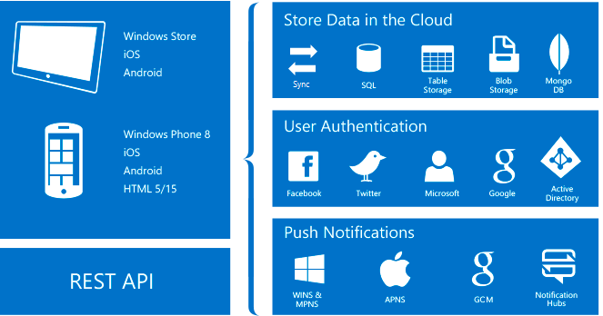

<properties
    pageTitle="Quali sono App Mobile"
    description="Informazioni su quali vantaggi introduce servizio App alle App per dispositivi mobili dell'organizzazione."
    services="app-service\mobile"
    documentationCenter=""
    authors="adrianhall"
    manager="yochayk"
    editor=""/>

<tags
    ms.service="app-service-mobile"
    ms.workload="na"
    ms.tgt_pltfrm="mobile-multiple"
    ms.devlang="na"
    ms.topic="hero-article"
    ms.date="10/01/2016"
    ms.author="adrianha"/>

# Novità App Mobile?

Servizio App Azure è una completamente gestita [piattaforma come servizio](https://azure.microsoft.com/overview/what-is-paas/) (PaaS) per sviluppatori professionisti che offre una vasta gamma di funzionalità Web, mobili e scenari di integrazione. *App Mobile* nel *Servizio App Azure* offrono una piattaforma di sviluppo di applicazioni mobili scalabilità, disponibili a livello globale per gli sviluppatori dell'organizzazione e integratori che offre una vasta gamma di funzionalità per gli sviluppatori per dispositivi mobili.

##Perché App per dispositivi mobili?
*App Mobile* nel *Servizio App Azure* offre una piattaforma di sviluppo di applicazioni mobili scalabilità, disponibili a livello globale per gli sviluppatori dell'organizzazione e integratori che offre una vasta gamma di funzionalità per gli sviluppatori per dispositivi mobili. Con App Mobile è possibile:

- **Creare nativa e incrociata piattaforma App** - se si sta creando nativo iOS, Android e Windows App o multipiattaforma Xamarin o Cordova (Phonegap) App, è possibile trarre vantaggio del servizio di App tramite SDK nativa.
- **Connettersi ai sistemi aziendali** - con l'App Mobile è possibile aggiungere accesso aziendale in minuti e la connessione per l'organizzazione locale o cloud risorse.
- **Creare App offline prodotto pronto per la sincronizzazione di dati** - i dipendenti mobili produttivi tramite la creazione di applicazioni compatibili offline e utilizzarla App Mobile ai dati di sincronizzazione in background quando la connettività presenta con qualsiasi delle origini dati aziendali o SaaS APIs.
- **Notifiche push per milioni in secondi** - esercitare i clienti con le notifiche push immediata in qualsiasi dispositivo, personalizzata in base a esigenze, inviate quando il tempo è corretto.

## Caratteristiche di App per dispositivi mobili
Le caratteristiche seguenti sono importanti per lo sviluppo di dispositivi mobili basate su cloud:

- **Autenticazione e l'autorizzazione** - selezionare da un elenco crescente della provider di identità, tra cui Azure Active Directory per l'autenticazione dell'organizzazione, oltre al provider di social networking come Facebook, Google, Twitter e Account Microsoft.  Azure App Mobile offre un servizio OAuth 2.0 per ogni provider.  È inoltre possibile integrare SDK per il provider di identità per funzionalità specifiche del provider.

  Scoprire le [funzionalità di autenticazione].

- **Accesso ai dati** - app di Azure Mobile offre orientata mobile OData v3 fonte dati collegati a SQL Azure o su un Server SQL locale.  Questo servizio può essere basato sulle entità Framework, consentendo di integrare facilmente con altri NoSQL e provider di dati SQL, inclusi i provider di [Archivio tabelle Azure], MongoDB, [DocumentDB] e SaaS API come Office 365 e Salesforce.com.
- **Sincronizzazione offline** - dei Client SDK rendere semplice per la compilazione di applicazioni per dispositivi mobili efficaci e interattive che funzionano con dei dati il set di possono essere sincronizzate automaticamente con i dati di back-end, incluso il supporto di risoluzione dei conflitti.

  Scoprire le [caratteristiche di dati].

- **Notifiche push** - dei Client SDK integrano con la funzionalità di registrazione di hub di notifica di Azure, che consente di inviare le notifiche push per milioni di utenti contemporaneamente.

  Scoprire le [funzionalità di notifica push].

- **Client SDK** - sono disponibili una serie completa di SDK Client che illustrate sviluppo nativo ([iOS], [Android] e [Windows]), sviluppo multipiattaforma ([Xamarin per iOS e Android], [Moduli Xamarin]) e sviluppo di applicazioni ibride ([Apache Cordova]).  Ogni client SDK è disponibile con una licenza MIT e Apri origine.

## Caratteristiche di Azure servizio App.
Le seguenti funzionalità di piattaforma generalmente sono utili per i siti di produzione per dispositivi mobili.

- **Il ridimensionamento automatico** - servizio App consente di rapidamente scalabilità o out per gestire qualsiasi carico cliente in arrivo. Selezionare il numero e le dimensioni delle macchine virtuali o impostare il ridimensionamento automatico per ridimensionare il back-end app per dispositivi mobili in base al caricamento o pianificazione manualmente.

  Maggiori informazioni su [scala automatica].

- **Ambienti di gestione temporanea** - servizio App può essere eseguito più versioni del sito, in modo da eseguire A / B testa, testare in produzione come parte di un piano di attrezzi più grande e sul posto gestione temporanea di un nuovo back-end.

  Maggiori informazioni su [ambienti di gestione temporanea].

- **Distribuzione continua** - servizio App è possibile integrare con i sistemi più diffusi servizi, che consente di distribuire automaticamente una nuova versione del back-end premendo a una sezione del sistema di Gestione controllo servizi.

  È facile scoprire altre informazioni sulle [Opzioni di distribuzione].

- **Rete virtuale** - servizio App possibile connettersi alle risorse locali con le connessioni di rete, ExpressRoute o ibrido virtuale.

  Alla scoperta di informazioni su [connessioni ibrida], [reti virtuali]ed [ExpressRoute].

- **Isolato / dedicato ambienti** -servizio App può essere eseguito in un ambiente completamente isolato e dedicato per l'esecuzione in modo sicuro le applicazioni di servizio App Azure scala elevato.  Questo è ideale per carichi di lavoro di applicazione che richiedono scala molto elevata, isolamento o accesso alla rete protetta.

  Maggiori informazioni su [App servizio ambienti].

## Guida introduttiva ##
Per iniziare a utilizzare App Mobile, seguire l'esercitazione [Per iniziare] .  Questa operazione verrà illustrate le nozioni fondamentali di produrre un back-end per dispositivi mobili e un client di propria scelta, quindi integrazione di autenticazione, sincronizzazione offline e le notifiche push.  È possibile eseguire l'esercitazione [Per iniziare] più volte - una volta per ogni applicazione client.

Per ulteriori informazioni sulle applicazioni Mobile Azure, esaminare la [mappa di apprendimento].
Per ulteriori informazioni sulla piattaforma Azure App servizio, vedere [Servizio App Azure].

>[AZURE.NOTE]Se si desidera iniziare a utilizzare il servizio di App Azure prima di iscriversi a un account Azure, accedere al [Servizio App provare](https://tryappservice.azure.com/?appServiceName=mobile), in cui è possibile creare immediatamente un'app web starter breve nel servizio di App. Nessun carte di credito obbligatorio; Nessun impegni.

<!-- URLs. -->
[Migrate your Mobile Service to App Service]: app-service-mobile-migrating-from-mobile-services.md
[Servizio App Azure]: ../app-service/app-service-value-prop-what-is.md
[Guida introduttiva]: app-service-mobile-ios-get-started.md
[Archivio tabelle Azure]: ../storage/storage-getting-started-guide.md
[DocumentDB]: ../documentdb/documentdb-get-started.md
[funzionalità di autenticazione]: ./app-service-mobile-auth.md
[caratteristiche di dati]: ./app-service-mobile-offline-data-sync.md
[funzionalità di notifica push]: ../notification-hubs/notification-hubs-push-notification-overview.md
[iOS]: ./app-service-mobile-ios-how-to-use-client-library.md
[Android]: ./app-service-mobile-android-how-to-use-client-library.md
[Windows]: ./app-service-mobile-dotnet-how-to-use-client-library.md
[Xamarin per iOS e Android]: ./app-service-mobile-dotnet-how-to-use-client-library.md
[Moduli Xamarin]: ./app-service-mobile-xamarin-forms-get-started.md
[Apache Cordova]: ./app-service-mobile-cordova-how-to-use-client-library.md
[scala automatica]: ../app-service-web/web-sites-scale.md
[ambienti di gestione temporanea]: ../app-service-web/web-sites-staged-publishing.md
[opzioni di distribuzione]: ../app-service-web/web-sites-deploy.md
[connessioni ibrido]: ../app-service-web/web-sites-hybrid-connection-get-started.md
[reti virtuali]: ../app-service-web/web-sites-integrate-with-vnet.md
[ExpressRoute]: ../app-service-web/app-service-app-service-environment-network-configuration-expressroute.md
[Servizio di App ambienti]: ../app-service-web/app-service-app-service-environment-intro.md
[mappa di formazione]: https://azure.microsoft.com/en-us/documentation/learning-paths/appservice-mobileapps/
