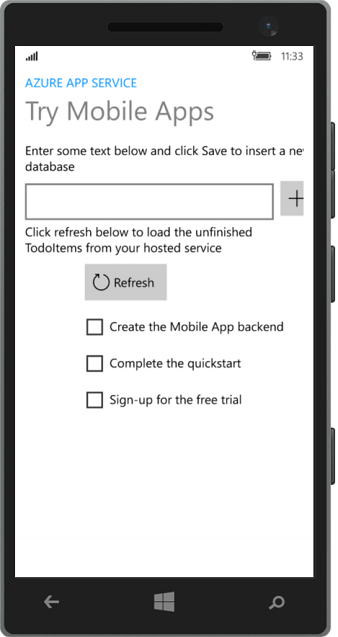

<properties
    pageTitle="Creare un universale Windows piattaforma (UWP) che utilizza in App Mobile | Microsoft Azure"
    description="Seguire questa esercitazione per iniziare a utilizzare back-end Azure app per dispositivi mobili per lo sviluppo di app universale Windows piattaforma (UWP) in c#, Visual Basic o JavaScript."
    services="app-service\mobile"
    documentationCenter="windows"
    authors="adrianhall"
    manager="erikre"
    editor=""/>

<tags
    ms.service="app-service-mobile"
    ms.workload="mobile"
    ms.tgt_pltfrm="mobile-windows"
    ms.devlang="dotnet"
    ms.topic="hero-article"
    ms.date="10/01/2016"
    ms.author="adrianha"/>

#Creare un'app di Windows

[AZURE.INCLUDE [app-service-mobile-selector-get-started](../../includes/app-service-mobile-selector-get-started.md)]

##Panoramica

In questa esercitazione viene illustrato come aggiungere un servizio basato su cloud back-end per un'app universale Windows piattaforma (UWP). Per ulteriori informazioni, vedere [informazioni sui App Mobile](app-service-mobile-value-prop.md). Schermate dall'app completate sono i seguenti:

   
In esecuzione su un computer desktop. 

  
In esecuzione su un telefono

Esercitazione è un prerequisito per tutte le altre esercitazioni App Mobile per le app UWP. 

##Prerequisiti

Per completare questa esercitazione, è necessario quanto segue:

* Un account Azure attivo. Se non si dispone di un account, è possibile iscriversi per una versione di valutazione di Azure e ottenere fino a 10 App per dispositivi mobili gratuito che è possibile continuare a usare anche il termine di valutazione. Per informazioni dettagliate, vedere [Versione di valutazione gratuita di Azure](https://azure.microsoft.com/pricing/free-trial/).

* [Visual Studio Community 2015] o versione successiva.

>[AZURE.NOTE] Se si desidera iniziare a usare il servizio di App Azure prima che si effettua l'iscrizione per un account Azure, accedere al [Servizio di App provare](https://tryappservice.azure.com/?appServiceName=mobile). Non esiste, è possibile creare immediatamente un'app per dispositivi mobili starter breve nel servizio di App, ovvero non carta di credito necessari e non impegni.

##Creare un nuova App Mobile Azure di back-end

Seguire questa procedura per creare un nuova App Mobile di back-end.

[AZURE.INCLUDE [app-service-mobile-dotnet-backend-create-new-service](../../includes/app-service-mobile-dotnet-backend-create-new-service.md)]

Ora viene completato il provisioning un back-end Azure Mobile App che possono essere usate dalle applicazioni client mobili. Successivamente, che verranno scaricate un progetto per un semplice "elenco" server di back-end e pubblicarla in Azure.

## Configurare project server

[AZURE.INCLUDE [app-service-mobile-configure-new-backend.md](../../includes/app-service-mobile-configure-new-backend.md)]

##Scaricare ed eseguire il progetto client

Dopo aver configurato il back-end App Mobile, è possibile creare una nuova app client o modificare un'app esistente a cui connettersi Azure. In questa sezione è scaricare un progetto di modello di app UWP personalizzabile per connettere il back-end App Mobile.

1. Di nuovo in blade **introduttive** per il back-end App Mobile, fare clic su **Crea una nuova app** > **è possibile scaricare**quindi estrarre i file di progetto in formato compresso al computer locale.

    

3. (Facoltativo) Aggiungere il progetto di app UWP alla stessa soluzione project server. Questo semplifica il debug e testare l'app e back-end nella stessa soluzione Visual Studio, se si sceglie di farlo. Per aggiungere un progetto di app UWP alla soluzione, è necessario utilizzare Visual Studio 2015 o versione successiva.

4. Grazie all'app UWP come progetto di avvio, premere F5 per distribuire ed eseguire l'app.

5. Nell'app digitare testo significativo, ad esempio *completata l'esercitazione*, nella casella di testo **inserire un TodoItem** e quindi fare clic su **Salva**.

    

    Si invia una richiesta POST nel back-end app per dispositivi mobili nuovo è ospitato in Azure.

6. (Facoltativo) Interrompere l'app e riavviare in un dispositivo diverso o emulatore per dispositivi mobili.

    

    Si noti che i dati salvati nel passaggio precedente vengono caricati da Azure verrà avviata l'app UWP. 

##Passaggi successivi

* [Aggiungere l'autenticazione applicazione in uso.](app-service-mobile-windows-store-dotnet-get-started-users.md)  
  Informazioni su come eseguire l'autenticazione degli utenti dell'app con un provider di identità.

* [Aggiungere le notifiche push applicazione in uso.](app-service-mobile-windows-store-dotnet-get-started-push.md)  
  Informazioni su come aggiungere push notifiche supportano l'app e configurare il back-end App Mobile per l'utilizzo di Azure notifica hub per inviare le notifiche push.

* [Attivare la sincronizzazione offline per l'app](app-service-mobile-windows-store-dotnet-get-started-offline-data.md)  
  Informazioni su come aggiungere l'app utilizzando un back-end App Mobile supporto della modalità offline. Sincronizzazione offline consente agli utenti finali di interagire con un'app per dispositivi mobili&mdash;la visualizzazione, aggiunta o la modifica dei dati&mdash;anche quando non vi è alcuna connessione di rete.

<!-- Anchors. -->
<!-- Images. -->
<!-- URLs. -->
[Mobile App SDK]: http://go.microsoft.com/fwlink/?LinkId=257545
[Azure portal]: https://portal.azure.com/
[Community di Visual Studio 2015]: https://go.microsoft.com/fwLink/p/?LinkID=534203
