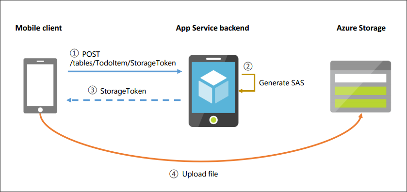

<properties
    pageTitle="Connettersi a archiviazione Azure nell'app Xamarin.Forms"
    description="Aggiungere immagini a app per dispositivi mobili di elenco Xamarin.Forms todo connettendosi a archiviazione blob Azure"
    documentationCenter="xamarin"
    authors="adrianhall"
    manager="erikre"
    editor=""
    services="app-service\mobile"/>

<tags
    ms.service="app-service-mobile"
    ms.workload="mobile"
    ms.tgt_pltfrm="mobile-xamarin-ios"
    ms.devlang="dotnet"
    ms.topic="article"
    ms.date="10/01/2016"
    ms.author="adrianha"/>

#Connettersi a archiviazione Azure nell'app Xamarin.Forms

## Panoramica

App Mobile Azure client e server SDK supporta sincronizzazione offline dei dati strutturati con le operazioni CRUD contro endpoint /tables. In genere questi dati vengono archiviati in un database o in un negozio simile, e in genere questi archivi di dati non è possibile archiviare dati binari di grandi dimensioni in modo efficiente. Inoltre, alcune applicazioni correlate i dati memorizzati in altre posizioni (ad esempio, archiviazione blob, condivisioni file) ed è utile per poter creare associazioni tra i record in endpoint /tables e altri dati.

In questo argomento viene illustrato come aggiungere il supporto per le immagini per la Guida introduttiva elenco todo App Mobile. È necessario completare l'esercitazione [creare un'app Xamarin.Forms].

In questa esercitazione verranno creare un account di archiviazione e aggiungere una stringa di connessione per il back-end App Mobile. Si aggiungerà quindi una nuova che ereditano dal nuovo tipo di App Mobile `StorageController<T>` al progetto server.

>[AZURE.TIP] In questa esercitazione include un [esempio complementare](https://azure.microsoft.com/documentation/samples/app-service-mobile-dotnet-todo-list-files/) disponibili, che può essere distribuito all'account Azure. 

## Prerequisiti

* Completare l'esercitazione [Crea un'app Xamarin.Forms] , in cui sono elencati altri prerequisiti. In questo articolo viene usata l'app completa da tale esercitazione.

>[AZURE.NOTE] Se si desidera iniziare a usare il servizio di App Azure prima che si effettua l'iscrizione per un account Azure, accedere al [Servizio di App provare](https://tryappservice.azure.com/?appServiceName=mobile). Non esiste, è possibile creare immediatamente un'app per dispositivi mobili starter breve nel servizio di App, ovvero non carta di credito necessari e non impegni.

## Creare un account di archiviazione

1. Creare un account di archiviazione seguendo l'esercitazione [creare un Account di archiviazione Azure]. 

2. Nel portale di Azure, passare al proprio account di archiviazione appena creato e fare clic sull'icona di **tasti** . Copiare la **stringa di connessione principale**.

3. Passare al back-end app per dispositivi mobili. In **Tutte le impostazioni** -> **Le impostazioni dell'applicazione** -> **Stringhe di connessione**, creare una nuova chiave denominata `MS_AzureStorageAccountConnectionString` e usare il valore copiato dal proprio account di archiviazione. Utilizzare **personalizzato** come tipo di chiave.

## Aggiungere un controller di archiviazione sul server

È necessario aggiungere un nuovo controller al progetto server che verrà rispondere alle richieste di un token SA per lo spazio di archiviazione di Azure, nonché restituire un elenco di file che corrispondono a un record:

- [Aggiungere un controller di archiviazione al progetto server](#add-controller-code)
- [Indirizza registrato dal controller di archiviazione](#routes-registered)
- [Comunicazione tra client e server](#client-communication)

###Aggiungere un controller di archiviazione al progetto server

1. In Visual Studio, aprire il progetto di server .NET. Aggiungere il pacchetto Nuget [Microsoft.Azure.Mobile.Server.Files]. Assicurarsi di selezionare **Includi definitiva**.

2. In Visual Studio, aprire il progetto di server .NET. Pulsante destro del mouse sulla cartella **controller** e selezionare **Aggiungi** -> **Controller** -> **Web API 2 Controller - vuoto**. Assegnare un nome controller di `TodoItemStorageController`.

3. Aggiungere le seguenti istruzioni using:

        using Microsoft.Azure.Mobile.Server.Files;
        using Microsoft.Azure.Mobile.Server.Files.Controllers;

4. Modificare la classe di base in `StorageController`:
    
        public class TodoItemStorageController : StorageController<TodoItem>

5. Aggiungere i metodi seguenti per la classe:

        [HttpPost]
        [Route("tables/TodoItem/{id}/StorageToken")]
        public async Task<HttpResponseMessage> PostStorageTokenRequest(string id, StorageTokenRequest value)
        {
            StorageToken token = await GetStorageTokenAsync(id, value);

            return Request.CreateResponse(token);
        }

        // Get the files associated with this record
        [HttpGet]
        [Route("tables/TodoItem/{id}/MobileServiceFiles")]
        public async Task<HttpResponseMessage> GetFiles(string id)
        {
            IEnumerable<MobileServiceFile> files = await GetRecordFilesAsync(id);

            return Request.CreateResponse(files);
        }

        [HttpDelete]
        [Route("tables/TodoItem/{id}/MobileServiceFiles/{name}")]
        public Task Delete(string id, string name)
        {
            return base.DeleteFileAsync(id, name);
        }

6. Aggiornare la configurazione dell'API Web per configurare l'attributo routing. In **Startup.MobileApp.cs**, aggiungere la riga seguente per il `ConfigureMobileApp()` metodo, dopo la definizione del `config` variabile:

        config.MapHttpAttributeRoutes();

7. Pubblicare il progetto server per il back-end app per dispositivi mobili.

###Indirizza registrato dal controller di archiviazione

Il nuovo `TodoItemStorageController` espone due risorse secondari in record che consente di gestire:

- StorageToken

    + HTTP POST: Crea un token di spazio di archiviazione
    
        `/tables/TodoItem/{id}/MobileServiceFiles`
    
- MobileServiceFiles

    + HTTP GET: Recupera un elenco di file associato al record
    
        `/tables/TodoItem/{id}/MobileServiceFiles`

    + HTTP Elimina: Elimina il file specificato l'identificatore di risorsa di file
    
        `/tables/TodoItem/{id}/MobileServiceFiles/{fileid}`

###Comunicazione tra client e server

Si noti che `TodoItemStorageController` *non* dispone di un percorso per il caricamento o il download di un blob. Ciò avviene perché un client mobile interagisce con blob archiviazione *direttamente* per eseguire queste operazioni, dopo la prima guida un token di SA (condiviso firma di Access) in modo sicuro ad accedere a un determinato blob o contenitore. Si tratta di un'architettura importante, come l'accesso in caso contrario allo spazio di archiviazione è limitato alla scalabilità e la disponibilità di back-end di dispositivi mobili. Invece connettendosi direttamente all'archivio Azure client mobile possibile sfruttare le funzionalità, ad esempio partizione automatico e distribuzione geografico.

Una firma di accesso condiviso fornisce delega per l'accesso alle risorse nell'account di archiviazione. Questo errore indica che è possibile concedere che autorizzazioni agli oggetti nel proprio account di archiviazione un client limitate per un determinato periodo di tempo e con un determinato set di autorizzazioni, senza che sia necessario condividere i tasti di scelta account. Per ulteriori informazioni, vedere [Informazioni sulle firme di Access condiviso].

Il diagramma seguente illustra le interazioni client e server. Prima di caricare un file, il client richiede un token SA dal servizio. Il servizio utilizza la stringa di connessione di spazio di archiviazione per generare un nuove SA, quindi viene restituito al client. Le SA tempo limitato e limita le autorizzazioni solo un file specifico o un contenitore. Client mobile utilizza quindi questo SA e il client di archiviazione Azure SDK per caricare il file in archiviazione blob.

## Aggiornare l'app di client per aggiungere il supporto dell'immagine

Aprire il progetto di Guida introduttiva Xamarin.Forms in Visual Studio o Xamarin Studio. Si verrà installato Nuget pacchetti e aggiornare il progetto libreria portatile e iOS, Android e Windows progetti client:

- [Aggiungere pacchetti Nuget](#add-nuget)
- [Aggiungere IPlatform interfaccia](#add-iplatform)
- [Aggiungere FileHelper classe](#add-filehelper)
- [Aggiungere un gestore di sincronizzazione di file](#file-sync-handler)
- [Aggiornare TodoItemManager](#update-todoitemmanager)
- [Aggiungere una visualizzazione dettagli](#add-details-view)
- [Aggiornare la visualizzazione principale](#update-main-view)
- [Aggiornare il progetto Android](#update-android), [iOS project](#update-ios), [progetto di Windows](#update-windows)

>[AZURE.NOTE] In questa esercitazione contiene solo le istruzioni per piattaforme di Windows Store, non di Windows Phone, Android e iOS.

###Aggiungere pacchetti Nuget

Fare doppio clic la soluzione e selezionare **Gestione Nuget pacchetti per soluzione**. Aggiungere i pacchetti Nuget seguenti per **tutti** i progetti della soluzione. Assicurarsi di selezionare **Includi definitiva**.

  - [Microsoft.Azure.Mobile.Client.Files]

  - [Microsoft.Azure.Mobile.Client.SQLiteStore]

  - [PCLStorage]

Per maggiore comodità, in questo esempio viene utilizzata la libreria [PCLStorage] , ma non è necessario dal client App Mobile Azure SDK.

[PCLStorage]: https://www.nuget.org/packages/PCLStorage/

###Aggiungere IPlatform interfaccia

Creare una nuova interfaccia `IPlatform` nel progetto principale raccolta portatile. Si segue il modello [Xamarin.Forms DependencyService] per caricare la classe specifico della piattaforma direttamente in fase di esecuzione. In ciascuno dei progetti client successivamente si aggiungeranno implementazioni specifiche della piattaforma.

1. Aggiungere le seguenti istruzioni using:

        using Microsoft.WindowsAzure.MobileServices.Files;
        using Microsoft.WindowsAzure.MobileServices.Files.Metadata;
        using Microsoft.WindowsAzure.MobileServices.Sync;

2. Sostituire l'implementazione con le operazioni seguenti:

        public interface IPlatform
        {
            Task <string> GetTodoFilesPathAsync();

            Task<IMobileServiceFileDataSource> GetFileDataSource(MobileServiceFileMetadata metadata);

            Task<string> TakePhotoAsync(object context);

            Task DownloadFileAsync<T>(IMobileServiceSyncTable<T> table, MobileServiceFile file, string filename);
        }

###Aggiungere FileHelper classe

1. Creare una nuova classe `FileHelper` nel progetto principale raccolta portatile. Aggiungere le seguenti istruzioni using:

        using System.IO;
        using PCLStorage;
        using System.Threading.Tasks;
        using Xamarin.Forms;

2. Aggiungere la definizione di classe:

        public class FileHelper
        {
            public static async Task<string> CopyTodoItemFileAsync(string itemId, string filePath)
            {
                IFolder localStorage = FileSystem.Current.LocalStorage;

                string fileName = Path.GetFileName(filePath);
                string targetPath = await GetLocalFilePathAsync(itemId, fileName);

                var sourceFile = await localStorage.GetFileAsync(filePath);
                var sourceStream = await sourceFile.OpenAsync(FileAccess.Read);

                var targetFile = await localStorage.CreateFileAsync(targetPath, CreationCollisionOption.ReplaceExisting);

                using (var targetStream = await targetFile.OpenAsync(FileAccess.ReadAndWrite)) {
                    await sourceStream.CopyToAsync(targetStream);
                }

                return targetPath;
            }

            public static async Task<string> GetLocalFilePathAsync(string itemId, string fileName)
            {
                IPlatform platform = DependencyService.Get<IPlatform>();

                string recordFilesPath = Path.Combine(await platform.GetTodoFilesPathAsync(), itemId);

                    var checkExists = await FileSystem.Current.LocalStorage.CheckExistsAsync(recordFilesPath);
                    if (checkExists == ExistenceCheckResult.NotFound) {
                        await FileSystem.Current.LocalStorage.CreateFolderAsync(recordFilesPath, CreationCollisionOption.ReplaceExisting);
                    }

                return Path.Combine(recordFilesPath, fileName);
            }

            public static async Task DeleteLocalFileAsync(Microsoft.WindowsAzure.MobileServices.Files.MobileServiceFile fileName)
            {
                string localPath = await GetLocalFilePathAsync(fileName.ParentId, fileName.Name);
                var checkExists = await FileSystem.Current.LocalStorage.CheckExistsAsync(localPath);

                if (checkExists == ExistenceCheckResult.FileExists) {
                    var file = await FileSystem.Current.LocalStorage.GetFileAsync(localPath);
                    await file.DeleteAsync();
                }
            }
        }

###Aggiungere un gestore di sincronizzazione di file

Creare una nuova classe `TodoItemFileSyncHandler` nel progetto principale raccolta portatile. Questa classe contiene callback da Azure SDK per ricevere una notifica del codice durante l'aggiunta o rimozione di un file.

Il Client Mobile di Azure SDK ma non memorizzati i dati dei file: il client SDK richiama l'implementazione di `IFileSyncHandler` che a sua volta determina se e come file archiviati nel dispositivo locale.

1. Aggiungere le seguenti istruzioni using:

        using System.Threading.Tasks;
        using Microsoft.WindowsAzure.MobileServices.Files.Sync;
        using Microsoft.WindowsAzure.MobileServices.Files;
        using Microsoft.WindowsAzure.MobileServices.Files.Metadata;
        using Xamarin.Forms;

2. Sostituire la definizione della classe con le operazioni seguenti: 

        public class TodoItemFileSyncHandler : IFileSyncHandler
        {
            private readonly TodoItemManager todoItemManager;

            public TodoItemFileSyncHandler(TodoItemManager itemManager)
            {
                this.todoItemManager = itemManager;
            }

            public Task<IMobileServiceFileDataSource> GetDataSource(MobileServiceFileMetadata metadata)
            {
                IPlatform platform = DependencyService.Get<IPlatform>();
                return platform.GetFileDataSource(metadata);
            }

            public async Task ProcessFileSynchronizationAction(MobileServiceFile file, FileSynchronizationAction action)
            {
                if (action == FileSynchronizationAction.Delete) {
                    await FileHelper.DeleteLocalFileAsync(file);
                }
                else { // Create or update. We're aggressively downloading all files.
                    await this.todoItemManager.DownloadFileAsync(file);
                }
            }
        }

###Aggiornare TodoItemManager

1. In **TodoItemManager.cs**, rimuovere il commento `#define OFFLINE_SYNC_ENABLED`.

2. In **TodoItemManager.cs**, aggiungere le seguenti istruzioni using:

        using System.IO;
        using Xamarin.Forms;
        using Microsoft.WindowsAzure.MobileServices.Files;
        using Microsoft.WindowsAzure.MobileServices.Files.Sync;
        using Microsoft.WindowsAzure.MobileServices.Eventing;

3. Nel costruttore di `TodoItemManager`, aggiungere quanto segue dopo la chiamata a `DefineTable()`:

        // Initialize file sync
        this.client.InitializeFileSyncContext(new TodoItemFileSyncHandler(this), store);

4. Nel costruttore, sostituire la chiamata a `InitializeAsync` con le operazioni seguenti. In questo modo sono presenti callback quando i record vengono modificati nell'archivio locale. La caratteristica di sincronizzazione di file utilizza questi callback per attivare il gestore di sincronizzazione di file.

        this.client.SyncContext.InitializeAsync(store, StoreTrackingOptions.NotifyLocalAndServerOperations);

5. In `SyncAsync()`, aggiungere quanto segue dopo la chiamata a `PushAsync()`:

        await this.todoTable.PushFileChangesAsync();

6. Aggiungere i metodi seguenti per `TodoItemManager`:

        internal async Task DownloadFileAsync(MobileServiceFile file)
        {
            var todoItem = await todoTable.LookupAsync(file.ParentId);
            IPlatform platform = DependencyService.Get<IPlatform>();

            string filePath = await FileHelper.GetLocalFilePathAsync(file.ParentId, file.Name); 
            await platform.DownloadFileAsync(this.todoTable, file, filePath);
        }

        internal async Task<MobileServiceFile> AddImage(TodoItem todoItem, string imagePath)
        {
            string targetPath = await FileHelper.CopyTodoItemFileAsync(todoItem.Id, imagePath);
            return await this.todoTable.AddFileAsync(todoItem, Path.GetFileName(targetPath));
        }

        internal async Task DeleteImage(TodoItem todoItem, MobileServiceFile file)
        {
            await this.todoTable.DeleteFileAsync(file);
        }

        internal async Task<IEnumerable<MobileServiceFile>> GetImageFilesAsync(TodoItem todoItem)
        {
            return await this.todoTable.GetFilesAsync(todoItem);
        }

###Aggiungere una visualizzazione dettagli

In questa sezione, si aggiungerà una nuova visualizzazione dettagli per un elemento todo. La visualizzazione viene creata quando l'utente seleziona un elemento todo e consente di nuove immagini da aggiungere a un elemento.

1. Aggiungere una nuova classe **TodoItemImage** al progetto raccolta portatile con l'implementazione seguente:

        public class TodoItemImage : INotifyPropertyChanged
        {
            private string name;
            private string uri;

            public MobileServiceFile File { get; private set; }

            public string Name
            {
                get { return name; }
                set
                {
                    name = value;
                    OnPropertyChanged(nameof(Name));
                }
            }

            public string Uri
            {
                get { return uri; }      
                set
                {
                    uri = value;
                    OnPropertyChanged(nameof(Uri));
                }
            }

            public TodoItemImage(MobileServiceFile file, TodoItem todoItem)
            {
                Name = file.Name;
                File = file;

                FileHelper.GetLocalFilePathAsync(todoItem.Id, file.Name).ContinueWith(x => this.Uri = x.Result);
            }

            public event PropertyChangedEventHandler PropertyChanged;

            private void OnPropertyChanged(string propertyName)
            {
                PropertyChanged?.Invoke(this, new PropertyChangedEventArgs(propertyName));
            }
        }

2. Modificare **App.cs**. Sostituire l'inizializzazione di `MainPage` con le operazioni seguenti:
    
        MainPage = new NavigationPage(new TodoList());

3. In **App.cs**, aggiungere le proprietà seguenti:

        public static object UIContext { get; set; }

4. Fare clic sul progetto portable raccolta e selezionare **Aggiungi** -> **Nuovo elemento** -> **multipiattaforma** -> **Pagina Xaml moduli**. Nome della vista `TodoItemDetailsView`.

5. Aprire **TodoItemDetailsView.xaml** e sostituire il corpo della ContentPage con le operazioni seguenti:

          <Grid>
            <Grid.RowDefinitions>
              <RowDefinition Height="Auto"/>
              <RowDefinition Height="Auto"/>
              <RowDefinition Height="*"/>
            </Grid.RowDefinitions>
            <Button Clicked="OnAdd" Text="Add image"></Button>
            <ListView x:Name="imagesList"
                      ItemsSource="{Binding Images}"
                      IsPullToRefreshEnabled="false"
                      Grid.Row="2">
              <ListView.ItemTemplate>
                <DataTemplate>
                  <ImageCell ImageSource="{Binding Uri}"
                             Text="{Binding Name}">
                  </ImageCell>
                </DataTemplate>
              </ListView.ItemTemplate>
            </ListView>
          </Grid>

6. Modificare **TodoItemDetailsView.xaml.cs** e aggiungere le seguenti istruzioni using:

        using System.Collections.ObjectModel;
        using Microsoft.WindowsAzure.MobileServices.Files;

7. Sostituire l'implementazione di `TodoItemDetailsView` con le operazioni seguenti:

        public partial class TodoItemDetailsView : ContentPage
        {
            private TodoItemManager manager;

            public TodoItem TodoItem { get; set; }        
            public ObservableCollection<TodoItemImage> Images { get; set; }

            public TodoItemDetailsView(TodoItem todoItem, TodoItemManager manager)
            {
                InitializeComponent();
                this.Title = todoItem.Name;

                this.TodoItem = todoItem;
                this.manager = manager;

                this.Images = new ObservableCollection<TodoItemImage>();
                this.BindingContext = this;
            }

            public async Task LoadImagesAsync()
            {
                IEnumerable<MobileServiceFile> files = await this.manager.GetImageFilesAsync(TodoItem);
                this.Images.Clear();

                foreach (var f in files) {
                    var todoImage = new TodoItemImage(f, this.TodoItem);
                    this.Images.Add(todoImage);
                }
            }

            public async void OnAdd(object sender, EventArgs e)
            {
                IPlatform mediaProvider = DependencyService.Get<IPlatform>();
                string sourceImagePath = await mediaProvider.TakePhotoAsync(App.UIContext);

                if (sourceImagePath != null) {
                    MobileServiceFile file = await this.manager.AddImage(this.TodoItem, sourceImagePath);

                    var image = new TodoItemImage(file, this.TodoItem);
                    this.Images.Add(image);
                }
            }
        }

###Aggiornare la visualizzazione principale 

Aggiornare la visualizzazione principale per aprire la visualizzazione dei dettagli quando viene selezionato un elemento todo.

In **TodoList.xaml.cs**, sostituire l'implementazione di `OnSelected` con le operazioni seguenti:

    public async void OnSelected(object sender, SelectedItemChangedEventArgs e)
    {
        var todo = e.SelectedItem as TodoItem;

        if (todo != null) {
            var detailsView = new TodoItemDetailsView(todo, manager);
            await detailsView.LoadImagesAsync();
            await Navigation.PushAsync(detailsView);
        }

        todoList.SelectedItem = null;
    }

###Aggiornare il progetto Android

Aggiungere codice specifico della piattaforma al progetto Android, incluso il codice per il download di un file e l'utilizzo della fotocamera per acquisire una nuova immagine. 

Questo codice utilizza il Xamarin.Forms [DependencyService](https://developer.xamarin.com/guides/xamarin-forms/dependency-service/) di caricare la classe specifico della piattaforma direttamente in fase di esecuzione.

1. Il componente **Xamarin.Mobile** al progetto Android.

2. Aggiungere una nuova classe `DroidPlatform` con l'implementazione seguente. Sostituire "denominato YourNamespace" con lo spazio dei nomi principale del progetto.

        using System;
        using System.IO;
        using System.Threading.Tasks;
        using Android.Content;
        using Microsoft.WindowsAzure.MobileServices.Files;
        using Microsoft.WindowsAzure.MobileServices.Files.Metadata;
        using Microsoft.WindowsAzure.MobileServices.Files.Sync;
        using Microsoft.WindowsAzure.MobileServices.Sync;
        using Xamarin.Media;

        [assembly: Xamarin.Forms.Dependency(typeof(YourNamespace.Droid.DroidPlatform))]
        namespace YourNamespace.Droid
        {
            public class DroidPlatform : IPlatform
            {
                public async Task DownloadFileAsync<T>(IMobileServiceSyncTable<T> table, MobileServiceFile file, string filename)
                {
                    var path = await FileHelper.GetLocalFilePathAsync(file.ParentId, file.Name);
                    await table.DownloadFileAsync(file, path);
                }

                public async Task<IMobileServiceFileDataSource> GetFileDataSource(MobileServiceFileMetadata metadata)
                {
                    var filePath = await FileHelper.GetLocalFilePathAsync(metadata.ParentDataItemId, metadata.FileName);
                    return new PathMobileServiceFileDataSource(filePath);
                }

                public async Task<string> TakePhotoAsync(object context)
                {
                    try {
                        var uiContext = context as Context;
                        if (uiContext != null) {
                            var mediaPicker = new MediaPicker(uiContext);
                            var photo = await mediaPicker.TakePhotoAsync(new StoreCameraMediaOptions());

                            return photo.Path;
                        }
                    }
                    catch (TaskCanceledException) {
                    }

                    return null;
                }

                public Task<string> GetTodoFilesPathAsync()
                {
                    string appData = Environment.GetFolderPath(Environment.SpecialFolder.MyDocuments);
                    string filesPath = Path.Combine(appData, "TodoItemFiles");

                    if (!Directory.Exists(filesPath)) {
                        Directory.CreateDirectory(filesPath);
                    }

                    return Task.FromResult(filesPath);
                }
            }
        }

3. Modificare **MainActivity.cs**. In `OnCreate`, aggiungere quanto segue prima la chiamata a `LoadApplication()`:

        App.UIContext = this;

###Aggiornare il progetto di iOS

Aggiungere codice specifico della piattaforma al progetto iOS.

1. Il componente **Xamarin.Mobile** al progetto iOS.

2. Aggiungere una nuova classe `TouchPlatform` con l'implementazione seguente. Sostituire "denominato YourNamespace" con lo spazio dei nomi principale del progetto.

        using System;
        using System.Collections.Generic;
        using System.IO;
        using System.Text;
        using System.Threading.Tasks;
        using Microsoft.WindowsAzure.MobileServices.Files;
        using Microsoft.WindowsAzure.MobileServices.Files.Metadata;
        using Microsoft.WindowsAzure.MobileServices.Files.Sync;
        using Microsoft.WindowsAzure.MobileServices.Sync;
        using Xamarin.Media;

        [assembly: Xamarin.Forms.Dependency(typeof(YourNamespace.iOS.TouchPlatform))]
        namespace YourNamespace.iOS
        {
            class TouchPlatform : IPlatform
            {
                public async Task DownloadFileAsync<T>(IMobileServiceSyncTable<T> table, MobileServiceFile file, string filename)
                {
                    var path = await FileHelper.GetLocalFilePathAsync(file.ParentId, file.Name);
                    await table.DownloadFileAsync(file, path);
                }

                public async Task<IMobileServiceFileDataSource> GetFileDataSource(MobileServiceFileMetadata metadata)
                {
                    var filePath = await FileHelper.GetLocalFilePathAsync(metadata.ParentDataItemId, metadata.FileName);
                    return new PathMobileServiceFileDataSource(filePath);
                }

                public async Task<string> TakePhotoAsync(object context)
                {
                    try {
                        var mediaPicker = new MediaPicker();
                        var mediaFile = await mediaPicker.PickPhotoAsync();
                        return mediaFile.Path;
                    }
                    catch (TaskCanceledException) {
                        return null;
                    }
                }

                public Task<string> GetTodoFilesPathAsync()
                {
                    string filesPath = Path.Combine(Environment.GetFolderPath(Environment.SpecialFolder.MyDocuments), "TodoItemFiles");

                    if (!Directory.Exists(filesPath)) {
                        Directory.CreateDirectory(filesPath);
                    }

                    return Task.FromResult(filesPath);
                }
            }
        }

3. Modificare **AppDelegate.cs** e la chiamata alla `SQLitePCL.CurrentPlatform.Init()`.

###Aggiornare il progetto di Windows

1. Installare l'estensione di Visual Studio [SQLite per Windows 8.1](http://go.microsoft.com/fwlink/?LinkID=716919). Per ulteriori informazioni, vedere l'esercitazione [attivare sincronizzazione offline per un'app di Windows](app-service-mobile-windows-store-dotnet-get-started-offline-data.md). 

2. Modificare **Package.appxmanifest** e controllare le funzionalità **Webcam** .

3. Aggiungere una nuova classe `WindowsStorePlatform` con l'implementazione seguente. Sostituire "denominato YourNamespace" con lo spazio dei nomi principale del progetto.

        using System;
        using System.Threading.Tasks;
        using Microsoft.WindowsAzure.MobileServices.Files;
        using Microsoft.WindowsAzure.MobileServices.Files.Metadata;
        using Microsoft.WindowsAzure.MobileServices.Files.Sync;
        using Microsoft.WindowsAzure.MobileServices.Sync;
        using Windows.Foundation;
        using Windows.Media.Capture;
        using Windows.Storage;
        using YourNamespace;

        [assembly: Xamarin.Forms.Dependency(typeof(WinApp.WindowsStorePlatform))]
        namespace WinApp
        {
            public class WindowsStorePlatform : IPlatform
            {
                public async Task DownloadFileAsync<T>(IMobileServiceSyncTable<T> table, MobileServiceFile file, string filename)
                {
                    var path = await FileHelper.GetLocalFilePathAsync(file.ParentId, file.Name);
                    await table.DownloadFileAsync(file, path);
                }

                public async Task<IMobileServiceFileDataSource> GetFileDataSource(MobileServiceFileMetadata metadata)
                {
                    var filePath = await FileHelper.GetLocalFilePathAsync(metadata.ParentDataItemId, metadata.FileName);
                    return new PathMobileServiceFileDataSource(filePath);
                }

                public async Task<string> GetTodoFilesPathAsync()
                {
                    var storageFolder = ApplicationData.Current.LocalFolder;
                    var filePath = "TodoItemFiles";

                    var result = await storageFolder.TryGetItemAsync(filePath);

                    if (result == null) {
                        result = await storageFolder.CreateFolderAsync(filePath);
                    }

                    return result.Name; // later operations will use relative paths
                }

                public async Task<string> TakePhotoAsync(object context)
                {
                    try {
                        CameraCaptureUI dialog = new CameraCaptureUI();
                        Size aspectRatio = new Size(16, 9);
                        dialog.PhotoSettings.CroppedAspectRatio = aspectRatio;

                        StorageFile file = await dialog.CaptureFileAsync(CameraCaptureUIMode.Photo);
                        return file.Path;
                    }
                    catch (TaskCanceledException) {
                        return null;
                    }
                }
            }
        }

##Riepilogo

In questo articolo viene descritto come utilizzare il nuovo supporto di file in dispositivi mobili di Azure client e server SDK di archiviazione Azure. 

- Creare un account di archiviazione e aggiungere la stringa di connessione per il back-end app per dispositivi mobili. Solo back-end con il tasto per lo spazio di archiviazione di Azure: il client mobile richiede un token di SA (condiviso accesso firma) ogni volta che è necessario accedere all'archiviazione Azure. Per ulteriori informazioni sui token SA in archiviazione Azure, vedere [Informazioni sulle firme di Access condiviso].

- Creare un controller di tale sottoclassi `StorageController` per gestire le richieste di token SA e per ottenere i file associati a un record. Per impostazione predefinita, i file sono associati a un record utilizzando l'ID di record come parte del nome del contenitore; il comportamento può essere personalizzato specificando un'implementazione di `IContainerNameResolver`. Il criterio di token SA può essere personalizzato.

- Il Client Mobile di Azure SDK non vengono archiviati vengono memorizzati i dati dei file. Invece il client SDK richiama il `IFileSyncHandler`, che quindi decide come (e se) file archiviati nel dispositivo locale. Il gestore di sincronizzazione è registrato come indicato di seguito:

        client.InitializeFileSync(new MyFileSyncHandler(), store);

      + `IFileSyncHandler.GetDataSource`è chiamato quando il Client Mobile di Azure SDK i dati del file (ad esempio come parte del processo di caricamento). In questo modo è la possibilità di gestire come (e se) file archiviati nel dispositivo locale e restituire le informazioni se necessario.

      + `IFileSyncHandler.ProcessFileSynchronizationAction`richiamato come parte del flusso di sincronizzazione di file. Un riferimento al file e un valore di enumerazione FileSynchronizationAction sono incluse in modo che è possibile decidere come l'applicazione dovrà gestire l'evento (ad esempio il download automatico di un file quando si è creata o aggiornata, l'eliminazione di un file dal dispositivo locale quando il file è stato eliminato dal server).

- A `MobileServiceFile` può essere utilizzato in modalità online o offline, utilizzando una `IMobileServiceTable` o `IMobileServiceSyncTable`, rispettivamente. In uno scenario offline, il caricamento si verifica quando l'app chiama `PushFileChangesAsync`. In questo modo coda operazione non in linea da trasformare; per ogni operazione di file, il client Mobile di Azure SDK richiama il `GetDataSource` metodo sul `IFileSyncHandler` istanza per recuperare il contenuto del file da caricare.

- Per recuperare i file di un elemento, chiamare il ' GetFilesAsync` method on the  `IMobileServiceTable<T> ` or IMobileServiceSyncTable<T>` istanza. Questo metodo restituisce un elenco di file associato all'elemento di dati specificato. (Nota: questa è un'operazione *locale* e restituirà i file in base a stato dell'oggetto quando l'ultima sincronizzazione. Per ottenere un elenco di file aggiornato dal server, è necessario avviare un'operazione di sincronizzazione prima di tutto.)

        IEnumerable<MobileServiceFile> files = await myTable.GetFilesAsync(myItem);

- La caratteristica di sincronizzazione di file utilizzato le notifiche di modifica del record l'archivio locale per recuperare i record che il client ha ricevuto come parte di un'operazione push o pull. A tale scopo, attivare le notifiche di locali e del server per il contesto di sincronizzazione utilizzando il `StoreTrackingOptions` parametro. 

        this.client.SyncContext.InitializeAsync(store, StoreTrackingOptions.NotifyLocalAndServerOperations);

      + Altre opzioni di gestione archivio sono disponibili, ad esempio solo locale o solo server notifiche. È possibile aggiungere o proprietari callback personalizzati utilizzando il `EventManager` proprietà di `IMobileServiceClient`:

            jobService.MobileService.EventManager.Subscribe<StoreOperationCompletedEvent>(StoreOperationEventHandler);

- È possibile aggiungere o rimuovere i file da un record modificando archiviazione blob direttamente, dal momento che l'associazione viene ottenuta tramite una convenzione di denominazione. Tuttavia, in questo caso è necessario sempre **aggiornare il timestamp record quando si modificano i BLOB associati**. Il client Mobile di Azure SDK Aggiorna sempre un record durante l'aggiunta o rimozione di un file. 

    Il motivo per questo requisito è che alcuni client mobili già avrà il record nell'archivio locale. Quando questi client eseguono un pull incrementali, questo record non verranno restituito e il client non viene eseguita una query per i nuovi file associati. Per evitare questo problema, si consiglia di aggiornare il record timestamp durante l'esecuzione di modifiche di spazio di archiviazione blob che non usa il client Mobile di Azure SDK.

- Il progetto client utilizza il modello [Xamarin.Forms DependencyService] di caricare la classe specifico della piattaforma direttamente in fase di esecuzione. In questo esempio abbiamo definito un'interfaccia `IPlatform` con implementazioni in ciascuno dei progetti specifici della piattaforma.

<!-- URLs. -->

[Visual Studio Community 2013]: https://go.microsoft.com/fwLink/p/?LinkID=534203
[Creare un'app Xamarin.Forms]: app-service-mobile-xamarin-forms-get-started.md
[Xamarin.Forms DependencyService]: https://developer.xamarin.com/guides/xamarin-forms/dependency-service/
[Microsoft.Azure.Mobile.Client.Files]: https://www.nuget.org/packages/Microsoft.Azure.Mobile.Client.Files/
[Microsoft.Azure.Mobile.Client.SQLiteStore]: https://www.nuget.org/packages/Microsoft.Azure.Mobile.Client.SQLiteStore/
[Microsoft.Azure.Mobile.Server.Files]: https://www.nuget.org/packages/Microsoft.Azure.Mobile.Server.Files/
[Informazioni sulle condivise firme di Access]: ../storage/storage-dotnet-shared-access-signature-part-1.md
[Creare un Account di archiviazione Azure]:  ../storage/storage-create-storage-account.md#create-a-storage-account
