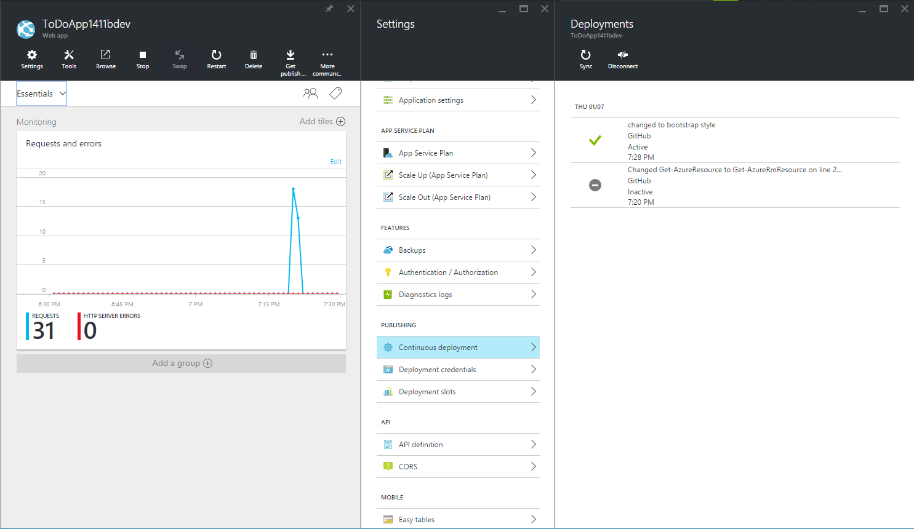

<properties
    pageTitle="Sviluppo software Agile con il servizio di App Azure"
    description="Informazioni su come creare applicazioni complesse vasta scala con il servizio di App Azure in modo che supporta lo sviluppo di software agile."
    services="app-service"
    documentationCenter=""
    authors="cephalin"
    manager="wpickett"
    editor=""/>

<tags
    ms.service="app-service"
    ms.workload="na"
    ms.tgt_pltfrm="na"
    ms.devlang="na"
    ms.topic="article"
    ms.date="07/01/2016"
    ms.author="cephalin"/>

# Sviluppo software Agile con il servizio di App Azure #

In questa esercitazione si imparerà la creazione di applicazioni complesse vasta scala con [Azure App servizio](/services/app-service/) in modo che supporta lo [sviluppo di software agile](https://en.wikipedia.org/wiki/Agile_software_development). Si presuppone che si conosce già come [distribuire applicazioni complesse prevedibili in Azure](app-service-deploy-complex-application-predictably.md).

Limitazioni di processi tecnici spesso possono attivare sovrappone corretta implementazione di metodi agile. Servizio di App Azure con caratteristiche quali [pubblicazione continua](app-service-continuous-deployment.md), [ambienti di gestione temporanea](web-sites-staged-publishing.md) (bande orarie) e [il monitoraggio](web-sites-monitor.md), utilizzata con attenzione con l'orchestrazione e la gestione della distribuzione in [Gestione risorse di Azure](../azure-resource-manager/resource-group-overview.md), possono far parte di un'ottima soluzione per gli sviluppatori che accogliere sviluppo software agile.

Nella tabella seguente è un breve elenco di requisiti associati sviluppo agile e come Azure servizi consente di esse.

| Requisito | Come consente di Azure |
|---------------------------------------------------------------|--------------------------------------------------------------------------------------------------------------------------------------------------------------------------------------------------------------------------|
| -Creare con ogni commit -Creare automaticamente e veloce | Quando è configurato con la distribuzione continua, servizio App Azure possano funzionare come build esecuzione live in base a un ramo dev. Ogni volta che viene inserito codice al ramo, viene generato automaticamente e in esecuzione in diretta in Azure.|
| -Verificare build self-test | Caricare i test, test web e così via, può essere distribuito con il modello di gestione di risorse Azure.|
| -È possibile eseguire test in un duplicato dell'ambiente di produzione | Azure modelli Manager delle risorse possono essere usati per creare duplicati dell'ambiente di produzione Azure (incluse le impostazioni dell'app, modelli di stringa di connessione, proporzioni dei caratteri e così via) per testare rapidamente e prevedibili.|
| -Visualizzare i risultati della build più recente con facilità | Distribuzione continua a Azure da un repository significa che è possibile testare nuovo codice in un'applicazione attiva immediatamente dopo la conferma le modifiche. |
| -Eseguire il commit ramo principale ogni giorno -Automatizzare la distribuzione | Integrazione continua di un'applicazione di produzione con ramo principale del repository distribuisce automaticamente ogni commit/unione al ramo principale di produzione. |

[AZURE.INCLUDE [app-service-web-to-api-and-mobile](../../includes/app-service-web-to-api-and-mobile.md)]

## Viene eseguita ##

Verificherà tramite un flusso di lavoro di produzione fase di test dev tipico per pubblicare nuove modifiche all'applicazione di esempio [ToDoApp](https://github.com/azure-appservice-samples/ToDoApp) è costituito da due [web App](/services/app-service/web/), uno da un front-end (ret) e l'altro in un API Web back-end (BE) e un [database SQL](/services/sql-database/). Si utilizzeranno l'architettura di distribuzione illustrato di seguito:

Per inserire l'immagine parole:

-   L'architettura di distribuzione è suddivise in tre distinti ambienti (o [gruppi di risorse](../azure-resource-manager/resource-group-overview.md) in Azure), ognuna con il proprio [piano di servizio App](../app-service/azure-web-sites-web-hosting-plans-in-depth-overview.md), le impostazioni di [ridimensionamento](web-sites-scale.md) e database SQL. 
-   Ogni ambiente può essere gestito separatamente. Possono essere presenti anche in diversi abbonamenti.
-   Prova e produzione sono previsti due bande orarie della stessa applicazione di servizio di App. Diramazione master è configurato per l'integrazione continua con la gestione temporanea.
-   Quando si verifica commit master ramo in intervallo aperto gestione temporanea (con dati di produzione), l'app di gestione temporanea verificato viene trasposto nella produzione intervallo aperto [con senza tempi di inattività](web-sites-staged-publishing.md).

Ambiente di produzione e gestione temporanea è definito dal modello in [ * &lt;repository_root >*/ARMTemplates/ProdandStage.json](https://github.com/azure-appservice-samples/ToDoApp/blob/master/ARMTemplates/ProdAndStage.json).

Ambienti di sviluppo e test sono definiti dal modello in [ * &lt;repository_root >*/ARMTemplates/Dev.json](https://github.com/azure-appservice-samples/ToDoApp/blob/master/ARMTemplates/Dev.json).

Utilizzare la strategia di salto condizionata tipica, anche con codice dallo ramo dev fino a diramazione test quindi ramo master (spostando qualità, per così dire).

 

## È necessario ##

-   Un account Azure
-   Un account [GitHub](https://github.com/)
-   Shell fra (installato con [GitHub per Windows](https://windows.github.com/)-) in questo modo è possibile eseguire operazioni sia PowerShell comandi nella stessa sessione 
-   Bit più recente di [PowerShell di Azure](https://github.com/Azure/azure-powershell/releases/download/0.9.4-June2015/azure-powershell.0.9.4.msi)
-   Base informazioni delle operazioni seguenti:
    -   Distribuzione dei modelli di [Gestione risorse di Azure](../azure-resource-manager/resource-group-overview.md) (vedere anche [distribuire un'applicazione complessa prevedibili in Azure](app-service-deploy-complex-application-predictably.md))
    -   [Operazioni](http://git-scm.com/documentation)
    -   [PowerShell](https://technet.microsoft.com/library/bb978526.aspx)

> [AZURE.NOTE] È necessario un account Azure per completare l'esercitazione:
> + È possibile [aprire un account Azure gratuitamente](/pricing/free-trial/) - viene visualizzato crediti è possibile utilizzare per provare a pagamento servizi Azure e anche dopo che è utilizzate è possibile mantenere l'account e usare gratuiti servizi Azure, ad esempio Web Apps.
> + È possibile [attivare vantaggi sottoscrittore Visual Studio](/pricing/member-offers/msdn-benefits-details/) - abbonamento Your Visual Studio offre crediti ogni mese che è possibile utilizzare per i servizi di Azure a pagamento.
>
> Se si desidera iniziare a utilizzare il servizio di App Azure prima di iscriversi a un account Azure, accedere al [Servizio App provare](http://go.microsoft.com/fwlink/?LinkId=523751), in cui è possibile creare immediatamente un'app web starter breve nel servizio di App. Nessun carte di credito obbligatorio; Nessun impegni.

## Configurare l'ambiente di produzione ##

>[AZURE.NOTE] Lo script utilizzato in questa esercitazione configura automaticamente continua pubblicazione dal repository GitHub. È necessario che le credenziali GitHub sono già archiviate nell'Azure, in caso contrario la distribuzione di script avrà esito negativo durante il tentativo di configurare le impostazioni di controllo di origine per le applicazioni web. 
>
>Per archiviare le credenziali GitHub in Azure, creare un'app web nel [Portale di Azure](https://portal.azure.com/) e [configurare la distribuzione di GitHub](app-service-continuous-deployment.md). È sufficiente eseguire questa operazione una sola volta. 

In uno scenario di attrezzi tipico, è installata un'applicazione che esegue live in Azure e si desidera apportare modifiche fino alla pubblicazione continua. In questo scenario, si dispone di un modello che sviluppati, testati e utilizzato per distribuire l'ambiente di produzione. Si verrà impostato in questa sezione.

1.  Creare il proprio divisione dell'archivio [ToDoApp](https://github.com/azure-appservice-samples/ToDoApp) . Per informazioni sulla creazione la divisione, vedere [divisione un Repo](https://help.github.com/articles/fork-a-repo/). Dopo aver creato la divisione, è possibile visualizzarlo nel browser.
 
    

2.  Aprire una sessione di Shell fra. Se ancora non si dispone fra Shell, installa [GitHub per Windows](https://windows.github.com/) .

3.  Creare un duplicato locale della divisione eseguendo il comando seguente:

        git clone https://github.com/<your_fork>/ToDoApp.git 

4.  Dopo avere creato la copia locale, passare a * &lt;repository_root >*\ARMTemplates ed eseguire il deploy.ps1 script come indicato di seguito:

        .\deploy.ps1 –RepoUrl https://github.com/<your_fork>/todoapp.git

4.  Quando richiesto, digitare il nome utente desiderato e la password per l'accesso al database.

    Verrà visualizzato lo stato di avanzamento provisioning delle varie risorse Azure. Al termine del processo di distribuzione, lo script di avvio dell'applicazione nel browser e assegnare un segnale acustico descrittivo.

    
 
    >[AZURE.TIP] Da un'occhiata * &lt;repository_root >*\ARMTemplates\Deploy.ps1, per vedere come viene generato risorse con ID univoco. È possibile utilizzare lo stesso approccio per creare duplicati della stessa distribuzione senza preoccuparsi di conflitti tra i nomi delle risorse.
 
6.  Tornare nella sessione Shell fra eseguire:

        .\swap –Name ToDoApp<unique_string>master

    

7.  Al termine dell'esecuzione dello script, tornare indietro per passare all'indirizzo del front-end (http://ToDoApp*&lt;unique_string >*master.azurewebsites.net/) per visualizzare l'applicazione in fase di produzione.
 
5.  Accedere al [Portale di Azure](https://portal.azure.com/) e dare un'occhiata qual è creato.

    Dovrebbe essere possibile vedere due web apps nello stesso gruppo di risorse, uno con la `Api` suffisso del nome. Se osserva la visualizzazione di gruppo di risorse, si vedranno anche il Database di SQL e server, il piano di servizio di App e le bande orarie di gestione temporanea per web apps. Sfogliare le risorse diversi e di confrontarle con * &lt;repository_root >*\ARMTemplates\ProdAndStage.json per vedere come vengono configurati nel modello.

    

È ora dispone di configurare l'ambiente di produzione. Successivamente, consente di avviare un nuovo aggiornamento all'applicazione.

## Creare dev e testare diramazioni ##

Dopo aver creato un'applicazione complessa in fase di produzione in Azure, si renderà un aggiornamento all'applicazione secondo metodologia agile. In questa sezione, si verrà creare il dev e testare diramazioni che è necessario effettuare gli aggiornamenti obbligatori.

1.  Creare innanzitutto l'ambiente di testing. La sessione di Shell fra, eseguire i comandi seguenti per creare l'ambiente per una nuova sezione denominata **NewUpdate**. 

        git checkout -b NewUpdate
        git push origin NewUpdate 
        .\deploy.ps1 -TemplateFile .\Dev.json -RepoUrl https://github.com/<your_fork>/ToDoApp.git -Branch NewUpdate

1.  Quando richiesto, digitare il nome utente desiderato e la password per l'accesso al database. 

    Al termine del processo di distribuzione, lo script di avvio dell'applicazione nel browser e assegnare un segnale acustico descrittivo. E in modo analogo, è ora disponibile una nuova sezione con il proprio ambiente di testing. Richiedere alcuni minuti per esaminare alcuni dettagli sull'ambiente di testing:

    -   È possibile creare in tutti gli abbonamenti Azure. Questo significa che l'ambiente di produzione può essere gestita separatamente dall'ambiente di testing.
    -   Ambiente di test è in esecuzione live in Azure.
    -   Ambiente di test è identico all'ambiente di produzione, ad eccezione delle bande di gestione temporanea e le impostazioni di ridimensionamento. È possibile conoscere questo poiché si tratta solo le differenze tra ProdandStage.json e Dev.json.
    -   È possibile gestire l'ambiente di testing nel proprio piano di servizio App, con un livello di prezzo diverso (ad esempio **gratuito**).
    -   Eliminazione di questo ambiente di testing sarà sufficiente eliminare il gruppo di risorse. Sono disponibili informazioni su come eseguire questa [in un secondo momento](#delete).

2.  Passare alla creazione di un ramo dev eseguendo i comandi seguenti:

        git checkout -b Dev
        git push origin Dev
        .\deploy.ps1 -TemplateFile .\Dev.json -RepoUrl https://github.com/<your_fork>/ToDoApp.git -Branch Dev

3.  Quando richiesto, digitare il nome utente desiderato e la password per l'accesso al database. 

    Richiedere alcuni minuti per esaminare alcuni dettagli sull'ambiente di sviluppo: 

    -   L'ambiente di sviluppo ha una configurazione identica per l'ambiente di testing poiché viene distribuito con lo stesso modello.
    -   Ogni ambiente di sviluppo può essere create nella sottoscrizione Azure dello sviluppatore, uscire dall'ambiente di prova per essere gestite separatamente.
    -   L'ambiente di sviluppo è in esecuzione live in Azure.
    -   Eliminazione dell'ambiente di sviluppo è sufficiente eliminare il gruppo di risorse. Sono disponibili informazioni su come eseguire questa [in un secondo momento](#delete).

>[AZURE.NOTE] Quando si dispone di più sviluppatori che utilizzano il nuovo aggiornamento, ognuno di essi poter creare facilmente un ambiente di sviluppo dedicato e ramo eseguendo le operazioni seguenti:
>
>1. Creare le proprie divisione dell'archivio in GitHub (vedere [divisione un Repo](https://help.github.com/articles/fork-a-repo/)).
>2. Duplicare divisione nel proprio computer locale
>3. Eseguire gli stessi comandi per creare il proprio ramo dev e ambiente.

Al termine, la divisione di GitHub deve avere tre diramazioni:

Ed è necessario disporre sei web App (tre set di due) in tre gruppi di risorse separati:

 
>[AZURE.NOTE] Si noti che ProdandStage.json specifica l'ambiente di produzione per utilizzare il **Standard** prezzi livello appropriato per scalabilità dell'applicazione di produzione.

## Compilare e testare ogni commit ##

I file di modello ProdAndStage.json e Dev.json già specificano i parametri di controllo di origine che per impostazione predefinita consente di impostare continuo pubblicazione per l'applicazione web. Pertanto, ogni commit al ramo GitHub attiva una distribuzione automatica di Azure da tale ramo. Vediamo come l'installazione e configurazione funziona correttamente.

1.  Verificare che sta partecipando a ramo Dev dell'archivio locale. A tale scopo, eseguire il comando seguente nella Shell di operazioni:

        git checkout Dev

2.  Rendere una semplice modifica a livello dell'interfaccia utente dell'applicazione modificando il codice per utilizzare gli elenchi di [avvio](http://getbootstrap.com/components/) . Apri * &lt;repository_root >*\src\MultiChannelToDo.Web\index.cshtml e apportare le modifiche evidenziata riportata di seguito:

    

    >[AZURE.NOTE] Se non è possibile leggere l'immagine precedente: 
    >
    >- Nella riga 18, sostituire `check-list` a `list-group`.
    >- Nella riga 19, sostituire `class="check-list-item"` a `class="list-group-item"`.

3.  Salvare le modifiche. Tornare nella Shell fra, eseguire i comandi seguenti:

        cd <repository_root>
        git add .
        git commit -m "changed to bootstrap style"
        git push origin Dev
 
    Questi comandi fra sono simili a "controllo del codice" in un altro sistema di controllo di origine come TFS. Quando si esegue `git push`, il commit nuovo attiva un push codice automatica in Azure, che viene ricreata l'applicazione per riflettere la modifica nell'ambiente di sviluppo.

4.  Per verificare che si è verificato il push di codice per l'ambiente di sviluppo, passare alla blade app web dell'ambiente di sviluppo e osservare la parte di **distribuzione** . Dovrebbe essere possibile visualizzare l'ultimo messaggio commit.

    

5.  A questo punto, fare clic su **Sfoglia** per visualizzare la nuova modifica nell'applicazione di live in Azure.

    

    Si tratta di una modifica molto secondaria per l'applicazione. Tuttavia, molte volte nuove modifiche da un'applicazione web complessi è ripercussioni imprevisti e indesiderati. La possibilità di testare facilmente ogni commit in Build dinamica consente di intercettare questi problemi prima che i clienti vederle.

A questo punto, avere acquisito familiarità con la realizzazione che, come uno sviluppatore sul progetto **NewUpdate** , sarà possibile creare facilmente un ambiente di sviluppo per se stessi, quindi compilare ogni commit e testare ogni compilazione.

## Unire codice ambiente di testing ##

Quando si è pronti per inserire il codice dal ramo Dev fino a NewUpdate ramo, si tratta del processo fra standard:

1.  Unione tutte le nuove si impegna a NewUpdate nel ramo Dev in GitHub, ad esempio commit creata da altri sviluppatori. Qualsiasi nuovo commit al GitHub verrà attivare un comando di codice e generare nell'ambiente di sviluppo. È possibile verificare che il codice in ramo Dev è ancora disponibile in bit più recente dal ramo NewUpdate.

2.  Unire tutte il commit nuovo da ramo Dev diramazione NewUpdate su GitHub. Questa azione attiva codice push che genera nell'ambiente di testing. 

Si noti nuovamente perché distribuzione continua è già impostata con diramazioni queste operazioni, è necessario eseguire altre azioni ad esempio l'esecuzione di integrazione Build. È sufficiente eseguire consigliate controllo origine standard usando fra e Azure verrà eseguita automaticamente tutti i processi di generazione dell'utente.

A questo punto, si push il codice per ramo **NewUpdate** . Nella Shell fra, eseguire i comandi seguenti:

    git checkout NewUpdate
    git pull origin NewUpdate
    git merge Dev
    git push origin NewUpdate

Questo è tutto! 

Passare a e il app web per l'ambiente di test visualizzare il nuovo commit (unire NewUpdate ramo) ora inserito all'ambiente di prova. Quindi fare clic su **Sfoglia** per visualizzare la modifica è in esecuzione live in Azure.

## Distribuire aggiornamento di produzione ##

Inserimento di codice per l'ambiente di gestione temporanea e produzione dovrebbe risultare non è diverso rispetto a cosa si è già stato fatto quando è inserito codice per l'ambiente di testing. È molto semplice. 

Nella Shell fra, eseguire i comandi seguenti:

    git checkout master
    git pull origin master
    git merge NewUpdate
    git push origin master

Ricordare che in base a lungo il tragitto che l'ambiente di produzione e gestione temporanea è stato configurato in ProdandStage.json, il nuovo codice inserito per l'intervallo **di gestione temporanea** aperto ed è in esecuzione. In modo che se si passa a URL dell'intervallo di aperto gestione temporanea, verrà visualizzato il nuovo codice in esecuzione. A tale scopo, eseguire la `Show-AzureWebsite` cmdlet nella Shell di operazioni.

    Show-AzureWebsite -Name ToDoApp<unique_string>master -Slot Staging
 
A questo punto, dopo aver verificato l'aggiornamento di gestione temporanea intervallo aperto, l'unico rimanente è sostituire nell'ambiente di produzione. Nella Shell fra, eseguire i comandi seguenti:

    cd <repository_root>\ARMTemplates
    .\swap.ps1 -Name ToDoApp<unique_string>master

Congratulazioni! Pubblicate correttamente una versione aggiornata per l'applicazione web di produzione. Inoltre è stata appena eseguita creando facilmente dev e testare ambienti e creare e verificare ogni commit. Si tratta di blocchi predefiniti fondamentali per agile software development.

## Eliminare dev e testare enviroments ##

Perché sono appositamente progettato gli ambienti di sviluppo e test per i gruppi di risorse indipendente, è molto semplice eliminarle. Per eliminare quelle è stato creato in questa esercitazione, diramazioni GitHub sia elementi Azure, Esegui i comandi seguenti nella Shell di operazioni:

    git branch -d Dev
    git push origin :Dev
    git branch -d NewUpdate
    git push origin :NewUpdate
    Remove-AzureRmResourceGroup -Name ToDoApp<unique_string>dev-group -Force -Verbose
    Remove-AzureRmResourceGroup -Name ToDoApp<unique_string>newupdate-group -Force -Verbose

## Riepilogo ##

Sviluppo software Agile è necessaria per molte aziende che desiderano adottare Azure come la piattaforma di applicazioni. In questa esercitazione sono state come creare ed eliminare verso il basso replica esatta prossimità repliche dell'ambiente di produzione con facilità anche per le applicazioni complesse. Inoltre appreso come sfruttare la possibilità di creare un processo di sviluppo che è possibile compilare e testare ogni singolo commit in Azure. In questa esercitazione sono state probabilmente illustrate come meglio utilizzare servizio App Azure e gestione di risorse di Azure insieme per creare una soluzione attrezzi che si occupa dei metodi agile. Successivamente, è possibile creare in questo scenario eseguendo tecniche avanzate di attrezzi, ad esempio [il test di produzione](app-service-web-test-in-production-get-start.md). Per uno scenario di test di produzione più comune, vedere [distribuzione Flighting (test della versione beta) nel servizio App Azure](app-service-web-test-in-production-controlled-test-flight.md).

## Altre risorse ##

-   [Distribuire un'applicazione complessa prevedibili in Azure](app-service-deploy-complex-application-predictably.md)
-   [Sviluppo Agile in pratica: suggerimenti e consigli per modernizzati di sviluppo](http://channel9.msdn.com/Events/Ignite/2015/BRK3707)
-   [Strategie di distribuzione avanzate per utilizzare i modelli di gestione risorse Azure Web Apps](http://channel9.msdn.com/Events/Build/2015/2-620)
-   [Creazione di modelli di gestione risorse di Azure](../resource-group-authoring-templates.md)
-   [JSONLint - convalida JSON](http://jsonlint.com/)
-   [ARMClient: configurare la pubblicazione GitHub al sito](https://github.com/projectKudu/ARMClient/wiki/Setup-GitHub-publishing-to-Site)
-   [Diramazione fra-base diramazioni e unione](http://www.git-scm.com/book/en/v2/Git-Branching-Basic-Branching-and-Merging)
-   [Blog di David Ebbo](http://blog.davidebbo.com/)
-   [PowerShell Azure](../powershell-install-configure.md)
-   [Strumenti di riga di comando multipiattaforma e su Azure](../xplat-cli-install.md)
-   [Creare o modificare utenti in Azure Active Directory](https://msdn.microsoft.com/library/azure/hh967632.aspx#BKMK_1)
-   [Progetto Kudu Wiki](https://github.com/projectkudu/kudu/wiki)
